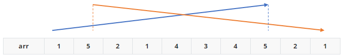
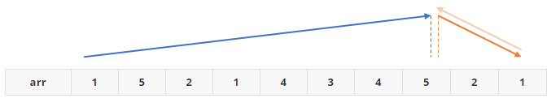

## 문제

수열 S가 어떤 수 Sk를 기준으로 S1 < S2 < ... Sk-1 < Sk > Sk+1 > ... SN-1 > SN을 만족한다면, 그 수열을 바이토닉 수열이라고 한다.

예를 들어, {10, 20, **30**, 25, 20}과 {10, 20, 30, **40**}, {**50**, 40, 25, 10} 은 바이토닉 수열이지만,  {1, 2, 3, 2, 1, 2, 3, 2, 1}과 {10, 20, 30, 40, 20, 30} 은 바이토닉 수열이 아니다.

수열 A가 주어졌을 때, 그 수열의 부분 수열 중 바이토닉 수열이면서 가장 긴 수열의 길이를 구하는 프로그램을 작성하시오.

## 입력

첫째 줄에 수열 A의 크기 N이 주어지고, 둘째 줄에는 수열 A를 이루고 있는 Ai가 주어진다. (1 ≤ N ≤ 1,000, 1 ≤ Ai ≤ 1,000)

## 출력

첫째 줄에 수열 A의 부분 수열 중에서 가장 긴 바이토닉 수열의 길이를 출력한다.

## 예제 입력 1 복사

```
10
1 5 2 1 4 3 4 5 2 1
```

## 예제 출력 1 복사

```
7
```

## 힌트

예제의 경우 {**1** 5 **2** 1 4 **3** **4** **5** **2** **1**}이 가장 긴 바이토닉 부분 수열이다.

---

```python
n = int(input())
arr = list(map(int, input().split()))
arr_r = arr[::-1]

dp = [1] * n
dp_r = [1] * n

for i in range(n):
    tmp = 0
    tmp_r = 0
    for j in range(i, -1, -1):
        if arr[i] > arr[j] and dp[j] > tmp:
            tmp = dp[j]
        if arr_r[i] > arr_r[j] and dp_r[j] > tmp_r:
            tmp_r = dp_r[j]
    dp[i] = tmp + 1
    dp_r[i] = tmp_r + 1

res = [0] * n
for i in range(n):
    res[i] = dp[i] + dp_r[::-1][i] - 1

print(max(res))
```

- 후.....

- 먼저 고려해야 할 점은 다음과 같음

  - 점차 증가하는 바이토닉 부분 수열만을 고려해보았음

    - 리스트 `arr`을 순회하며 현재 인덱스 값에 대한 숫자보다 작은 숫자가 있다면 **바이토닉 수열을 만족하는 최대 길이**보다 +1 하면 된다.

      |  arr   |  1   |    5    |    2    |  1   |    4    |    3    |    4    |    5    |    2    |  1   |
      | :----: | :--: | :-----: | :-----: | :--: | :-----: | :-----: | :-----: | :-----: | :-----: | :--: |
      | **dp** |  1   | 2 (1+1) | 2 (1+1) |  1   | 3 (2+1) | 3 (2+1) | 4 (3+1) | 5 (4+1) | 2 (1+1) |  1   |

    - 위의 표를 보면 **숫자 3**의 경우 전까지의 최대 길이는 **숫자 4의 길이 3 이지만,** 바이토닉 수열을 만족하며 가장 긴 수열을 뽑아내기 위해서 [1 -> 2 -> 3] 의 순서로 가야하므로 **숫자 2의 길이 2에서 +1을 한 길이 3**이 나온다.

  - 감소에 대한 최대 길이는 어떻게 구현할까 고민했다.

    - 최초 방법으로는 똑같이 감소하는 부분 수열만을 고려해서 **바이토닉 수열을 만족하며 최대 길이 +1**로 접근했다.

      |  arr   |  1   |  5   |  2   |  1   |  4   |  3   |  4   |  5   |  2   |  1   |
      | :----: | :--: | :--: | :--: | :--: | :--: | :--: | :--: | :--: | :--: | :--: |
      | **dp** |  1   |  1   |  2   |  3   |  2   |  3   |  2   |  1   |  4   |  5   |
      
    - 위의 논리대로라면 위와 같은 `dp` 리스트가 채워진다.

    - 뭔가 이상하다..

      - 증가하는 바이토닉 수열을 채우며 비교가 되는 기준값과 해당 방법에서 감소하기 위해 비교하는 기준값의 위치가 바뀐다.

      

      - **증가는 증가대로, 감소는 감소대로** 최대 길이만을 구해버리기 때문에 답을 구할 수 없다.

    - 제대로 된 최대길이를 구하기 위해서는 아래 그림과 같이 구해야 한다.

      

      - **뒤에서 부터 증가하는 바이토닉 부분 수열**을 똑같은 방법으로 탐색하면 된다.
        - 이대로 구현하게 되면 순방향, 역방향 증가를 기록하기 위해서는 반복문을 크게 2번 돌게된다.
        - 이를 보다 줄이기 위해서, `arr` 리스트를 뒤집은 `arr_r`을 선언
        - `arr_r`에 증가하는 바이토닉 부분 수열을 기록하는 `dp_r`을 선언한다.

  - `dp_r`에 기록된 최대 길이는 다시한번 뒤집어서 `dp` 배열과 순서를 맞춰준다.

  - 각각의 자리 값(최대 길이)를 더하면서 자기자신의 자리에 대한 값이 중복되므로 -1을 계산해준다.

  - 그렇게 나온 `res` 리스트의 `max`값이 바이토닉 수열의 최대 길이가 된다.

