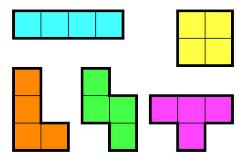

## 14500. 테트로미노

### 문제

폴리오미노란 크기가 1×1인 정사각형을 여러 개 이어서 붙인 도형이며, 다음과 같은 조건을 만족해야 한다.

- 정사각형은 서로 겹치면 안 된다.
- 도형은 모두 연결되어 있어야 한다.
- 정사각형의 변끼리 연결되어 있어야 한다. 즉, 꼭짓점과 꼭짓점만 맞닿아 있으면 안 된다.

정사각형 4개를 이어 붙인 폴리오미노는 테트로미노라고 하며, 다음과 같은 5가지가 있다.



아름이는 크기가 N×M인 종이 위에 테트로미노 하나를 놓으려고 한다. 종이는 1×1 크기의 칸으로 나누어져 있으며, 각각의 칸에는 정수가 하나 쓰여 있다.

테트로미노 하나를 적절히 놓아서 테트로미노가 놓인 칸에 쓰여 있는 수들의 합을 최대로 하는 프로그램을 작성하시오.

테트로미노는 반드시 한 정사각형이 정확히 하나의 칸을 포함하도록 놓아야 하며, 회전이나 대칭을 시켜도 된다.

### 입력

첫째 줄에 종이의 세로 크기 N과 가로 크기 M이 주어진다. (4 ≤ N, M ≤ 500)

둘째 줄부터 N개의 줄에 종이에 쓰여 있는 수가 주어진다. i번째 줄의 j번째 수는 위에서부터 i번째 칸, 왼쪽에서부터 j번째 칸에 쓰여 있는 수이다. 입력으로 주어지는 수는 1,000을 넘지 않는 자연수이다.

### 출력

첫째 줄에 테트로미노가 놓인 칸에 쓰인 수들의 합의 최댓값을 출력한다.

```python
# ㅗ 뺀 테트로미노 dfs 탐색
def dfs(y, x, sum_value, length):
    global res

    if length >= 4:
        if res <= sum_value:
            res = sum_value
        return

    for i in range(4):
        n_y = y + dy[i]
        n_x = x + dx[i]

        if 0 <= n_y < n and 0 <= n_x < m:
            if visited[n_y][n_x] == 0:
                visited[n_y][n_x] = 1
                dfs(n_y, n_x, sum_value + arr[n_y][n_x], length+1)
                visited[n_y][n_x] = 0


# ㅗ 모양 테트로미노 델타 탐색
def find_h(y, x):
    global res

    for i in range(4):
        sum_value = 0

        for j in range(4):
            n_y = y + hy[i][j]
            n_x = x + hx[i][j]

            if 0 <= n_y < n and 0 <= n_x < m:
                sum_value += arr[n_y][n_x]

        if res <= sum_value:
            res = sum_value


n, m = map(int, input().split())
arr = [list(map(int, input().split())) for _ in range(n)]
visited = [[0] * m for _ in range(n)]

# 델타 아래, 위, 왼, 오
dy = [-1, 1, 0, 0]
dx = [0, 0, -1, 1]

# ㅜ, ㅏ, ㅗ, ㅓ 모양 델타
hy = [[0, 0, 0, 1], [0, 1, 2, 1], [0, 1, 1, 1], [1, 0, 1, 2]]
hx = [[0, 1, 2, 1], [0, 0, 0, 1], [1, 0, 1, 2], [0, 1, 1, 1]]

res = 0

for i in range(n):
    for j in range(m):
        visited[i][j] = 1
        dfs(i, j, arr[i][j], 1)
        visited[i][j] = 0
        find_h(i, j)

print(res)
```

### 구현 과정

- L 모양 블럭에서 노가다 스톱 현타가 너무 쎄게 옴 (회전, 대칭 가능한 모양의 수가 L 블럭 부터 8가지를 감안해야 함...)
- ┳ 모양 블럭 제외하고는 거리가 4인 DFS로 풀면 된다고 하네요.... 후.... 그렇ㅈ..
- ㅜ 모양 블럭은 ㅜ, ㅏ, ㅗ, ㅓ 에 대한 모양 x, y 상대 좌표 리스트를 선언하고, 따로 탐색해서 결과값과 비교

```
# input
5 5
1 2 3 4 5
5 4 3 2 1
2 3 4 5 6
6 5 4 3 2
1 2 1 2 1

# output
19
```

```
# input
4 5
1 2 3 4 5
1 2 3 4 5
1 2 3 4 5
1 2 3 4 5

# output
7
```

```
# input
4 10
1 2 1 2 1 2 1 2 1 2
2 1 2 1 2 1 2 1 2 1
1 2 1 2 1 2 1 2 1 2
2 1 2 1 2 1 2 1 2 1

# output
7
```

