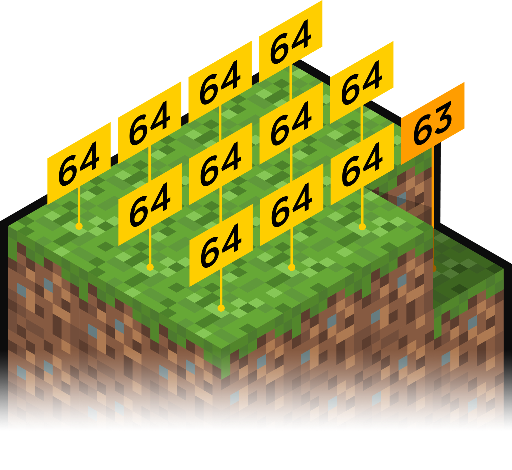

## 18111. 마인크래프트

### 문제

팀 레드시프트는 대회 준비를 하다가 지루해져서 샌드박스 게임인 ‘마인크래프트’를 켰다. 마인크래프트는 1 × 1 × 1(세로, 가로, 높이) 크기의 블록들로 이루어진 3차원 세계에서 자유롭게 땅을 파거나 집을 지을 수 있는 게임이다.

목재를 충분히 모은 lvalue는 집을 짓기로 하였다. 하지만 고르지 않은 땅에는 집을 지을 수 없기 때문에 땅의 높이를 모두 동일하게 만드는 ‘땅 고르기’ 작업을 해야 한다.

lvalue는 세로 *N*, 가로 *M* 크기의 집터를 골랐다. 집터 맨 왼쪽 위의 좌표는 (0, 0)이다. 우리의 목적은 이 집터 내의 땅의 높이를 일정하게 바꾸는 것이다. 우리는 다음과 같은 두 종류의 작업을 할 수 있다.

1. 좌표 (*i*, *j*)의 가장 위에 있는 블록을 제거하여 인벤토리에 넣는다.
2. 인벤토리에서 블록 하나를 꺼내어 좌표 (*i*, *j*)의 가장 위에 있는 블록 위에 놓는다.

1번 작업은 2초가 걸리며, 2번 작업은 1초가 걸린다. 밤에는 무서운 몬스터들이 나오기 때문에 최대한 빨리 땅 고르기 작업을 마쳐야 한다. ‘땅 고르기’ 작업에 걸리는 최소 시간과 그 경우 땅의 높이를 출력하시오.

단, 집터 아래에 동굴 등 빈 공간은 존재하지 않으며, 집터 바깥에서 블록을 가져올 수 없다. 또한, 작업을 시작할 때 인벤토리에는 *B*개의 블록이 들어 있다. 땅의 높이는 256블록을 초과할 수 없으며, 음수가 될 수 없다.

### 입력

첫째 줄에 *N, M*, *B*가 주어진다. (1 ≤ *M*, *N* ≤ 500, 0 ≤ *B* ≤ 6.4 × 107)

둘째 줄부터 *N*개의 줄에 각각 *M*개의 정수로 땅의 높이가 주어진다. (*i* + 2)번째 줄의 (*j* + 1)번째 수는 좌표 (*i*, *j*)에서의 땅의 높이를 나타낸다. 땅의 높이는 256보다 작거나 같은 자연수 또는 0이다.

### 출력

첫째 줄에 땅을 고르는 데 걸리는 시간과 땅의 높이를 출력하시오. 답이 여러 개 있다면 그중에서 땅의 높이가 가장 높은 것을 출력하시오.


```python
import sys
from collections import Counter
sys.stdin = open("input.txt", "r")

n, m, b = map(int, input().split())

res = [n * m * 256 * 2 , 0] # 최대 시간, 최소 높이로 결과값 초기화

# 연산속도를 더 빠르게 하기 위한 1차원 리스트 입력
arr = []
for i in range(n):
    arr.extend(list(map(int, sys.stdin.readline().split())))

# 딕셔너리 변환 {리스트의 값: 값에 대한 개수}
cnt = Counter(arr)

# 입력받은 최저 높이 -> 최고 높이 순회 (비교 대상)
for hight in range(min(cnt), max(cnt) + 1):
    t, inven = 0, b # 소요 시간, 인벤토리 수 초기화

    # hight 값으로 평탄화를 할때 걸리는 시간과 인벤 수 계산을 위한 반복
    for now in cnt.keys():

        # 평탄화 기준보다 현재 높이가 높을 경우
        if now > hight:
            t += 2 * (now - hight) * cnt[now]   # 1번 작업 실행 (+2초, +1 인벤)
            inven += (now - hight) * cnt[now]
        
        # 평탄화 기준보다 현재 높이가 낮을 경우
        elif now < hight:
            t += (hight - now) * cnt[now]   # 2번 작업 실행 (+1초, -1 인벤)
            inven -= (hight - now) * cnt[now]
    
    # 모든 높이를 hight만큼 평탄화 작업 종료
    if inven >= 0:  # 인벤이 - 값이면 불가능 다음 반복문 순회

        # 결과의 시간값보다 방금 나온 시간값이 작을경우
        if t < res[0]:
            res[0] = t      # 소요 시간, 최대 높이 새로 저장
            res[1] = hight

        # 시간은 같은데, 높이가 더 높게 나올 경우
        if t == res[0] and res[1] < hight: 
            res[1] = hight  # 최대 높이만 수정
            
print(*res)
```

```
# tc 1 input
3 4 99
0 0 0 0
0 0 0 0
0 0 0 1

# tc 1 output
2 0
```

맨 오른쪽 아래의 블록을 제거하면 모두 높이가 0으로 고른 상태가 된다. 따라서 블럭을 한 번 제거하는 시간 2초가 소요된다.

```
# tc 2 input
3 4 1
64 64 64 64
64 64 64 64
64 64 64 63

# tc 2 output
1 64
```



```
# tc 3 input
3 4 0
64 64 64 64
64 64 64 64
64 64 64 63

# tc 3 output
22 63
```

인벤토리가 비어 있기 때문에, 맨 오른쪽 아래를 제외한 모든 좌표에서 블록을 하나씩 제거해야 한다.