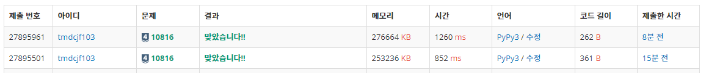

## 10816. 숫자 카드 2

### 문제

숫자 카드는 정수 하나가 적혀져 있는 카드이다. 상근이는 숫자 카드 N개를 가지고 있다. 정수 M개가 주어졌을 때, 이 수가 적혀있는 숫자 카드를 상근이가 몇 개 가지고 있는지 구하는 프로그램을 작성하시오.


### 입력

첫째 줄에 상근이가 가지고 있는 숫자 카드의 개수 N(1 ≤ N ≤ 500,000)이 주어진다. 둘째 줄에는 숫자 카드에 적혀있는 정수가 주어진다. 숫자 카드에 적혀있는 수는 -10,000,000보다 크거나 같고, 10,000,000보다 작거나 같다.

셋째 줄에는 M(1 ≤ M ≤ 500,000)이 주어진다. 넷째 줄에는 상근이가 몇 개 가지고 있는 숫자 카드인지 구해야 할 M개의 정수가 주어지며, 이 수는 공백으로 구분되어져 있다. 이 수도 -10,000,000보다 크거나 같고, 10,000,000보다 작거나 같다.


### 출력

첫째 줄에 입력으로 주어진 M개의 수에 대해서, 각 수가 적힌 숫자 카드를 상근이가 몇 개 가지고 있는지를 공백으로 구분해 출력한다.


### 소스 코드

```python
# 이진 탐색 시간 초과

# dict 사용
import sys

n = int(input())
card = list(map(int, sys.stdin.readline().split()))
m = int(input())
target = list(map(int, sys.stdin.readline().split()))

cnt = {}
for num in card:
    if num not in cnt:
        cnt[num] = 1
    else:
        cnt[num] += 1

for num in target:
    if num in cnt:
        print(cnt[num], end=' ')
    else:
        print(0, end=' ')
```

```python
# Counter() 함수 사용
from collections import Counter

sys.stdin = open("input.txt", "r")

n = int(input())
card = list(map(int, sys.stdin.readline().split()))
m = int(input())
target = list(map(int, sys.stdin.readline().split()))

counter = Counter(card)

for num in target:
    print(counter[num], end=' ')
```

```
# intput
10
6 3 2 10 10 10 -10 -10 7 3
8
10 9 -5 2 3 4 5 -10

# output
3 0 0 1 2 0 0 2
```


### 소요 시간 및 메모리

