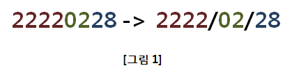
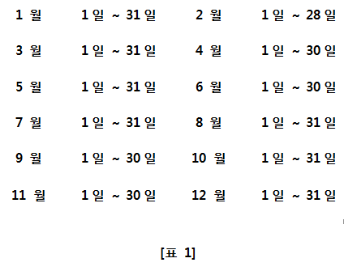

## 2056. 연월일 달력

연월일 순으로 구성된 8자리의 날짜가 입력으로 주어진다.





해당 날짜의 유효성을 판단한 후, 날짜가 유효하다면

[그림1] 과 같이 ”YYYY/MM/DD”형식으로 출력하고,

날짜가 유효하지 않을 경우, -1 을 출력하는 프로그램을 작성하라.


연월일로 구성된 입력에서 월은 1~12 사이 값을 가져야 하며

일은 [표1] 과 같이, 1일 ~ 각각의 달에 해당하는 날짜까지의 값을 가질 수 있다.





※ 2월의 경우, 28일인 경우만 고려한다. (윤년은 고려하지 않는다.)


**[입력]**

입력은 첫 줄에 총 테스트 케이스의 개수 T가 온다.

다음 줄부터 각 테스트 케이스가 주어진다.


**[출력]**

테스트 케이스 t에 대한 결과는 “#t”을 찍고, 한 칸 띄고, 정답을 출력한다.

(t는 테스트 케이스의 번호를 의미하며 1부터 시작한다.)

```python
T = int(input())

day_list = []
for i in range(T):
    day_list.append(input())

month_31 = ['1', '3', '5', '7', '8', '10', '12']
month_30 = ['4', '6', '9', '11']

for idx ,date in enumerate(day_list):
    year = date[:4]
    month = date[4:6]
    day = date[6:]
    if int(month) <= 0 or int(month) > 12:
        print(f'#{idx+1} -1')
    elif int(month) in month_31 and int(day) > 31:
        print(f'#{idx+1} -1')
    elif int(month) in month_30 and int(day) > 30:
        print(f'#{idx+1} -1')
    elif int(month) == 2 and int(day) > 28:
        print(f'#{idx+1} -1')
    else:
        print(f'#{idx+1} {year}/{month}/{day}')
```

```
# input
5
22220228
20150002
01010101
20140230
11111111

# output
#1 2222/02/28
#2 -1
#3 0101/01/01
#4 -1
#5 1111/11/11
```

