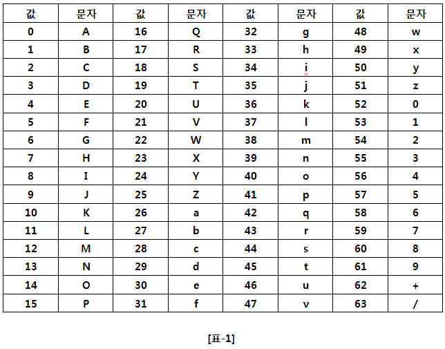

## 1928. Base64 Decoder :-1: 

다음과 같이 Encoding 을 한다.

1. 우선 24비트 버퍼에 위쪽(MSB)부터 한 byte씩 3 byte의 문자를 집어넣는다.

2. 버퍼의 위쪽부터 6비트씩 잘라 그 값을 읽고, 각각의 값을 아래 [표-1] 의 문자로 Encoding 한다.



입력으로 Base64 Encoding 된 String 이 주어졌을 때, 해당 String 을 Decoding 하여, 원문을 출력하는 프로그램을 작성하시오.

**[제약사항]**
문자열의 길이는 항상 4의 배수로 주어진다.
그리고 문자열의 길이는 100000을 넘지 않는다.

**[입력]**
입력은 첫 줄에 총 테스트 케이스의 개수 T가 온다.
다음 줄부터 각 테스트 케이스가 주어진다.
테스트 케이스는 Encoding 된 상태로 주어지는 문자열이다.

**[출력]**
테스트 케이스 t에 대한 결과는 “#t”을 찍고, 한 칸 띄고, 정답을 출력한다.
(t는 테스트 케이스의 번호를 의미하며 1부터 시작한다.)

```python
import base64

T = int(input())

i = 0
while i < T:
    decoding_string = base64.b64decode(input())
    utf_to_b64 = decoding_string.decode("UTF-8")
    print(f'#{i+1} {utf_to_b64}')
    i += 1
```

```
# input
10
TGlmZSBpdHNlbGYgaXMgYSBxdW90YXRpb24u
U3VzcGljaW9uIGZvbGxvd3MgY2xvc2Ugb24gbWlzdHJ1c3Qu
VG8gZG91YnQgaXMgc2FmZXIgdGhhbiB0byBiZSBzZWN1cmUu
T25seSB0aGUganVzdCBtYW4gZW5qb3lzIHBlYWNlIG9mIG1pbmQu
QSBmdWxsIGJlbGx5IGlzIHRoZSBtb3RoZXIgb2YgYWxsIGV2aWwu
...
 
# output
#1 Life itself is a quotation.
#2 Suspicion follows close on mistrust.
#3 To doubt is safer than to be secure.
#4 Only the just man enjoys peace of mind.
#5 A full belly is the mother of all evil.
...
```

