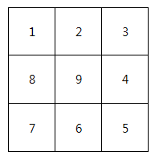
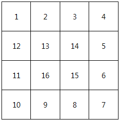

## 1954. 달팽이 숫자

달팽이는 1부터 N*N까지의 숫자가 시계방향으로 이루어져 있다.

다음과 같이 정수 N을 입력 받아 N크기의 달팽이를 출력하시오.


**[예제]**

N이 3일 경우,





N이 4일 경우,




**[제약사항]**

달팽이의 크기 N은 1 이상 10 이하의 정수이다. (1 ≤ N ≤ 10)


**[입력]**

가장 첫 줄에는 테스트 케이스의 개수 T가 주어지고, 그 아래로 각 테스트 케이스가 주어진다.

각 테스트 케이스에는 N이 주어진다.


**[출력]**

각 줄은 '#t'로 시작하고, 다음 줄부터 빈칸을 사이에 두고 달팽이 숫자를 출력한다.

(t는 테스트 케이스의 번호를 의미하며 1부터 시작한다.)

```python
T = int(input())

x = 0
while x < T:
    n = int(input())
    num = 1
    
    null_list = [[0] * n for _ in range(n)]

    row_start_point = 0
    row_end_point = n - 1

    row_point = row_start_point

    col_start_point = 0
    col_end_point = n - 1

    col_point = col_start_point

    while True:
        # row 시작, col 시작인 경우
        if row_point == row_start_point and col_point == col_start_point:
            for i in range(col_start_point, col_end_point + 1):
                null_list[row_point][i] = num
                num += 1
            col_point = col_end_point
            row_start_point += 1
            row_point = row_start_point

        # row 시작, col 끝인 경우
        elif row_point == row_start_point and col_point == col_end_point:
            for i in range(row_start_point, row_end_point + 1):
                null_list[i][col_point] = num
                num += 1
            row_point = row_end_point
            col_end_point -= 1
            col_point = col_end_point

        # row 끝, col 끝인 경우
        elif row_point == row_end_point and col_point == col_end_point:
            for i in range(col_end_point, col_start_point - 1, -1):
                null_list[row_point][i] = num
                num += 1
            col_point = col_start_point
            row_end_point -= 1
            row_point = row_end_point
        
        # row 끝, col 시작인 경우
        elif row_point == row_end_point and col_point == col_start_point:
            for i in range(row_end_point, row_start_point-1, -1):
                null_list[i][col_point] = num
                num += 1
            row_point = row_start_point
            col_start_point += 1
            col_point = col_start_point
        
        if num == n * n + 1:
            break
    
    print(f"#{x+1}")
    for i in range(n):
        for j in range(n):
            print(null_list[i][j], end=" ")
        print()
        
    x += 1
```

```python
# 수정 후
cnt=1
arr=[[0]*5 for i in range(5)]

row_start=0
row_end=4
col_start=0
col_end=4

while row_start<=row_end and col_start<=col_end:
    # 왼쪽=> 오른쪽
    for i in range(col_start, col_end+1):
        arr[row_start][i]=cnt
        cnt+=1
    row_start +=1

    # 위=> 아래
    for i in range(row_start, row_end + 1):
        arr[i][col_end] = cnt
        cnt += 1
    col_end -= 1

    # 오른쪽=> 왼쪽
    for i in range(col_end, col_start-1, -1):
        arr[row_end][i]=cnt
        cnt+=1
    row_end -=1

    # 아래=> 위
    for i in range(row_end, row_start - 1, -1):
        arr[i][col_start] = cnt
        cnt += 1
    col_start += 1

print(arr)
```

```
# input
2    
3   
4       

# ouput
#1
1 2 3
8 9 4
7 6 5
#2
1 2 3 4
12 13 14 5
11 16 15 6
10 9 8 7
```


