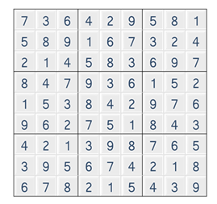
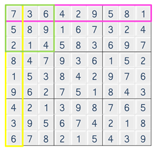

## 1974. 스도쿠 검증

스도쿠는 숫자퍼즐로, **가로 9칸 세로 9칸**으로 이루어져 있는 표에 **1 부터 9 까지의 숫자**를 채워넣는 퍼즐이다.





같은 줄에 **1 에서 9 까지의 숫자를 한번씩만 넣고, 3 x 3 크기의 작은 격자 또한, 1 에서 9 까지의 숫자가 겹치지 않아야 한다.**




입력으로 9 X 9 크기의 스도쿠 퍼즐의 숫자들이 주어졌을 때, 위와 같이 겹치는 숫자가 없을 경우, 1을 정답으로 출력하고 그렇지 않을 경우 0 을 출력한다.


**[제약 사항]**

1. 퍼즐은 모두 숫자로 채워진 상태로 주어진다.

2. 입력으로 주어지는 퍼즐의 모든 숫자는 1 이상 9 이하의 정수이다.


**[입력]**

입력은 첫 줄에 총 테스트 케이스의 개수 T가 온다.

다음 줄부터 각 테스트 케이스가 주어진다.

테스트 케이스는 9 x 9 크기의 퍼즐의 데이터이다.


**[출력]**

테스트 케이스 t에 대한 결과는 “#t”을 찍고, 한 칸 띄고, 정답을 출력한다.

(t는 테스트 케이스의 번호를 의미하며 1부터 시작한다.)

```python
import sys
sys.stdin = open("input.txt", "r")

def row_validation(sudoku):
    for i in range(len(sudoku)):
        val_list = [0] * 9
        for j in range(9):
            val_list[sudoku[i][j]-1] += 1
        if all(val_list):
            continue
        else:
            return False
    return True

def col_validation(sudoku):
    for i in range(len(sudoku)): # col_index
        val_list = [0] * 9
        for j in range(9): # row_index
            val_list[sudoku[j][i]-1] += 1
        if all(val_list):
            continue
        else:
            return False
    return True

def box_validation(sudoku):
    box_index = [[0, 1, 2], [3, 4, 5], [6, 7, 8]]
    for x_list in box_index:
        for y_list in box_index:
            val_list = [0] * 9
            for x in x_list:
                for y in y_list:
                    val_list[sudoku[x][y]-1] += 1
            if all(val_list):
                continue
            else:
                return False
    return True

T = int(input())

x=0
results = []
while x < T:
    sudoku = [list(map(int, input().split())) for _ in range(9)]

    row_result = row_validation(sudoku)
    col_result = col_validation(sudoku)
    box_result = box_validation(sudoku)

    if row_result and col_result and box_result:
        total_result = True
    else:
        total_result = False
    
    print(f'#{x+1} {int(total_result)}')
    x += 1
```

```
# input
10
7 3 6 4 2 9 5 8 1
5 8 9 1 6 7 3 2 4
2 1 4 5 8 3 6 9 7
8 4 7 9 3 6 1 5 2
1 5 3 8 4 2 9 7 6
9 6 2 7 5 1 8 4 3
4 2 1 3 9 8 7 6 5
3 9 5 6 7 4 2 1 8
6 7 8 2 1 5 4 3 9
…

# output
#1 1
...
```

