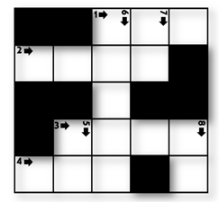

## 1979. 어디에 단어가 들어갈 수 있을까

N X N 크기의 단어 퍼즐을 만들려고 한다. 입력으로 단어 퍼즐의 모양이 주어진다.

주어진 퍼즐 모양에서 특정 길이 K를 갖는 단어가 들어갈 수 있는 자리의 수를 출력하는 프로그램을 작성하라.

**[예제]**

N = 5, K = 3 이고, 퍼즐의 모양이 아래 그림과 같이 주어졌을 때


길이가 3 인 단어가 들어갈 수 있는 자리는 2 곳(가로 1번, 가로 4번)이 된다.




**[제약 사항]**

1. N은 5 이상 15 이하의 정수이다. (5 ≤ N ≤ 15)

2. K는 2 이상 N 이하의 정수이다. (2 ≤ K ≤ N)

**[입력]**

입력은 첫 줄에 총 테스트 케이스의 개수 T가 온다.

다음 줄부터 각 테스트 케이스가 주어진다.

테스트 케이스의 첫 번째 줄에는 단어 퍼즐의 가로, 세로 길이 N 과, 단어의 길이 K 가 주어진다.

테스트 케이스의 두 번째 줄부터 퍼즐의 모양이 2차원 정보로 주어진다.

퍼즐의 각 셀 중, 흰색 부분은 1, 검은색 부분은 0 으로 주어진다.


**[출력]**

테스트 케이스 t에 대한 결과는 “#t”을 찍고, 한 칸 띄고, 정답을 출력한다.

(t는 테스트 케이스의 번호를 의미하며 1부터 시작한다.)

```python
# 가로에 가능한 단어 수를 구하는 함수
def row_crossword(cross_list, K, N):
    # 들어갈 수 있는 단어의 갯수
    word_count = 0

    for row in range(N):
        # 글자수 카운트
        letter_count = 0
        for col in range(N):
            # 빈칸 숫자 1 마다 1씩 카운트
            if cross_list[row][col] == 1:
                letter_count += 1
            # 0 을 만났을 때
            elif cross_list[row][col] == 0:
                # 만약 글자수가 K개 만큼 쌓였으면 단어 개수 추가, 글자수카운트 초기화
                if letter_count == K:
                    word_count += 1
                    letter_count = 0
                # 그게 아니라면 그냥 글자카운트만 초기화
                else:
                    letter_count = 0
        # 마지막 칸이 종료됨과 동시에 글자수가 K라면 단어 개수 추가
        if letter_count == K:
            word_count += 1

    return word_count

# 세로에 가능한 단어 수를 구하는 함수
def col_crossword(cross_list, K, N):
    word_count = 0

    for row in range(N):
        letter_count = 0
        for col in range(N):
            if cross_list[col][row] == 1:
                letter_count += 1
            elif cross_list[col][row] == 0:
                if letter_count == K:
                    word_count += 1
                    letter_count = 0
                else:
                    letter_count = 0
        if letter_count == K:
            word_count += 1
        
    return word_count

T = int(input())
x = 0
while x < T:
    N, K = map(int, input().split())
    cross_list = [list(map(int, input().split())) for _ in range(N)]

    row_words_cnt = row_crossword(cross_list, K, N)
    col_words_cnt = col_crossword(cross_list, K, N)

    result = row_words_cnt + col_words_cnt

    print(f'#{x+1} {result}')

    x += 1
```

```
# input
10
5 3
0 0 1 1 1
1 1 1 1 0
0 0 1 0 0
0 1 1 1 1
1 1 1 0 1
5 3
1 0 0 1 0
1 1 0 1 1
1 0 1 1 1
0 1 1 0 1
0 1 1 1 0
…

# output
#1 2
#2 6
...
```

