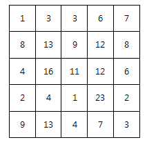
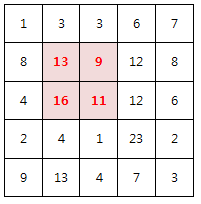

## 2001. 파리 퇴치

N x N 배열 안의 숫자는 해당 영역에 존재하는 파리의 개수를 의미한다.

아래는 N=5 의 예이다.





M x M 크기의 파리채를 한 번 내리쳐 최대한 많은 파리를 죽이고자 한다.

죽은 파리의 개수를 구하라!

예를 들어 M=2 일 경우 위 예제의 정답은 49마리가 된다.





**[제약 사항]**

1. N 은 5 이상 15 이하이다.

2. M은 2 이상 N 이하이다.

3. 각 영역의 파리 갯수는 30 이하 이다.


**[입력]**

가장 첫 줄에는 테스트 케이스의 개수 T가 주어지고, 그 아래로 각 테스트 케이스가 주어진다.

각 테스트 케이스의 첫 번째 줄에 N 과 M 이 주어지고,

다음 N 줄에 걸쳐 N x N 배열이 주어진다.


**[출력]**

출력의 각 줄은 '#t'로 시작하고, 공백을 한 칸 둔 다음 정답을 출력한다.

(t는 테스트 케이스의 번호를 의미하며 1부터 시작한다.)

```python
T = int(input())

x = 0
while x < T:
    n, m = map(int, input().split())
    # 파리 리스트
    fly = [list(map(int, input().split())) for _ in range(n)]

    # 죽는 파리수 계산을 위한 변수
    dead = 0
    
    # 파리채(m)의 크기를 감안하여 파리 리스트 순회
    for i in range(n-m+1):
        for j in range(n-m+1):

            # 파리채(m)의 크기 만큼 타겟 리스트 할당
            target = [fly[a][b] for a in range(i, i+m) for b in range(j, j+m)]

            # 죽인 파리들끼리 대소 비교
            if dead < sum(target):
                dead = sum(target)
            
    print(f'#{x+1} {dead}')
    x += 1
```

```
# input
10
5 2
1 3 3 6 7
8 13 9 12 8
4 16 11 12 6
2 4 1 23 2
9 13 4 7 3
6 3
29 21 26 9 5 8
21 19 8 0 21 19
9 24 2 11 4 24
19 29 1 0 21 19
10 29 6 18 4 3
29 11 15 3 3 29
...

# output
#1 49
#2 159
...
```

