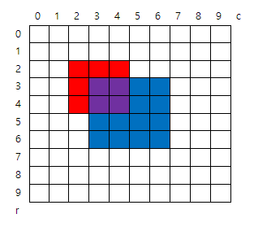

## 4836. [파이썬 S/W 문제해결 기본] 2일차 - 색칠하기

그림과 같이 인덱스가 있는 10x10 격자에 빨간색과 파란색을 칠하려고 한다.

N개의 영역에 대해 왼쪽 위와 오른쪽 아래 모서리 인덱스, 칠할 색상이 주어질 때, 칠이 끝난 후 색이 겹쳐 보라색이 된 칸 수를 구하는 프로그램을 만드시오.

주어진 정보에서 같은 색인 영역은 겹치지 않는다.




예를 들어 2개의 색칠 영역을 갖는 위 그림에 대한 색칠 정보이다.

2

2 2 4 4 1 ( [2,2] 부터 [4,4] 까지 color 1 (빨강) 으로 칠한다 )

3 3 6 6 2 ( [3,3] 부터 [6,6] 까지 color 2 (파랑) 으로 칠한다 )

 

**[입력]**

첫 줄에 테스트 케이스 개수 T가 주어진다.  ( 1 ≤ T ≤ 50 )

다음 줄부터 테스트케이스의 첫 줄에 칠할 영역의 개수 N이 주어진다. ( 2 ≤ N ≤ 30 )

다음 줄에 왼쪽 위 모서리 인덱스 r1, c1, 오른쪽 아래 모서리 r2, c2와 색상 정보 color가 주어진다. ( 0 ≤ r1, c1, r2, c2 ≤ 9 )

color = 1 (빨강), color = 2 (파랑)

 

**[출력]**

각 줄마다 "#T" (T는 테스트 케이스 번호)를 출력한 뒤, 답을 출력한다.

```python
T = int(input())

x = 0
while x < T:
    n = int(input())

    color_map = [list(map(int, input().split())) for _ in range(n)]

    null_list = [[0] * 10 for _ in range(10)]

    # 입력받은 color_map 리스트 순회
    for i in range(len(color_map)): 

        # 색칠할 row 접근
        for row in range(color_map[i][0], color_map[i][2] + 1):
            # 색칠할 col 접근
            for col in range(color_map[i][1], color_map[i][3] + 1):
                if null_list[row][col] == color_map[i][4]:
                    continue
                else:
                    null_list[row][col] += color_map[i][4]

    # 보라색 칸 찾기
    cnt = 0
    for i in range(10):
        for j in range(10):
            if null_list[i][j] == 3:
                cnt += 1

    print(f'#{x+1} {cnt}')
    x += 1
```

```
# input
3
2
2 2 4 4 1
3 3 6 6 2
3
1 2 3 3 1
3 6 6 8 1
2 3 5 6 2
3
1 4 8 5 1
1 8 3 9 1
3 2 5 8 2

# output
#1 4
#2 5
#3 7
```

