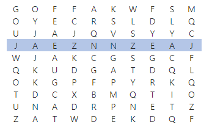

## 4861. [파이썬 S/W 문제해결 기본] 3일차 - 회문

ABBA처럼 어느 방향에서 읽어도 같은 문자열을 회문이라 한다. NxN 크기의 글자판에서 길이가 M인 회문을 찾아 출력하는 프로그램을 만드시오.

회문은 1개가 존재하는데, 가로 뿐만 아니라 세로로 찾아질 수도 있다.


예를 들어 N=10, M=10 일 때, 다음과 같이 회문을 찾을 수 있다.





**[입력]**

첫 줄에 테스트 케이스 개수 T가 주어진다. 1≤T≤50

다음 줄부터 테스트케이스의 첫 줄에 N과 M이 주어진다. 10≤N≤100, 5≤M≤N

다음 줄부터 N개의 글자를 가진 N개의 줄이 주어진다.

 

**[출력]**

각 줄마다 "#T" (T는 테스트 케이스 번호)를 출력한 뒤, 답을 출력한다.

```python
# 회문 판별 함수
def palindrome(word):
    while len(word) >= 1:
        if word[0] == word[-1]:
            word = word[1:-1]
        else:
            return False
    return True

T = int(input())
x = 0
while x < T:
    n, m = map(int, input().split())
    word_list = [input() for _ in range(n)]

    # word_list를 행과 열 전치한 새로운 리스트
    new_list = list(map(list, zip(*word_list)))

    # 리스트 갯수에 따라 큰 for loop를 순회
    for i in range(len(word_list)):
        # 행과 열을 전치한 리스트는 문자하나씩 분리되어 있으므로 join()함수 사용
        temp_word = ''.join(new_list[i])

        # 단어 글자수 만큼 인덱스를 감안하여 단어 회문 비교
        for j in range(n-m+1):
            # 가로 단어 회문 판별
            if palindrome(word_list[i][j:j+m]):
                result = word_list[i][j:j+m]
            # 세로 단어(전치한 리스트) 회문 판별
            elif palindrome(temp_word[j:j + m]):
                result = temp_word[j:j + m]

    print('#{} {}'.format(x+1, result))
    x += 1
    
# 위와같은 경우 회문이 가로와 세로에 모두 존재할 경우 세로만 출력됨. 하지만 tc에서는 회문은 하나만 포함하고 있어 보임
```

```
# input
3
10 10
GOFFAKWFSM
OYECRSLDLQ
UJAJQVSYYC
JAEZNNZEAJ
WJAKCGSGCF
QKUDGATDQL
OKGPFPYRKQ
TDCXBMQTIO
UNADRPNETZ
ZATWDEKDQF
10 10
WPMACSIBIK
STWASDCOBQ
AMOUENCSOG
XTIIGBLRCZ
WXVSWXYYVU
CJVAHRZZEM
NDIEBIIMTX
UOOGPQCBIW
OWWATKUEUY
FTMERSSANL

# output
#1 JAEZNNZEAJ
#2 MWOIVVIOWM
```

