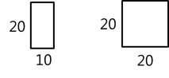
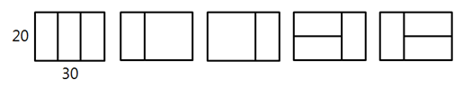

## 4869. [파이썬 S/W 문제해결 기본] 4일차 - 종이붙이기

어린이 알고리즘 교실의 선생님은 경우의 수 놀이를 위해, 그림처럼 가로x세로 길이가 10x20, 20x20인 직사각형 종이를 잔뜩 준비했다.




그리고 교실 바닥에 20xN 크기의 직사각형을 테이프로 표시하고, 이 안에 준비한 종이를 빈틈없이 붙이는 방법을 찾아보려고 한다. N이 30인 경우 다음 그림처럼 종이를 붙일 수 있다.





10의 배수인 N이 주어졌을 때, 종이를 붙이는 모든 경우를 찾으려면 테이프로 만든 표시한 영역을 몇 개나 만들어야 되는지 계산하는 프로그램을 만드시오. 직사각형 종이가 모자라는 경우는 없다.


**[입력]**

첫 줄에 테스트 케이스 개수 T가 주어진다. 1≤T≤50
다음 줄부터 테스트 케이스 별로 N이 주어진다. 10≤N≤300, N은 10의 배수


**[출력]**

각 줄마다 "#T" (T는 테스트 케이스 번호)를 출력한 뒤, 답을 출력한다.

```python
# 종이붙이기 함수
def paper(N):
    # n을 10으로 나눈 몫을 사용하므로 10 -> 1, 20 -> 2 ...로 통일

    if N == 1:      # n이 10일 경우
        return 1    # 나오는 경우의 수는 1가지

    elif N == 2:    # n 이 20일 경우
        return 3    # 나오는 경우의 수는 3가지

    # N 길이를 만들 수 있는 경우는 2가지이다
    # N-10 길이에 세로 10*20 종이를 붙이는 방법과
    # N-20 길이에 가로의 10*20 2장 혹은 20*20 1장 => paper(N-2)를 두번 곱한 이유
    # 10*20 종이를 세워 2장을 붙이는 방법은 paper(N-1)과 같음
    return paper(N - 1) + paper(N - 2) * 2

# 속도향상을 위한 DP 함수
def dp_paper(N):
    if data[N] == 0:
        data[N] = dp_paper(N - 1) + dp_paper(N - 2) * 2
    return data[N]


T = int(input())
x = 0
while x < T:
    # 총 길이 입력 (인덱스 부여를 위한 //10)
    n = int(input())//10

    # 런타임 오버 방지를 위한 DP
    data = [0 for _ in range(31)]
    data[1] = 1
    data[2] = 3

    # 종이접기 함수 호출
    res = paper(n)
    res2 = dp_paper(n)
    print('#{} {}'.format(x+1, res))
    # print('#{} {}'.format(x+1, res2))
    x += 1
```

```
# input
3
30
50
70

# output
#1 5
#2 21
#3 85
```

