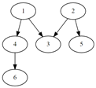

## 4871. [파이썬 S/W 문제해결 기본] 4일차 - 그래프 경로

V개 이내의 노드를 E개의 간선으로 연결한 방향성 그래프에 대한 정보가 주어질 때, 특정한 두 개의 노드에 경로가 존재하는지 확인하는 프로그램을 만드시오.

두 개의 노드에 대해 경로가 있으면 1, 없으면 0을 출력한다.


예를 들어 다음과 같은 그래프에서 1에서 6으로 가는 경로를 찾는 경우, 경로가 존재하므로 1을 출력한다.





노드번호는 1번부터 존재하며, V개의 노드 중에는 간선으로 연결되지 않은 경우도 있을 수 있다.

 

**[입력]**

첫 줄에 테스트 케이스 개수 T가 주어진다. 1≤T≤50

다음 줄부터 테스트 케이스의 첫 줄에 V와 E가 주어진다. 5≤V≤50, 4≤E≤1000

테스트케이스의 둘째 줄부터 E개의 줄에 걸쳐, 출발 도착 노드로 간선 정보가 주어진다.

E개의 줄 이후에는 경로의 존재를 확인할 출발 노드 S와 도착노드 G가 주어진다.

 

**[출력]**

각 줄마다 "#T" (T는 테스트 케이스 번호)를 출력한 뒤, 답을 출력한다.

```python
T = int(input())
x = 0
while x < T:
    # 입력 데이터
    V, E = map(int, input().split())                            # 노드, 간선
    arr = [list(map(int, input().split())) for _ in range(E)]   # 간선 정보
    S, G = map(int, input().split())                            # 시작, 끝 지점

    # 인접 리스트 생성
    adj = [[] for _ in range(V+1)]
    for i in range(len(arr)):
        adj[arr[i][0]].append(arr[i][1])

    s = []                  # 스택 리스트
    visited = [0] * (V+1)   # 노드 방문 여부 리스트
    res = 0                 # 경로 존재 여부 초기화

    s.append(S)         # 시작 지점을 스택에 추가
    while len(s) != 0:  # 반복구조 dfs
        n = s.pop()     # 스택에서 갈 수 있는 노드 선택

        if n == G:      # 노드 n이 도착 지점과 동일하면
            res = 1     # 경로가 존재(1)하므로 종료
            break

        # 방문하지 않은 노드라면 밑의 로직 진행 / 방문하였다면 생략하고 pop()으로 이동
        if visited[n] == 0:
            visited[n] = 1  # 방문 했음을 표시

            if adj[n] is None:  # 방문한 노드에 간선 정보가 없다면 
                continue        # pop()으로 skip (방문만 표시되고 pop되어 사라짐)
                
            else:               # 방문한 노드에 간선 정보가 있다면 전부 스택에 추가
                for i in range(len(adj[n])):
                    s.append(adj[n][i])
    
    # 스택 길이가 0이 되어 나오면 res = 0
    # n == G로 종료되면 res = 1
    print('#{} {}'.format(x+1, res))
    x += 1
```

```
# input
3
6 5
1 4
1 3
2 3
2 5
4 6
1 6
7 4
1 6
2 3
2 6
3 5
2 5
9 9
2 6
4 7
5 7
1 5
2 9
3 9
4 8
5 3
7 8
1 9

# ouput
#1 1
#2 1
#3 1
```

