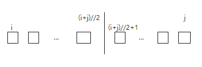
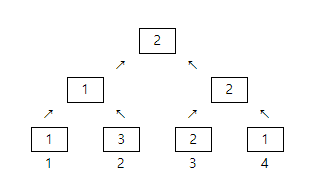

## 4880. [파이썬 S/W 문제해결 기본] 5일차 - 토너먼트 카드게임

사다리 게임이 지겨워진 알고리즘 반 학생들이 새로운 게임을 만들었다. 가위바위보가 그려진 카드를 이용해 토너먼트로 한 명을 뽑는 것이다. 게임 룰은 다음과 같다.


1번부터 N번까지 N명의 학생이 N장의 카드를 나눠 갖는다. 전체를 두 개의 그룹으로 나누고, 그룹의 승자끼리 카드를 비교해서 이긴 사람이 최종 승자가 된다.

그룹의 승자는 그룹 내부를 다시 두 그룹으로 나눠 뽑는데, i번부터 j번까지 속한 그룹은 파이썬 연산으로 다음처럼 두개로 나눈다.

 

두 그룹이 각각 1명이 되면 양 쪽의 카드를 비교해 승자를 가리고, 다시 더 큰 그룹의 승자를 뽑는 방식이다.

다음은 4명이 카드를 비교하는 경우로, 숫자 1은 가위, 2는 바위, 3은 보를 나타낸다. 만약 같은 카드인 경우 편의상 번호가 작은 쪽을 승자로 하고, 처음 선택한 카드는 바꾸지 않는다.


N명이 학생들이 카드를 골랐을 때 1등을 찾는 프로그램을 만드시오.


**[입력]**

첫 줄에 테스트 케이스 개수 T가 주어진다. 1≤T≤50


다음 줄부터 테스트 케이스의 별로 인원수 N과 다음 줄에 N명이 고른 카드가 번호순으로 주어진다. 4≤N≤100

카드의 숫자는 각각 1은 가위, 2는 바위, 3은 보를 나타낸다.

 

**[출력]**


각 줄마다 "#T" (T는 테스트 케이스 번호)를 출력한 뒤, 1등의 번호를 출력한다.

```python
# i와 j번째 카드의 승자 인덱스를 반환
def winner(i, j):
    # 1은 가위, 2는 바위, 3은 보
    if a[i] == 1:
        if a[j] == 1 or a[j] == 3:
            return i
        elif a[j] == 2:
            return j

    elif a[i] == 2:
        if a[j] == 2 or a[j] == 1:
            return i
        elif a[j] == 3:
            return j

    elif a[i] == 3:
        if a[j] == 3 or a[j] == 2:
            return i
        elif a[j] == 1:
            return j


# 중간 인덱스를 사용하는 토너먼트 방식
def tournament(start, end):
    if start == end:
        return start
    center = (start + end) // 2

    left = tournament(start, center)
    right = tournament(center + 1, end)

    return winner(left, right)


T = int(input())
t = 0
while t < T:
    n = int(input())
    a = list(map(int, input().split()))

    print('#{} {}'.format(t + 1, tournament(0, n - 1) + 1))
    t += 1
```

```
# input
3
4
1 3 2 1
6
2 1 1 2 3 3
7
1 3 3 3 1 1 3

# output
#1 3
#2 5
#3 1
```

