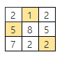

## 4881. [파이썬 S/W 문제해결 기본] 5일차 - 배열 최소 합

NxN 배열에 숫자가 들어있다. 한 줄에서 하나씩 N개의 숫자를 골라 합이 최소가 되도록 하려고 한다. 단, 세로로 같은 줄에서 두 개 이상의 숫자를 고를 수 없다.

조건에 맞게 숫자를 골랐을 때의 최소 합을 출력하는 프로그램을 만드시오.


예를 들어 다음과 같이 배열이 주어진다.



이경우 1, 5, 2를 고르면 합이 8로 최소가 된다.

 

**[입력]**

첫 줄에 테스트 케이스 개수 T가 주어진다. 1≤T≤50


다음 줄부터 테스트 케이스의 첫 줄에 숫자 N이 주어지고, 이후 N개씩 N줄에 걸쳐 10보다 작은 자연수가 주어진다. 3≤N≤10

 

**[출력]**


각 줄마다 "#T" (T는 테스트 케이스 번호)를 출력한 뒤, 합계를 출력한다.

```python
# 인덱스와, 합계계산을 위한 인자를 받는 함수
def perm(idx, sum_val):
    global min_val

    # 합계가 저장되어 있는 최소값보다 크다면 바로 걍 돌아가라
    if min_val < sum_val:
        return

    # idx가 꽉차서 오면 합계와 최소값을 비교
    if idx == n:
        if sum_val < min_val:       # 최소값이 더 크다면
            min_val = sum_val       # 새로운 최소값을 할당
        return                      # 다시 돌아가서 하던거 마저 하렴

    # 위의 모든 경우가 아니라면 열심히 순열을 조합해야지
    else:
        # n이 3일 때, i = 0, 1, 2
        for i in range(n):
            if check[i] == 0:   # i번째 열을 아직 방문안했니?
                check[i] = 1    # 가져다 쓸게
                
                # 다음 행에 어떤 숫자를 가져올까 + 합계에는 idx 행의 i번째 열을 더해놓고 갈꺼야
                perm(idx + 1, sum_val + arr[idx][i])
                check[i] = 0    # 잘 쓰고 다시 반납


T = int(input())
t = 0
while t < T:
    n = int(input())
    arr = [list(map(int, input().split())) for _ in range(n)]

    min_val = 9999      # 최소값 초기화
    check = [0] * n     # 사용 여부

    perm(0, 0)
    print('#{} {}'.format(t + 1, min_val))
    t += 1
```

```
# input
3
3
2 1 2
5 8 5
7 2 2
3
9 4 7
8 6 5
5 3 7
5
5 2 1 1 9
3 3 8 3 1
9 2 8 8 6
1 5 7 8 3
5 5 4 6 8

# output
#1 8
#2 14
#3 9
```

