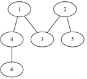

## 5102. [파이썬 S/W 문제해결 기본] 6일차 - 노드의 거리

V개의 노드 개수와 방향성이 없는 E개의 간선 정보가 주어진다.

주어진 출발 노드에서 최소 몇 개의 간선을 지나면 도착 노드에 갈 수 있는지 알아내는 프로그램을 만드시오.

예를 들어 다음과 같은 그래프에서 1에서 6으로 가는 경우, 두 개의 간선을 지나면 되므로 2를 출력한다.


  


노드 번호는 1번부터 존재하며, 노드 중에는 간선으로 연결되지 않은 경우도 있을 수 있다.

**[입력]**

첫 줄에 테스트 케이스 개수 T가 주어진다. 1<=T<=50

다음 줄부터 테스트 케이스의 첫 줄에 V와 E가 주어진다. 5<=V=50, 4<=E<=1000

테스트케이스의 둘째 줄부터 E개의 줄에 걸쳐, 간선의 양쪽 노드 번호가 주어진다.

E개의 줄 이후에는 출발 노드 S와 도착 노드 G가 주어진다.

**[출력]**

각 줄마다 "#T" (T는 테스트 케이스 번호)를 출력한 뒤, 답을 출력한다.

두 노드 S와 G가 서로 연결되어 있지 않다면, 0을 출력한다.

```python
T = int(input())
t = 0
while t < T:
    V, E = map(int, input().split())    # 노드 수, 간선 수

    # 인접 행렬 초기화
    adj = [[0] * (V+1) for _ in range(V+1)]

    # 간선 정보를 받아 인접 행렬 입력
    for i in range(E):
        a, b = map(int, input().split())
        adj[a][b] = 1
        adj[b][a] = 1

    # 출발, 도착 노드
    S, G = map(int, input().split())

    # 방문 여부 리스트
    v = [0] * (V+1)

    # 노드 간 거리
    dis = 0
    res = False

    # BFS
    q = [S]

    while q and not res:
        size = len(q)           # 현재 큐의 길이

        for i in range(size):   # 현재 큐의 길이만큼 순회 (같은 거리의 노드끼리 순회)
            node = q.pop(0)     # 하나씩 삭제하다가

            if node == G:       # 도착지점을 만나면
                res = True      # 도착을 바꾸고 중지
                break

            else:               # 그렇지 않으면
                for i in range(V+1):
                    if adj[node][i] and not v[i]:   # 접점이면서 방문하지 않은 노드에 대해서
                        q.append(i)                 # 큐에 삽입
                        v[i] = 1                    # 방문했다고 표시
        if not res:     # 도착지점을 찾을때 까지만 거리를 증가
            dis += 1

    if res:
        print('#{} {}'.format(t+1, dis))
    else:
        print('#{} {}'.format(t + 1, 0))
    t += 1
```

```
# input
3
6 5
1 4
1 3
2 3
2 5
4 6
1 6
7 4
1 6
2 3
2 6
3 5
1 5
9 9
2 6
4 7
5 7
1 5
2 9
3 9
4 8
5 3
7 8
1 9

# output
#1 2
#2 4
#3 3
```

