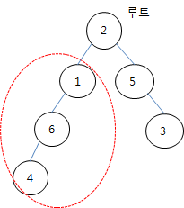

## 5174. [파이썬 S/W 문제해결 기본] 8일차 - subtree

트리의 일부를 서브 트리라고 한다. 주어진 이진 트리에서 노드 N을 루트로 하는 서브 트리에 속한 노드의 개수를 알아내는 프로그램을 만드시오.





주어지는 트리는 부모와 자식 노드 번호 사이에 특별한 규칙이 없고, 부모가 없는 노드가 전체의 루트 노드가 된다.

이런 경우의 트리는 부모 노드를 인덱스로 다음과 같은 방법으로 나타낼 수 있다. 자식 노드가 0인 경우는 노드가 자식이 없는 경우이다.

 

| 부모  | 1    | 2    | 3    | 4    | 5    | 6    |
| ----- | ---- | ---- | ---- | ---- | ---- | ---- |
| 자식1 | 6    | 1    | 0    | 0    | 3    | 4    |
| 자식2 | 0    | 5    | 0    | 0    | 0    | 0    |


**[입력]**

첫 줄에 테스트케이스의 수 T가 주어진다. 1<=T<=50

다음 줄부터 테스트 케이스의 별로 첫 줄에 간선의 개수 E와 N이 주어지고, 다음 줄에 E개의 부모 자식 노드 번호 쌍이 주어진다.

노드 번호는 1번부터 E+1번까지 존재한다. 1<=E<=1000, 1<=N<=E+1

**[출력]**

각 줄마다 "#T" (T는 테스트 케이스 번호)를 출력한 뒤, 답을 출력한다.

```python
def subtree(n):
    # n으로부터 연결되는 subtree의 노드 수 구하기
    node_q = [n]
    
    # 노드 수 카운트를 위한 res (시작지점이 포함되므로 1로 시작)
    res = 1
    
    # 큐 구현으로 자식노드를 탐색
    while node_q:
        t = node_q.pop(0)
        for i in node[t]:   # node[t]에 대한 자식 노드 순회
            if i != 0:      # 0이면 자식노드 X, 그 외라면 자식노드 O
                node_q.append(i)    # 자식노드를 부모노드로 추후에 탐색하기 위해 큐에 추가
                res += 1            # 자식노드를 찾았으므로 카운트 +1
    return res


for tc in range(1, int(input()) + 1):
    e, n = map(int, input().split())
    pair = list(map(int, input().split()))

    node_cnt = e + 2
    node = [[0] * 2 for _ in range(node_cnt)]
    
    # node[idx] : 부모 노드
    # node[idx][0] : idx의 왼쪽 자식 노드, node[idx][1] : idx의 오른쪽 자식 노드
    for i in range(e):
        if node[pair[i*2]][0] != 0:
            node[pair[i*2]][1] = pair[i*2+1]
        else:
            node[pair[i * 2]][0] = pair[i * 2 + 1]

    print(f'#{tc} {subtree(n)}')
```

```
# input
3
5 1
2 1 2 5 1 6 5 3 6 4
5 1
2 6 6 4 6 5 4 1 5 3
10 5
7 6 7 4 6 9 4 11 9 5 11 8 5 3 5 2 8 1 8 10

# output
#1 3
#2 1
#3 3
```

