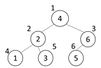

## 5176. [파이썬 S/W 문제해결 기본] 8일차 - 이진탐색

1부터 N까지의 자연수를 이진 탐색 트리에 저장하려고 한다.

이진 탐색 트리는 어떤 경우에도 저장된 값이 왼쪽 서브트리의 루트 <현재 노드 <오른쪽 서브 트리의 루트인 규칙을 만족한다.

추가나 삭제가 없는 경우에는, 완전 이진 트리가 되도록 만들면 효율적인 이진 탐색 트리를 만들수 있다.

다음은 1부터 6까지의 숫자를 완전 이진 트리 형태인 이진 탐색 트리에 저장한 경우이다.




 
완전 이진 트리의 노드 번호는 루트를 1번으로 하고 아래로 내려가면서 왼쪽에서 오른쪽 순으로 증가한다.

N이 주어졌을 때 완전 이진 트리로 만든 이진 탐색 트리의 루트에 저장된 값과, N/2번 노드(N이 홀수인 경우 소수점 버림)에 저장된 값을 출력하는 프로그램을 만드시오.


**[입력]**

첫 줄에 테스트케이스의 수 T가 주어진다. 1<=T<=50

다음 줄부터 테스트 케이스의 별로 N이 주어진다. 1<=N<=1000

**[출력]**

각 줄마다 "#T" (T는 테스트 케이스 번호)를 출력한 뒤, 답을 출력한다.

```python
def binarytree(node):
    # 차례로 증가하며 트리에 들어갈 숫자
    global num

    # node 값이 배열크기를 넘어가지 않는 조건
    if node <= n:
        binarytree(node * 2)        # 왼쪽 노드는 현재 인덱스 * 2
        tree[node] = num            # 재귀에 끝에 도달하면 숫자 입력
        num += 1                    # 다음값 입력을 위해 +1
        binarytree(node * 2 + 1)    # 오른쪽 노드는 현재 인덱스 * 2 + 1

for tc in range(1, int(input()) + 1):
    n = int(input())

    tree = [0 for _ in range(n+1)]
    num = 1         # 시작 값
    binarytree(1)   # tree 배열에 조건에 맞게 입력하는 함수
    print(f'#{tc} {tree[1]} {tree[n//2]}')
```

```
# input
3
6
8
15

# output
#1 4 6
#2 5 2
#3 8 14
```

