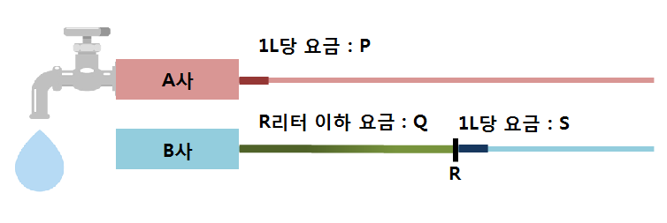
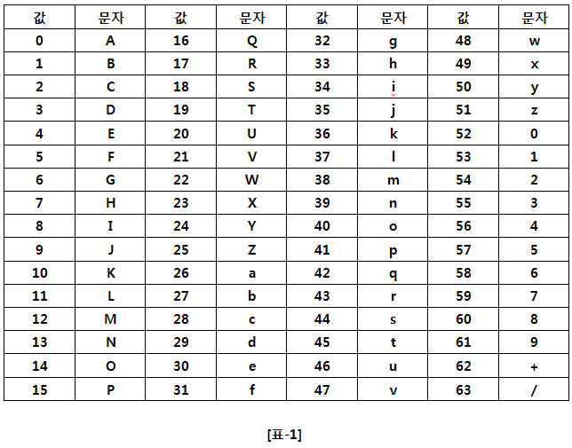

# D2

## 1204. [S/W 문제해결 기본] 1일차 - 최빈수 구하기

어느 고등학교에서 실시한 1000명의 수학 성적을 토대로 통계 자료를 만들려고 한다.

이때, 이 학교에서는 최빈수를 이용하여 학생들의 평균 수준을 짐작하는데, 여기서 최빈수는 특정 자료에서 가장 여러 번 나타나는 값을 의미한다.

다음과 같은 수 분포가 있으면,

10, 8, 7, 2, 2, 4, 8, 8, 8, 9, 5, 5, 3

최빈수는 8이 된다.

최빈수를 출력하는 프로그램을 작성하여라 (단, 최빈수가 여러 개 일 때에는 가장 큰 점수를 출력하라).

**[제약 사항]**

학생의 수는 1000명이며, 각 학생의 점수는 0점 이상 100점 이하의 값이다.

**[입력]**

첫 번째 줄에 테스트 케이스의 수 T가 주어진다.

각 테스트 케이스의 첫 줄에는 테스트 케이스의 번호가 주어지고 그 다음 줄부터는 점수가 주어진다.

**[출력]**

\#부호와 함께 테스트 케이스의 번호를 출력하고, 공백 문자 후 테스트 케이스에 대한 답을 출력한다.

```python
T = int(input())

i = 0 
db = []
while i < T:
    i += 1
    tc = int(input())

    scores = list(map(int, input().split()))
    db.append(scores)

for idx, score_list in enumerate(db):
    count_dict = {key: 0 for key in set(score_list)}
    for score in score_list:
        count_dict[score] += 1
    dic_max = max(count_dict.values())
    for key, value in count_dict.items():
        if value == dic_max:
            print(f'#{idx+1} {key}')
```

```
# input
10
1
<학생 1000명의 점수> 예: 41 85 72 38 80 69 65 ...
2
<학생 1000명의 점수>...
...

# output
#1 71
#2 76
.......
```


## 1284. 수도 요금 경쟁

삼성전자에 입사한 종민이는 회사 근처로 이사를 하게 되었다.

그런데 집의 위치가 두 수도 회사 A, B 중간에 위치하기에 원하는 수도 회사를 선택할 수 있게 되었는데, 두 회사 중 더 적게 수도 요금을 부담해도 되는 회사를 고르려고 한다.

종민이가 알아본 결과 두 회사의 수도 요금은 한 달 동안 사용한 수도의 양에 따라 다음과 같이 정해진다.

A사 : 1리터당 P원의 돈을 내야 한다.

B사 : 기본 요금이 Q원이고, 월간 사용량이 R리터 이하인 경우 요금은 기본 요금만 청구된다. 하지만 R 리터보다 많은 양을 사용한 경우 초과량에 대해 1리터당 S원의 요금을 더 내야 한다.



종민이의 집에서 한 달간 사용하는 수도의 양이 W리터라고 할 때, 요금이 더 저렴한 회사를 골라 그 요금을 출력하는 프로그램을 작성하라.

**[입력]**

첫 번째 줄에 테스트 케이스의 수 T가 주어진다.

각 테스트 케이스마다 첫 번째 줄에 위 본문에서 설명한 대로 P, Q, R, S, W(1 ≤ P, Q, R, S, W ≤ 10000, 자연수)가 순서대로 공백 하나로 구분되어 주어진다.

**[출력]**

각 테스트 케이스마다 ‘#x’(x는 테스트케이스 번호를 의미하며 1부터 시작한다)를 출력하고, 종민이가 내야 하는 수도 요금을 출력한다.

```python
T = int(input())

i = 0

a_comp = []
b_comp = []
while i < T:
    P, Q, R, S, W = map(int, input().split())
    i += 1
    a_comp.append(P * W)
    if R >= W:
        b_comp.append(Q)
    else:
        b_comp.append(Q + ((W - R) * S))

for tc in range(T):
    if a_comp[tc] > b_comp[tc]:
        print(f'#{tc+1} {b_comp[tc]}')
    else:
        print(f'#{tc+1} {a_comp[tc]}')
```

```
# input
2
9 100 20 3 10
8 300 100 10 250

# output
#1 90
#2 1800
```


## 1288. 새로운 불면증 치료법

민석이는 불면증에 걸렸다. 그래서 잠이 안 올 때의 민간요법 중 하나인 양 세기를 하려고 한다.

민석이는 1번 양부터 순서대로 세는 것이 재미없을 것 같아서 N의 배수 번호인 양을 세기로 하였다.

즉, 첫 번째에는 N번 양을 세고, 두 번째에는 2N번 양, … , k번째에는 kN번 양을 센다.

이렇게 숫자를 세던 민석이에게 잠은 더 오지 않고 다음과 같은 궁금증이 생겼다.

이전에 셌던 번호들의 각 자리수에서 0에서 9까지의 모든 숫자를 보는 것은 최소 몇 번 양을 센 시점일까?

예를 들어 N = 1295이라고 하자.

첫 번째로 N = 1295번 양을 센다. 현재 본 숫자는 1, 2, 5, 9이다.

두 번째로 2N = 2590번 양을 센다. 현재 본 숫자는 0, 2, 5, 9이다.

현재까지 본 숫자는 0, 1, 2, 5, 9이다.

세 번째로 3N = 3885번 양을 센다. 현재 본 숫자는 3, 5, 8이다.

현재까지 본 숫자는 0, 1, 2, 3, 5, 8, 9이다.

네 번째로 4N = 5180번 양을 센다. 현재 본 숫자는 0, 1, 5, 8이다.

현재까지 본 숫자는 0, 1, 2, 3, 5, 8, 9이다.

다섯 번째로 5N = 6475번 양을 센다. 현재 본 숫자는 4, 5, 6, 7이다.

현재까지 본 숫자는 0, 1, 2, 3, 4, 5, 6, 7, 8, 9이다.

5N번 양을 세면 0에서 9까지 모든 숫자를 보게 되므로 민석이는 양 세기를 멈춘다.

**[입력]**

첫 번째 줄에 테스트 케이스의 수 T가 주어진다.

각 테스트 케이스의 첫 번째 줄에는 N (1 ≤ N ≤ 106)이 주어진다.

**[출력]**

각 테스트 케이스마다 ‘#x’(x는 테스트케이스 번호를 의미하며 1부터 시작한다)를 출력하고,

최소 몇 번 양을 세었을 때 이전에 봤던 숫자들의 자릿수에서 0에서 9까지의 모든 숫자를 보게 되는지 출력한다.

( 민석이는 xN번 양을 세고 있다. )

```python
T = int(input())

i = 0
n = []
result = []
while i < T:
    n_ele = int(input())
    n.append(n_ele)
    
    num = n[i]
    m = 1
    count_dict = {key:0 for key in range(10)}
    while True:
        count_number = num * m
        temp_list = [i for i in str(count_number)]
        for number in temp_list:
            count_dict[int(number)] += 1
        if all(count_dict.values()):
            break
        else:
            m += 1
    result.append(count_number)
    i += 1
   
for idx, i in enumerate(result):
    print(f'#{idx+1} {i}')
```

```
# input
5
1
2
11
1295
1692

# output
#1 10
#2 90
#3 110
#4 6475
#5 5076
```


## 1928. Base64 Decoder :-1: 

다음과 같이 Encoding 을 한다.

1. 우선 24비트 버퍼에 위쪽(MSB)부터 한 byte씩 3 byte의 문자를 집어넣는다.

2. 버퍼의 위쪽부터 6비트씩 잘라 그 값을 읽고, 각각의 값을 아래 [표-1] 의 문자로 Encoding 한다.



입력으로 Base64 Encoding 된 String 이 주어졌을 때, 해당 String 을 Decoding 하여, 원문을 출력하는 프로그램을 작성하시오.

**[제약사항]**
문자열의 길이는 항상 4의 배수로 주어진다.
그리고 문자열의 길이는 100000을 넘지 않는다.

**[입력]**
입력은 첫 줄에 총 테스트 케이스의 개수 T가 온다.
다음 줄부터 각 테스트 케이스가 주어진다.
테스트 케이스는 Encoding 된 상태로 주어지는 문자열이다.

**[출력]**
테스트 케이스 t에 대한 결과는 “#t”을 찍고, 한 칸 띄고, 정답을 출력한다.
(t는 테스트 케이스의 번호를 의미하며 1부터 시작한다.)

```python
import base64

T = int(input())

i = 0
while i < T:
    decoding_string = base64.b64decode(input())
    utf_to_b64 = decoding_string.decode("UTF-8")
    print(f'#{i+1} {utf_to_b64}')
    i += 1
```

```
# input
10
TGlmZSBpdHNlbGYgaXMgYSBxdW90YXRpb24u
U3VzcGljaW9uIGZvbGxvd3MgY2xvc2Ugb24gbWlzdHJ1c3Qu
VG8gZG91YnQgaXMgc2FmZXIgdGhhbiB0byBiZSBzZWN1cmUu
T25seSB0aGUganVzdCBtYW4gZW5qb3lzIHBlYWNlIG9mIG1pbmQu
QSBmdWxsIGJlbGx5IGlzIHRoZSBtb3RoZXIgb2YgYWxsIGV2aWwu
...
 
# output
#1 Life itself is a quotation.
#2 Suspicion follows close on mistrust.
#3 To doubt is safer than to be secure.
#4 Only the just man enjoys peace of mind.
#5 A full belly is the mother of all evil.
...
```


## 1940. 가랏! RC카!​ :-1:(문제 이해 X)

**RC (Radio Control)** 카의 이동거리를 계산하려고 한다.

입력으로 매 초마다 아래와 같은 command 가 정수로 주어진다.

0 : 현재 속도 유지.
1 : 가속
2 : 감속

위 command 중, **가속(1)** 또는 **감속(2)** 의 경우 가속도의 값이 추가로 주어진다.

가속도의 단위는, **m/s2** 이며, 모두 양의 정수로 주어진다.

입력으로 주어진 **N** 개의 command 를 모두 수행했을 때, **N 초 동안 이동한 거리를 계산하는 프로그램을 작성하라.**

RC 카의 초기 속도는 0 m/s 이다.

**[예제]**

아래 예제 입력에서 정답은 3 이 된다.

**입력     시간   RC 카의 속도 RC   카의 이동거리**
1 2     1 sec     2 m/s          2 m
2 1     2 sec      1 m/s          3 m


**[제약사항]**

1. N은 2이상 30이하의 정수이다. (2 ≤ N ≤ 30)

2. 가속도의 값은 1 m/s2 혹은 2 m/s2 이다.

3. 현재 속도보다 감속할 속도가 더 클 경우, 속도는 0 m/s 가 된다.


**[입력]**

입력은 첫 줄에 총 테스트 케이스의 개수 T, 다음 줄부터 각 테스트 케이스가 주어진다.

테스트 케이스 첫 줄에는 Command 의 수 N이 주어지고, 둘째 줄부터, 매 줄마다 각각의 Command가 주어진다.


**[출력]**

테스트 케이스 t에 대한 결과는 “#t”을 찍고, 한 칸 띄고, 정답을 출력한다.

(t는 테스트 케이스의 번호를 의미하며 1부터 시작한다.)

```python

```

```

```


## 1945. 간단한 소인수분해

숫자 N은 아래와 같다.

N=2^a x 3^b x 5^c x 7^d x 11^e

N이 주어질 때 a, b, c, d, e 를 출력하라.


**[제약 사항]**

N은 2 이상 10,000,000 이하이다.


**[입력]**

가장 첫 줄에는 테스트 케이스의 개수 T가 주어지고, 그 아래로 각 테스트 케이스가 주어진다.

각 테스트 케이스의 첫 번째 줄에 N 이 주어진다.


**[출력]**

출력의 각 줄은 '#t'로 시작하고, 공백을 한 칸 둔 다음 정답을 출력한다.

(t는 테스트 케이스의 번호를 의미하며 1부터 시작한다.)

```python
T = int(input())

i = 0
numbers = []
result = []
while i < T:
    numbers.append(int(input()))
    divisor = {2:0, 3:0, 5:0, 7:0, 11:0}
    idx = 0
    while True:
        div_list = [2, 3, 5, 7, 11]

        if numbers[i] % div_list[idx] == 0:
            numbers[i] = numbers[i] // div_list[idx]
            divisor[div_list[idx]] += 1

        elif numbers[i] == 1:
            break

        elif numbers[i] % div_list[idx] != 0:
            idx += 1
    result.append(list(divisor.values()))
    i += 1

for idx, i in enumerate(result):
    count = ' '.join(list(map(str, i)))
    print(f"#{idx+1} {count}")
```

```
# input
10  
6791400
1646400
1425600
8575
185625
6480
1185408
6561
25
330750

# output
#1 3 2 2 3 1
#2 6 1 2 3 0
#3 6 4 2 0 1
#4 0 0 2 3 0
#5 0 3 4 0 1
#6 4 4 1 0 0
#7 7 3 0 3 0
#8 0 8 0 0 0
#9 0 0 2 0 0
#10 1 3 3 2 0
```


## 1946. 간단한 압축 풀기

원본 문서는 너비가 10인 여러 줄의 문자열로 이루어져 있다.

문자열은 마지막 줄을 제외하고 빈 공간 없이 알파벳으로 채워져 있고 마지막 줄은 왼쪽부터 채워져 있다.

이 문서를 압축한 문서는 알파벳과 그 알파벳의 연속된 개수로 이루어진 쌍들이 나열되어 있다. (예 : A 5  AAAAA)

압축된 문서를 입력 받아 원본 문서를 만드는 프로그램을 작성하시오.

**[예제]**
압축된 문서의 내용

A 10
B 7
C 5


압축을 풀었을 때 원본 문서의 내용

AAAAAAAAAA
BBBBBBBCCC
CC


**[제약사항]**

1. 압축된 문서의 알파벳과 숫자 쌍의 개수 N은1이상 10이하의 정수이다. (1 ≤ N ≤ 10)

2. 주어지는 알파벳 Ci는 A~Z의 대문자이다. (i는 줄의 번호로 1~N까지의 수)

3. 알파벳의 연속된 개수로 주어지는 수 Ki는 1이상 20이하의 정수이다. (1 ≤ Ki ≤ 20, i는 줄의 번호로 1~N까지의 수)

4. 원본 문서의 너비는 10으로 고정이다.


**[입력]**

가장 첫 줄에는 테스트 케이스의 개수 T가 주어지고, 그 아래로 각 테스트 케이스가 주어진다.

각 테스트 케이스에는 N이 주어지고 다음 줄부터 N+1줄까지 Ci와 Ki가 빈 칸을 사이에 두고 주어진다.


**[출력]**

각 줄은 '#t'로 시작하고, 다음 줄부터 원본 문서를 출력한다.

(t는 테스트 케이스의 번호를 의미하며 1부터 시작한다.)

```python
T = int(input())

i = 0
Ci_Ki = [0] * T
while i < T:
    N = int(input())

    j = 0
    Ci_Ki[i] = [0] * N
    while j < N:
        Ci, Ki = input().split()
        Ci_Ki[i][j] = [Ci, int(Ki)]
        j += 1
    i += 1

for i in range(T):
    print(f'#{i+1}')
    global_count = 0
    for _list in Ci_Ki[i]:
        for cnt in range(_list[1]):
            print(_list[0], end='')

            global_count += 1

            if global_count % 10 == 0:
                print()
    print()
```

```
# input
1
3
A 10
B 7
C 5     

# output
#1
AAAAAAAAAA
BBBBBBBCCC
CC
```


## 1948. 날짜 계산기:-1: (10중 7개 패스..?)

월 일로 이루어진 날짜를 2개 입력 받아, 두 번째 날짜가 첫 번째 날짜의 며칠째인지 출력하는 프로그램을 작성하라.


**[제약 사항]**

월은 1 이상 12 이하의 정수이다. 각 달의 마지막 날짜는 다음과 같다.

1/31, 2/28, 3/31, 4/30, 5/31, 6/30, 7/31, 8/31, 9/30, 10/31, 11/30, 12/31

두 번째 날짜가 첫 번째 날짜보다 항상 크게 주어진다.


**[입력]**

가장 첫 줄에는 테스트 케이스의 개수 T가 주어지고, 그 아래로 각 테스트 케이스가 주어진다.

각 테스트 케이스의 첫 번째 줄에는 4개의 수가 주어진다.

첫 번째 수가 월을 나타내고 두 번째 수가 일을 나타낸다. 그 다음 같은 형식으로 두 번째 날짜가 주어진다.


**[출력]**

출력의 각 줄은 '#t'로 시작하고, 공백을 한 칸 둔 다음 정답을 출력한다. (t는 테스트 케이스의 번호를 의미하며 1부터 시작한다.)

```python
T = int(input())

i = 0
start_end = []
last_date = [31, 28, 31, 30, 31, 30, 31, 31, 30, 31, 30, 31]

while i < T:
    start_end.append(list(map(int, input().split())))
    
    result_list = []

    for dates in start_end:
        # result = result + (last_date[dates[0]] - dates[1]) # 시작 월만 날짜 계산
        # result = result + (last_date[dates[2]] - dates[3])
        result = 1

        for month in range(dates[0], dates[2]):
            result += last_date[month]

        result_list.append(result - dates[1] + dates[3])

    i += 1

for idx, result in enumerate(result_list):
    print(f'#{idx+1} {result}')
```

```
# input
3 
3 1 3 31
5 5 8 15
7 17 12 24  

# output
#1 31
#2 103
#3 161
```

