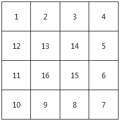

# D2

## 1954. 달팽이 숫자

달팽이는 1부터 N*N까지의 숫자가 시계방향으로 이루어져 있다.

다음과 같이 정수 N을 입력 받아 N크기의 달팽이를 출력하시오.


**[예제]**

N이 3일 경우,


N이 4일 경우,





**[제약사항]**

달팽이의 크기 N은 1 이상 10 이하의 정수이다. (1 ≤ N ≤ 10)


**[입력]**

가장 첫 줄에는 테스트 케이스의 개수 T가 주어지고, 그 아래로 각 테스트 케이스가 주어진다.

각 테스트 케이스에는 N이 주어진다.


**[출력]**

각 줄은 '#t'로 시작하고, 다음 줄부터 빈칸을 사이에 두고 달팽이 숫자를 출력한다.

(t는 테스트 케이스의 번호를 의미하며 1부터 시작한다.)

```python
T = int(input())

x = 0
while x < T:
    n = int(input())
    num = 1
    
    null_list = [[0] * n for _ in range(n)]

    row_start_point = 0
    row_end_point = n - 1

    row_point = row_start_point

    col_start_point = 0
    col_end_point = n - 1

    col_point = col_start_point

    while True:
        # row 시작, col 시작인 경우
        if row_point == row_start_point and col_point == col_start_point:
            for i in range(col_start_point, col_end_point + 1):
                null_list[row_point][i] = num
                num += 1
            col_point = col_end_point
            row_start_point += 1
            row_point = row_start_point

        # row 시작, col 끝인 경우
        elif row_point == row_start_point and col_point == col_end_point:
            for i in range(row_start_point, row_end_point + 1):
                null_list[i][col_point] = num
                num += 1
            row_point = row_end_point
            col_end_point -= 1
            col_point = col_end_point

        # row 끝, col 끝인 경우
        elif row_point == row_end_point and col_point == col_end_point:
            for i in range(col_end_point, col_start_point - 1, -1):
                null_list[row_point][i] = num
                num += 1
            col_point = col_start_point
            row_end_point -= 1
            row_point = row_end_point
        
        # row 끝, col 시작인 경우
        elif row_point == row_end_point and col_point == col_start_point:
            for i in range(row_end_point, row_start_point-1, -1):
                null_list[i][col_point] = num
                num += 1
            row_point = row_start_point
            col_start_point += 1
            col_point = col_start_point
        
        if num == n * n + 1:
            break
    
    print(f"#{x+1}")
    for i in range(n):
        for j in range(n):
            print(null_list[i][j], end=" ")
        print()
        
    x += 1
```

```python
# 수정 후
cnt=1
arr=[[0]*5 for i in range(5)]

row_start=0
row_end=4
col_start=0
col_end=4

while row_start<=row_end and col_start<=col_end:
    # 왼쪽=> 오른쪽
    for i in range(col_start, col_end+1):
        arr[row_start][i]=cnt
        cnt+=1
    row_start +=1

    # 위=> 아래
    for i in range(row_start, row_end + 1):
        arr[i][col_end] = cnt
        cnt += 1
    col_end -= 1

    # 오른쪽=> 왼쪽
    for i in range(col_end, col_start-1, -1):
        arr[row_end][i]=cnt
        cnt+=1
    row_end -=1

    # 아래=> 위
    for i in range(row_end, row_start - 1, -1):
        arr[i][col_start] = cnt
        cnt += 1
    col_start += 1

print(arr)
```

```
# input
2    
3   
4       

# ouput
#1
1 2 3
8 9 4
7 6 5
#2
1 2 3 4
12 13 14 5
11 16 15 6
10 9 8 7
```


## 1959. 두 개의 숫자열

N 개의 숫자로 구성된 숫자열 Ai (i=1~N) 와 M 개의 숫자로 구성된 숫자열 Bj (j=1~M) 가 있다.

아래는 N =3 인 Ai 와 M = 5 인 Bj 의 예이다.


Ai 나 Bj 를 자유롭게 움직여서 숫자들이 서로 마주보는 위치를 변경할 수 있다.

단, 더 긴 쪽의 양끝을 벗어나서는 안 된다.


서로 마주보는 숫자들을 곱한 뒤 모두 더할 때 최댓값을 구하라.

위 예제의 정답은 아래와 같이 30 이 된다.


**[제약 사항]**

N 과 M은 3 이상 20 이하이다.

**[입력]**

가장 첫 줄에는 테스트 케이스의 개수 T가 주어지고, 그 아래로 각 테스트 케이스가 주어진다.

각 테스트 케이스의 첫 번째 줄에 N 과 M 이 주어지고,

두 번째 줄에는 Ai,

세 번째 줄에는 Bj 가 주어진다.

**[출력]**

출력의 각 줄은 '#t'로 시작하고, 공백을 한 칸 둔 다음 정답을 출력한다.

(t는 테스트 케이스의 번호를 의미하며 1부터 시작한다.)

```python
T = int(input())

i = 0
results = []

while i < T:
    NM = list(map(int, input().split()))
    
    n_list = list(map(int, input().split()))
    m_list = list(map(int, input().split()))

    cycle = abs(NM[0] - NM[1])

    if len(n_list) > len(m_list):
        shorter = len(m_list)
        short_list = m_list[:]
        long_list = n_list[:]

    else:
        shorter = len(n_list)
        short_list = n_list[:]
        long_list = m_list[:]


    total_temp = 0
    for k in range(cycle+1):

        temp = 0
        total = 0
        for j in range(shorter):
            temp = short_list[j] * long_list[j+k]
            total += temp

        if total_temp < total:
            total_temp = total

    results.append(total_temp)
    i += 1

for idx, result in enumerate(results):
    print(f'#{idx+1} {result}')
```

```
# input
10
3 5
1 5 3
3 6 -7 5 4
7 6
6 0 5 5 -1 1 6
-4 1 8 7 -9 3
...

# output
#1 30
#2 63
...
```


## 1961. 숫자 배열 회전

N x N 행렬이 주어질 때,

시계 방향으로 90도, 180도, 270도 회전한 모양을 출력하라.


**[제약 사항]**

N은 3 이상 7 이하이다.

**[입력]**

가장 첫 줄에는 테스트 케이스의 개수 T가 주어지고, 그 아래로 각 테스트 케이스가 주어진다.

각 테스트 케이스의 첫 번째 줄에 N이 주어지고,

다음 N 줄에는 N x N 행렬이 주어진다.

**[출력]**

출력의 첫 줄은 '#t'로 시작하고,

다음 N줄에 걸쳐서 90도, 180도, 270도 회전한 모양을 출력한다.

입력과는 달리 출력에서는 회전한 모양 사이에만 공백이 존재함에 유의하라.

(t는 테스트 케이스의 번호를 의미하며 1부터 시작한다.)

```python
T = int(input())

x = 0
results = []
n = []
while x < T:
    n.append(int(input()))

    array = []
    for i in range(n[x]):
        inner_list = list(map(int, input().split()))
        array.append(inner_list)    
    
    turn_90 = [[0] * n[x] for _ in range(n[x])]
    for i in range(n[x]):
        for j in range(n[x]):
            turn_90[j][n[x]-1-i] = str(array[i][j])

    turn_180 = [[0] * n[x] for _ in range(n[x])]
    for i in range(n[x]):
        for j in range(n[x]):
            turn_180[n[x]-1-i][n[x]-1-j] = str(array[i][j])

    turn_270 = [[0] * n[x] for _ in range(n[x])]
    for i in range(n[x]):
        for j in range(n[x]):
            turn_270[n[x]-1-j][i] = str(array[i][j])

    results.extend([[turn_90, turn_180, turn_270]])
    
    
    x += 1

for i in range(T):
    print(f'#{i+1}')
    for j in range(n[i]):
        for k in range(3):
            print(f'{"".join(results[i][k][j])}', end=' ')
        print()
```

```
# input
10
3
1 2 3
4 5 6
7 8 9
6
6 9 4 7 0 5
8 9 9 2 6 5
6 8 5 4 9 8
2 2 7 7 8 4
7 5 1 9 7 9
8 9 3 9 7 6
…

# output
#1
741 987 369
852 654 258
963 321 147
#2
872686 679398 558496
952899 979157 069877
317594 487722 724799
997427 894586 495713
778960 562998 998259
694855 507496 686278
…
```


## 1966. 숫자를 정렬하자

주어진 N 길이의 숫자열을 오름차순으로 정렬하여 출력하라.

**[제약 사항]**

N 은 5 이상 50 이하이다.


**[입력]**

가장 첫 줄에는 테스트 케이스의 개수 T가 주어지고, 그 아래로 각 테스트 케이스가 주어진다.

각 테스트 케이스의 첫 번째 줄에 N 이 주어지고, 다음 줄에 N 개의 숫자가 주어진다.


**[출력]**

출력의 각 줄은 '#t'로 시작하고, 공백을 한 칸 둔 다음 정답을 출력한다.

(t는 테스트 케이스의 번호를 의미하며 1부터 시작한다.)

```python
T = int(input())

x=0
result = []
while x < T:
    n = int(input())

    input_list = list(map(int, input().split()))

    result.append(sorted(input_list))
    x += 1

for idx, _list in enumerate(result):
    print(f'#{idx+1} {" ".join(map(str, _list))}')
```

```python
# 선택 정렬
T = int(input())

x=0
result = []
while x < T:
    n = int(input())
    nums = list(map(int, input().split()))
    
    for i in range(n - 1):
        min_idx = i
        for j in range(i+1, n):
            if nums[min_idx] > nums[j]:
                min_idx = j
        nums[i], nums[min_idx] = nums[min_idx], nums[i]
    
    print(f'#{x+1} {" ".join(map(str, nums))}')
    x += 1
```

```
#input
10
5
1 4 7 8 0
...

#output
#1 0 1 4 7 8
...
```


## 1970. 쉬운 거스름돈

우리나라 화폐 ‘원’은 금액이 높은 돈을 우선적으로 계산할 때 돈의 개수가 가장 최소가 된다.

S마켓에서 사용하는 돈의 종류는 다음과 같다.
50,000 원
10,000 원
5,000 원
1,000 원
500 원
100 원
50 원
10 원

S마켓에서 손님에게 거슬러 주어야 할 금액 N이 입력되면 돈의 최소 개수로 거슬러 주기 위하여 각 종류의 돈이 몇 개씩 필요한지 출력하라.


**[예제]**

N이 32850일 경우,
50,000 원 : 0개
10,000 원 : 3개
5,000 원 : 0개
1,000 원 : 2개
500 원 : 1개
100 원 : 3개
50 원 : 1개
10 원 : 0개


**[제약 사항]**

1. N은 10이상 1,000,000이하의 정수이다. (10 ≤ N ≤ 1,000,000)

2. N의 마지막 자릿수는 항상 0이다. (ex : 32850)


**[입력]**

가장 첫 줄에는 테스트 케이스의 개수 T가 주어지고, 그 아래로 각 테스트 케이스가 주어진다.

각 테스트 케이스에는 N이 주어진다.


**[출력]**

각 줄은 '#t'로 시작하고, 다음줄에 각 돈의 종류마다 필요한 개수를 빈칸을 사이에 두고 출력한다.

(t는 테스트 케이스의 번호를 의미하며 1부터 시작한다.)

```python
T = int(input())

x=0
result = []


while x < T:
    n = int(input())
    
    won = {50000: 0, 10000: 0, 5000: 0, 1000: 0, 500: 0, 100: 0, 50: 0, 10: 0}
    temp = n

    for key, value in won.items():
        won[key], temp = divmod(temp, key)

    result.append(list(won.values()))
    
    x += 1
for idx, _list in enumerate(result):
    print(f'#{idx+1}\n{" ".join(map(str, _list))}')
```

```
#input
2 
32850
160   

#output
#1
0 3 0 2 1 3 1 0
#2
0 0 0 0 0 1 1 1
```


## 1974. 스도쿠 검증

스도쿠는 숫자퍼즐로, **가로 9칸 세로 9칸**으로 이루어져 있는 표에 **1 부터 9 까지의 숫자**를 채워넣는 퍼즐이다.


같은 줄에 **1 에서 9 까지의 숫자를 한번씩만 넣고, 3 x 3 크기의 작은 격자 또한, 1 에서 9 까지의 숫자가 겹치지 않아야 한다.**


입력으로 9 X 9 크기의 스도쿠 퍼즐의 숫자들이 주어졌을 때, 위와 같이 겹치는 숫자가 없을 경우, 1을 정답으로 출력하고 그렇지 않을 경우 0 을 출력한다.


**[제약 사항]**

1. 퍼즐은 모두 숫자로 채워진 상태로 주어진다.

2. 입력으로 주어지는 퍼즐의 모든 숫자는 1 이상 9 이하의 정수이다.


**[입력]**

입력은 첫 줄에 총 테스트 케이스의 개수 T가 온다.

다음 줄부터 각 테스트 케이스가 주어진다.

테스트 케이스는 9 x 9 크기의 퍼즐의 데이터이다.


**[출력]**

테스트 케이스 t에 대한 결과는 “#t”을 찍고, 한 칸 띄고, 정답을 출력한다.

(t는 테스트 케이스의 번호를 의미하며 1부터 시작한다.)

```python
import sys
sys.stdin = open("input.txt", "r")

def row_validation(sudoku):
    for i in range(len(sudoku)):
        val_list = [0] * 9
        for j in range(9):
            val_list[sudoku[i][j]-1] += 1
        if all(val_list):
            continue
        else:
            return False
    return True

def col_validation(sudoku):
    for i in range(len(sudoku)): # col_index
        val_list = [0] * 9
        for j in range(9): # row_index
            val_list[sudoku[j][i]-1] += 1
        if all(val_list):
            continue
        else:
            return False
    return True

def box_validation(sudoku):
    box_index = [[0, 1, 2], [3, 4, 5], [6, 7, 8]]
    for x_list in box_index:
        for y_list in box_index:
            val_list = [0] * 9
            for x in x_list:
                for y in y_list:
                    val_list[sudoku[x][y]-1] += 1
            if all(val_list):
                continue
            else:
                return False
    return True

T = int(input())

x=0
results = []
while x < T:
    sudoku = [list(map(int, input().split())) for _ in range(9)]

    row_result = row_validation(sudoku)
    col_result = col_validation(sudoku)
    box_result = box_validation(sudoku)

    if row_result and col_result and box_result:
        total_result = True
    else:
        total_result = False
    
    print(f'#{x+1} {int(total_result)}')
    x += 1
```

```
# input
10
7 3 6 4 2 9 5 8 1
5 8 9 1 6 7 3 2 4
2 1 4 5 8 3 6 9 7
8 4 7 9 3 6 1 5 2
1 5 3 8 4 2 9 7 6
9 6 2 7 5 1 8 4 3
4 2 1 3 9 8 7 6 5
3 9 5 6 7 4 2 1 8
6 7 8 2 1 5 4 3 9
…

# output
#1 1
...
```


## 1976. 시각 덧셈

시 분으로 이루어진 시각을 2개 입력 받아, 더한 값을 시 분으로 출력하는 프로그램을 작성하라.

(시각은 12시간제로 표시한다. 즉, 시가 가질 수 있는 값은 1시부터 12시이다.)


**[제약 사항]**

시는 1 이상 12 이하의 정수이다. 분은 0 이상 59 이하의 정수이다.


**[입력]**

가장 첫 줄에는 테스트 케이스의 개수 T가 주어지고, 그 아래로 각 테스트 케이스가 주어진다.

각 테스트 케이스의 첫 번째 줄에는 4개의 수가 주어진다.

첫 번째 수가 시를 나타내고 두 번째 수가 분을 나타낸다. 그 다음 같은 형식으로 두 번째 시각이 주어진다.


**[출력]**

출력의 각 줄은 '#t'로 시작하고 공백을 한 칸 둔 다음, 시를 출력하고 공백을 한 칸 둔 다음 분을 출력한다.

(t는 테스트 케이스의 번호를 의미하며 1부터 시작한다.)

```python
def hourtomin(time):
    min = 0
    for i in range(len(time)):
        if i % 2 == 1:
            min += time[i]
        else:
            min += (time[i] * 60)
    return min

T = int(input())

x=0

while x < T:
    time = list(map(int, input().split()))

    res_temp = hourtomin(time)
    hour, min = divmod(res_temp, 60)

    if hour > 12:
        hour -= 12

    print(f'#{x+1} {hour} {min}')

    x += 1
```

```
# input
3 
3 17 1 39
8 22 5 10
6 53 2 12

# output
#1 4 56
#2 1 32
#3 9 5
```

