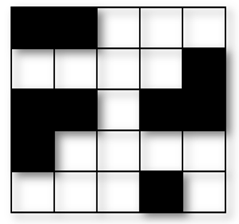
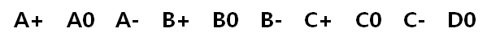
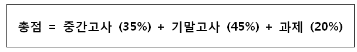
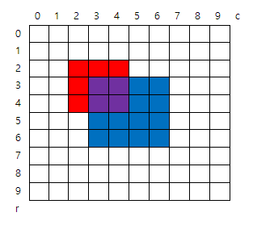
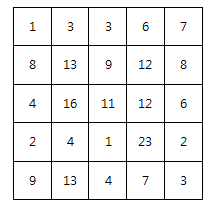
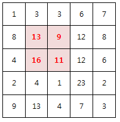
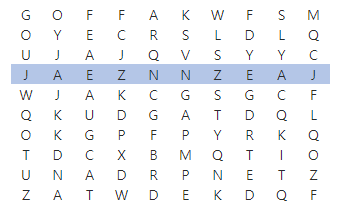
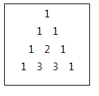

# D2

## 1979. 어디에 단어가 들어갈 수 있을까

N X N 크기의 단어 퍼즐을 만들려고 한다. 입력으로 단어 퍼즐의 모양이 주어진다.

주어진 퍼즐 모양에서 특정 길이 K를 갖는 단어가 들어갈 수 있는 자리의 수를 출력하는 프로그램을 작성하라.

**[예제]**

N = 5, K = 3 이고, 퍼즐의 모양이 아래 그림과 같이 주어졌을 때





길이가 3 인 단어가 들어갈 수 있는 자리는 2 곳(가로 1번, 가로 4번)이 된다.


**[제약 사항]**

1. N은 5 이상 15 이하의 정수이다. (5 ≤ N ≤ 15)

2. K는 2 이상 N 이하의 정수이다. (2 ≤ K ≤ N)


**[입력]**

입력은 첫 줄에 총 테스트 케이스의 개수 T가 온다.

다음 줄부터 각 테스트 케이스가 주어진다.

테스트 케이스의 첫 번째 줄에는 단어 퍼즐의 가로, 세로 길이 N 과, 단어의 길이 K 가 주어진다.

테스트 케이스의 두 번째 줄부터 퍼즐의 모양이 2차원 정보로 주어진다.

퍼즐의 각 셀 중, 흰색 부분은 1, 검은색 부분은 0 으로 주어진다.


**[출력]**

테스트 케이스 t에 대한 결과는 “#t”을 찍고, 한 칸 띄고, 정답을 출력한다.

(t는 테스트 케이스의 번호를 의미하며 1부터 시작한다.)

```python
# 가로에 가능한 단어 수를 구하는 함수
def row_crossword(cross_list, K, N):
    # 들어갈 수 있는 단어의 갯수
    word_count = 0

    for row in range(N):
        # 글자수 카운트
        letter_count = 0
        for col in range(N):
            # 빈칸 숫자 1 마다 1씩 카운트
            if cross_list[row][col] == 1:
                letter_count += 1
            # 0 을 만났을 때
            elif cross_list[row][col] == 0:
                # 만약 글자수가 K개 만큼 쌓였으면 단어 개수 추가, 글자수카운트 초기화
                if letter_count == K:
                    word_count += 1
                    letter_count = 0
                # 그게 아니라면 그냥 글자카운트만 초기화
                else:
                    letter_count = 0
        # 마지막 칸이 종료됨과 동시에 글자수가 K라면 단어 개수 추가
        if letter_count == K:
            word_count += 1

    return word_count

# 세로에 가능한 단어 수를 구하는 함수
def col_crossword(cross_list, K, N):
    word_count = 0

    for row in range(N):
        letter_count = 0
        for col in range(N):
            if cross_list[col][row] == 1:
                letter_count += 1
            elif cross_list[col][row] == 0:
                if letter_count == K:
                    word_count += 1
                    letter_count = 0
                else:
                    letter_count = 0
        if letter_count == K:
            word_count += 1
        
    return word_count

T = int(input())
x = 0
while x < T:
    N, K = map(int, input().split())
    cross_list = [list(map(int, input().split())) for _ in range(N)]

    row_words_cnt = row_crossword(cross_list, K, N)
    col_words_cnt = col_crossword(cross_list, K, N)

    result = row_words_cnt + col_words_cnt

    print(f'#{x+1} {result}')

    x += 1
```

```
# input
10
5 3
0 0 1 1 1
1 1 1 1 0
0 0 1 0 0
0 1 1 1 1
1 1 1 0 1
5 3
1 0 0 1 0
1 1 0 1 1
1 0 1 1 1
0 1 1 0 1
0 1 1 1 0
…

# output
#1 2
#2 6
...
```


## 1983. 조교의 성적 매기기

학기가 끝나고, 학생들의 점수로 학점을 계산중이다.

학점은 상대평가로 주어지는데, 총 10개의 평점이 있다.


학점은 학생들이 응시한 중간/기말고사 점수 결과 및 과제 점수가 반영한다.

각각 아래 비율로 반영된다.


10 개의 평점을 총점이 높은 순서대로 부여하는데,

각각의 평점은 같은 비율로 부여할 수 있다.

예를 들어, N 명의 학생이 있을 경우 N/10 명의 학생들에게 동일한 평점을 부여할 수 있다.

입력으로 각각의 학생들의 중간, 기말, 과제 점수가 주어지고,

학점을 알고싶은 K 번째 학생의 번호가 주어졌을 때,

K 번째 학생의 학점을 출력하는 프로그램을 작성하라.


**[제약사항]**

1. N은 항상 10의 배수이며, 10이상 100이하의 정수이다. (10 ≤ N ≤ 100)

2. K는 1 이상 N 이하의 정수이다. (1 ≤ K ≤ N)

3. K 번째 학생의 총점과 다른 학생의 총점이 동일한 경우는 입력으로 주어지지 않는다.


**[입력]**

입력은 첫 줄에 총 테스트 케이스의 개수 T가 온다.

다음 줄부터 각 테스트 케이스가 주어진다.

테스트 케이스의 첫 번째 줄은 학생수 N 과, 학점을 알고싶은 학생의 번호 K 가 주어진다.

테스트 케이스 두 번째 줄 부터 각각의 학생이 받은 시험 및 과제 점수가 주어진다.


**[출력]**

테스트 케이스 t에 대한 결과는 “#t”을 찍고, 한 칸 띄고, 정답을 출력한다.

(t는 테스트 케이스의 번호를 의미하며 1부터 시작한다.)

```python
T = int(input())
x = 0
mark = ['A', 'A0', 'A-', 'B+', 'B0', 'B-', 'C+', 'C0', 'C-', 'D0']

while x < T:
    # 입력 데이터
    N, K = map(int, input().split())
    scores = [list(map(int, input().split())) for _ in range(N)]
    
    # 총점 계산
    _scores = [i[0]*0.35 + i[1]*0.45 + i[2]*0.20 for i in scores]

    # K 번째 학생 점수
    find_std = _scores[K-1]

    # 총점 내림차순 정렬
    sort_scores = sorted(_scores, reverse=True)
    
    # 학점 상대평가 범위
    sort_mark = []
    for i in mark:
        for j in range(int(N/10)):
            sort_mark.append(i)

    print(f'#{x+1} {sort_mark[sort_scores.index(find_std)]}')

    x += 1
```

```
# input
10
10 2
87 59 88
99 94 78
94 86 86
99 100 99
69 76 70
76 89 96
98 95 96
74 69 60
98 84 67
85 84 91
…

# output
#1 A-
...
```


## 1984. 중간 평균값 구하기

10개의 수를 입력 받아, 최대 수와 최소 수를 제외한 나머지의 평균값을 출력하는 프로그램을 작성하라.

(소수점 첫째 자리에서 반올림한 정수를 출력한다.)


**[제약 사항]**

각 수는 0 이상 10000 이하의 정수이다.


**[입력]**

가장 첫 줄에는 테스트 케이스의 개수 T가 주어지고, 그 아래로 각 테스트 케이스가 주어진다.

각 테스트 케이스의 첫 번째 줄에는 10개의 수가 주어진다.


**[출력]**

출력의 각 줄은 '#t'로 시작하고, 공백을 한 칸 둔 다음 정답을 출력한다.

(t는 테스트 케이스의 번호를 의미하며 1부터 시작한다.)

```python
T = int(input())
x = 0

while x < T:
    # 입력 데이터
    scores = list(map(int, input().split()))

    # 버블 정렬
    for i in range(len(scores)-1, 0, -1):
        for j in range(0, i):
            if scores[j] > scores[j+1]:
                scores[j], scores[j+1] = scores[j+1], scores[j]
    
    # 최대 수와 최소 수 제외
    _scores = scores[1:-1]

    # 결과
    result = round(sum(_scores) / len(_scores))

    print(f'#{x+1} {result}')

    x += 1
```

```
# input
3      
3 17 1 39 8 41 2 32 99 2 
22 8 5 123 7 2 63 7 3 46 
6 63 2 3 58 76 21 33 8 1   

# output
#1 18
#2 20
#3 24
```


## 4836. [파이썬 S/W 문제해결 기본] 2일차 - 색칠하기

그림과 같이 인덱스가 있는 10x10 격자에 빨간색과 파란색을 칠하려고 한다.

N개의 영역에 대해 왼쪽 위와 오른쪽 아래 모서리 인덱스, 칠할 색상이 주어질 때, 칠이 끝난 후 색이 겹쳐 보라색이 된 칸 수를 구하는 프로그램을 만드시오.

주어진 정보에서 같은 색인 영역은 겹치지 않는다.




예를 들어 2개의 색칠 영역을 갖는 위 그림에 대한 색칠 정보이다.

2

2 2 4 4 1 ( [2,2] 부터 [4,4] 까지 color 1 (빨강) 으로 칠한다 )

3 3 6 6 2 ( [3,3] 부터 [6,6] 까지 color 2 (파랑) 으로 칠한다 )

 

**[입력]**

첫 줄에 테스트 케이스 개수 T가 주어진다.  ( 1 ≤ T ≤ 50 )

다음 줄부터 테스트케이스의 첫 줄에 칠할 영역의 개수 N이 주어진다. ( 2 ≤ N ≤ 30 )

다음 줄에 왼쪽 위 모서리 인덱스 r1, c1, 오른쪽 아래 모서리 r2, c2와 색상 정보 color가 주어진다. ( 0 ≤ r1, c1, r2, c2 ≤ 9 )

color = 1 (빨강), color = 2 (파랑)

 

**[출력]**

각 줄마다 "#T" (T는 테스트 케이스 번호)를 출력한 뒤, 답을 출력한다.

```python
T = int(input())

x = 0
while x < T:
    n = int(input())

    color_map = [list(map(int, input().split())) for _ in range(n)]

    null_list = [[0] * 10 for _ in range(10)]

    # 입력받은 color_map 리스트 순회
    for i in range(len(color_map)): 

        # 색칠할 row 접근
        for row in range(color_map[i][0], color_map[i][2] + 1):
            # 색칠할 col 접근
            for col in range(color_map[i][1], color_map[i][3] + 1):
                if null_list[row][col] == color_map[i][4]:
                    continue
                else:
                    null_list[row][col] += color_map[i][4]

    # 보라색 칸 찾기
    cnt = 0
    for i in range(10):
        for j in range(10):
            if null_list[i][j] == 3:
                cnt += 1

    print(f'#{x+1} {cnt}')
    x += 1
```

```
# input
3
2
2 2 4 4 1
3 3 6 6 2
3
1 2 3 3 1
3 6 6 8 1
2 3 5 6 2
3
1 4 8 5 1
1 8 3 9 1
3 2 5 8 2

# output
#1 4
#2 5
#3 7
```


## 4839. [파이썬 S/W 문제해결 기본] 2일차 - 이진탐색

코딩반 학생들에게 이진 탐색을 설명하던 선생님은 이진탐색을 연습할 수 있는 게임을 시켜 보기로 했다.

짝을 이룬 A, B 두 사람에게 교과서에서 각자 찾을 쪽 번호를 알려주면, 이진 탐색만으로 지정된 페이지를 먼저 펼치는 사람이 이기는 게임이다.

예를 들어 책이 총 400쪽이면, 검색 구간의 왼쪽 l=1, 오른쪽 r=400이 되고, 중간 페이지 c= int((l+r)/2)로 계산한다.

찾는 쪽 번호가 c와 같아지면 탐색을 끝낸다.

A는 300, B는 50 쪽을 찾아야 하는 경우, 다음처럼 중간 페이지를 기준으로 왼쪽 또는 오른 쪽 영역의 중간 페이지를 다시 찾아가면 된다.

|              | A                   | B                 |
| ------------ | ------------------- | ----------------- |
| 첫 번째 탐색 | l=1, r=400, c=200   | l=1, r=400, c=200 |
| 두 번째 탐색 | l=200, r=400, c=300 | l=1, r=200, c=100 |
| 세 번째 탐색 |                     | l=1, r=100, c=50  |


책의 전체 쪽수와 두 사람이 찾을 쪽 번호가 주어졌을 때, 이진 탐색 게임에서 이긴 사람이 누구인지 알아내 출력하시오. 비긴 경우는 0을 출력한다.


**[입력]**

첫 줄에 테스트 케이스 개수 T가 주어진다. 1<=T<=50

테스트 케이스 별로 책의 전체 쪽 수 P, A, B가 찾을 쪽 번호 Pa, Pb가 차례로 주어진다. 1<= P, Pa, Pb <=1000


**[출력]**

각 줄마다 "#T" (T는 테스트 케이스 번호)를 출력한 뒤, A, B, 0 중 하나를 출력한다.

```python
# 탐색 횟수를 구하는 이진탐색 함수
def binarySearch(_list, key):
    start = 0
    end = len(_list) - 1
    cnt = 0
    while start <= end:
        middle = int((start + end) // 2)
        cnt += 1
        if _list[middle] == key: # 검색 성공
            return cnt
        elif _list[middle] > key:
            end = middle
        else:
            start = middle
    return False

T = int(input())

x = 0
while x < T:
    P, a, b= map(int, input().split())

    # 전체 페이지 리스트
    full_page = list(range(1, P+1))

    # a의 이진 탐색 횟수
    cnt_a = binarySearch(full_page, a)

    # b의 이진 탐색 횟수
    cnt_b = binarySearch(full_page, b)

    # 결과 출력을 위한 조건
    if cnt_a < cnt_b:
        print(f'#{x+1} A')
    elif cnt_a == cnt_b:
        print(f'#{x+1} 0')
    else:
        print(f'#{x+1} B')
    x += 1
```

```
# input
3
400 300 350
1000 299 578
1000 222 888

# output
#1 A
#2 0
#3 A
```


## 2001. 파리 퇴치

N x N 배열 안의 숫자는 해당 영역에 존재하는 파리의 개수를 의미한다.

아래는 N=5 의 예이다.





M x M 크기의 파리채를 한 번 내리쳐 최대한 많은 파리를 죽이고자 한다.

죽은 파리의 개수를 구하라!

예를 들어 M=2 일 경우 위 예제의 정답은 49마리가 된다.





**[제약 사항]**

1. N 은 5 이상 15 이하이다.

2. M은 2 이상 N 이하이다.

3. 각 영역의 파리 갯수는 30 이하 이다.


**[입력]**

가장 첫 줄에는 테스트 케이스의 개수 T가 주어지고, 그 아래로 각 테스트 케이스가 주어진다.

각 테스트 케이스의 첫 번째 줄에 N 과 M 이 주어지고,

다음 N 줄에 걸쳐 N x N 배열이 주어진다.


**[출력]**

출력의 각 줄은 '#t'로 시작하고, 공백을 한 칸 둔 다음 정답을 출력한다.

(t는 테스트 케이스의 번호를 의미하며 1부터 시작한다.)

```python
T = int(input())

x = 0
while x < T:
    n, m = map(int, input().split())
    # 파리 리스트
    fly = [list(map(int, input().split())) for _ in range(n)]

    # 죽는 파리수 계산을 위한 변수
    dead = 0
    
    # 파리채(m)의 크기를 감안하여 파리 리스트 순회
    for i in range(n-m+1):
        for j in range(n-m+1):

            # 파리채(m)의 크기 만큼 타겟 리스트 할당
            target = [fly[a][b] for a in range(i, i+m) for b in range(j, j+m)]

            # 죽인 파리들끼리 대소 비교
            if dead < sum(target):
                dead = sum(target)
            
    print(f'#{x+1} {dead}')
    x += 1
```

```
# input
10
5 2
1 3 3 6 7
8 13 9 12 8
4 16 11 12 6
2 4 1 23 2
9 13 4 7 3
6 3
29 21 26 9 5 8
21 19 8 0 21 19
9 24 2 11 4 24
19 29 1 0 21 19
10 29 6 18 4 3
29 11 15 3 3 29
...

# output
#1 49
#2 159
...
```


## 1986. 지그재그 숫자

1부터 N까지의 숫자에서 홀수는 더하고 짝수는 뺐을 때 최종 누적된 값을 구해보자.


**[예제 풀이]**

N이 5일 경우,

1 – 2 + 3 – 4 + 5 = 3

N이 6일 경우,

1 – 2 + 3 – 4 + 5 – 6 = -3


**[제약사항]**

N은 1 이상 10 이하의 정수이다. (1 ≤ N ≤ 10)


**[입력]**

가장 첫 줄에는 테스트 케이스의 개수 T가 주어지고, 그 아래로 각 테스트 케이스가 주어진다.

각 테스트 케이스에는 N이 주어진다.


**[출력]**

각 줄은 '#t'로 시작하고, 공백을 한 칸 둔 다음 누적된 값을 출력한다.

(t는 테스트 케이스의 번호를 의미하며 1부터 시작한다.)

```python
T = int(input())

x = 0
while x < T:
    n = int(input())
	
    # 리스트로 구성해서 풀이하는 것보다, 규칙을 활용하여 풀도록 하였다.
    if n % 2:
        print(f'#{x+1} {n//2 + 1}')
    else:
        print(f'#{x+1} {-n//2}')

    x += 1
```

```
# input
2
5
6

# output
#1 3
#2 -3
```


## 1989. 초심자의 회문 검사

"level" 과 같이 거꾸로 읽어도 제대로 읽은 것과 같은 문장이나 낱말을 회문(回文, palindrome)이라 한다.

단어를 입력 받아 회문이면 1을 출력하고, 아니라면 0을 출력하는 프로그램을 작성하라.


**[제약 사항]**

각 단어의 길이는 3 이상 10 이하이다.


**[입력]**

가장 첫 줄에는 테스트 케이스의 개수 T가 주어지고, 그 아래로 각 테스트 케이스가 주어진다.

각 테스트 케이스의 첫 번째 줄에 하나의 단어가 주어진다.


**[출력]**

출력의 각 줄은 '#t'로 시작하고, 공백을 한 칸 둔 다음 정답을 출력한다.

(t는 테스트 케이스의 번호를 의미하며 1부터 시작한다.)

```python
# 화문 판별 함수
def palindorme(word):
	# 단어의 길이가 1 이하 까지
    while len(word) >= 1:
        
        # 단어의 첫 글자와, 마지막 글자가 동일하다면
        if word[0] == word[-1]:
            # 첫번째 마지막 글자 슬라이싱
            word = word[1:-1]
		# 동일하지 않다면 0을 반환
        else:
            return 0
    return 1

T = int(input())

x = 0
while x < T:
    word = input()

    result = palindorme(word)

    print(f'#{x+1} {result}')
    x += 1
```

```
# input
3
level     
samsung
eye

# output
#1 1
#2 0
#3 1
```


## 4864. [파이썬 S/W 문제해결 기본] 3일차 - 문자열 비교

두 개의 문자열 str1과 str2가 주어진다. 문자열 str2 안에 str1과 일치하는 부분이 있는지 찾는 프로그램을 만드시오.

예를 들어 두 개의 문자열이 다음과 같이 주어질 때, 첫 문자열이 두번째에 존재하면 1, 존재하지 않으면 0을 출력한다.


ABC

ZZZZZ**ABC**ZZZZZ

두번째 문자열에 첫번째 문자열과 일치하는 부분이 있으므로 1을 출력.


ABC

ZZZZ**A**Z**BC**ZZZZZ

문자열이 일치하지 않으므로 0을 출력.


**[입력]**

첫 줄에 테스트 케이스 개수 T가 주어진다. (1≤T≤50)

다음 줄부터 테스트 케이스 별로 길이가 N인 문자열 str1과 길이가 M인 str2가 각각 다른 줄에 주어집니다. (5≤N≤100, 10≤M≤1000, N≤M)

 

**[출력]**

각 줄마다 "#T" (T는 테스트 케이스 번호)를 출력한 뒤, 답을 출력한다.

```python
T = int(input())
x = 0
while x < T:
    word = input()
    sentense = input()

    cnt = 0
    for i in range(len(sentense) - len(word) + 1):
        if sentense[i:i+len(word)] == word:
            cnt += 1

    print(f'#{x+1} {cnt}')
    x += 1
```

```
# input
3
XYPV
EOGGXYPVSY
STJJ
HOFSTJPVPP
ZYJZXZTIBSDG
TTXGZYJZXZTIBSDGWQLW

# output
#1 1
#2 0
#3 1
```


## 4861. [파이썬 S/W 문제해결 기본] 3일차 - 회문

ABBA처럼 어느 방향에서 읽어도 같은 문자열을 회문이라 한다. NxN 크기의 글자판에서 길이가 M인 회문을 찾아 출력하는 프로그램을 만드시오.

회문은 1개가 존재하는데, 가로 뿐만 아니라 세로로 찾아질 수도 있다.


예를 들어 N=10, M=10 일 때, 다음과 같이 회문을 찾을 수 있다.





**[입력]**

첫 줄에 테스트 케이스 개수 T가 주어진다. 1≤T≤50

다음 줄부터 테스트케이스의 첫 줄에 N과 M이 주어진다. 10≤N≤100, 5≤M≤N

다음 줄부터 N개의 글자를 가진 N개의 줄이 주어진다.

 

**[출력]**

각 줄마다 "#T" (T는 테스트 케이스 번호)를 출력한 뒤, 답을 출력한다.

```python
# 회문 판별 함수
def palindrome(word):
    while len(word) >= 1:
        if word[0] == word[-1]:
            word = word[1:-1]
        else:
            return False
    return True

T = int(input())
x = 0
while x < T:
    n, m = map(int, input().split())
    word_list = [input() for _ in range(n)]

    # word_list를 행과 열 전치한 새로운 리스트
    new_list = list(map(list, zip(*word_list)))

    # 리스트 갯수에 따라 큰 for loop를 순회
    for i in range(len(word_list)):
        # 행과 열을 전치한 리스트는 문자하나씩 분리되어 있으므로 join()함수 사용
        temp_word = ''.join(new_list[i])

        # 단어 글자수 만큼 인덱스를 감안하여 단어 회문 비교
        for j in range(n-m+1):
            # 가로 단어 회문 판별
            if palindrome(word_list[i][j:j+m]):
                result = word_list[i][j:j+m]
            # 세로 단어(전치한 리스트) 회문 판별
            elif palindrome(temp_word[j:j + m]):
                result = temp_word[j:j + m]

    print('#{} {}'.format(x+1, result))
    x += 1
    
# 위와같은 경우 회문이 가로와 세로에 모두 존재할 경우 세로만 출력됨. 하지만 tc에서는 회문은 하나만 포함하고 있어 보임
```

```
# input
3
10 10
GOFFAKWFSM
OYECRSLDLQ
UJAJQVSYYC
JAEZNNZEAJ
WJAKCGSGCF
QKUDGATDQL
OKGPFPYRKQ
TDCXBMQTIO
UNADRPNETZ
ZATWDEKDQF
10 10
WPMACSIBIK
STWASDCOBQ
AMOUENCSOG
XTIIGBLRCZ
WXVSWXYYVU
CJVAHRZZEM
NDIEBIIMTX
UOOGPQCBIW
OWWATKUEUY
FTMERSSANL

# output
#1 JAEZNNZEAJ
#2 MWOIVVIOWM
```


## 4865. [파이썬 S/W 문제해결 기본] 3일차 - 글자수

두 개의 문자열 str1과 str2가 주어진다. 문자열 str1에 포함된 글자들이 str2에 몇 개씩 들어있는지 찾고, 그중 가장 많은 글자의 개수를 출력하는 프로그램을 만드시오.

예를 들어 str1 = “ABCA”, str2 = “ABABCA”인 경우, str1의 A가 str2에 3개 있으므로 가장 많은 글자가 되고 3을 출력한다.

파이썬의 경우 딕셔너리를 이용할 수 있다.


**[입력]**

첫 줄에 테스트 케이스 개수 T가 주어진다. 1≤T≤50

다음 줄부터 테스트 케이스 별로 길이가 N인 문자열 str1과 길이가 M인 str2가 각각 다른 줄에 주어진다. 5≤N≤100, 10≤M≤1000, N≤M

**[출력]**

각 줄마다 "#T" (T는 테스트 케이스 번호)를 출력한 뒤, 답을 출력한다.

```python
T = int(input())
x = 0
while x < T:
    str_1 = input()
    str_2 = input()
	
    # 등장 회수 초기화
    temp_cnt = 0
    
    # str_1의 문자 하나씩 순회
    for i in str_1:
        # str_2에 str_1의 i번째 문자를 count()하여 큰 수를 계속 저장
        if temp_cnt < str_2.count(i):
            temp_cnt = str_2.count(i)

    print('#{} {}'.format(x+1, temp_cnt))
    x += 1
```

```
# input
3
XYPV
EOGGXYPVSY
STJJ
HOFSTJPVPP
ZYJZXZTIBSDG
TTXGZYJZXZTIBSDGWQLW

# output
#1 2
#2 1
#3 3
```


## 2005. 파스칼의 삼각형

크기가 N인 파스칼의 삼각형을 만들어야 한다.

파스칼의 삼각형이란 아래와 같은 규칙을 따른다.

\1. 첫 번째 줄은 항상 숫자 1이다.

\2. 두 번째 줄부터 각 숫자들은 자신의 왼쪽과 오른쪽 위의 숫자의 합으로 구성된다.

N이 4일 경우,
 




N을 입력 받아 크기 N인 파스칼의 삼각형을 출력하는 프로그램을 작성하시오.


**[제약 사항]**

파스칼의 삼각형의 크기 N은 1 이상 10 이하의 정수이다. (1 ≤ N ≤ 10)


**[입력]**

가장 첫 줄에는 테스트 케이스의 개수 T가 주어지고, 그 아래로 각 테스트 케이스가 주어진다.

각 테스트 케이스에는 N이 주어진다.


**[출력]**

각 줄은 '#t'로 시작하고, 다음 줄부터 파스칼의 삼각형을 출력한다.

삼각형 각 줄의 처음 숫자가 나오기 전까지의 빈 칸은 생략하고 숫자들 사이에는 한 칸의 빈칸을 출력한다.

(t는 테스트 케이스의 번호를 의미하며 1부터 시작한다.)

```python
T = int(input())

x = 0
while x < T:
    n = int(input())
    
    # 삼각형을 쌓아나갈 리스트
    res = []
	
    # 테스트 케이스 번호
    print('#{}'.format(x+1))
    
    # 파스칼 삼각형 계산 및 출력
    for i in range(n):
        temp = []
        # 파스칼 삼각형의 한 행을 하나의 리스트로 취급
        for j in range(i+1):
            # 처음과 마지막일 경우는 무조건 1
            if j == 0 or j == i:
                temp.append(1)
            # 이외의 경우에는 윗줄 인덱스의 j-1번째와 j번째를 합한 값을 추가
            else:
                temp.append(res[i-1][j-1] + res[i-1][j])
        
        # 다음 계산을 위해 삼각형에 누적
        res.append(temp)
        
        # 행마다 바로 출력
        print('{}'.format(' '.join(map(str, temp))))
    x += 1
```

```
# input
1
4

# ouput
#1
1
1 1
1 2 1
1 3 3 1
```

