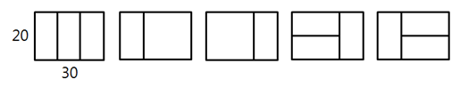
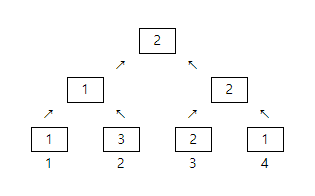
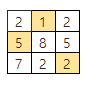

# D2

## 4869. [파이썬 S/W 문제해결 기본] 4일차 - 종이붙이기

어린이 알고리즘 교실의 선생님은 경우의 수 놀이를 위해, 그림처럼 가로x세로 길이가 10x20, 20x20인 직사각형 종이를 잔뜩 준비했다.


그리고 교실 바닥에 20xN 크기의 직사각형을 테이프로 표시하고, 이 안에 준비한 종이를 빈틈없이 붙이는 방법을 찾아보려고 한다. N이 30인 경우 다음 그림처럼 종이를 붙일 수 있다.





10의 배수인 N이 주어졌을 때, 종이를 붙이는 모든 경우를 찾으려면 테이프로 만든 표시한 영역을 몇 개나 만들어야 되는지 계산하는 프로그램을 만드시오. 직사각형 종이가 모자라는 경우는 없다.


**[입력]**

첫 줄에 테스트 케이스 개수 T가 주어진다. 1≤T≤50
다음 줄부터 테스트 케이스 별로 N이 주어진다. 10≤N≤300, N은 10의 배수


**[출력]**

각 줄마다 "#T" (T는 테스트 케이스 번호)를 출력한 뒤, 답을 출력한다.

```python
# 종이붙이기 함수
def paper(N):
    # n을 10으로 나눈 몫을 사용하므로 10 -> 1, 20 -> 2 ...로 통일

    if N == 1:      # n이 10일 경우
        return 1    # 나오는 경우의 수는 1가지

    elif N == 2:    # n 이 20일 경우
        return 3    # 나오는 경우의 수는 3가지

    # N 길이를 만들 수 있는 경우는 2가지이다
    # N-10 길이에 세로 10*20 종이를 붙이는 방법과
    # N-20 길이에 가로의 10*20 2장 혹은 20*20 1장 => paper(N-2)를 두번 곱한 이유
    # 10*20 종이를 세워 2장을 붙이는 방법은 paper(N-1)과 같음
    return paper(N - 1) + paper(N - 2) * 2

# 속도향상을 위한 DP 함수
def dp_paper(N):
    if data[N] == 0:
        data[N] = dp_paper(N - 1) + dp_paper(N - 2) * 2
    return data[N]


T = int(input())
x = 0
while x < T:
    # 총 길이 입력 (인덱스 부여를 위한 //10)
    n = int(input())//10

    # 런타임 오버 방지를 위한 DP
    data = [0 for _ in range(31)]
    data[1] = 1
    data[2] = 3

    # 종이접기 함수 호출
    res = paper(n)
    res2 = dp_paper(n)
    print('#{} {}'.format(x+1, res))
    # print('#{} {}'.format(x+1, res2))
    x += 1
```

```
# input
3
30
50
70

# output
#1 5
#2 21
#3 85
```


## 4866. [파이썬 S/W 문제해결 기본] 4일차 - 괄호검사

주어진 입력에서 괄호 {}, ()가 제대로 짝을 이뤘는지 검사하는 프로그램을 만드시오.

예를 들어 {( )}는 제대로 된 짝이지만, {( })는 제대로 된 짝이 아니다. 입력은 한 줄의 파이썬 코드일수도 있고, 괄호만 주어질 수도 있다.

정상적으로 짝을 이룬 경우 1, 그렇지 않으면 0을 출력한다.

print(‘{‘) 같은 경우는 입력으로 주어지지 않으므로 고려하지 않아도 된다.


**[입력]**

첫 줄에 테스트 케이스 개수 T가 주어진다. 1≤T≤50

다음 줄부터 테스트 케이스 별로 온전한 형태이거나 괄호만 남긴 한 줄의 코드가 주어진다.

 

**[출력]**

각 줄마다 "#T" (T는 테스트 케이스 번호)를 출력한 뒤, 답을 출력한다.

```python
def solution(text):
    for i in range(len(text)):
        if text[i] == '(' or text[i] == '{':
            s.append(text[i])

        elif text[i] == ')':
            if len(s) != 0 and s[-1] == '(':
                s.pop(-1)
            else:
                return 0

        elif text[i] == '}':
            if len(s) != 0 and s[-1] == '{':
                s.pop(-1)
            else:
                return 0
            
    if len(s) != 0:
        return 0
    else:
        return 1

T = int(input())
x = 0
while x < T:
    text = input()

    s = []
    res = solution(text)

    print('#{} {}'.format(x+1, res))
    x += 1
```

```
# input
3
print('{} {}'.format(1, 2))
N, M = map(int, input().split())
print('#{} {}'.format(tc, find())

# output
#1 1
#2 1
#3 0
```


## 4871. [파이썬 S/W 문제해결 기본] 4일차 - 그래프 경로

V개 이내의 노드를 E개의 간선으로 연결한 방향성 그래프에 대한 정보가 주어질 때, 특정한 두 개의 노드에 경로가 존재하는지 확인하는 프로그램을 만드시오.

두 개의 노드에 대해 경로가 있으면 1, 없으면 0을 출력한다.


예를 들어 다음과 같은 그래프에서 1에서 6으로 가는 경로를 찾는 경우, 경로가 존재하므로 1을 출력한다.


노드번호는 1번부터 존재하며, V개의 노드 중에는 간선으로 연결되지 않은 경우도 있을 수 있다.

 

**[입력]**

첫 줄에 테스트 케이스 개수 T가 주어진다. 1≤T≤50

다음 줄부터 테스트 케이스의 첫 줄에 V와 E가 주어진다. 5≤V≤50, 4≤E≤1000

테스트케이스의 둘째 줄부터 E개의 줄에 걸쳐, 출발 도착 노드로 간선 정보가 주어진다.

E개의 줄 이후에는 경로의 존재를 확인할 출발 노드 S와 도착노드 G가 주어진다.

 

**[출력]**

각 줄마다 "#T" (T는 테스트 케이스 번호)를 출력한 뒤, 답을 출력한다.

```python
T = int(input())
x = 0
while x < T:
    # 입력 데이터
    V, E = map(int, input().split())                            # 노드, 간선
    arr = [list(map(int, input().split())) for _ in range(E)]   # 간선 정보
    S, G = map(int, input().split())                            # 시작, 끝 지점

    # 인접 리스트 생성
    adj = [[] for _ in range(V+1)]
    for i in range(len(arr)):
        adj[arr[i][0]].append(arr[i][1])

    s = []                  # 스택 리스트
    visited = [0] * (V+1)   # 노드 방문 여부 리스트
    res = 0                 # 경로 존재 여부 초기화

    s.append(S)         # 시작 지점을 스택에 추가
    while len(s) != 0:  # 반복구조 dfs
        n = s.pop()     # 스택에서 갈 수 있는 노드 선택

        if n == G:      # 노드 n이 도착 지점과 동일하면
            res = 1     # 경로가 존재(1)하므로 종료
            break

        # 방문하지 않은 노드라면 밑의 로직 진행 / 방문하였다면 생략하고 pop()으로 이동
        if visited[n] == 0:
            visited[n] = 1  # 방문 했음을 표시

            if adj[n] is None:  # 방문한 노드에 간선 정보가 없다면 
                continue        # pop()으로 skip (방문만 표시되고 pop되어 사라짐)
                
            else:               # 방문한 노드에 간선 정보가 있다면 전부 스택에 추가
                for i in range(len(adj[n])):
                    s.append(adj[n][i])
    
    # 스택 길이가 0이 되어 나오면 res = 0
    # n == G로 종료되면 res = 1
    print('#{} {}'.format(x+1, res))
    x += 1
```

```
# input
3
6 5
1 4
1 3
2 3
2 5
4 6
1 6
7 4
1 6
2 3
2 6
3 5
2 5
9 9
2 6
4 7
5 7
1 5
2 9
3 9
4 8
5 3
7 8
1 9

# ouput
#1 1
#2 1
#3 1
```


## 4873. [파이썬 S/W 문제해결 기본] 4일차 - 반복문자 지우기

문자열 s에서 반복된 문자를 지우려고 한다. 지워진 부분은 다시 앞뒤를 연결하는데, 만약 연결에 의해 또 반복문자가 생기면 이부분을 다시 지운다.

반복문자를 지운 후 남은 문자열의 길이를 출력 하시오. 남은 문자열이 없으면 0을 출력한다.


다음은 CAAABBA에서 반복문자를 지우는 경우의 예이다.


C**AA**ABBA 연속 문자 AA를 지우고 C와 A를 잇는다.

CA**BB**A 연속 문자 BB를 지우고 A와 A를 잇는다.

C**AA** 연속 문자 AA를 지운다.

C 1글자가 남았으므로 1을 리턴한다.


**[입력]**

첫 줄에 테스트 케이스 개수 T가 주어진다. 1≤T≤ 50

다음 줄부터 테스트 케이스의 별로 길이가 1000이내인 문자열이 주어진다.

 

**[출력]**

\#과 1번부터인 테스트케이스 번호, 빈칸에 이어 답을 출력한다.

```python
T = int(input())
x = 0
while x < T:
    word = input()

    i = 0
    # 중복 단어 제거 반복
    while i < len(word)-1:                  # 2글자씩 비교하므로 len()-1
        if word[i] == word[i+1]:            # i번째와 i+1번째 글자가 같은 경우
            word = word[0:i] + word[i+2:]   # 단어 슬라이싱
            i = -1                          # i 초기화 (다음 명령으로 i=0부터 시작)
        i += 1

    print('#{} {}'.format(x+1, len(word)))
    x += 1
```

```
# input
3
ABCCB
NNNASBBSNV
UKJWHGGHNFTCRRCTWLALX

# output
#1 1
#2 4
#3 11
```


## 2007. 패턴 마디의 길이

패턴에서 반복되는 부분을 마디라고 부른다. 문자열을 입력 받아 마디의 길이를 출력하는 프로그램을 작성하라.


**[제약 사항]**

각 문자열의 길이는 30이다. 마디의 최대 길이는 10이다.


**[입력]**

가장 첫 줄에는 테스트 케이스의 개수 T가 주어지고, 그 아래로 각 테스트 케이스가 주어진다.

각 테스트 케이스의 첫 번째 줄에는 길이가 30인 문자열이 주어진다.


**[출력]**

출력의 각 줄은 '#t'로 시작하고, 공백을 한 칸 둔 다음 정답을 출력한다.

(t는 테스트 케이스의 번호를 의미하며 1부터 시작한다.)

```python
T = int(input())
x = 0
while x < T:
    text = input()

    word = ''

    for i in range(len(text)):
        if text[i:i+len(word)] == word and len(word) > 1:
            break
        else:
            word += text[i]

    print('#{} {}'.format(x+1, len(word)))
    x += 1
```

```
# input
3       
KOREAKOREAKOREAKOREAKOREAKOREA
SAMSUNGSAMSUNGSAMSUNGSAMSUNGSA
GALAXYGALAXYGALAXYGALAXYGALAXY   

# output
#1 5
#2 7
#3 6
```


## 1926. 간단한 369게임

3 6 9 게임을 프로그램으로 제작중이다. 게임 규칙은 다음과 같다.

 

\1. 숫자 1부터 순서대로 차례대로 말하되, **“3” “6” “9”** 가 들어가 있는 수는 말하지 않는다.

 **1 2** **3** **4 5** **6** **7 8** **9…**

\2. "3" "6" "9"가 들어가 있는 수를 말하지 않는대신, 박수를 친다. 이 때, 박수는 해당 숫자가 들어간 개수만큼 쳐야 한다. 
예를 들어 숫자 35의 경우 박수 한 번, 숫자 36의 경우 박수를 두번 쳐야 한다.

입력으로 정수 N 이 주어졌을 때, 1~N 까지의 숫자를

게임 규칙에 맞게 출력하는 프로그램을 작성하라.

박수를 치는 부분은 숫자 대신, 박수 횟수에 맞게 “-“ 를 출력한다.

**여기서 주의해야 할 것은 박수 한 번 칠 때는 - 이며, 박수를 두 번 칠 때는 - - 가 아닌 -- 이다. **


**[제약사항]**

N은 10이상 1,000이하의 정수이다. (10 ≤ N ≤ 1,000)

 

**[입력]**

입력으로 정수 N 이 주어진다.


**[출력]**

1 ~ N까지의 숫자를 게임 규칙에 맞게 출력한다.

```python
n = int(input())
arr = [str(i) for i in range(1, n+1)]
clap = ['3', '6', '9']

for i in range(len(arr)):
    cnt = 0
    for j in range(len(clap)):
        if clap[j] in arr[i]:
            cnt += arr[i].count(clap[j])
    if cnt != 0:
        arr[i] = '-' * cnt

print(' '.join(arr))
```

```
# input
10

# output
1 2 - 4 5 - 7 8 - 10
```


## 1859. 백만 장자 프로젝트

25년 간의 수행 끝에 원재는 미래를 보는 능력을 갖게 되었다. 이 능력으로 원재는 사재기를 하려고 한다.

다만 당국의 감시가 심해 한 번에 많은 양을 사재기 할 수 없다.

다음과 같은 조건 하에서 사재기를 하여 최대한의 이득을 얻도록 도와주자.

1. 원재는 연속된 N일 동안의 물건의 매매가를 예측하여 알고 있다.
2. 당국의 감시망에 걸리지 않기 위해 하루에 최대 1만큼 구입할 수 있다.
3. 판매는 얼마든지 할 수 있다.

예를 들어 3일 동안의 매매가가 1, 2, 3 이라면 처음 두 날에 원료를 구매하여 마지막 날에 팔면 3의 이익을 얻을 수 있다.


**[입력]**

첫 번째 줄에 테스트 케이스의 수 T가 주어진다.

각 테스트 케이스 별로 첫 줄에는 자연수 N(2 ≤ N ≤ 1,000,000)이 주어지고,

둘째 줄에는 각 날의 매매가를 나타내는 N개의 자연수들이 공백으로 구분되어 순서대로 주어진다.

각 날의 매매가는 10,000이하이다.


**[출력]**

각 테스트 케이스마다 ‘#x’(x는 테스트케이스 번호를 의미하며 1부터 시작한다)를 출력하고, 최대 이익을 출력한다.


**[예제 풀이]**

1번째 케이스는 아무 것도 사지 않는 것이 최대 이익이다.

2번째 케이스는 1,2일에 각각 한 개씩 사서 세 번째 날에 두 개를 팔면 10의 이익을 얻을 수 있다.

```python
T = int(input())
t = 0
while t < T:
    N = int(input())
    day = list(map(int, input().split()))

    i = N-1
    s = []
    temp = day[-1]
    res = 0

    while i >= 0:
        if temp < day[i]:
            temp = day[i]

        elif temp >= day[i]:
            res += temp - day[i]

        i -= 1

    print(f'#{t+1} {res}')
    t += 1
```

```
# input
3
3
10 7 6
3
3 5 9
5
1 1 3 1 2

# output
#1 0
#2 10
#3 5
```


## 4874. [파이썬 S/W 문제해결 기본] 5일차 - Forth

Forth라는 컴퓨터 언어는 스택 연산을 기반으로 하고 있어 후위 표기법을 사용한다. 예를 들어 3+4는 다음과 같이 표기한다.
 

3 4 + .
 

Forth에서는 동작은 다음과 같다.
 

숫자는 스택에 넣는다.

연산자를 만나면 스택의 숫자 두 개를 꺼내 더하고 결과를 다시 스택에 넣는다.

‘.’은 스택에서 숫자를 꺼내 출력한다.

 

Forth 코드의 연산 결과를 출력하는 프로그램을 만드시오. 만약 형식이 잘못되어 연산이 불가능한 경우 ‘error’를 출력한다.
 

다음은 Forth 연산의 예이다.
 

| 코드    | 출력 |
| ------- | ---- |
| 4 2 / . | 2    |
| 4 3 - . | 1    |

 

**[입력]**

첫 줄에 테스트 케이스 개수 T가 주어진다. 1≤T≤50
 

다음 줄부터 테스트 케이스의 별로 정수와 연산자가 256자 이내의 연산코드가 주어진다. 피연산자와 연산자는 여백으로 구분되어 있으며, 코드는 ‘.’로 끝난다.

나눗셈의 경우 항상 나누어 떨어진다.

 

**[출력]**

\#과 1번부터인 테스트케이스 번호, 빈칸에 이어 계산결과를 정수로 출력하거나 또는 ‘error’를 출력한다.

```python
T = int(input())
t = 0
while t < T:
    arr = list(input().split())
    s = []
    
    # arr을 순회
    for i in range(len(arr)):
        # arr의 i 번째가 숫자라면 스택에 push
        if arr[i].isdigit():
            s.append(int(arr[i]))
        
        # arr의 i 번째가 '.'일 경우 
        elif arr[i] == '.':
            if len(s) == 1:     # 스택에 결과값이 하나가 남았을 경우 (정상)
                res = s.pop()
            else:
                res = 'error'   # 스택에 결과값이 없거나 하나 이상일 경우 (비정상)
                break
        
        # arr의 i 번째가 연산자일 경우
        else:
            # 스택에 2개 이상의 원소들이 있을때만 연산 수행
            if len(s) >= 2:
                num2 = s.pop()
                num1 = s.pop()

                if arr[i] == '+':
                    s.append(num1 + num2)

                elif arr[i] == '-':
                    s.append(num1 - num2)

                elif arr[i] == '*':
                    s.append(num1 * num2)

                elif arr[i] == '/':
                    s.append(int(num1 / num2))
                    
            # 2개미만 이라면 'error' 출력
            else:
                res = 'error'
                break

    print('#{} {}'.format(t+1, res))
    t += 1
```

```
# input
3
10 2 + 3 4 + * .
5 3 * + .
1 5 8 10 3 4 + + 3 + * 2 + + + .

# output
#1 84
#2 error
#3 168
```


## 4875. [파이썬 S/W 문제해결 기본] 5일차 - 미로

NxN 크기의 미로에서 출발지에서 목적지에 도착하는 경로가 존재하는지 확인하는 프로그램을 작성하시오. 도착할 수 있으면 1, 아니면 0을 출력한다.

주어진 미로 밖으로는 나갈 수 없다.
 

다음은 5x5 미로의 예이다.
 

13101

10101

10101

10101

10021

 

마지막 줄의 2에서 출발해서 0인 통로를 따라 이동하면 맨 윗줄의 3에 도착할 수 있는지 확인하면 된다.


**[입력]**
 

첫 줄에 테스트 케이스 개수 T가 주어진다. 1<=T<=50
 

다음 줄부터 테스트 케이스의 별로 미로의 크기 N과 N개의 줄에 걸쳐 미로의 통로와 벽에 대한 정보가 주어진다. 0은 통로, 1은 벽, 2는 출발, 3은 도착이다. 5<=N<=100

 

**[출력]**

각 줄마다 "#T" (T는 테스트 케이스 번호)를 출력한 뒤, 계산결과를 정수로 출력하거나 또는 ‘error’를 출력한다.

```python
T = int(input())
t = 0
while t < T:
    n = int(input())
    maze = [[0] * n for _ in range(n)]

    for i in range(n):
        temp = input()
        for j in range(n):
            maze[i][j] = int(temp[j])

    # 미로 경로 좌표 스택
    s = []

    # 시작점, 끝점 찾기
    start = [[x, y] for x in range(n) for y in range(n) if maze[x][y] == 2]

    # 델타
    d = [[-1, 0], [0, 1], [1, 0], [0, -1]]

    # 미로 탐색
    s.extend(start)             # 시작점 지정
    while True:
        # 스택에 순회할 좌표가 있으면 pop하여 진행, 아니면 갈 경로가 없으므로 종료
        if len(s) > 0:
            point = s.pop()
        else:
            res = 0
            break
        
        # 도착지점에 도착했을 경우
        if maze[point[0]][point[1]] == 3:
            res = 1
            break
        
        # 사방향 델타 검색
        for delta in d:
            row = point[0] + delta[0]
            col = point[1] + delta[1]
            
            # 미로 크기에 벗어나지 않도록 인덱스 조건
            if 0 <= row < n and 0 <= col < n:
                if maze[row][col] == 0:             # 갈 수 있는 경로가 있다면
                    s.append([row, col])            # 스택에 푸쉬하고
                    maze[row][col] = 1              # 방문을 체크하기 위해 1로 변경
                elif maze[row][col] == 3:           # 만일 3을 만났다면
                    s.append([row, col])            # 좌표만 푸쉬하고 반복문 종료
                    break

            else:
                continue

    print('#{} {}'.format(t+1, res))

    t += 1
```

```
# input
3
5
13101
10101
10101
10101
10021
5
10031
10111
10101
10101
12001
5
00013
01110
21000
01111
00000

# output
#1 1
#2 1
#3 0
```


## 4880. [파이썬 S/W 문제해결 기본] 5일차 - 토너먼트 카드게임

사다리 게임이 지겨워진 알고리즘 반 학생들이 새로운 게임을 만들었다. 가위바위보가 그려진 카드를 이용해 토너먼트로 한 명을 뽑는 것이다. 게임 룰은 다음과 같다.
 

1번부터 N번까지 N명의 학생이 N장의 카드를 나눠 갖는다. 전체를 두 개의 그룹으로 나누고, 그룹의 승자끼리 카드를 비교해서 이긴 사람이 최종 승자가 된다.

그룹의 승자는 그룹 내부를 다시 두 그룹으로 나눠 뽑는데, i번부터 j번까지 속한 그룹은 파이썬 연산으로 다음처럼 두개로 나눈다.

 

두 그룹이 각각 1명이 되면 양 쪽의 카드를 비교해 승자를 가리고, 다시 더 큰 그룹의 승자를 뽑는 방식이다.

다음은 4명이 카드를 비교하는 경우로, 숫자 1은 가위, 2는 바위, 3은 보를 나타낸다. 만약 같은 카드인 경우 편의상 번호가 작은 쪽을 승자로 하고, 처음 선택한 카드는 바꾸지 않는다.


N명이 학생들이 카드를 골랐을 때 1등을 찾는 프로그램을 만드시오.


**[입력]**

첫 줄에 테스트 케이스 개수 T가 주어진다. 1≤T≤50
 

다음 줄부터 테스트 케이스의 별로 인원수 N과 다음 줄에 N명이 고른 카드가 번호순으로 주어진다. 4≤N≤100

카드의 숫자는 각각 1은 가위, 2는 바위, 3은 보를 나타낸다.

 

**[출력]**
 

각 줄마다 "#T" (T는 테스트 케이스 번호)를 출력한 뒤, 1등의 번호를 출력한다.

```python
# i와 j번째 카드의 승자 인덱스를 반환
def winner(i, j):
    # 1은 가위, 2는 바위, 3은 보
    if a[i] == 1:
        if a[j] == 1 or a[j] == 3:
            return i
        elif a[j] == 2:
            return j

    elif a[i] == 2:
        if a[j] == 2 or a[j] == 1:
            return i
        elif a[j] == 3:
            return j

    elif a[i] == 3:
        if a[j] == 3 or a[j] == 2:
            return i
        elif a[j] == 1:
            return j


# 중간 인덱스를 사용하는 토너먼트 방식
def tournament(start, end):
    if start == end:
        return start
    center = (start + end) // 2

    left = tournament(start, center)
    right = tournament(center + 1, end)

    return winner(left, right)


T = int(input())
t = 0
while t < T:
    n = int(input())
    a = list(map(int, input().split()))

    print('#{} {}'.format(t + 1, tournament(0, n - 1) + 1))
    t += 1
```

```
# input
3
4
1 3 2 1
6
2 1 1 2 3 3
7
1 3 3 3 1 1 3

# output
#1 3
#2 5
#3 1
```


## 4881. [파이썬 S/W 문제해결 기본] 5일차 - 배열 최소 합

NxN 배열에 숫자가 들어있다. 한 줄에서 하나씩 N개의 숫자를 골라 합이 최소가 되도록 하려고 한다. 단, 세로로 같은 줄에서 두 개 이상의 숫자를 고를 수 없다.

조건에 맞게 숫자를 골랐을 때의 최소 합을 출력하는 프로그램을 만드시오.
 

예를 들어 다음과 같이 배열이 주어진다.



이경우 1, 5, 2를 고르면 합이 8로 최소가 된다.

 

**[입력]**

첫 줄에 테스트 케이스 개수 T가 주어진다. 1≤T≤50
 

다음 줄부터 테스트 케이스의 첫 줄에 숫자 N이 주어지고, 이후 N개씩 N줄에 걸쳐 10보다 작은 자연수가 주어진다. 3≤N≤10

 

**[출력]**
 

각 줄마다 "#T" (T는 테스트 케이스 번호)를 출력한 뒤, 합계를 출력한다.

```python
# 인덱스와, 합계계산을 위한 인자를 받는 함수
def perm(idx, sum_val):
    global min_val

    # 합계가 저장되어 있는 최소값보다 크다면 바로 걍 돌아가라
    if min_val < sum_val:
        return

    # idx가 꽉차서 오면 합계와 최소값을 비교
    if idx == n:
        if sum_val < min_val:       # 최소값이 더 크다면
            min_val = sum_val       # 새로운 최소값을 할당
        return                      # 다시 돌아가서 하던거 마저 하렴

    # 위의 모든 경우가 아니라면 열심히 순열을 조합해야지
    else:
        # n이 3일 때, i = 0, 1, 2
        for i in range(n):
            if check[i] == 0:   # i번째 열을 아직 방문안했니?
                check[i] = 1    # 가져다 쓸게
                
                # 다음 행에 어떤 숫자를 가져올까 + 합계에는 idx 행의 i번째 열을 더해놓고 갈꺼야
                perm(idx + 1, sum_val + arr[idx][i])
                check[i] = 0    # 잘 쓰고 다시 반납


T = int(input())
t = 0
while t < T:
    n = int(input())
    arr = [list(map(int, input().split())) for _ in range(n)]

    min_val = 9999      # 최소값 초기화
    check = [0] * n     # 사용 여부

    perm(0, 0)
    print('#{} {}'.format(t + 1, min_val))
    t += 1
```

```
# input
3
3
2 1 2
5 8 5
7 2 2
3
9 4 7
8 6 5
5 3 7
5
5 2 1 1 9
3 3 8 3 1
9 2 8 8 6
1 5 7 8 3
5 5 4 6 8

# output
#1 8
#2 14
#3 9
```

