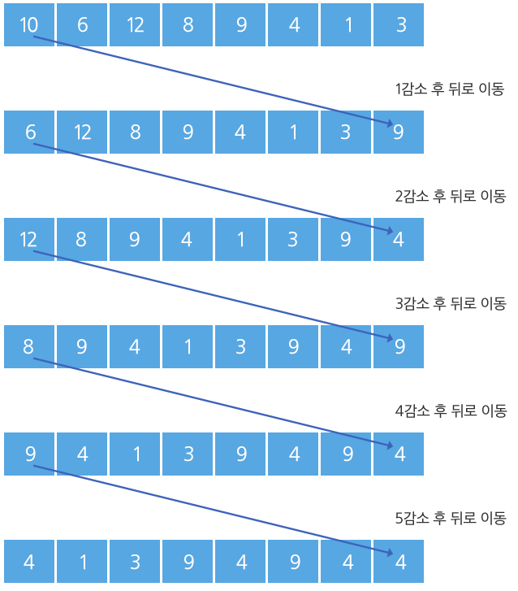

## 1225. [S/W 문제해결 기본] 7일차 - 암호생성기

다음 주어진 조건에 따라 n개의 수를 처리하면 8자리의 암호를 생성할 수 있다.

\- 8개의 숫자를 입력 받는다.

\- 첫 번째 숫자를 1 감소한 뒤, 맨 뒤로 보낸다. 

다음 첫 번째 수는 2 감소한 뒤 맨 뒤로, 그 다음 첫 번째 수는 3을 감소하고 맨 뒤로, 그 다음 수는 4, 그 다음 수는 5를 감소한다.

이와 같은 작업을 한 사이클이라 한다.

\- 숫자가 감소할 때 0보다 작아지는 경우 0으로 유지되며, 프로그램은 종료된다. 이 때의 8자리의 숫자 값이 암호가 된다.

 



[1 사이클]

 

[암호 도출]


**[제약 사항]**

주어지는 각 수는 integer 범위를 넘지 않는다.

마지막 암호 배열은 모두 한 자리 수로 구성되어 있다.

**[입력]**

각 테스트 케이스의 첫 줄에는 테스트 케이스의 번호가 주어지고, 그 다음 줄에는 8개의 데이터가 주어진다.

**[출력]**

\#부호와 함께 테스트케이스의 번호를 출력하고, 공백 문자 후 테스트 케이스의 답을 출력한다.

```python
t = 0
while t < 10:
    tc = int(input())
    pw = list(map(int, input().split()))    # 8개 숫자 입력

    while pw[-1]:
        for i in range(1, 6):   # 1~5를 순회하며
            tmp = pw.pop(0)     # 앞숫자를 하나 뽑아서
            tmp -= i            # i만큼 감소
            if tmp <= 0:        # 만약 0보다 작아지면
                pw.append(0)    # 0을 추가하고 종료
                break
            pw.append(tmp)      # 그렇지 않으면 계속 사이클을 돌며 진행

    print('#{} {}'.format(tc, ' '.join(map(str, pw))))
    t += 1
```

```
# input
1
9550 9556 9550 9553 9558 9551 9551 9551
2
2419 2418 2423 2415 2422 2419 2420 2415
...

# output
#1 6 2 2 9 4 1 3 0
#2 9 7 9 5 4 3 8 0
...
```

