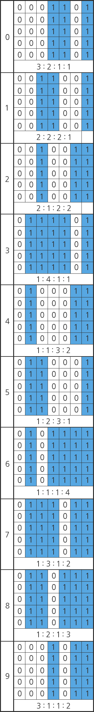

## 1240. [S/W 문제해결 응용] 1일차 - 단순 2진 암호코드

어떤 국가에서는 자국 내 방송국에서 스파이가 활동하는 사실을 알아냈다. 스파이는 영상물에 암호 코드를 삽입하여 송출하고 있었다. 암호 코드는 국가 내 중요 시설을 의미하는 숫자임을 알아냈다. 암호 코드의 규칙은 아래와 같다.


1. 총 8개의 숫자로 이루어져 있다. 

2. 앞 7자리는 상품 고유의 번호를 나타내며, 마지막 자리는 검증 코드를 나타낸다.    

   검증코드는 아래와 같은 방법으로 계산한다.    

   “(홀수 자리의 합 x 3) + 짝수 자리의 합 + 검증 코드” 가 10의 배수가 되어야 한다.    

   상품 고유의 번호가 8801234일 경우,   

   “( ( 8 + 0 + 2 + 4 ) x 3 ) + ( 8 + 1 + 3 ) + 검증 코드”    

   = “42 + 12 + 검증 코드”    

   = “54 + 검증 코드” 가 10 의 배수가 되어야 하므로, 검증코드는 6이 되어야 한다.    

   즉, 88012346 이 정상적인 암호코드고, 그 외의 검증코드가 포함된 경우 비정상적인 암호코드다.


A 업체에서는 이 암호코드들을 빠르고 정확하게 인식할 수 있는 스캐너를 개발하려고 한다. 스캐너의 성능은 아래와 같은 방법으로 측정된다.


1. 세로 50. 가로 100 이하의 크기를 가진 직사각형 배열에 암호코드 정보가 포함되어 전달된다. 이 때, 하나의 배열에는 1개의 암호코드가 존재한다. (단, 모든 암호코드가 정상적인 암호코드임을 보장할 수 없다. 비정상적인 암호코드가 포함될 수 있다.)  
2. 배열은 1, 0으로 이루어져 있으며 그 안에 포함되어 있는 암호코드 정보를 확인한다. 
3. 포함된 암호코드들의 검증코드를 확인하여 정상적인 암호코드인지 확인한다.
4. 정상적인 암호코드들을 판별한 뒤 이 암호코드들에 적혀있는 숫자들의 합을 출력한다.
5. 이때, 총 소요시간이 적을수록 성능이 좋은 것으로 간주된다.


배열에 포함되어 있는 암호코드의 세부 규칙은 아래와 같다.


1. 암호코드 하나는 숫자 8개로 구성되며 시작 구분선, 종료 구분선은 별도로 존재하지 않는다.  
2. 암호코드가 일부만 표시된 경우는 없다. 모든 암호코드는 8개의 숫자로 구성되어 있다.  
3. 암호코드의 세로 길이는 5 ~ 50 칸이다.  
4. 암호코드의 가로 길이는 총 길이는 56칸이다. 암호코드에 구성하는 숫자 하나가 차지하는 길이는 7칸이다. 각 숫자들을 그림으로 표시하는 방법은 다음과 같다.


  


암호코드 정보가 포함된 2차원 배열을 입력으로 받아 정상적인 암호코드를 판별하는 프로그램을 작성하라.

**[입력]**

가장 첫줄은 전체 테스트 케이스의 수이다.

각 테스트 케이스의 첫 줄에 두 자연수가 주어지는데 각각 배열의 세로 크기 N, 배열의 가로크기 M이다 (1≤N<50, 1≤M<100).

그 다음 N개의 줄에는 M개의 배열의 값이 주어진다.

**[출력]**

각 테스트 케이스의 답을 순서대로 표준출력으로 출력하며, 각 케이스마다 줄의 시작에 “#C”를 출력하여야 한다.

이때 C는 케이스의 번호이다. 같은 줄에 빈칸을 하나 두고, 입력에 주어진 배열에서 정상적인 암호코드들에 포함된 숫자들의 합을 출력한다.

**[예제 풀이]**

1번 케이스의 암호코드 정보를 추출하면 아래와 같다.

01110110110001011101101100010110001000110100100110111011
01110110110001011101101100010110001000110100100110111011
01110110110001011101101100010110001000110100100110111011
01110110110001011101101100010110001000110100100110111011
01110110110001011101101100010110001000110100100110111011
01110110110001011101101100010110001000110100100110111011
01110110110001011101101100010110001000110100100110111011

이 숫자가 나타내는 정보는 각각 아래와 같다.
0111011(7)  0110001(5)  0111011(7)  0110001(5)  0110001(5)  0001101(0)  0010011(2)  0111011(7)

검증코드가 맞는지 살펴보면, (7 + 7 + 5 + 2) * 3 + 5 + 5 + 0 + 7 = 80 이므로 올바른 암호코드라고 할 수 있다. 따라서 1번의 출력 값은 38이 된다.

2번 케이스도 같은 방식으로 계산할 경우, 검증코드가 틀렸음을 알 수 있다. 따라서 2번의 출력 값은 0이 된다.

```python
# 암호코드를 10진수로 변환하기 위한 해쉬 코드
hcode = {'0001101': '0', '0011001': '1', '0010011': '2',
         '0111101': '3', '0100011': '4', '0110001': '5',
         '0101111': '6', '0111011': '7', '0110111': '8', '0001011': '9'}

for tc in range(1, int(input()) + 1):
    # 데이터 입력
    n, m = map(int, input().split())
    original = [input() for _ in range(n)]
    
    # 암호코드 부분 검색 과정
    for i in range(n):
        if int(original[i]) != 0:                   # 한 줄 모두 0으로 찍히지 않은 행에 대해
            for j in range(m-1, -1, -1):            # 해당 행을 역순으로 순회
                if original[i][j] == '1':           # 1을 만난 시점일 경우
                    code = original[i][j-55:j+1]    # 해당 자리부터 앞으로 56 자리를 슬라이싱 (암호코드 추출)
                    break
            break

    _digits = 0     # 암호코드 자리수 구별을 위한 카운트 변수
    odd = 1         # 홀수자리 짝수자리 여부 판단을 위한 변수
    val = 0         # 10으로 나눌 검증 값
    res = 0         # 최종 결과 값

    while _digits < len(code):
        tmp = code[_digits:_digits + 7]     # 7자리씩 임시 할당
        decimal = int(hcode[tmp])           # 해쉬코드에 대응되는 10진수로 변환
        res += decimal                      # 최종 결과 값에 누적

        if odd % 2:                         # 현재 홀수 자리일 경우
            val += (decimal * 3)            # * 3을 연산해서 검증값에 누적
        else:
            val += decimal                  # 짝수일 경우 바로 검증값에 누적

        odd += 1                            # 다음 홀 짝 자리수로 +1
        _digits += 7                        # 다음 7자리수 할당을 위해 +7

    if not val % 10:                        # 검증값이 10의 배수일경우 정상 출력
        print(f'#{tc} {res}')
    else:                                   # 나머지가 생길 경우 0을 출력
        print(f'#{tc} 0')

```

```
# input
2
16 80
00000000000000000000000000000000000000000000000000000000000000000000000000000000
00000000000000000000000000000000000000000000000000000000000000000000000000000000
00000000000000000000000000000000000000000000000000000000000000000000000000000000
00000000000000000000000000000000000000000000000000000000000000000000000000000000
00000000000000000000000000000000000000000000000000000000000000000000000000000000
00000000000000000000000000000000000000000000000000000000000000000000000000000000
00000000000000011101101100010111011011000101100010001101001001101110110000000000
00000000000000011101101100010111011011000101100010001101001001101110110000000000
00000000000000011101101100010111011011000101100010001101001001101110110000000000
00000000000000011101101100010111011011000101100010001101001001101110110000000000
00000000000000011101101100010111011011000101100010001101001001101110110000000000
00000000000000011101101100010111011011000101100010001101001001101110110000000000
00000000000000011101101100010111011011000101100010001101001001101110110000000000
00000000000000000000000000000000000000000000000000000000000000000000000000000000
00000000000000000000000000000000000000000000000000000000000000000000000000000000
00000000000000000000000000000000000000000000000000000000000000000000000000000000
11 70
00000000000000000000000000000000000000000000000000000000000000000000000
00000000000000000000000000000000000000000000000000000000000000000000000
00000001100101000110100011010111101101110010011001001101110110000000000
00000001100101000110100011010111101101110010011001001101110110000000000
00000001100101000110100011010111101101110010011001001101110110000000000
00000001100101000110100011010111101101110010011001001101110110000000000
00000001100101000110100011010111101101110010011001001101110110000000000
00000001100101000110100011010111101101110010011001001101110110000000000
00000000000000000000000000000000000000000000000000000000000000000000000
00000000000000000000000000000000000000000000000000000000000000000000000
00000000000000000000000000000000000000000000000000000000000000000000000

# output
#1 38
#2 0
```

