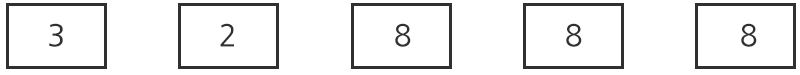

## 1244. [S/W 문제해결 응용] 2일차 - 최대 상금

퀴즈 대회에 참가해서 우승을 하게 되면 보너스 상금을 획득할 수 있는 기회를 부여받는다.

우승자는 주어진 숫자판들 중에 두 개를 선택에서 정해진 횟수만큼 서로의 자리를 위치를 교환할 수 있다.

예를 들어, 다음 그림과 3, 2, 8, 8, 8 의 5개의 숫자판들이 주어지고 교환 횟수는 2회라고 하자.

교환전>



처음에는 첫번째 숫자판의 3과 네 번째 숫자판의 8을 교환해서 8, 2, 8, 3, 8이 되었다.


다음으로, 두 번째 숫자판 2와 마지막에 있는 8을 교환해서 8, 8, 8, 3, 2이 되었다.


정해진 횟수만큼 교환이 끝나면 숫자판의 위치에 부여된 가중치에 의해 상금이 계산된다.

숫자판의 오른쪽 끝에서부터 1원이고 왼쪽으로 한자리씩 갈수록 10의 배수만큼 커진다.

위의 예에서와 같이 최종적으로 숫자판들이 8,8,8,3,2의 순서가 되면 88832원의 보너스 상금을 획득한다.

여기서 주의할 것은 반드시 횟수만큼 교환이 이루어져야 하고 동일한 위치의 교환이 중복되어도 된다.

다음과 같은 경우 1회의 교환 횟수가 주어졌을 때 반드시 1회 교환을 수행하므로 결과값은 49가 된다.


94의 경우 2회 교환하게 되면 원래의 94가 된다.

정해진 횟수만큼 숫자판을 교환했을 때 받을 수 있는 가장 큰 금액을 계산해보자.

**[입력]**

가장 첫 줄은 전체 테스트 케이스의 수이다.

최대 20개의 테스트 케이스가 표준 입력을 통하여 주어진다.

각 테스트 케이스에는 숫자판의 정보와 교환 횟수가 주어진다.

숫자판의 정보는 정수형 숫자로 주어지고 **최대 자릿수**는 6자리이며, **최대 교환 횟수**는 10번이다.

**[출력]**

각 테스트 케이스마다, 첫 줄에는 “#C”를 출력해야 하는데 C는 케이스 번호이다.

같은 줄에 빈 칸을 하나 사이에 두고 교환 후 받을 수 있는 가장 큰 금액을 출력한다.

```python
def perm(cnt):
    global res

    # n회 만큼 교체했을 경우
    if cnt == n:
        tmp = int(''.join(_nums))   # 현재 문자열을 숫자로 변환
        if res < tmp:               # 큰 값이라면 res에 저장
            res = tmp
        return

    for i in range(l):              # 문자열 처음부터 전체를 순회
        for j in range(i+1, l):     # i+1부터 끝까지 순회(무조건 오른쪽 숫자)
            # swap
            _nums[i], _nums[j] = _nums[j], _nums[i]
            temp = ''.join(_nums)       # 중복검사를 위해 하나로 합치기
            if (temp, cnt+1) not in v:  # 문자열과 현재 swap 횟수를 같이 저장(1회교체, 2회교체때 숫자가 같아서 튕기는거 방지)
                v.append((temp, cnt+1)) # 방문여부 저장
                perm(cnt+1)             # 횟수를 증가해 재귀 호출
            _nums[i], _nums[j] = _nums[j], _nums[i] # swap 원상복귀


for tc in range(1, int(input())+1):
    nums, n = map(int, input().split())
    _nums = list(str(nums))
    l = len(_nums)
    res = 0
    v = []
    # if tc == 4:
    perm(0)
    # print(v)
    print(f'#{tc} {res}')
```

```
# input
3
123 1
2737 1
32888 2
...

# output
#1 321
#2 7732
#3 88832
...
```


