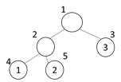
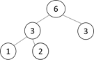

## 5178. [파이썬 S/W 문제해결 기본] 8일차 - 노드의 합

완전 이진 트리의 리프 노드에 1000이하의 자연수가 저장되어 있고, 리프 노드를 제외한 노드에는 자식 노드에 저장된 값의 합이 들어있다고 한다.

다음은 리프 노드에 저장된 1, 2, 3이 주어졌을 때, 나머지 노드에 자식 노드의 합을 저장한 예이다.
 

|  |  |
| ----------------------------- | ----------------------------- |
| 리프 노드 저장 값             | 자식 노드의 합을 저장한 상태  |


N개의 노드를 갖는 완전 이진 트리의 노드 번호는 루트가 1번이 되며, 같은 단계에서는 왼쪽에서 오른쪽으로 증가, 단계가 꽉 차면 다음단계의 왼쪽부터 시작된다.

완전 이진 트리의 특성상 1번부터 N번까지 빠지는 노드 번호는 없다.

리프 노드의 번호와 저장된 값이 주어지면 나머지 노드에 자식 노드 값의 합을 저장한 다음, 지정한 노드 번호에 저장된 값을 출력하는 프로그램을 작성 하시오.


**[입력]**

첫 줄에 테스트케이스의 수 T가 주어진다. 1<=T<=50

다음 줄부터 테스트 케이스의 별로 노드의 개수 N과 리프 노드의 개수 M, 값을 출력할 노드 번호 L이 주어지고, 다음 줄부터 M개의 줄에 걸쳐 리프 노드 번호와 1000이하의 자연수가 주어진다.

**[출력]**

각 줄마다 "#T" (T는 테스트 케이스 번호)를 출력한 뒤, 답을 출력한다.

```python
# [부모 노드 = 자식 노드의 합] 함수
def SumNode(idx):
    if idx <= n-m:          # 채워야 할 노드 깊이 까지 재귀 조건
        SumNode(idx*2)      # 왼쪽 자식 노드 깊게 진행
        SumNode(idx*2+1)    # 오른쪽 자식 노드로 깊게 진행
        
        if idx*2+1 <= n:    # 오른쪽, 왼쪽 자식 노드 모두 가진 부모노드일 경우
            tree[idx] = tree[idx*2] + tree[idx*2+1] # 두개의 합으로 계산
        else:               # 오른쪽 자식 노드는 인덱스에 벗어날 경우
            tree[idx] = tree[idx*2]                 # 왼쪽 노드가 곧 부모 노드 


for tc in range(1, int(input()) + 1):
    n, m, l = map(int, input().split())
    
    # 이진 트리 초기화
    tree = [0] * (n + 1)
    
    # 문제에서 제공하는 리프노드 값 입력
    for _ in range(m):
        leaf_node, num = map(int, input().split())
        tree[leaf_node] = num
    
    # 이진 트리 완성하기
    SumNode(1)
    print(f'#{tc} {tree[l]}')
```

```
# input
3
5 3 2
4 1
5 2
3 3
10 5 2
8 42
9 468
10 335
6 501
7 170
17 9 4
16 479
17 359
9 963
10 465
11 706
12 146
13 282
14 828
15 962

# output
#1 3
#2 845
#3 1801
```

