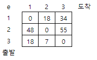

## 5189. [파이썬 S/W 문제해결 구현] 2일차 - 전자카트

골프장 관리를 위해 전기 카트로 사무실에서 출발해 각 관리구역을 돌고 다시 사무실로 돌아와야 한다.

사무실에서 출발해 각 구역을 한 번씩만 방문하고 사무실로 돌아올 때의 최소 배터리 사용량을 구하시오.

각 구역을 이동할 때의 배터리 사용량은 표로 제공되며, 1번은 사무실을, 2번부터 N번은 관리구역 번호이다.

두 구역 사이도 갈 때와 올 때의 경사나 통행로가 다를 수 있으므로 배터리 소비량은 다를 수 있다.

N이 3인 경우 가능한 경로는 1-2-3-1, 1-3-2-1이며 각각의 배터리 소비량은 다음과 같이 계산할 수 있다.

e\[1][2]+e\[2][3]+e\[3][1] = 18+55+18 = 91

e\[1][3]+e\[3][2]+e\[2][1] = 34+7+48 = 89

 



이 경우 최소 소비량은 89가 된다.


**[입력]**

첫 줄에 테스트케이스의 수 T가 주어진다. 1<=T<=50

다음 줄부터 테스트 케이스의 별로 첫 줄에 N이 주어지고, 다음 줄부터 N개씩 N개의 줄에 걸쳐 100이하의 자연수가 주어진다. 3<=N<=10

**[출력]**

각 줄마다 "#T" (T는 테스트 케이스 번호)를 출력한 뒤, 답을 출력한다.

```python
def dfs(now, temp_sum):
    global res              # 최소값을 담을 변수

    if temp_sum > res:      # dfs 중 temp_sum값이 이미 res를 넘었다면 리턴
        return

    if 0 not in v:              # 모든 관리구역을 방문했다면 다시 사무실로
        temp_sum += arr[now][0] # 사무실로 돌아오는 배터리 사용량 추가 
        if res > temp_sum:      # res값보다 작을 경우에 저장
            res = temp_sum
        return

    for i in range(n):          # 사무실 - 관리구역 순회
        if not v[i]:            # 아직 방문하지 않은 관리구역이라면
            # print(v)
            v[i] = 1            # 방문 여부 체크
            dfs(i, temp_sum+arr[now][i])    # 다음 관리구역 탐색을 위한 재귀, + 배터리 사용량
            v[i] = 0            # 관리구역 방문이 끝났으므로 다음 탐색을 위해 방문 초기화


for tc in range(1, int(input()) + 1):
    n = int(input())
    arr = [list(map(int, input().split())) for _ in range(n)]

    v = [0] * n     # 방문 배열
    v[0] = 1        # 사무실은 출발점이므로 방문 체크
    res = 999       # 최소값을 저장할 변수 초기화

    dfs(0, 0)       # 재귀 호출

    print(f'#{tc} {res}')
```

```
# input
3
3
0 18 34
48 0 55
18 7 0
4
0 83 65 97
82 0 78 6
19 19 0 82
6 34 94 0
5
0 9 26 85 42
14 0 84 31 27
58 88 0 16 46
83 61 94 0 17
40 71 24 38 0

# output
#1 89
#2 96
#3 139
```

