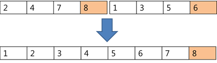

## 5204. [파이썬 S/W 문제해결 구현] 4일차 - 병합 정렬 (해결 못함)

알고리즘 교수님은 학생들에게 병합 정렬을 이용해 오름차순으로 정렬하는 과제를 내려고 한다.

정렬 된 결과만으로는 실제로 병합 정렬을 적용했는지 알 수 없기 때문에 다음과 같은 제약을 주었다.

N개의 정렬 대상을 가진 리스트 L을 분할할 때 L[0:N//2], L[N//2:N]으로 분할 한다.

병합 과정에서 다음처럼 왼쪽 마지막 원소가 오른쪽 마지막 원소보다 큰 경우의 수를 출력한다.





정렬이 끝난 리스트 L에서 L[N//2] 원소를 출력한다.

알고리즘 교수님의 조건에 따라 병합 정렬을 수행하는 프로그램을 만드시오.


**[입력]**

첫 줄에 테스트케이스의 수 T가 주어진다. 1<=T<=50

다음 줄부터 테스트 케이스의 별로 정수의 개수 N이 주어지고, 다음 줄에 N개의 정수 ai가 주어진다.

5<=N<=1,000,000, 0 <= ai <= 1,000,000

**[출력]**

각 줄마다 "#T" (T는 테스트 케이스 번호)를 출력한 뒤,  N//2 번째 원소와 오른쪽 원소가 먼저 복사되는 경우의 수를 출력한다.

```python
def merge_sort_1(arr):
    if len(arr) == 1:
        return arr

    m = len(arr) // 2
    left_list = arr[:m]
    right_list = arr[m:]

    left_list = merge_sort_1(left_list)
    right_list = merge_sort_1(right_list)

    return merge_1(left_list, right_list)


def merge_1(left, right):
    global cnt

    result = []

    if left[-1] > right[-1]:
        cnt += 1

    while len(left) > 0 or len(right) > 0:
        if len(left) > 0 and len(right) > 0:
            if left[0] <= right[0]:
                result.append(left[0])
                left = left[1:]
            else:
                result.append(right[0])
                right = right[1:]

        elif len(left) > 0:
            result.append(left[0])
            left = left[1:]

        elif len(right) > 0:
            result.append(right[0])
            right = right[1:]

    return result

def merge_sort_2(arr, s, e):
    m = (s + e) // 2

    if s+1 <= e:
        merge_sort_2(arr, s, m)
        merge_sort_2(arr, m + 1, e)
        return merge_2(arr, s, m, e)

    else:
        return arr


def merge_2(arr, s, m, e):
    global cnt
    i, j, t = s, m+1, 0
    temp = [0] * (e-s+1)

    if arr[m] > arr[e]:
        cnt += 1

    while i <= m and j <= e:
        if arr[i] < arr[j]:
            temp[t] = arr[i]
            t += 1
            i += 1
        else:
            temp[t] = arr[j]
            t += 1
            j += 1

    while i <= m:
        temp[t] = arr[i]
        t += 1
        i += 1
        if i > m:
            break

    while j <= e:
        temp[t] = arr[j]
        t += 1
        j += 1
        if j > e:
            break

    for x in range(e-s+1):
        arr[s+x] = temp[x]

    return arr


for tc in range(1, int(input())+1):
    n = int(input())
    nums = list(map(int, input().split()))

    cnt = 0

    # res = merge_sort_1(nums)
    res_2 = merge_sort_2(nums, 0, n-1)
    print(f'#{tc} {res_2} {cnt}')
    # print(res_2)
```

```
# input
2
5
2 2 1 1 3
10
7 5 4 1 2 10 3 6 9 8

# output
#1 2 0
#2 6 6
```

