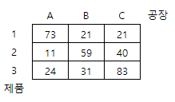

## 5209. [파이썬 S/W 문제해결 구현] 5일차 - 최소 생산 비용

A사는 여러 곳에 공장을 갖고 있다. 봄부터 새로 생산되는 N종의 제품을 N곳의 공장에서 한 곳당 한가지씩 생산하려고 한다.

각 제품의 공장별 생산비용이 주어질 때 전체 제품의 최소 생산 비용을 계산하는 프로그램을 만드시오.

예를 들어 3개의 제품을 생산하려는 경우 각 공장별 생산비용은 다음과 같이 주어진다..



이때 1-C, 2-A, 3-B로 제품별 생산 공장을 정하면 생산 비용이 21+11+31=63으로 최소가 된다.


**[입력]**

첫 줄에 테스트케이스의 수 T가 주어진다. 1<=T<=50

다음 줄부터 테스트 케이스의 별로 첫 줄에 제품 수 N이 주어지고, 이후 제품당 한 줄 씩 N개의 줄에 걸쳐 공장별 생산비용 Vij가 주어진다. 3<=N<=15,  1<=Vij<=99

**[출력]**

각 줄마다 "#T" (T는 테스트 케이스 번호)를 출력한 뒤, 답을 출력한다.

```python
def perm(k, tmp):
    global res
    
    # 종료 조건
    if k == n:
        if res > tmp:   # 저장된 비용보다 적다면 갱신
            res = tmp
        return

    if res < tmp:       # 재귀 중 저장된 비용을 넘어버리면 종료
        return

    for i in range(n):                  # n 만큼 순회
        if not visited[i]:              # visited 리스트에 체크가 안되어 있다면
            visited[i] = 1              # 체크하고
            perm(k+1, tmp + cost[k][i]) # k번째 열의 i번째 행 값 누적, k+1로 다음 열 재귀
            visited[i] = 0              # 다음번 탐색을 위해 체크 취소


for tc in range(1, int(input()) + 1):
    n = int(input())
    cost = [list(map(int, input().split())) for _ in range(n)]

    visited = [0] * n
    arr = list(range(n))
    res = 999999999

    perm(0, 0)
    print(f'#{tc} {res}')
```

```
# input
3
3
73 21 21
11 59 40
24 31 83
5
93 4 65 31 66
63 12 60 60 84
87 57 44 35 20
12 9 40 12 40
60 21 3 49 54
6
55 83 32 79 53 70
77 88 80 93 42 29
54 26 5 10 25 94
77 92 82 83 11 51
84 11 21 62 45 58
37 88 13 34 41 4

# output
#1 63
#2 78
#3 129
```

