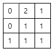
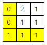

## 5250. [파이썬 S/W 문제해결 구현] 7일차 - 최소 비용

출발에서 최종 도착지까지 경유하는 지역의 높이 차이에 따라 연료 소비량이 달라지기 때문에, 최적의 경로로 이동하면 최소한의 연료로 이동할 수 있다.

다음은 각 지역의 높이를 기록한 표의 예로, 항상 출발은 맨 왼쪽 위, 도착지는 가장 오른쪽 아래이며, 각 칸에서는 상하좌우 칸이 나타내는 인접 지역으로만 이동할 수 있다.

(표에 표시되지 않은 지역이나 대각선 방향으로는 이동 불가.)

 



인접 지역으로 이동시에는 기본적으로 1만큼의 연료가 들고, 더 높은 곳으로 이동하는 경우 높이 차이만큼 추가로 연료가 소비된다.

 



색이 칠해진 칸을 따라 이동하는 경우 기본적인 연료 소비량 4에, 높이가 0에서 1로 경우만큼 추가 연료가 소비되므로 최소 연료 소비량 5로 목적지에 도착할 수 있다.

이동 가능한 지역의 높이 정보에 따라 최소 연료 소비량을 출력하는 프로그램을 만드시오.


**[입력]**

첫 줄에 테스트 케이스의 개수 T가 주어지고, 테스트 케이스 별로 첫 줄에 표의 가로, 세로 칸수N, 다음 줄부터 N개 지역의 높이 H가 N개의 줄에 걸쳐 제공된다.

1<=T<=50, 3<=N<=100, 0<=H<1000

**[출력]**

각 줄마다 "#T" (T는 테스트 케이스 번호)를 출력한 뒤, 답을 출력한다.


```python
from collections import deque


def bfs(y, x):
    delta = [[-1, 0], [0, 1], [1, 0], [0, -1]]

    fuel = [[float('inf')] * n for _ in range(n)]   # 매 칸 소비 연료 최대치로 초기화
    fuel[0][0] = 0                                  # 시작칸 연료 0 초기화

    q = deque([(0, 0)])     # 움직이는 위치 기록

    while q:
        y, x = q.popleft()  # 현재 y, x 좌표

        for d in delta:     # 4방향 탐색
            ny = y + d[0]
            nx = x + d[1]

            if 0 <= ny < n and 0 <= nx < n: # 유효 범위일 경우
                gap = 0                     # 높이 차를 저장하기 위한 변수
                if h[ny][nx] > h[y][x]:     # 높이 차이가 날 경우
                    gap = h[ny][nx] - h[y][x]   # gap에 차이값 저장
                    
                # 기존 기록되었던 연료량 보다 현재 연산한 연료량이 더 적을 경우
                if fuel[ny][nx] > (1 + fuel[y][x] + gap):
                    # 갱신하고 다음 탐색 좌표 추가
                    fuel[ny][nx] = 1 + fuel[y][x] + gap
                    q.append((ny, nx))
    return fuel[n-1][n-1]


for tc in range(1, int(input())+1):
    n = int(input())
    h = [list(map(int, input().split())) for _ in range(n)]

    print(f'#{tc} {bfs(0, 0)}')
```

```
# input
3
3
0 2 1
0 1 1
1 1 1
5
0 0 0 0 0
0 1 2 3 0
0 2 3 4 0
0 3 4 5 0
0 0 0 0 0
5
0 1 1 1 0
1 1 0 1 0
0 1 0 1 0
1 0 0 1 1
1 1 1 1 1

# output
#1 5
#2 8
#3 9
```

