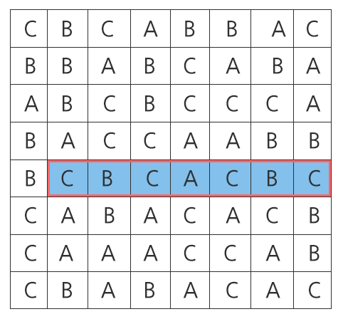
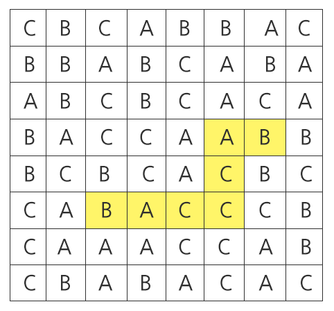

## [S/W 문제해결 기본] 3일차 - 회문2

"기러기" 또는 "level" 과 같이 거꾸로 읽어도 제대로 읽은 것과 같은 문장이나 낱말을 회문(回文, palindrome)이라 한다.

주어진 100x100 평면 글자판에서 가로, 세로를 모두 보아 가장 긴 회문의 길이를 구하는 문제이다.

 


위와 같은 글자 판이 주어졌을 때, 길이가 가장 긴 회문은 붉은색 테두리로 표시된 7칸짜리 회문이다.

예시의 경우 설명을 위해 글자판의 크기가 100 x 100이 아닌 8 x 8으로 주어졌음에 주의한다.

**[제약사항]**

각 칸의 들어가는 글자는 c언어 char type으로 주어지며 'A', 'B', 'C' 중 하나이다.

글자 판은 무조건 정사각형으로 주어진다.

ABA도 회문이며, ABBA도 회문이다. A또한 길이 1짜리 회문이다.

가로, 세로 각각에 대해서 직선으로만 판단한다. 즉, 아래 예에서 노란색 경로를 따라가면 길이 7짜리 회문이 되지만 직선이 아니기 때문에 인정되지 않는다. 





**[입력]**

각 테스트 케이스의 첫 번째 줄에는 테스트 케이스의 번호가 주어지며, 바로 다음 줄에 테스트 케이스가 주어진다.

총 10개의 테스트케이스가 주어진다.

**[출력]**

\#부호와 함께 테스트 케이스의 번호를 출력하고, 공백 문자 후 찾은 회문의 길이를 출력한다.

```python
# 단어 리스트 안에서 len_word 만큼의 단어가 회문인지 판단
# 회문일 경우 단어 길이를 리턴하는 함수
def len_palindrome(word_list, len_word):
    # 100 줄 문장을 순회하는 for loop
    for i in range(len(word_list)):
        # 단어의 길이만큼 인덱싱을 조절하는 for loop
        for j in range(100-len_word+1):

            # 회문 판단을 위해 단어 길이를 2로 나눠 인덱스로 접근
            # j+k, j+len_word-1-k는 k가 커질수록 양 끝에서 중앙으로 접근하며 비교
            for k in range(len_word//2):
                if word_list[i][j+k] != word_list[i][j+len_word-1-k]:
                    break
            else:
                return len_word
    # 회문을 찾지 못했다면 0을 출력
    return 0

# 리스트 속에서 가장 긴 회문의 길이를 찾는 함수
# 초기 회문의 길이는 1로 설정
def find_max_len(word_list, len_pal = 1):
    # 길이 2부터, 100까지의 for loop 순회
    for i in range(len_pal + 1, 101):
        # 2) 만일 현재 할당된 회문 길이인 len_pal보다 i가 2이상 커진다면 중단

        # 회문은 무조건 2씩 늘어나기 때문에 다음과 같이 지정
        if i > len_pal + 2:
            break
        # 3글자의 회문이라면 5글자가 회문인지 판단, 아니면 더이상 회문 없음
        # 4글자의 회문이라면 6글자가 회문인지 판단, 아니면 더이상 회문 없음

        # 1) 만일 현재 회문의 길이 값보다 i 길이 단어가 회문이면서 크다면, i를 새로 할당
        if len_pal < len_palindrome(word_list, i):
            len_pal = i
    return len_pal

x = 0
while x < 10:
    tc = int(input())
    _list = [input() for _ in range(100)]
    vertical_list = [''.join(_) for _ in zip(*_list)]

    row_max_len = find_max_len(_list)
    result = find_max_len(vertical_list, row_max_len)

    print('#{} {}'.format(x+1, result))
    x += 1
```

```
# input
1
CCBBCBAABCCCBABCBCAAAACABBACCCCACAABCBBACACAACABCBCCB...
ACBAAAACCACCCBAACAAABACACCABCBCBABBBACBABCAACCBCCACBC...
CCCACCBCBACBACBCABAABABCCAAAACCCCCBBAABBCCBCCCABBACAC...
CABACBCBBCBABACABBBBBBABBCABCBCBCAABCBCCCBABACCCCABBA...
BCCBCCACCBCBCABBBCCABAACACCBCCCBCCACCBBCBCCCBBCCBACBC...
BBBBCBBAACABACCBCBCCABBBBCCAABCBBCACCBBCAAAABABABBABB...
ABBAACCCACBBABBABCCCABABCACABABACCCBACACABCBCCCBABCCC...
ABBBBAABCAACCBACBBAACACABCABACBAABCAABBCCCCCCACBCCCCA...
ACCACABABBACBBAACCBBACBBCCACCACCABCCBABABBBACBACBAABC...
BABACACCABCAACBAABCCACCACBCCAABBCBAABABAACAAAAAACCCBC...
...
2
CBBABBACCAACCCAABABAACCABCBBCCABABBBBBCCACBCCCCBBBAAC...
BBBCBACAAABAACACBCAABBAAABCABBBCAAACBAABCAAAAACBABBAB...
CAAAABCAABAACCBBABCCCACABABACBCCBCCBABABBCCCBCBACAAAC...
BBBACBBBBBAACBBCBABBCBAABACCCBBBBCCCBBBCABCABCAABCBCA...
ABBBBAABCBACCACBBCBBAABABCBCCAAABBCAAABBAABBCACABAABA...
ABCBACAAACCCAAABCACABBAABBCAACCBABCCACBABBBABAABAACBB...
ACACABCBAAACCACABABBCABCBABAAABCBCCABABCCAACACBCBABCA...
ACCBACACCAAAABABACABABBBBABBAABABBBBACBACABABACACACAA...
AAACCCCCBCAACCCCCAAAACBCACBBABBBBBABABBCCCCBBAACCBBCB...
CCABCCBBCAAAACACBBBBAAAACABACABCCCBACBABBACCAABAAACAB...

# output
#1 18
#2 17
...
```

