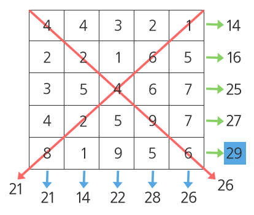

# D3

## 1206. [S/W 문제해결 기본] 1일차 - View

강변에 빌딩들이 옆으로 빽빽하게 밀집한 지역이 있다.

이곳에서는 빌딩들이 너무 좌우로 밀집하여, 강에 대한 조망은 모든 세대에서 좋지만 왼쪽 또는 오른쪽 창문을 열었을 때 바로 앞에 옆 건물이 보이는 경우가 허다하였다.

그래서 이 지역에서는 왼쪽과 오른쪽으로 창문을 열었을 때, 양쪽 모두 거리 2 이상의 공간이 확보될 때 조망권이 확보된다고 말한다.

빌딩들에 대한 정보가 주어질 때, 조망권이 확보된 세대의 수를 반환하는 프로그램을 작성하시오.

아래와 같이 강변에 8채의 빌딩이 있을 때, 연두색으로 색칠된 여섯 세대에서는 좌우로 2칸 이상의 공백이 존재하므로 조망권이 확보된다. 따라서 답은 6이 된다.


A와 B로 표시된 세대의 경우는 왼쪽 조망은 2칸 이상 확보가 되었지만 오른쪽 조망은 한 칸 밖에 확보가 되지 않으므로 조망권을 확보하지 못하였다.

C의 경우는 반대로 오른쪽 조망은 2칸이 확보가 되었지만 왼쪽 조망이 한 칸 밖에 확보되지 않았다.

**[제약 사항]**

가로 길이는 항상 1000이하로 주어진다.

맨 왼쪽 두 칸과 맨 오른쪽 두 칸에는 건물이 지어지지 않는다. (예시에서 빨간색 땅 부분)

각 빌딩의 높이는 최대 255이다.

**[입력]**

입력 파일의 첫 번째 줄에는 테스트케이스의 길이가 주어진다. 그 바로 다음 줄에 테스트 케이스가 주어진다.

총 10개의 테스트케이스가 주어진다.

**[출력]**

\#부호와 함께 테스트 케이스의 번호를 출력하고, 공백 문자 후 테스트 케이스의 조망권이 확보된 세대의 수를 출력한다.

```python
import sys
sys.stdin = open("input.txt", "r")

x = 0
result = []
while x < 10:
    tc = int(input())
    test_list = list(map(int, input().split()))

    res = 0
    for i in range(2 ,len(test_list)-2):
        view_temp = [test_list[i+idx] for idx in range(-2,3) if idx != 0]
        max_val = view_temp[0]
        for j in range(len(view_temp)):
            if max_val < view_temp[j]:
                max_val = view_temp[j]
        if max_val < test_list[i]:
            res += (test_list[i] - max_val)
    result.append(res)
    x += 1

for i in range(10):
    print(f'#{i+1} {result[i]}')
```

```
# input
100
0 0 225 214 82 73 241 233 179 219 135 62 36 13 6 71 179 77 67 139 31 90 9 37 ...
1000
0 0 225 214 82 73 241 233 179 219 135 62 36 13 6 71 179 77 67 139 31 90 9 37 ...
...

# output
#1 691
#2 9092
...
```


## 5789. 현주의 상자 바꾸기

현주는 1번부터 N번까지 N개의 상자를 가지고 있다. 각 상자에는 숫자를 새길 수 있는데 처음에는 모두 0으로 적혀있다.

숫자가 너무 단조로웠던 현주는 다음 Q회 동안 일정 범위의 연속한 상자를 동일한 숫자로 변경하려고 한다. 변경하는 방법은 다음과 같다.

  · i (1 ≤ i ≤ Q)번째 작업에 대해 L번 상자부터 R번 상자까지의 값을 i로 변경

현주가 Q회 동안 위의 작업을 순서대로 한 다음 N개의 상자에 적혀있는 값들을 순서대로 출력하는 프로그램을 작성하라.


**[입력]**

첫 번째 줄에 테스트 케이스의 수 T가 주어진다.

각 테스트 케이스의 첫 번째 줄에는 두 정수 N, Q (1 ≤ N, Q ≤ 103)가 공백으로 구분되어 주어진다.

다음 Q개의 줄의 i번째 줄에는 Li, Ri (1 ≤ Li ≤ Ri ≤ N)이 주어진다.

 

**[출력]**

각 테스트 케이스마다 첫 번째 줄에는 ‘#x’(x는 테스트케이스 번호를 의미하며 1부터 시작한다)를 출력하고,

각 테스트 케이스마다 Q개의 작업을 수행한 다음 1번부터 N번까지의 상자에 적혀있는 값들을 순서대로 출력한다.

```python
T = int(input())
x = 0
while x < T:
    N, Q = map(int, input().split())

    box = [0] * N

    for i in range(Q):
        L, R = map(int, input().split())

        for j in range(L-1, R):
            box[j] = i+1

    print('#{} {}'.format(x+1, ' '.join(map(str, box))))
    x += 1
```

```
# input
1
5 2
1 3
2 4	// Test Case 개수
// 첫 번째 Test Case, N=5, Q=2
// i = 1일 때, L=1, R=3
// i = 2일 때, L=2, R=4

# output
#1 1 2 2 2 0	//첫 번째 테스트케이스 결과
```


## 1208. [S/W 문제해결 기본] 1일차 - Flatten

한 쪽 벽면에 다음과 같이 노란색 상자들이 쌓여 있다.

높은 곳의 상자를 낮은 곳에 옮기는 방식으로 최고점과 최저점의 간격을 줄이는 작업을 평탄화라고 한다.

평탄화를 모두 수행하고 나면, 가장 높은 곳과 가장 낮은 곳의 차이가 최대 1 이내가 된다.

평탄화 작업을 위해서 상자를 옮기는 작업 횟수에 제한이 걸려있을 때, 제한된 횟수만큼 옮기는 작업을 한 후 최고점과 최저점의 차이를 반환하는 프로그램을 작성하시오.


 


가장 높은 곳에 있는 상자를 가장 낮은 곳으로 옮기는 작업을 덤프라고 정의한다.

위의 예시에서 제1회 덤프를 수행한 이후 화면은 다음과 같다.

 


A부분의 상자를 가장 낮은 B부분에 덤프하였으며, A대신 A’부분의 상자를 사용해도 무방하다.

다음은 제2회 덤프를 수행한 이후의 화면이다.

 


A’부분의 상자를 옮겨서, C부분에 덤프하였다. 이때 C 대신 C’부분에 덤프해도 무방하다.

2회의 덤프 후, 최고점과 최저점의 차이는 8 – 2 = 6 이 되었다 (최초덤프 이전에는 9 – 1 = 8 이었다).

덤프 횟수가 2회로 제한된다면, 이 예시 문제의 정답은 6이 된다.

**[제약 사항]**

가로 길이는 항상 100으로 주어진다.

모든 위치에서 상자의 높이는 1이상 100이하로 주어진다.

덤프 횟수는 1이상 1000이하로 주어진다.

주어진 덤프 횟수 이내에 평탄화가 완료되면 더 이상 덤프를 수행할 수 없으므로 그 때의 최고점과 최저점의 높이 차를 반환한다 (주어진 data에 따라 0 또는 1이 된다).

**[입력]**

총 10개의 테스트 케이스가 주어지며, 각 테스트 케이스의 첫 번째 줄에는 덤프 횟수가 주어진다. 그리고 다음 줄에 각 상자의 높이값이 주어진다.

**[출력]**

\#부호와 함께 테스트 케이스의 번호를 출력하고, 공백 문자 후 테스트 케이스의 최고점과 최저점의 높이 차를 출력한다.

```python
import sys
sys.stdin = open("input.txt", "r")

x = 0
while x < 10:
    dump = int(input())
    y_box = list(map(int, input().split()))

    for i in range(dump):
        max_value = min_value = y_box[0]
        max_index = min_index = 0

        for j in range(1, len(y_box)):
            if max_value < y_box[j]:
                max_value = y_box[j]
                max_index = j

            if min_value > y_box[j]:
                min_value = y_box[j]
                min_index = j

        y_box[max_index] -= 1
        y_box[min_index] += 1

    max_value = min_value = y_box[0]
    for i in range(1, len(y_box)):
        if max_value < y_box[i]:
            max_value = y_box[i]
        if min_value > y_box[i]:
            min_value = y_box[i]

    print(f'#{x+1} {max_value-min_value}')

    x += 1
```

```
# input
834
42 68 35 1 70 25 79 59 63 65 6 46 82 28 62 92 96 43 28 37 92 5 3 54 93 83 22 17 19 96 ...
617
16 40 59 5 31 78 7 74 87 22 46 25 73 71 30 78 74 98 13 87 91 62 37 56 68 56 75 32 53 ...
...

# output
#1 13
#2 32
...
```


## 6485. 삼성시의 버스 노선

삼성시에 있는 5,000개의 버스 정류장은 관리의 편의를 위해 1에서 5,000까지 번호가 붙어 있다.

그리고 버스 노선은 N개가 있는데, i번째 버스 노선은 번호가 Ai이상이고,

Bi이하인 모든 정류장만을 다니는 버스 노선이다.

P개의 버스 정류장에 대해 각 정류장에 몇 개의 버스 노선이 다니는지 구하는 프로그램을 작성하라.


**[입력]**

첫 번째 줄에 테스트 케이스의 수 T가 주어진다.

각 테스트 케이스의 첫 번째 줄에는 하나의 정수 N ( 1 ≤ N ≤ 500 )이 주어진다.

다음 N개의 줄의 i번째 줄에는 두 정수 Ai, Bi ( 1 ≤ Ai ≤ Bi ≤ 5,000 )가 공백 하나로 구분되어 주어진다.

다음 줄에는 하나의 정수 P ( 1 ≤ P ≤ 500 )가 주어진다.

다음 P개의 줄의 j번째 줄에는 하나의 정수 Cj ( 1 ≤ Cj ≤ 5,000 ) 가 주어진다.


**[출력]**

각 테스트 케이스마다 ‘#x’(x는 테스트케이스 번호를 의미하며 1부터 시작한다)를 출력하고 한 칸을 띄운 후,

한 줄에 P개의 정수를 공백 하나로 구분하여 출력한다.

j번째 정수는 Cj번 버스 정류장을 지나는 버스 노선의 개수여야 한다.

```python
T = int(input())

x = 0
while x < T:
    n = int(input())
    
    route = [list(map(int, input().split())) for _ in range(n)]
    station = int(input())
    station_list= [int(input()) for _ in range(station)]
    result = [0] * station

    for i in range(len(route)):
        for j in range(len(station_list)):
            if station_list[j] >= route[i][0] and station_list[j] <= route[i][1]:
                result[j] += 1

    print(f'#{x+1} {" ".join(map(str, result))}')

    x += 1
```

```
# input
1 //테스트 케이스 개수
2 //첫 번째 테스트 케이스, N=2
1 3 // A1 = 1, B1 = 3
2 5 // A2 = 2, B2 = 5
5 // P = 5
1 // 이하 C1 = 1, C2 = 2, C3 = 3, C4 = 4, C5 = 5
2
3
4
5	

# output
#1 1 2 2 1 1	//첫 번째 테스트 케이스 결과
```


## 1209. [S/W 문제해결 기본] 2일차 - Sum

다음 100X100의 2차원 배열이 주어질 때, 각 행의 합, 각 열의 합, 각 대각선의 합 중 최댓값을 구하는 프로그램을 작성하여라.

다음과 같은 5X5 배열에서 최댓값은 29이다.




**[제약 사항]**

총 10개의 테스트 케이스가 주어진다.

배열의 크기는 100X100으로 동일하다.

각 행의 합은 integer 범위를 넘어가지 않는다.

동일한 최댓값이 있을 경우, 하나의 값만 출력한다.

**[입력]**

각 테스트 케이스의 첫 줄에는 테스트 케이스 번호가 주어지고 그 다음 줄부터는 2차원 배열의 각 행 값이 주어진다.

**[출력]**

\#부호와 함께 테스트 케이스의 번호를 출력하고, 공백 문자 후 테스트 케이스의 답을 출력한다.

```python
x = 0
while x < 10:
    t = int(input())
    array = [list(map(int, input().split())) for _ in range(100)]
    
    # 모든 합계를 저장하기 위한 리스트
    sum_list = []

    # 대각선의 값을 저장하기 위한 변수
    dia_sum_1 = dia_sum_2 = 0

    # 2차원 배열을 순회하며 리스트에 합계값 추가
    for i in range(len(array)):
        
        # 행, 열의 합계값을 저장하기 위한 변수
        row_sum = 0
        col_sum = 0

        for j in range(len(array[0])):
            row_sum += array[i][j]
            col_sum += array[j][i]

            # 2가지 경우의 대각선 합계 우측하방, 우측상방
            if i == j:
                dia_sum_1 += array[i][j]

            if i + j == 99:
                dia_sum_2 += array[i][j]
        
        sum_list.extend([row_sum, col_sum])
    sum_list.extend([dia_sum_1, dia_sum_2])
    
    # 선택 정렬
    for i in range(len(sum_list)-1):
        max_index = i

        for j in range(i+1, len(sum_list)):
            if sum_list[max_index] < sum_list[j]:
                max_index = j

        sum_list[i], sum_list[max_index] = sum_list[max_index], sum_list[i]
    
    print(f"#{x+1} {sum_list[0]}")

    x += 1
```

```
# input
1
13 24 13 24 1 7 24 11 22 18 22 16 24 8 15 28 9 24 14 14 28 18 17 9 3 29 22 12 28 2 25 6 11 26 14 19 3 26 13 6 23 3 3 29 13 25 4 27 8 25 28 8 9 17 28 13 24 27 9 25 21 20 6 16 28 5 22 11 9 29 13 26 28 2 11 10 14 14 5 11 26 9 15 3 23 9 8 11 12 6 9 18 6 14 28 21 24 24 20 12
20 28 29 21 27 13 29 16 6 28 5 7 13 20 7 1 11 1 23 12 4 9 27 19 26 2 21 2 1 18 4 20 6 4 18 9 20 3 28 28 1 21 1 2 11 7 20 15 7 29 14 7 15 10 29 24 2 25 29 3 11 9 17 6 2 17 17 11 7 20 26 10 8 1 15 10 2 29 7 9 17 8 25 28 29 12 28 19 3 4 17 17 28 9 2 15 14 6 20 3
13 19 28 23 11 1 19 5 5 28 19 18 16 14 26 20 6 12 20 18 16 22 25 21 25 29 3 ............
........
........

# output
#1 1712
#2 1743
.......
.......
```


## 4837. [파이썬 S/W 문제해결 기본] 2일차 - 부분집합의 합

1부터 12까지의 숫자를 원소로 가진 집합 A가 있다. 집합 A의 부분 집합 중 N개의 원소를 갖고 있고, 원소의 합이 K인 부분집합의 개수를 출력하는 프로그램을 작성하시오.

해당하는 부분집합이 없는 경우 0을 출력한다. 모든 부분 집합을 만들어 답을 찾아도 된다.

예를 들어 N = 3, K = 6 경우, 부분집합은 { 1, 2, 3 } 경우 1가지가 존재한다.


**[입력]**

첫 줄에 테스트 케이스 개수 T가 주어진다. ( 1 ≤ T ≤ 50 )

테스트 케이스 별로 부분집합 원소의 수 N과 부분 집합의 합 K가 여백을 두고 주어진다. ( 1 ≤ N ≤ 12, 1 ≤ K ≤ 100 )

 

**[출력]**

각 줄마다 "#T" (T는 테스트 케이스 번호)를 출력한 뒤, 답을 출력한다.

```python
T = int(input())

x = 0
while x < T:
    n, k= map(int, input().split())

    # 집합 A
    a = list(range(1, 13))

    # 조건에 만족하는 부분집합의 개수
    cnt = 0

    # 조건에 맞는 부분집합 구하기
    for i in range(1<<len(a)):
        temp = []
        for j in range(len(a)):
            if i & (1<<j):
                temp.append(a[j])

        # 길이가 n이고, 합이 k인 부분집합 
        if len(temp) == n and sum(temp) == k:
            cnt += 1

    print(f'#{x+1} {cnt}')
    x += 1
```

```
# input
3
3 6
5 15
5 10

# output
#1 1
#2 1
#3 0
```


## 4843. [파이썬 S/W 문제해결 기본] 2일차 - 특별한 정렬

보통의 정렬은 오름차순이나 내림차순으로 이루어지지만, 이번에는 특별한 정렬을 하려고 한다.

N개의 정수가 주어지면 가장 큰 수, 가장 작은 수, 2번째 큰 수, 2번째 작은 수 식으로 큰 수와 작은 수를 번갈아 정렬하는 방법이다.

예를 들어 1부터 10까지 10개의 숫자가 주어지면 다음과 같이 정렬한다.


10 1 9 2 8 3 7 4 6 5

주어진 숫자에 대해 특별한 정렬을 한 결과를 10개까지 출력하시오

 

**[입력]**

첫 줄에 테스트 케이스 개수 T가 주어진다. 1<=T<=50

다음 줄에 정수의 개수 N이 주어지고 다음 줄에 N개의 정수 ai가 주어진다. 10<=N<=100, 1<=ai<=100

 

**[출력]**

각 줄마다 "#T" (T는 테스트 케이스 번호)를 출력한 뒤, 특별히 정렬된 숫자를 10개까지 출력한다.

```python
T = int(input())

x = 0
while x < T:
    n = int(input())

    nums = list(map(int, input().split()))

    # 입력받은 리스트의 선택정렬
    for i in range(len(nums)-1):
        min_idx = i
        for j in range(i+1, len(nums)):
            if nums[min_idx] > nums[j]:
                min_idx = j
        nums[i], nums[min_idx] = nums[min_idx], nums[i]
    
    # 결과를 출력할 리스트
    result = [0] * 10

    # nums 인덱스를 result 인덱스에 맞게 순회하며 할당
    for i in range(10):
        if i % 2 == 0:
            result[i] = nums[-(i//2)-1]
        elif i % 2 == 1:
            result[i] = nums[i//2]

    # 결과 출력
    print(f'#{x+1} {" ".join(map(str, result))}')
    
    x += 1
```

```
# input
3
10
1 2 3 4 5 6 7 8 9 10
10
67 39 16 49 60 28 8 85 89 11
20
3 69 21 46 43 60 62 97 64 30 17 88 18 98 71 75 59 36 9 26

# output
#1 10 1 9 2 8 3 7 4 6 5
#2 89 8 85 11 67 16 60 28 49 39
#3 98 3 97 9 88 17 75 18 71 21
```


## 1221. [S/W 문제해결 기본] 5일차 - GNS

숫자 체계가 우리와 다른 어느 행성이 있다. 아래는 이 행성에서 사용하는 0 ~ 9의 값을 순서대로 나타낸 것이다.

**"ZRO", "ONE", "TWO", "THR", "FOR", "FIV", "SIX", "SVN", "EGT", "NIN"**

0 ~ 9 의 값을 나타내는 단어가 섞여 있는 문자열을 받아 작은 수부터 차례로 정렬하여 출력하는 프로그램을 작성하라.

예를 들어 입력 문자열이 **"TWO NIN TWO TWO FIV FOR"** 일 경우 정렬한 문자열은 **"TWO TWO TWO FOR FIV NIN"** 이 된다.

**[입력]**

입력 파일의 첫 번째 줄에는 테스트 케이스의 개수가 주어진다.

그 다음 줄에 #기호와 함께 테스트 케이스의 번호가 주어지고 공백문자 후 테스트 케이스의 길이가 주어진다.

그 다음 줄부터 바로 테스트 케이스가 주어진다. 단어와 단어 사이는 하나의 공백으로 구분하며, 문자열의 길이 N은 100≤N≤10000이다.

**[출력]**

\#부호와 함께 테스트 케이스의 번호를 출력하고, 공백 문자 후 정렬된 문자열을 출력한다.

```python
t = int(input())

# 문자로 표현한 리스트
_chr = ["ZRO", "ONE", "TWO", "THR", "FOR", "FIV", "SIX", "SVN", "EGT", "NIN"]
# '문자: 문자에 해당하는 숫자'의 쌍을 이루는 dict
_order = dict(zip(_chr, range(len(_chr))))

x = 0
while x < t:
    # 데이터 입력
    tc, n = input().split()
    _list = input().split()
	
    # 문자가 들어오는 수를 계산하기 위한 리스트
    cnt = [0] * 10
	
    # list[0] -> 'ZRO'
    # _order['ZRO'] -> 0
    # cnt[0] += 1 순서의 로직으로 cnt에 등장 횟수를 카운트
    for i in range(len(_list)):
        cnt[_order[_list[i]]] += 1
	
    # 결과 출력을 위한 리스트
    result = []
    
    # _chr의 i번째 문자를 cnt에 i 즉 등장 회수만큼 곱하여 result에 할당
    for i in range(len(cnt)):
        result.extend([_chr[i]] * cnt[i])

    print(tc)
    print(' '.join(result))
    x += 1
```

```
# input
10
#1 7041
SVN FOR ZRO NIN FOR EGT EGT TWO FOR FIV FIV ONE SVN ONE ONE FIV TWO SVN SIX ONE FOR TWO THR TWO TWO ONE SIX EGT FIV SVN SIX ONE EGT NIN TWO SVN NIN FIV FOR THR ONE TWO THR THR FOR ONE ONE THR EGT SVN FOR TWO SVN SVN NIN THR ONE NIN EGT SIX FIV ZRO TWO EGT SIX ZRO TWO FOR EGT SIX FIV ZRO NIN ZRO ZRO SIX ONE THR EGT NIN THR FOR FOR SIX ZRO SIX SIX ONE...
#2 7778
EGT ONE THR SIX ZRO ZRO NIN FIV FOR EGT SVN FOR NIN NIN EGT THR EGT FIV TWO ONE FIV THR ONE SIX SVN THR ZRO FIV TWO TWO ONE FIV ZRO TWO SIX TWO EGT THR SIX SVN FOR FIV THR SVN SVN EGT EGT FOR ZRO THR FIV EGT NIN THR ONE SVN ZRO NIN THR THR FIV SVN THR SIX FOR NIN FOR ZRO ZRO NIN SVN EGT SIX FIV TWO TWO THR FIV THR SVN NIN ONE ZRO FIV ZRO NIN THR SIX ...
...

# output
#1
ZRO ZRO ZRO ZRO ZRO ZRO ZRO ZRO ZRO ZRO ZRO ZRO ZRO ZRO ZRO ZRO ZRO ZRO ZRO ZRO ZRO ZRO ZRO ZRO ZRO ZRO ZRO ZRO ZRO ZRO ZRO ZRO ZRO ZRO ZRO ZRO ZRO ZRO ZRO ZRO ZRO ZRO ZRO ZRO ZRO ZRO ...
#2
ZRO ZRO ZRO ZRO ZRO ZRO ZRO ZRO ZRO ZRO ZRO ZRO ZRO ZRO ZRO ZRO ZRO ZRO ZRO ZRO ZRO ZRO ZRO ZRO ZRO ZRO ZRO ZRO ZRO ZRO ZRO ZRO ZRO ZRO ZRO ZRO ZRO ZRO ZRO ZRO ZRO ZRO ZRO ZRO ZRO ZRO ...
...
```


## 1213. [S/W 문제해결 기본] 3일차 - String

주어지는 영어 문장에서 특정한 문자열의 개수를 반환하는 프로그램을 작성하여라.

Starteatingwellwiththeseeighttipsforhealthyeating,whichcoverthebasicsofahealthydietandgoodnutrition.

위 문장에서 ti 를 검색하면, 답은 4이다.

**[제약 사항]**

총 10개의 테스트 케이스가 주어진다.

문장의 길이는 1000자를 넘어가지 않는다.

한 문장에서 검색하는 문자열의 길이는 최대 10을 넘지 않는다.

한 문장에서는 하나의 문자열만 검색한다. 

**[입력]**

각 테스트 케이스의 첫 줄에는 테스트 케이스의 번호가 주어지고 그 다음 줄에는 찾을 문자열, 그 다음 줄에는 검색할 문장이 주어진다.

**[출력]**

\#부호와 함께 테스트 케이스의 번호를 출력하고, 공백 문자 후 테스트 케이스의 답을 출력한다.

```python
# import sys
# sys.stdin = open("input.txt", "r", encoding='UTF8')
# 인코딩 UTF8을 추가해야 본 코드가 실행되었다...

x = 0
while x < 10:
    tc = int(input())
    word = input()
    sentense = input()
	
    # 매칭되는 횟수 초기화
    cnt = 0
    
    # 문장 속에서 문장 길이를 고려하여 단어를 비교
    for i in range(len(sentense) - len(word) + 1):
        # 동일하면 1 추가
        if sentense[i:i+len(word)] == word:
            cnt += 1

    print(f'#{tc} {cnt}')
    x += 1
```

```
# input
1
ti
Starteatingwellwiththeseeighttipsforhealthyeating,whichcoverthebasics ...
2
ing
Thedoublehelixformsthestructuralbasisofsemi-conservativeDNAreplication.1,2Less ...
...

# output
#1 4
#2 2
...
```


## [S/W 문제해결 기본] 3일차 - 회문2

"기러기" 또는 "level" 과 같이 거꾸로 읽어도 제대로 읽은 것과 같은 문장이나 낱말을 회문(回文, palindrome)이라 한다.

주어진 100x100 평면 글자판에서 가로, 세로를 모두 보아 가장 긴 회문의 길이를 구하는 문제이다.


 


위와 같은 글자 판이 주어졌을 때, 길이가 가장 긴 회문은 붉은색 테두리로 표시된 7칸짜리 회문이다.

예시의 경우 설명을 위해 글자판의 크기가 100 x 100이 아닌 8 x 8으로 주어졌음에 주의한다.

**[제약사항]**

각 칸의 들어가는 글자는 c언어 char type으로 주어지며 'A', 'B', 'C' 중 하나이다.

글자 판은 무조건 정사각형으로 주어진다.

ABA도 회문이며, ABBA도 회문이다. A또한 길이 1짜리 회문이다.

가로, 세로 각각에 대해서 직선으로만 판단한다. 즉, 아래 예에서 노란색 경로를 따라가면 길이 7짜리 회문이 되지만 직선이 아니기 때문에 인정되지 않는다. 


**[입력]**

각 테스트 케이스의 첫 번째 줄에는 테스트 케이스의 번호가 주어지며, 바로 다음 줄에 테스트 케이스가 주어진다.

총 10개의 테스트케이스가 주어진다.

**[출력]**

\#부호와 함께 테스트 케이스의 번호를 출력하고, 공백 문자 후 찾은 회문의 길이를 출력한다.

```python
# 단어 리스트 안에서 len_word 만큼의 단어가 회문인지 판단
# 회문일 경우 단어 길이를 리턴하는 함수
def len_palindrome(word_list, len_word):
    # 100 줄 문장을 순회하는 for loop
    for i in range(len(word_list)):
        # 단어의 길이만큼 인덱싱을 조절하는 for loop
        for j in range(100-len_word+1):

            # 회문 판단을 위해 단어 길이를 2로 나눠 인덱스로 접근
            # j+k, j+len_word-1-k는 k가 커질수록 양 끝에서 중앙으로 접근하며 비교
            for k in range(len_word//2):
                if word_list[i][j+k] != word_list[i][j+len_word-1-k]:
                    break
            else:
                return len_word
    # 회문을 찾지 못했다면 0을 출력
    return 0

# 리스트 속에서 가장 긴 회문의 길이를 찾는 함수
# 초기 회문의 길이는 1로 설정
def find_max_len(word_list, len_pal = 1):
    # 길이 2부터, 100까지의 for loop 순회
    for i in range(len_pal + 1, 101):
        # 2) 만일 현재 할당된 회문 길이인 len_pal보다 i가 2이상 커진다면 중단

        # 회문은 무조건 2씩 늘어나기 때문에 다음과 같이 지정
        if i > len_pal + 2:
            break
        # 3글자의 회문이라면 5글자가 회문인지 판단, 아니면 더이상 회문 없음
        # 4글자의 회문이라면 6글자가 회문인지 판단, 아니면 더이상 회문 없음

        # 1) 만일 현재 회문의 길이 값보다 i 길이 단어가 회문이면서 크다면, i를 새로 할당
        if len_pal < len_palindrome(word_list, i):
            len_pal = i
    return len_pal

x = 0
while x < 10:
    tc = int(input())
    _list = [input() for _ in range(100)]
    vertical_list = [''.join(_) for _ in zip(*_list)]

    row_max_len = find_max_len(_list)
    result = find_max_len(vertical_list, row_max_len)

    print('#{} {}'.format(x+1, result))
    x += 1
```

```
# input
1
CCBBCBAABCCCBABCBCAAAACABBACCCCACAABCBBACACAACABCBCCB...
ACBAAAACCACCCBAACAAABACACCABCBCBABBBACBABCAACCBCCACBC...
CCCACCBCBACBACBCABAABABCCAAAACCCCCBBAABBCCBCCCABBACAC...
CABACBCBBCBABACABBBBBBABBCABCBCBCAABCBCCCBABACCCCABBA...
BCCBCCACCBCBCABBBCCABAACACCBCCCBCCACCBBCBCCCBBCCBACBC...
BBBBCBBAACABACCBCBCCABBBBCCAABCBBCACCBBCAAAABABABBABB...
ABBAACCCACBBABBABCCCABABCACABABACCCBACACABCBCCCBABCCC...
ABBBBAABCAACCBACBBAACACABCABACBAABCAABBCCCCCCACBCCCCA...
ACCACABABBACBBAACCBBACBBCCACCACCABCCBABABBBACBACBAABC...
BABACACCABCAACBAABCCACCACBCCAABBCBAABABAACAAAAAACCCBC...
...
2
CBBABBACCAACCCAABABAACCABCBBCCABABBBBBCCACBCCCCBBBAAC...
BBBCBACAAABAACACBCAABBAAABCABBBCAAACBAABCAAAAACBABBAB...
CAAAABCAABAACCBBABCCCACABABACBCCBCCBABABBCCCBCBACAAAC...
BBBACBBBBBAACBBCBABBCBAABACCCBBBBCCCBBBCABCABCAABCBCA...
ABBBBAABCBACCACBBCBBAABABCBCCAAABBCAAABBAABBCACABAABA...
ABCBACAAACCCAAABCACABBAABBCAACCBABCCACBABBBABAABAACBB...
ACACABCBAAACCACABABBCABCBABAAABCBCCABABCCAACACBCBABCA...
ACCBACACCAAAABABACABABBBBABBAABABBBBACBACABABACACACAA...
AAACCCCCBCAACCCCCAAAACBCACBBABBBBBABABBCCCCBBAACCBBCB...
CCABCCBBCAAAACACBBBBAAAACABACABCCCBACBABBACCAABAAACAB...

# output
#1 18
#2 17
...
```

