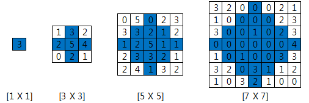

# D3

## 5356. 의석이의 세로로 말해요

아직 글을 모르는 의석이가 벽에 걸린 칠판에 자석이 붙어있는 글자들을 붙이는 장난감을 가지고 놀고 있다.

이 장난감에 있는 글자들은 영어 대문자 ‘A’부터 ‘Z’, 영어 소문자 ‘a’부터 ‘z’, 숫자 ‘0’부터 ‘9’이다. 의석이는 칠판에 글자들을 수평으로 일렬로 붙여서 단어를 만든다.

다시 그 아래쪽에 글자들을 붙여서 또 다른 단어를 만든다. 이런 식으로 다섯 개의 단어를 만든다. 아래에 의석이가 칠판에 붙여 만든 단어들의 예가 있다.


A A B C D D

a f z z

0 9 1 2 1

a 8 E W g 6

P 5 h 3 k x

 

만들어진 다섯 개의 단어들의 글자 개수는 서로 다를 수 있다.


심심해진 의석이는 칠판에 만들어진 다섯 개의 단어를 세로로 읽으려 한다.

세로로 읽을 때, 각 단어의 첫 번째 글자들을 위에서 아래로 세로로 읽는다. 다음에 두 번째 글자들을 세로로 읽는다.

이런 식으로 왼쪽에서 오른쪽으로 한 자리씩 이동 하면서 동일한 자리의 글자들을 세로로 읽어 나간다.

위의 그림 1의 다섯 번째 자리를 보면 두 번째 줄의 다섯 번째 자리의 글자는 없다. 이런 경우처럼 세로로 읽을 때 해당 자리의 글자가 없으면, 읽지 않고 그 다음 글자를 계속 읽는다.

그림 1의 다섯 번째 자리를 세로로 읽으면 D1gk로 읽는다.

위에서 의석이가 세로로 읽은 순서대로 글자들을 공백 없이 출력하면 다음과 같다:

 

Aa0aPAf985Bz1EhCz2W3D1gkD6x


칠판에 붙여진 단어들이 주어질 때, 의석이가 세로로 읽은 순서대로 글자들을 출력하는 프로그램을 작성하라.

 

**[입력]**

첫 번째 줄에 테스트 케이스의 수 T가 주어진다.

각 테스트 케이스는 총 다섯 줄로 이루어져 있다.

각 줄에는 길이가 1이상 15이하인 문자열이 주어진다. 각 문자열은 영어 대문자 ‘A’부터 ‘Z’, 영어 소문자 ‘a’부터 ‘z’, 숫자 ‘0’부터 ‘9’만으로 이루어져 있다.


**[출력]**

각 테스트 케이스마다 #T를 출력하고 한 칸을 띄운 후, 의석이가 세로로 읽은 순서대로 글자들을 출력한다.

```python
T = int(input())

x = 0
while x < T:
    text = [input() for _ in range(5)]
    
    # 텍스트 리스트 내에 가장 긴 단어
    max_len = 0
    for i in range(5):
        if max_len < len(text[i]):
            max_len = len(text[i])
            
    # 열 우선 순회
    print('#{}'.format(x+1), end=' ')
    for i in range(max_len):
        for j in range(5):
            # 만일 text[j] 번째 단어의 길이가 i 인덱스보다 짧을 경우 넘어감
            if len(text[j]) <= i:
                continue
            else:
                print(text[j][i], end='')
    print()

    x += 1
```

```
# input

2
ABCDE    //Test Case #1의 시작
abcde
01234
FGHIJ
fghij
AABCDD    //Test Case #2의 시작
afzz
09121
a8EWg6
P5h3kx

# output
#1 Aa0FfBb1GgCc2HhDd3IiEe4Jj
#2 Aa0aPAf985Bz1EhCz2W3D1gkD6x
```


## [S/W 문제해결 기본] 10일차 - 비밀번호

평소에 잔머리가 발달하고 게으른 철수는 비밀번호를 기억하는 것이 너무 귀찮았습니다.

적어서 가지고 다니고 싶지만 누가 볼까봐 걱정입니다. 한가지 생각을 해냅니다.

0~9로 이루어진 번호 문자열에서 같은 번호로 붙어있는 쌍들을 소거하고 남은 번호를 비밀번호로 만드는 것입니다.

번호 쌍이 소거되고 소거된 번호 쌍의 좌우 번호가 같은 번호이면 또 소거 할 수 있습니다.

예를 들어 아래의 번호 열을 철수의 방법으로 소거하고 알아낸 비밀 번호입니다.


**[입력]**

10개의 테스트 케이스가 10줄에 걸쳐, 한 줄에 테스트 케이스 하나씩 제공된다.

각 테스트 케이스는 우선 문자열이 포함하는 문자의 총 수가 주어지고, 공백을 둔 다음 번호 문자열이 공백 없이 제공된다.

문자열은 0~9로 구성되며 문자열의 길이 N은 10≤N≤100이다. 비밀번호의 길이는 문자열의 길이보다 작다.

**[출력]**

\#부호와 함께 테스트 케이스의 번호를 출력하고, 공백 문자 후 테스트 케이스에 대한 답(비밀번호)을 출력한다.

```python
x = 0
while x < 10:
    pw_len, pw = map(str, input().split())

    s = []
    for i in range(int(pw_len)):
        s.append(pw[i])
        if len(s) >= 2 and s[-1] == s[-2]:
            s = s[:-2]

    print('#{} {}'.format(x+1, ''.join(s)))
    x += 1
```

```
# input
10 1238099084  
16 4100112380990844
...

# output
#1 1234
#2 4123
...
```


## 6019. 기차 사이의 파리

궁금증이 많은 한 소녀는 존 폰 노이만(John von Neumann)에게 다음과 같은 문제를 질문했다.

**“두 기차 A, B가 서로를 향해 달리고 있다. 두 기차의 전면부는 250마일 떨어져 있고 기차 A는 시속 10마일, B는 시속 15마일로 달리고 있다. **

**파리가 기차 A의 전면부에서 기차 B로 시속 20마일의 속력으로 날아간다. **

**파리가 기차 B의 전면부에 닿으면 바로 방향을 바꿔 기차 A를 향해 같은 속력으로 날아간다. **

**그러다 기차 A와 B가 충돌하면 파리는 죽을 것이다. 파리는 죽기 전 까지 몇 마일의 거리를 이동했을까?”**


폰 노이만은 소녀의 질문에 대해 즉시 무한 급수를 이용해 답이 200마일이라는 것을 계산해냈다.

소녀가 질문한 문제의 조금 더 일반화된 버전을 해결해보자.


**[입력]**

첫 번째 줄에 테스트 케이스의 수 T가 주어진다.

각 테스트 케이스의 첫 번째 줄에는 네 정수 D, A, B, F (1 ≤ D ≤ 103, 1 ≤ A ≤ B ＜ F ≤ 102) 가 주어진다.

D는 두 기차 전면부 사이의 거리, A는 기차 A의 속력, B는 기차 B의 속력, F는 파리의 속력이다.


**[출력]**

각 테스트 케이스마다 ‘#t’(t는 테스트케이스 번호를 의미하며 1부터 시작한다)를 출력하고 한 칸을 띄운 후,

각 테스트 케이스마다 파리가 이동한 거리를 출력한다. 정답과의 절대오차나 상대오차가 10^6 이하이면 정답으로 인정한다.

```python
T = int(input())
x = 0
while x < T:
    D, A, B, F = map(int, input().split())
    AF = A + F
    BF = B + F
    Ft = 0
    t = 0
    while True:
        if -0.000001 <= D <= 0.000001:
            break
        Ft = D / BF
        D -= (A + B) * Ft
        t += Ft

        Ft = D / AF
        D -= (A + B) * Ft
        t += Ft

    Fd = t * F
    print('#{} {}'.format(x+1, '%0.6f'%Fd))
    x += 1
```

```
# input
1				// 테스트케이스 개수
250 10 15 20    // 첫 번째 테스트 케이스,  // D=250, A=10, B=15, F=20
 	
# output

#1 200.0000000000	// 첫 번째 테스트케이스 결과
```


## 4615. 재미있는 오셀로 게임

오셀로라는 게임은 흑돌과 백돌을 가진 사람이 번갈아가며 보드에 돌을 놓아서 최종적으로 보드에 자신의 돌이 많은 사람이 이기는 게임이다.

보드는 4x4, 6x6, 8x8(가로, 세로 길이) 크기를 사용한다. 6x6 보드에서 게임을 할 때, 처음에 플레이어는 다음과 같이 돌을 놓고 시작한다(B : 흑돌, W : 백돌).

4x4, 8x8 보드에서도 동일하게 정가운데에 아래와 같이 배치하고 시작한다.


그리고 흑, 백이 번갈아가며 돌을 놓는다.

처음엔 흑부터 시작하는데 이 때 흑이 돌을 놓을 수 있는 곳은 다음과 같이 4군데이다.


플레이어는 빈공간에 돌을 놓을 수 있다.

단, 자신이 놓을 돌과 자신의 돌 사이에 상대편의 돌이 있을 경우에만 그 곳에 돌을 놓을 수 있고, 그 때의 상대편의 돌은 자신의 돌로 만들 수 있다.

(여기에서 "사이"란 가로/세로/대각선을 의미한다.)

(2, 3) 위치에 흑돌을 놓은 후의 보드는 다음과 같다.


이런 식으로 번갈아가며 흑, 백 플레이어가 돌을 놓는다.

만약 돌을 놓을 곳이 없다면 상대편 플레이어가 다시 돌을 놓는다.

보드에 빈 곳이 없거나 양 플레이어 모두 돌을 놓을 곳이 없으면 게임이 끝나고 그 때 보드에 있는 돌의 개수가 많은 플레이어가 승리하게 된다.


 **[입력]**

첫 번째 줄에 테스트 케이스의 수 T가 주어진다.

각 테스트 케이스의 첫 번째 줄에는 보드의 한 변의 길이 N과 플레이어가 돌을 놓는 횟수 M이 주어진다. N은 4, 6, 8 중 하나이다.

그 다음 M줄에는 돌을 놓을 위치와 돌의 색이 주어진다.

돌의 색이 1이면 흑돌, 2이면 백돌이다.

만약 3 2 1이 입력된다면 (3, 2) 위치에 흑돌을 놓는 것을 의미한다.

돌을 놓을 수 없는 곳은 입력으로 주어지지 않는다.

 **[출력]**

각 테스트 케이스마다 게임이 끝난 후 보드 위의 흑돌, 백돌의 개수를 출력한다.

흑돌이 30개, 백돌이 34인 경우 30 34를 출력한다.

```python
T = int(input())
t = 0
while t < T:
    N, M = map(int, input().split())

    # 오델로 판 초기 모양 잡기
    board = [[0] * N for _ in range(N)]
    center = N // 2

    # 델타 위부터 시계방향
    d_rc = [[-1, 0], [-1, 1], [0, 1], [1, 1], [1, 0], [1, -1], [0, -1], [-1, -1]]

    # 중앙에 백흑돌 정렬
    for i in range(center - 1, center + 1):
        for j in range(center - 1, center + 1):
            if i == j:
                board[i][j] = 2
            else:
                board[i][j] = 1

    # 흑돌 백돌 놓는 위치 입력
    for i in range(M):
        x, y, c = map(int, input().split())
        x, y = x-1, y-1
        board[x][y] = c

        # 델타 8방향 탐색
        for d in d_rc:
            new_x = x + d[0]
            new_y = y + d[1]

            # 판 밖으로 나가는 애들 나가리
            if new_x < 0 or new_x >= N or new_y < 0 or new_y >= N:
                continue

            # 팔방향 탐색했을 때, 0도 아니고 내 말이 아닌 자리에 대해서
            if board[new_x][new_y] != 0 and board[new_x][new_y] != c:

                # 내 말로 바꿀 애들 탐색
                while True:
                    # 내 말이 아닌 쪽으로 점점 증가
                    new_x += d[0]
                    new_y += d[1]

                    # 끝에 도착했으면 말 위치 초기화
                    if new_x < 0 or new_x >= N or new_y < 0 or new_y >= N:
                        new_x = x
                        new_y = y
                        break

                    # 중간에 0을 만나도 말 위치 초기화
                    elif board[new_x][new_y] == 0:
                        new_x = x
                        new_y = y
                        break
                    
                    # 내 말을 다시 찾으면 초기화 안하고 종료
                    elif board[new_x][new_y] == c:
                        break

                # 새로 생긴 좌표까지 반복하며 내말로 바꾸기
                while x != new_x or y != new_y: # 초기화 되서 나온애들은 걍 반복문 안돌고 끝
                    new_x -= d[0]
                    new_y -= d[1]
                    board[new_x][new_y] = c
    # 흑백돌 갯수
    cnt_w = 0
    cnt_b = 0
    for i in range(N):
        for j in range(N):
            if board[i][j] == 1:
                cnt_b += 1
            elif board[i][j] == 2:
                cnt_w += 1

    print('#{} {} {}'.format(t+1, cnt_b, cnt_w))

    t += 1
```

```
# input
1			// T
4 12		// N, M
1 2 1		// (1, 2)에 흑돌 놓기
1 1 2		//( 1, 1)에 백돌 놓기
4 3 1		
4 4 2
2 1 1
4 2 2
3 4 1
1 3 2
2 4 1
1 4 2
4 1 2
3 1 2

# output
#1 0 16			//첫 번째 케이스의 답
```


## 2805. 농작물 수확하기

N X N크기의 농장이 있다.

이 농장에는 이상한 규칙이 있다.

규칙은 다음과 같다.


  ① 농장은 크기는 항상 홀수이다. (1 X 1, 3 X 3 … 49 X 49)

  ② 수확은 항상 농장의 크기에 딱 맞는 정사각형 마름모 형태로만 가능하다.



                     
1 X 1크기의 농장에서 자라는 농작물을 수확하여 얻을 수 있는 수익은 3이다.

3 X 3크기의 농장에서 자라는 농작물을 수확하여 얻을 수 있는 수익은 16 (3 + 2 + 5 + 4 + 2)이다.

5 X 5크기의 농장에서 자라는 농작물의 수확하여 얻을 수 있는 수익은 25 (3 + 2 + 1 + 1 + 2 + 5 + 1 + 1 + 3 + 3 + 2 + 1)이다.

농장의 크기 N와 농작물의 가치가 주어질 때, 규칙에 따라 얻을 수 있는 수익은 얼마인지 구하여라.


**[제약 사항]**

농장의 크기 N은 1 이상 49 이하의 홀수이다. (1 ≤ N ≤ 49)

농작물의 가치는 0~5이다.


**[입력]**

가장 첫 줄에는 테스트 케이스의 개수 T가 주어지고, 그 아래로 각 테스트 케이스가 주어진다.

각 테스트 케이스에는 농장의 크기 N과 농장 내 농작물의 가치가 주어진다.


**[출력]**

각 줄은 '#t'로 시작하고, 공백으로 농장의 규칙에 따라 얻을 수 있는 수익을 출력한다.

(t는 테스트 케이스의 번호를 의미하며 1부터 시작한다.)

```python
T = int(input())
t = 0
while t < T:
    # 밭 크기 입력
    N = int(input())

    # 농장 가치 입력
    farm = [list(map(int, input())) for _ in range(N)]

    # 농장 중앙 계산
    center = N//2

    # 가치 계산을 위한 변수 초기화
    value = 0

    # 행 우선 순회
    for i in range(N):
        # 중앙보다 커질때 열 인덱스 조절
        if i > center:
            fix = N - i - 1
        else:
            fix = i
        # 농장 가치 덧셈
        for j in range(center - fix, center + fix+1):
            value += farm[i][j]

    print(f'#{t+1} {value}')

    t += 1
```

```
# input
1
5
14054
44250
02032
51204
52212

# output
#1 23
```


## 1860. 진기의 최고급 붕어빵

진기는 붕어빵 가게를 운영하고 있다.

진기가 파는 붕어빵은 그냥 붕어빵이 아니라 겉은 바삭! 속은 말랑! 한입 물면 팥 앙금이 주르륵 흘러 입안에서 춤을 추며,

절로 어릴 적 호호 불며 먹었던 뜨거운 붕어빵의 추억이 떠올라 눈물이 나오게 되는 최고급 붕어빵이다.

진기는 이런 붕어빵을 보통 사람들에게는 팔지 않는다.

그는 무조건 예약제로만 손님을 받으며, 예약을 하려는 손님들은 진기의 까다로운 자격 검증에서 합격해야만 붕어빵을 맛 볼 자격을 얻는다.

그래서 오늘은 N명의 사람이 자격을 얻었다.

진기는 0초부터 붕어빵을 만들기 시작하며, M초의 시간을 들이면 K개의 붕어빵을 만들 수 있다.

서빙은 진기가 하는 것이 아니기 때문에, 붕어빵이 완성되면 어떤 시간 지연도 없이 다음 붕어빵 만들기를 시작할 수 있다.

0초 이후에 손님들이 언제 도착하는지 주어지면, 모든 손님들에게 기다리는 시간없이 붕어빵을 제공할 수 있는지 판별하는 프로그램을 작성하라.


**[입력]**

첫 번째 줄에 테스트 케이스의 수 T가 주어진다.

각 테스트 케이스의 첫 번째 줄에는 세 자연수 N, M, K(1 ≤ N, M, K ≤ 100)가 공백으로 구분되어 주어진다.

두 번째 줄에는 N개의 정수가 공백으로 구분되어 주어지며,

각 정수는 각 사람이 언제 도착하는지를 초 단위로 나타낸다. 각 수는 0이상 11,111이하이다.


**[출력]**

각 테스트 케이스마다 ‘#x’(x는 테스트케이스 번호를 의미하며 1부터 시작한다)를 출력하고,

모든 손님에 대해 기다리는 시간이 없이 붕어빵을 제공할 수 있으면 “Possible”을, 아니라면 “Impossible”을 출력한다.


**[예제 풀이]**

2번째 테스트 케이스의 경우, 2초가 지날 때마다 붕어빵을 2개씩 만들 수 있다.

하지만 손님 1명은 1초에 도착하므로 이 손님에게는 붕어빵을 바로 제공할 수 없다.

따라서 결과값으로 Impossible 출력한다.

```python
T = int(input())
t = 0
while t < T:
    # 손님, 쿨타임, 붕어빵 수
    N, M, K = map(int, input().split())

    # 방문 시간
    gst = list(map(int, input().split()))


    # 같은 시간대에 여러명이 오기도 한다..... 해당 시간대에 몇 명 오는지..
    gst_cnt = {time: gst.count(time) for time in gst}
    gst = sorted(list(set(gst)))  # 키 값가져다 쓰기 위해..

    # 붕어빵 장사
    person = 0  # 왔다간 사람
    sec = 0  # 시간
    fish = 0  # 붕어빵 적재용
    res = 'Impossible'  # 가능 여부

    while True:
        if sec != 0 and sec % M == 0:
            fish += K

        if gst[person] == sec:
            if fish <= 0:
                break
            else:
                fish -= (1 * gst_cnt[gst[person]])
                person += 1

        if person >= len(gst):
            res = 'Possible'
            break

        sec += 1

    print(f'#{t+1} {res}')

    t += 1
```

```
# input
4
2 2 2
3 4
2 2 2
1 2
2 2 1
4 2
2 2 1
3 2

# output
#1 Possible
#2 Impossible
#3 Possible
#4 Impossible
```


## 6190. 정곤이의 단조 증가하는 수

정곤이는 자신이 엄청난 수학자임을 증명하기 위해, 어떤 규칙 만족하는 수를 찾아보기로 했다.

그 규칙은 단조 증가하는 수인데, 각 숫자의 자릿수가 단순하게 증가하는 수를 말한다.

어떤 k자리 수 X = d1d2…dk 가 d1 ≤ d2 ≤ … ≤ dk 를 만족하면 단조 증가하는 수이다.

예를 들어 111566, 233359는 단조 증가하는 수이고, 12343, 999888은 단조 증가하는 수가 아니다.

양의 정수 N 개 A1, …, AN이 주어진다.

 1 ≤ i < j ≤ N 인 두 i, j에 대해, Ai x Aj값이 단조 증가하는 수인 것들을 구하고 그 중의 최댓값을 출력하는 프로그램을 작성하라.


**[입력]**

첫 번째 줄에 테스트 케이스의 수 T가 주어진다.

각 테스트 케이스의 첫 번째 줄에는 하나의 정수 N(1 ≤N ≤ 1,000) 이 주어진다.

두 번째 줄에는 N개의 정수 A1, …, AN(1 ≤ Ai ≤ 30,000) 이 공백 하나로 구분되어 주어진다.


**[출력]**

각 테스트 케이스마다 단조 증가하는 수인 Ai x Aj중에서 그 최댓값을 출력한다.

만약 Ai x Aj중에서 단조 증가하는 수가 없다면 -1을 출력한다.

```python
# 단조 증가면 True 그렇지 않으면 False 함수
def solution(temp):
    ten = temp // 10
    one = temp % 10

    while ten != 0:
        if ten % 10 > one:
            return False
        one = ten % 10
        ten //= 10
    return True

T = int(input())
t = 0
while t < T:
    # 숫자 갯수
    N = int(input())
    # 숫자들
    nums = list(map(int, input().split()))
	
    # 초기 결과값
    res = -1							# 단조 증가하는 수가 없다면 -1이기 때문
    for i in range(N):					
        for j in range(i+1, N):
            temp = nums[i] * nums[j]	# temp에 모든 경우의 숫자 곱을 할당

            if temp > res:				# 만일 res보다 클 경우
                if solution(temp):		# 단조 증가 확인 함수가 True일 경우
                    res = temp			# res에 저장

    print(f'#{t+1} {res}')
    t += 1
```


## 4047. 영준이의 카드 카운팅

최근 영준이는 카드 게임에 꽂혀 있다.

영준이가 하는 카드 게임에는 한 덱의 카드가 필요한데 여기서 얘기하는 “한 덱”이란 스페이드, 다이아몬드, 하트, 클로버 무늬 별로 각각 A, 2~10, J, Q, K의 라벨 즉 4개의 무늬 별로

각각 13장씩 총 52장의 카드가 있는 모음을 의미한다.

편의상 A는 1, J, Q, K는 11, 12, 13으로 하여 1~13의 숫자가 카드에 적혀있다고 하자.

영준이는 몇 장의 카드를 이미 가지고 있는데 게임을 하기 위해서 몇 장의 카드가 더 필요한지 알고 싶어 한다.

그리고 이미 겹치는 카드를 가지고 있다면 오류를 출력하고자 한다.

지금 가지고 있는 카드의 정보가 주어지면 이 작업을 수행하는 프로그램을 작성하라.


**[입력]**

맨 위 줄에 테스트케이스의 개수가 주어진다.

각 테스트케이스 별로 순서대로 첫 번째 줄에 지금 영준이가 가지고 있는 카드에 대한 정보 S (1 ≤ |S| ≤ 1000)가 주어진다.

S는 각각 3자리로 표현되는 카드들의 정보를 붙여서 만든 하나의 문자열인데 각 카드는 TXY 꼴로 표현되며,

T는 카드의 무늬(S, D, H, C)이며 XY는 카드의 숫자 (01 ~ 13)이다.

**[출력]**

각 테스트케이스 별로 순서대로 한 줄씩 답을 출력하는데, 문자열 S를 보고 지금 무늬 별로(S, D, H, C 순서로) 몇 장의 카드가 부족한지 출력하여라.

이미 겹치는 카드가 있다면 문자열 “ERROR” (쌍따옴표는 출력하지 않는다)를 출력한다

```python
T = int(input())
t = 0
while t < T:

    card = input()
    
    # 중복을 확인할 리스트
    s = []
    
    # 카드 숫자를 카운팅
    res = {'S': 13, 'D': 13, 'H': 13, 'C': 13}
    
    # Error인가 아닌가
    tf = True

    for i in range(0, len(card), 3):
        # 3글자씩 슬라이싱 했을 때, 이미 s 리스트에 있으면 Error 발생
        if card[i:i+3] in s:
            tf = False
            break
        
        # 그렇지 않으면 s에 3글자를 추가, res에서 해당 무늬의 카드 한 장 마이너스
        else:
            s.append(card[i:i+3])
            res[card[i:i+1]] -= 1

    if tf:
        print(f'#{t + 1} {" ".join(map(str, res.values()))}')
    else:
        print(f'#{t + 1} ERROR')

    t += 1
```

```
# input
3
S01D02H03H04
H02H10S11H02
S10D10H10C01

# output
#1 12 12 11 13
#2 ERROR
#3 12 12 12 12
```


## 1225. [S/W 문제해결 기본] 7일차 - 암호생성기

다음 주어진 조건에 따라 n개의 수를 처리하면 8자리의 암호를 생성할 수 있다.

\- 8개의 숫자를 입력 받는다.

\- 첫 번째 숫자를 1 감소한 뒤, 맨 뒤로 보낸다. 

다음 첫 번째 수는 2 감소한 뒤 맨 뒤로, 그 다음 첫 번째 수는 3을 감소하고 맨 뒤로, 그 다음 수는 4, 그 다음 수는 5를 감소한다.

이와 같은 작업을 한 사이클이라 한다.

\- 숫자가 감소할 때 0보다 작아지는 경우 0으로 유지되며, 프로그램은 종료된다. 이 때의 8자리의 숫자 값이 암호가 된다.

 


[1 사이클]

 

[암호 도출]


**[제약 사항]**

주어지는 각 수는 integer 범위를 넘지 않는다.

마지막 암호 배열은 모두 한 자리 수로 구성되어 있다.

**[입력]**

각 테스트 케이스의 첫 줄에는 테스트 케이스의 번호가 주어지고, 그 다음 줄에는 8개의 데이터가 주어진다.

**[출력]**

\#부호와 함께 테스트케이스의 번호를 출력하고, 공백 문자 후 테스트 케이스의 답을 출력한다.

```python
t = 0
while t < 10:
    tc = int(input())
    pw = list(map(int, input().split()))    # 8개 숫자 입력

    while pw[-1]:
        for i in range(1, 6):   # 1~5를 순회하며
            tmp = pw.pop(0)     # 앞숫자를 하나 뽑아서
            tmp -= i            # i만큼 감소
            if tmp <= 0:        # 만약 0보다 작아지면
                pw.append(0)    # 0을 추가하고 종료
                break
            pw.append(tmp)      # 그렇지 않으면 계속 사이클을 돌며 진행

    print('#{} {}'.format(tc, ' '.join(map(str, pw))))
    t += 1
```

```
# input
1
9550 9556 9550 9553 9558 9551 9551 9551
2
2419 2418 2423 2415 2422 2419 2420 2415
...

# output
#1 6 2 2 9 4 1 3 0
#2 9 7 9 5 4 3 8 0
...
```


## 5105. [파이썬 S/W 문제해결 기본] 6일차 - 미로의 거리

NxN 크기의 미로에서 출발지 목적지가 주어진다.

이때 최소 몇 개의 칸을 지나면 출발지에서 도착지에 다다를 수 있는지 알아내는 프로그램을 작성하시오.

경로가 있는 경우 출발에서 도착까지 가는데 지나야 하는 최소한의 칸 수를, 경로가 없는 경우 0을 출력한다.

다음은 5x5 미로의 예이다. 1은 벽, 0은 통로를 나타내며 미로 밖으로 벗어나서는 안된다.

13101
10101
10101
10101
10021

마지막 줄의 2에서 출발해서 0인 통로를 따라 이동하면 맨 윗줄의 3에 5개의 칸을 지나 도착할 수 있다.


**[입력]**

첫 줄에 테스트 케이스 개수 T가 주어진다. 1<=T<=50

다음 줄부터 테스트 케이스의 별로 미로의 크기 N과 N개의 줄에 걸쳐 미로의 통로와 벽에 대한 정보가 주어진다. 5<=N<=100

0은 통로, 1은 벽, 2는 출발, 3은 도착이다.

**[출력]**

각 줄마다 "#T" (T는 테스트 케이스 번호)를 출력한 뒤, 답을 출력한다.

```python
T = int(input())
t = 0
while t < T:
    n = int(input())

    # 미로 입력
    maze = [[0] * n for _ in range(n)]

    for i in range(n):
        tmp = input()
        for j in range(n):
            maze[i][j] = int(tmp[j])

    # 미로 시작점
    srt = [(x, y) for x in range(n) for y in range(n) if maze[x][y] == 2]

    # 델타 검색 (상하좌우)
    d = [[-1, 0], [1, 0], [0, 1], [0, -1]]

    # 리스트 큐
    q = []
    q.extend(srt)   # 시작점 추가

    # 거리 측정
    dis = 0
    # 도착 여부
    res = False

    # 미로 탐색
    while not res:
        size = len(q)

        if not size:    # 갈 곳이 없으면 종료
            break

        dis += 1        # 앞으로 추가될 칸에 대해서 거리 1을 미리 추가

        for i in range(size):   # 시작점으로부터 같은 거리에 있는 좌표들을 순회
            point = q.pop(0)

            for delta in d:     # 델타 4방향 탐색
                row = point[0] + delta[0]
                col = point[1] + delta[1]

                if 0 <= row < n and 0 <= col < n:
                    if maze[row][col] == 0:
                        q.append((row, col))
                        maze[row][col] = 1

                    elif maze[row][col] == 3:   # 도착지점을 찾으면
                        q.append((row, col))
                        res = True              # 도착 여부 바꾸고 종료
                        break

    if res:
        print('#{} {}'.format(t+1, dis-1))
    else:
        print('#{} {}'.format(t+1, 0))
    t += 1
```

```
# input
3
5
13101
10101
10101
10101
10021
5
10031
10111
10101
10101
12001
5
00013
01110
21000
01111
00000

# output
#1 5
#2 5
#3 0
```


## 5099. [파이썬 S/W 문제해결 기본] 6일차 - 피자 굽기

N개의 피자를 동시에 구울 수 있는 화덕이 있다. 피자는 치즈가 모두 녹으면 화덕에서 꺼내며, 치즈의 양은 피자마다 다르다.

1번부터 M번까지 M개의 피자를 순서대로 화덕에 넣을 때, 치즈의 양에 따라 녹는 시간이 다르기 때문에 꺼내지는 순서는 바뀔 수 있다.

주어진 조건에 따라 피자를 구울 때, 화덕에 가장 마지막까지 남아있는 피자 번호를 알아내는 프로그램을 작성하시오.


\- 피자는 1번위치에서 넣거나 뺄 수 있다.
\- 화덕 내부의 피자받침은 천천히 회전해서 1번에서 잠시 꺼내 치즈를 확인하고 다시 같은 자리에 넣을 수 있다.
\- M개의 피자에 처음 뿌려진 치즈의 양이 주어지고, 화덕을 한 바퀴 돌 때 녹지않은 치즈의 양은 반으로 줄어든다. 이전 치즈의 양을 C라고 하면 다시 꺼냈을 때 C//2로 줄어든다.
\- 치즈가 모두 녹아 0이 되면 화덕에서 꺼내고, 바로 그 자리에 남은 피자를 순서대로 넣는다.


**[입력]**

첫 줄에 테스트 케이스 개수 T가 주어진다. 1<=T<=50

다음 줄부터 테스트 케이스의 첫 줄에 화덕의 크기 N과 피자 개수 M이 주어지고, 다음 줄에 M개의 피자에 뿌려진 치즈의 양을 나타내는 Ci가 주어진다.

3<=N<=20, N<=M<=100, 1<=Ci<=20

**[출력]**

각 줄마다 "#T" (T는 테스트 케이스 번호)를 출력한 뒤, 번호를 출력한다.

```python
T = int(input())
t = 0
while t < T:
    n, m = map(int, input().split())
    c = list(map(int, input().split()))

    oven = c[:n]                # 화덕 녹는 치즈를 계산하기 위한 리스트
    oven_idx = list(range(n))   # 화덕안에 들어가있는 피자 인덱스를 위한 리스트
    ci = n - 1                  # 화덕에 들어갈 피자 순서

    i = 0
    while len(oven) != 1:       # 화덕에 피자가 하나면 종료

        oven[i] = oven[i] // 2

        if not oven[i]:         # 치즈가 다 녹으면
            ci += 1             # 다음 피자 준비

            if ci >= len(c):    # 다음 피자가 없다면
                oven.pop(i)     # 피자만 꺼내고 진행
                oven_idx.pop(i)
                n -= 1          # 화덕 자리 - 1
                i -= 1          # 카운트 - 1

            else:               # 다음 피자가 있다면
                oven[i] = c[ci] # 화덕에 피자 교체
                oven_idx[i] = ci

        i = (i + 1) % n

    print('#{} {}'.format(t+1, oven_idx[0] + 1))
    t += 1
```

```
# input
3
3 5
7 2 6 5 3
5 10
5 9 3 9 9 2 5 8 7 1
5 10
20 4 5 7 3 15 2 1 2 2

# output
#1 4
#2 8
#3 6
```

