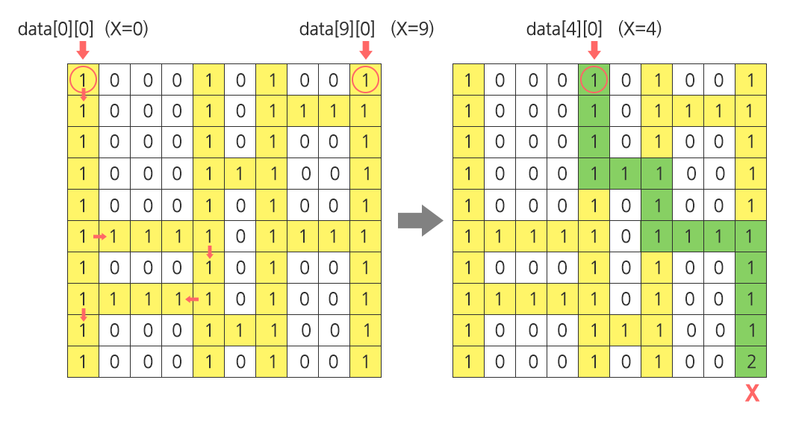

## 1210. [S/W 문제해결 기본] 2일차 - Ladder1

점심 시간에 산책을 다니는 사원들은 최근 날씨가 더워져, 사다리 게임을 통하여 누가 아이스크림을 구입할지 결정하기로 한다.

김 대리는 사다리타기에 참여하지 않는 대신 사다리를 그리기로 하였다.

사다리를 다 그리고 보니 김 대리는 어느 사다리를 고르면 X표시에 도착하게 되는지 궁금해졌다. 이를 구해보자.

아래 <그림 1>의 예를 살펴보면, 출발점 x=0 및 x=9인 세로 방향의 두 막대 사이에 임의의 개수의 막대들이 랜덤 간격으로 추가되고(이 예에서는 2개가 추가됨) 이 막대들 사이에 가로 방향의 선들이 또한 랜덤하게 연결된다.

X=0인 출발점에서 출발하는 사례에 대해서 화살표로 표시한 바와 같이, 아래 방향으로 진행하면서 좌우 방향으로 이동 가능한 통로가 나타나면 방향 전환을 하게 된다.

방향 전환 이후엔 다시 아래 방향으로만 이동하게 되며, 바닥에 도착하면 멈추게 된다.

문제의 X표시에 도착하려면 X=4인 출발점에서 출발해야 하므로 답은 4가 된다. 해당 경로는 별도로 표시하였다.




<그림 1> 사다리 게임에 대한 설명 (미니맵)


아래 <그림 2>와 같은 **100 x 100 크기의 2차원 배열로 주어진 사다리에 대해서, 지정된 도착점에 대응되는 출발점 X를 반환하는 코드를 작성하라** (‘0’으로 채워진 평면상에 사다리는 연속된 ‘1’로 표현된다. 도착 지점은 '2'로 표현된다).

 

<그림 2> 테스트 케이스에 의해 생성되는 실제 사다리의 모습


**[제약 사항]**

한 막대에서 출발한 가로선이 다른 막대를 가로질러서 연속하여 이어지는 경우는 없다.

**[입력]**

입력 파일의 첫 번째 줄에는 테스트 케이스의 번호가 주어지며, 바로 다음 줄에 테스트 케이스가 주어진다.

총 10개의 테스트 케이스가 주어진다.

**[출력]**

\#부호와 함께 테스트 케이스의 번호를 출력하고, 공백 문자 후 도착하게 되는 출발점의 x좌표를 출력한다.

```python
# 사다리 이동 로직
def move(ladder, point):
    row = point[0] - 1
    col = point[1]

    # 좌측 이동
    def moveleft(ladder, point):
        row = point[0]
        col = point[1] - 1

        while True:
            # 위쪽에 1이 있을 경우
            if ladder[row-1][col] == 1:
                return [row, col]

            col -= 1
    
    # 우측 이동
    def moveright(ladder, point):
        row = point[0]
        col = point[1] + 1
        
        while True:
            # 위쪽에 1이 있을 경우
            if ladder[row-1][col] == 1:
                return [row, col]
            
            col += 1

    while True:
        
        # 우측에 1이 있을 경우 moveright 함수로 이동
        if col != 99 and ladder[row][col+1] == 1:
            pos = moveright(ladder, [row, col])
            row, col = pos[0], pos[1]


        # 좌측에 1이 있을 경우 moveleft 함수로 이동
        elif col != 0 and ladder[row][col-1] == 1:
            pos = moveleft(ladder, [row, col])
            row, col = pos[0], pos[1]

        # 최상단에 도착한 경우
        elif row == 0:
            return [row, col]
        
        row -= 1


x = 0
while x < 10:
    T = int(input())

    # 사다리 리스트
    ladder = [list(map(int, input().split())) for _ in range(100)]

    # 도착 지점 위치
    goal = [99, 0]
    for i in range(100):
        if ladder[99][i] == 2:
            goal[1] = i
    
    # 사다리 이동 함수 (도착지점 -> 출발지점)
    point = move(ladder, goal)

    print(f'#{x+1} {point[1]}')

    x += 1
```

```
# input
1
1 0 0 1 0 0 0 0 0 0 0 0 1 0 0 0 0 0 1 0 1 0 0 0 0 0 0 0 0 0 0 1 0 0 0 0 0 1 0 0 0 ...
1 0 0 1 0 0 0 0 0 0 0 0 1 0 0 0 0 0 1 0 1 0 0 0 0 0 0 0 0 0 0 1 0 0 0 0 0 1 0 0 0 ...
1 0 0 1 1 1 1 1 1 1 1 1 1 0 0 0 0 0 1 0 1 0 0 0 0 0 0 0 0 0 0 1 0 0 0 0 0 1 0 0 0 ...
1 0 0 1 0 0 0 0 0 0 0 0 1 1 1 1 1 1 1 0 1 0 0 0 0 0 0 0 0 0 0 1 0 0 0 0 0 1 0 0 0 ...
1 0 0 1 0 0 0 0 0 0 0 0 1 0 0 0 0 0 1 0 1 0 0 0 0 0 0 0 0 0 0 1 0 0 0 0 0 1 0 0 0 ...
1 1 1 1 0 0 0 0 0 0 0 0 1 0 0 0 0 0 1 1 1 0 0 0 0 0 0 0 0 0 0 1 0 0 0 0 0 1 0 0 0 ...
1 0 0 1 0 0 0 0 0 0 0 0 1 0 0 0 0 0 1 0 1 0 0 0 0 0 0 0 0 0 0 1 0 0 0 0 0 1 0 0 0 ...
1 0 0 1 0 0 0 0 0 0 0 0 1 0 0 0 0 0 1 1 1 0 0 0 0 0 0 0 0 0 0 1 0 0 0 0 0 1 0 0 0 ...
1 0 0 1 0 0 0 0 0 0 0 0 1 0 0 0 0 0 1 0 1 0 0 0 0 0 0 0 0 0 0 1 1 1 1 1 1 1 0 0 0 ...
1 0 0 1 1 1 1 1 1 1 1 1 1 0 0 0 0 0 1 0 1 0 0 0 0 0 0 0 0 0 0 1 0 0 0 0 0 1 0 0 0 ...
1 0 0 1 0 0 0 0 0 0 0 0 1 0 0 0 0 0 1 0 1 0 0 0 0 0 0 0 0 0 0 1 0 0 0 0 0 1 0 0 0 ...
1 0 0 1 0 0 0 0 0 0 0 0 1 0 0 0 0 0 1 0 1 1 1 1 1 1 1 1 1 1 1 1 0 0 0 0 0 1 0 0 0 ...
1 0 0 1 0 0 0 0 0 0 0 0 1 1 1 1 1 1 1 0 1 0 0 0 0 0 0 0 0 0 0 1 0 0 0 0 0 1 0 0 0 ...
1 1 1 1 0 0 0 0 0 0 0 0 1 0 0 0 0 0 1 0 1 0 0 0 0 0 0 0 0 0 0 1 1 1 1 1 1 1 0 0 0 ...
1 0 0 1 0 0 0 0 0 0 0 0 1 0 0 0 0 0 1 0 1 0 0 0 0 0 0 0 0 0 0 1 0 0 0 0 0 1 0 0 0 ...
...

# output
#1 67
...
```

