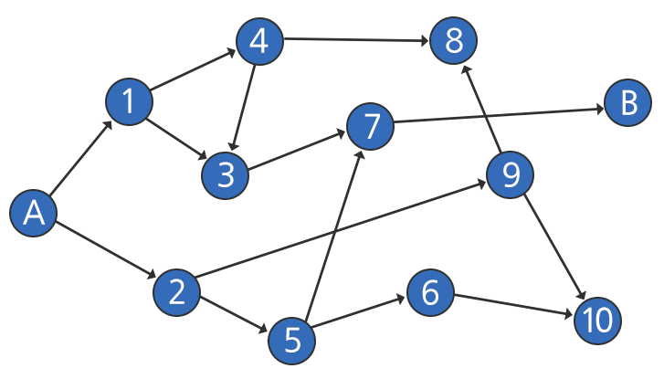

## 1219. [S/W 문제해결 기본] 4일차 - 길찾기

그림과 같이 도식화한 지도에서 A도시에서 출발하여 B도시로 가는 길이 존재하는지 조사하려고 한다.

길 중간 중간에는 최대 2개의 갈림길이 존재하고, 모든 길은 일방 통행으로 되돌아오는 것이 불가능하다.

다음과 같이 길이 주어질 때, A도시에서 B도시로 가는 길이 존재하는지 알아내는 프로그램을 작성하여라.

- A와 B는 숫자 0과 99으로 고정된다.

- 모든 길은 순서쌍으로 나타내어진다. 위 예시에서 2번에서 출발 할 수 있는 길의 표현은 (2, 5), (2, 9)로 나타낼 수 있다.

- 가는 길의 개수와 상관없이 한가지 길이라도 존재한다면 길이 존재하는 것이다.

- 단 화살표 방향을 거슬러 돌아갈 수는 없다.




**[제약 사항]**

출발점은 0, 도착점은 99으로 표현된다.

정점(분기점)의 개수는 98개(출발점과 도착점 제외)를 넘어가지 않으며, 한 개의 정점에서 선택할 수 있는 길의 개수도 2개를 넘어가지 않는다.

아래 제시된 가이드 라인은 제안사항일 뿐 강제사항은 아니다.

**[데이터 저장 가이드]**

정점(분기점)의 개수가 최대 100개 이기 때문에, size [100]의 정적 배열 2개을 선언하여, 각 정점의 번호를 주소로 사용하고, 저장되는 데이터는 각 정점에서 도착하는 정점의 번호를 저장한다.

위 그림을 저장하였을 때 결과는 다음과 같다.


**[입력]**

각 테스트 케이스의 첫 줄에는 테스트 케이스의 번호와 길의 총 개수가 주어지고 그 다음 줄에는 순서쌍이 주어진다.

순서쌍의 경우, 별도로 나누어 표현되는 것이 아니라 숫자의 나열이며, 나열된 순서대로 순서쌍을 이룬다.

**[출력]**

\#부호와 함께 테스트 케이스의 번호를 출력하고, 공백 문자 후 테스트 케이스에 대한 답을 출력한다.

```python
def find_route(nod):
    s = [nod]  # 스택 생성 및 시작점 추가

    while len(s) != 0:
        a = s.pop()  # 갈 수 있는 노드 중 하나 선택

        if a == 99:  # 만일 도착지점일 경우
            return 1

        # 방문 여부 확인
        if visited[a] == 0:  # 방문했던 노드는 pop()으로 이동하여 다음 노드진행
            visited[a] = 1  # 방문하지 않은 노드는 방문을 표시하고 밑의 로직 수행

            if adj[a] is None:  # 현재 노드로부터 갈 수 있는 노드가 없다면 skip
                continue
            else:               # 그렇지 않다면 갈 수 있는 노드 전부 스택에 추가
                for i in range(len(adj[a])):
                    s.append(adj[a][i])
    # 반복을 끝내고 나왔다면, 도착지점에 접근 불가
    return 0


x = 0
while x < 10:
    tc, e = map(int, input().split())  # 테스트케이스, 간선의 수 입력
    arr = list(map(int, input().split()))  # 간선 정보 입력

    adj = [[] for _ in range(100)]  # 인접 리스트 초기화
    visited = [0] * 100  # 방문 리스트 초기화

    # 인접 리스트 생성
    for i in range(0, len(arr), 2):
        start = arr[i]
        to = arr[i + 1]
        adj[start].append(to)
    
    # 결과 출력
    print('#{} {}'.format(tc, find_route(0)))
    x += 1
```

```
# input
1 16
0 1 0 2 1 4 1 3 4 8 4 3 2 9 2 5 5 6 5 7 7 99 7 9 9 8 9 10 6 10 3 7
2 159
0 4 0 10 1 4 1 10 2 11 2 8 3 13 4 8 4 11 5 10 5 8 6 10 6 11 7 8 7 15 8 14 9 10 9 20 10 14 10 17 11 21 12 21 13 14 13 17 14 20 15 22 16 22 16 20 17 19 18 28 18 29 19 27 20 29 21 31 21 30 22 24 22 30 23 24 23 26 24 27 25 31 26 31 26 37 27 34 27 30 28 38 28 30 29 32 30 38 30 32 31 35 31 36 32 34 32 37 33 40 33 44 34 44 35 39 35 46 36 38 36 41 37 40 38 40 38 49 39 41 39 44 40 45 41 44 41 50 42 44 42 51 43 45 43 52 44 45 44 52 45 48 45 52 46 47 46 55 47 48 47 58 48 53 49 55 50 59 50 60 51 57 51 60 52 60 52 63 53 57 53 62 54 62 54 65 55 62 56 58 57 66 58 64 58 61 59 69 60 62 61 63 62 68 62 64 63 66 64 68 64 71 65 75 65 67 66 75 66 73 67 71 67 72 68 72 68 70 69 72 70 71 70 80 71 80 72 81 72 83 73 77 73 75 74 83 74 78 75 81 75 85 76 79 76 82 77 86 77 87 78 86 78 81 79 89 80 84 80 86 81 83 81 88 82 87 82 86 83 86 83 94 84 94 84 88 85 95 86 91 86 97 87 93 88 92 88 90 89 97 89 92 90 99 91 95 92 96 92 97 94 95 95 97 95 99 96 97
........

# output
#1 1
#2 1
.......
```

