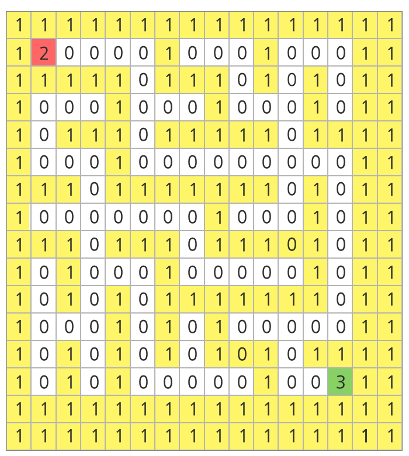
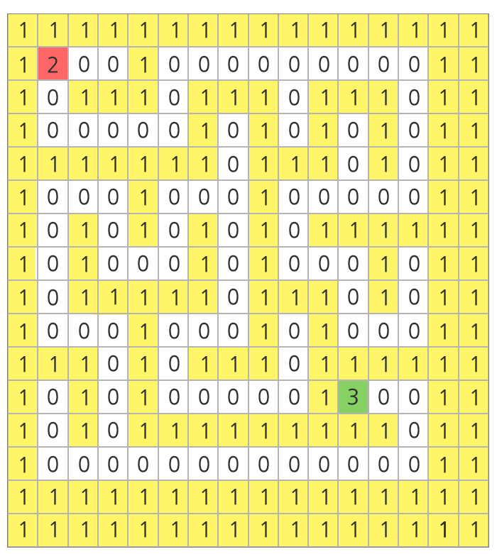

## 1226. [S/W 문제해결 기본] 7일차 - 미로1

아래 그림과 같은 미로가 있다. 16*16 행렬의 형태로 만들어진 미로에서 흰색 바탕은 길, 노란색 바탕은 벽을 나타낸다.

가장 좌상단에 있는 칸을 (0, 0)의 기준으로 하여, 가로방향을 x 방향, 세로방향을 y 방향이라고 할 때, 미로의 시작점은 (1, 1)이고 도착점은 (13, 13)이다.

주어진 미로의 출발점으로부터 도착지점까지 갈 수 있는 길이 있는지 판단하는 프로그램을 작성하라.

아래의 예시에서는 도달 가능하다.


  


아래의 예시에서는 출발점이 (1, 1)이고, 도착점이 (11, 11)이며 도달이 불가능하다.




**[입력]**

각 테스트 케이스의 첫 번째 줄에는 테스트 케이스의 번호가 주어지며, 바로 다음 줄에 테스트 케이스가 주어진다.

총 10개의 테스트케이스가 주어진다.

테스트 케이스에서 1은 벽을 나타내며 0은 길, 2는 출발점, 3은 도착점을 나타낸다.

**[출력]**

\#부호와 함께 테스트 케이스의 번호를 출력하고, 공백 문자 후 도달 가능 여부를 1 또는 0으로 표시한다 (1 - 가능함, 0 - 가능하지 않음).

```python
t = 0
while t < 10:
    tc = int(input())

    # 미로 입력
    maze = [[0] * 16 for _ in range(16)]
    for i in range(16):
        tmp = input()
        for j in range(16):
            maze[i][j] = int(tmp[j])

    # 시작 지점
    s = [[x, y] for x in range(16) for y in range(16) if maze[x][y] == 2]

    # 델타
    d = [[-1, 0], [1, 0], [0, 1], [0, -1]]

    # 결과값
    res = 0

    # 시작지점을 큐에 삽입하고 BFS
    q = []
    q.extend(s)

    while q and not res:
        point = q.pop(0)

        for delta in d:                 # 4방향 델타 탐색
            row = point[0] + delta[0]
            col = point[1] + delta[1]

            if maze[row][col] == 0:     # 갈수있는 길이면 큐에 삽입
                q.append([row, col])
                maze[row][col] = 1
            elif maze[row][col] == 3:   # 도착지점이면 결과값을 1로 수정하여 종료
                res = 1

    print('#{} {}'.format(tc, res))
    t += 1
```

```
# input
1
1111111111111111
1210000000100011
1010101110101111
1000100010100011
1111111010101011
1000000010101011
1011111110111011
1010000010001011
1010101111101011
1010100010001011
1010111010111011
1010001000100011
1011101111101011
1000100000001311
1111111111111111
1111111111111111
2
1111111111111111
1200000010000011
1011111011111011
1000001010000011
1110101010111011
1010101010100011
1011111010111111
1000001010000011
1011101011111011
1010101010000011
1010101010111111
1010100000130011
1010111111111011
1000000000000011
1111111111111111
1111111111111111
...

# output
#1 1
#2 1
...
```

