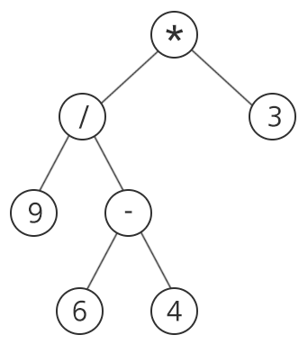

## 1232. [S/W 문제해결 기본] 9일차 - 사칙연산

사칙연산으로 구성되어 있는 식은 이진 트리로 표현할 수 있다. 아래는 식 “(9/(6-4))*3”을 이진 트리로 표현한 것이다.

임의의 정점에 연산자가 있으면 해당 연산자의 왼쪽 서브 트리의 결과와 오른쪽 서브 트리의 결과를 사용해서 해당 연산자를 적용한다.
 

 


사칙연산 “+, -, *, /”와 양의 정수로만 구성된 임의의 이진트리가 주어질 때, 이를 계산한 결과를 출력하는 프로그램을 작성하라.

단, 중간 과정에서의 연산은 실수 연산으로 하되, 최종 결과값이 정수로 떨어지지 않으면 정수부만 출력한다.

위의 예에서는 최종 결과값이 13.5이므로 13을 출력하면 된다.

**[제약 사항]**

정점의 총 수 N은 1≤N≤1000.

**[입력]**

각 테스트 케이스의 첫 줄에는 각 케이스의 트리가 갖는 정점의 총 수 N(1≤N≤1000)이 주어진다. 그 다음 N줄에 걸쳐 각각의 정점 정보가 주어진다.

정점이 단순한 수이면 정점번호와 해당 양의 정수가 주어지고, 정점이 연산자이면 정점번호, 연산자, 해당 정점의 왼쪽 자식, 오른쪽 자식의 정점번호가 차례대로 주어진다.

정점번호는 1부터 N까지의 정수로 구분된다. 입력에서 정점 번호를 매기는 특별한 규칙은 없으나, 루트 정점의 번호는 반드시 1이다.

입력에서 이웃한 수나 연산자는 모두 공백으로 구분된다.

위의 예시에서, 숫자 4가 7번 정점에 해당하면 “7 4”으로 주어지고, 연산자 ‘/’가 2번 정점에 해당하면 두 자식이 각각 숫자 9인 4번 정점과 연산자 ‘-’인 5번 정점이므로 “2 / 4 5”로 주어진다.

총 10개의 테스트 케이스가 주어진다.

**[출력]**

\#부호와 함께 테스트 케이스의 번호를 출력하고, 공백 문자 후 테스트 케이스에 대한 답을 출력한다. 답은 항상 정수값으로 기록한다.

```python
# 트리 계산 함수
def TreeCalc(idx):
    # tree의 idx 값이 문자값일 경우 / 숫자 값이면 그냥 패스
    if isinstance(tree[idx], str):
        TreeCalc(connect[idx][0])   # 좌측 자식 노드로 내려감
        TreeCalc(connect[idx][1])   # 우측 자식 노드로 내려감
        
        # 숫자인 애들 / null 값은 튕기고 마지막 리프 노드 위 연산자들부터 연산
        if tree[idx] == '+':
            tree[idx] = tree[connect[idx][0]] + tree[connect[idx][1]]
        elif tree[idx] == '-':
            tree[idx] = tree[connect[idx][0]] - tree[connect[idx][1]]
        elif tree[idx] == '*':
            tree[idx] = tree[connect[idx][0]] * tree[connect[idx][1]]
        elif tree[idx] == '/':
            tree[idx] = int(tree[connect[idx][0]] / tree[connect[idx][1]])


for tc in range(1, 11):
    n = int(input())

    tree = [0] * (n+1)
    connect = [[] for _ in range(n+1)]
    for _ in range(n):
        data = list(map(str, input().split()))
        
        # 연산자일 경우, 자식 노드 번호까지 저장
        if len(data) > 2:
            tree[int(data[0])] = data[1]
            connect[int(data[0])] = [int(data[2]), int(data[3])]
        
        # 숫자일 경우, 숫자만 저장
        else:
            tree[int(data[0])] = int(data[1])

    TreeCalc(1)
    print(f'#{tc} {tree[1]}')
```

```
# input
5
1 - 2 3
2 - 4 5
3 10
4 88
5 65
7
1 / 2 3
2 - 4 5
3 - 6 7
4 261
5 61
6 81
7 71
...

# output
#1 13
#2 20
...
```

