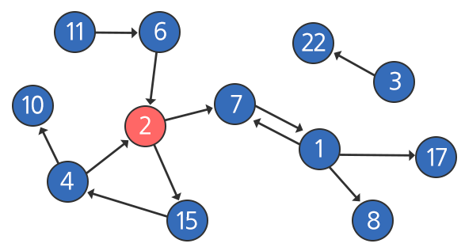
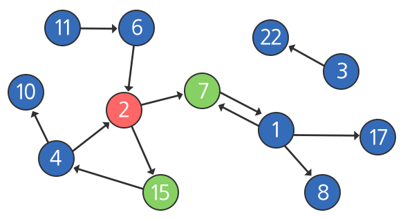
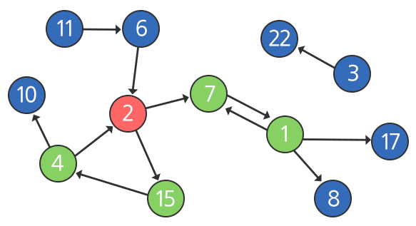
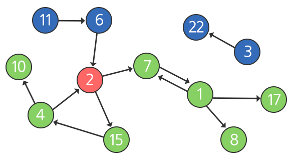

## 1238. [S/W 문제해결 기본] 10일차 - Contact

비상연락망과 연락을 시작하는 당번에 대한 정보가 주어질 때, 가장 나중에 연락을 받게 되는 사람 중 번호가 가장 큰 사람을 구하는 함수를 작성하시오.

**[예시]**

아래는 비상연락망을 나타낸 그림이다.
 



 
각 원은 개개인을 의미하며, 원 안의 숫자는 그사람의 번호를 나타내고 빨간원은 연락을 시작하는 당번을 의미한다.

화살표는 연락이 가능한 방향을 의미한다.

위의 예시에서는 7번과 1번은 서로 연락이 가능하다,

하지만 2번과 7번의 경우 2번은 7번에게 연락할 수 있지만 7번은 2번에게 연락할 수 없다.

비상연락망이 가동되면 아래 그림과 같이 연락을 시작하는 당번인 2번은 연락 가능한 7번과 15번에 동시에 연락을 취한다 (다자 간 통화를 사용한다고 가정).



 
그 다음 아래와 같이 7번은 1번에게, 15번은 4번에게 연락을 취한다 (이 과정은 동시에 일어난다고 가정한다).
 




그 다음 아래와 같이 1번은 8번과 17번에게 동시에 연락하며, 이와 동시에 4번은 10번에게 연락한다.

7번과 2번의 경우는 이미 연락을 받은 상태이기 때문에 다시 연락하지 않는다.
 




위의 모습이 연락이 끝난 마지막 모습이 되며, 마지막에 동시에 연락 받은 사람은 8번, 10번, 17번의 세 명이다.

이 중에서 가장 숫자가 큰 사람은 17번이므로 17을 반환하면 된다.
 
※ 3, 6, 11, 22번은 시간이 지나도 연락을 받지 못한다.
 
**[제약 사항]**

연락 인원은 최대 100명이며, 부여될 수 있는 번호는 1이상, 100이하이다.

단, 예시에서 5번이 존재하지 않듯이 중간 중간에 비어있는 번호가 있을 수 있다.

한 명의 사람이 다수의 사람에게 연락이 가능한 경우 항상 다자 간 통화를 통해 동시에 전달한다.

연락이 퍼지는 속도는 항상 일정하다 (전화를 받은 사람이 다음사람에게 전화를 거는 속도는 동일).

비상연락망 정보는 사전에 공유되며 한 번 연락을 받은 사람에게 다시 연락을 하는 일은 없다.

예시에서의 3, 6, 11, 22번과 같이 연락을 받을 수 없는 사람도 존재할 수 있다.
 
**[입력]**

입력의 첫 번째 줄에는 입력 받는 데이터의 길이와 시작점이 주어진다.

그 다음 줄에 입력받는 데이터는 {from, to, from, to, …} 의 순서로 해석되며 예시의 경우는 {2, 7, 11, 6, 6, 2, 2, 15, 15, 4, 4, 2, 4, 10, 7, 1, 1, 7, 1, 8, 1, 17, 3, 22}와 같다.

그런데 순서에는 상관이 없으므로 다음과 같이 주어진 인풋도 동일한 비상연락망을 나타낸다 (같은 비상연락망을 표현하는 다양한 인풋이 존재 가능하다).

{1, 17, 3, 22, 1, 8, 1, 7, 7, 1, 2, 7, 2, 15, 15, 4, 6, 2, 11, 6, 4, 10, 4, 2}

다음과 같이 동일한 {from, to}쌍이 여러 번 반복되는 경우도 있으며, 한 번 기록된 경우와 여러 번 기록된 경우의 차이는 없다.

{1, 17, 1, 17, 1, 17, 3, 22, 1, 8, 1, 7, 7, 1, 2, 7, 2, 15, 15, 4, 6, 2, 11, 6, 4, 10, 11, 6, 4, 2}

**[출력]**

\#부호와 함께 테스트 케이스의 번호를 출력하고, 공백 문자 후 테스트 케이스에 대한 답을 출력한다.

```python
def bfs(g, v):
    visited = [0] * 101
    visited[v] = True
    res = v
    q = [v]

    while q:
        res = max(q)
        size = len(q)
        for i in range(size):
            tmp = q.pop(0)
            for j in g[tmp]:
                if not visited[j]:
                    q.append(j)
                    visited[j] = True
    return res


for tc in range(1, 11):
    n, s = map(int, input().split())
    node = list(map(int, input().split()))

    arr = [[] for _ in range(101)]
    for i in range(n // 2):
        arr[node[i * 2]].append(node[i * 2 + 1])

    res = bfs(arr, s)

    print(f'#{tc} {res}')
```

**[구현 방법]**

1. 너비 우선 탐색 함수 구현
   - 연락 인원은 최대 100명이므로, 노드 방문 체크를 위한 `visited` 리스트와 간선의 정보를 담고있는 `arr` 리스트의 크기를 101로 선언
   - 결과 값 `res`와 `q` 큐 리스트에 초기 값으로 시작 노드 `v` 를 할당
   - `res` 값은 마지막에 연락된 인원 중 가장 큰 값임과 동시에 `q` 리스트가 언제 끝날지 모르니, 항상 최대값을 할당
   - `q`의 길이만큼 `for` 문을 순회
     - `q`에 들어있는 노드들이 각각 연결된 노드가 모두 다르므로, 노드별로 접근하기 위함
   - `tmp = q.pop(0)`로 하나의 노드를 꺼내 연결된 노드가 있는지 `g[tmp]` 리스트를 순회하며 탐색
     - 만약 연결이 되어있고, 아직 방문하지 않은 노드일 경우
     - 다음 탐색을 위해 `q` 리스트에 추가
     - 방문 표시를 위한 `visited[j] = True` 할당
2. `n, s` 값으로 node 정보의 길이와 시작 노드값을, `node` 리스트에는 방향성 정보를 포함한 노드의 간선 정보를 입력
3. `node` 정보대로 `arr`에 노드간의 연결상태 할당
   1. `arr`의 인덱스는 해당 노드의 번호이며 `arr[idx]`는 `idx` 번호에 대한 연결 노드 정보
4. 앞에서 선언한 `bfs 함수` (너비우선탐색 함수)를 통해 결과값 출력


```
# input
24 2
1 17 3 22 1 8 1 7 7 1 2 7 2 15 15 4 6 2 11 6 4 10 4 2
300 42
42 68 35 1 70 25 79 59 63 65 6 46 82 28 62 92 96 43 28 37 92 5 3 54 93 83 22 17 19 96 48 27 72 39 70 13 68 100 36 95 4 12 23 34 74 65 42 12 54 69 48 45 63 58 38 60 24 42 30 79 17 36 91 43 89 7 41 43 65 49 47 6 91 30 71 51 7 2 94 49 30 24 85 55 57 41 67 77 32 9 45 40 27 24 38 39 19 83 30 42 34 16 40 59 5 31 78 7 74 87 22 46 25 73 71 30 78 74 98 13 87 91 62 37 56 68 56 75 32 53 51 51 42 25 67 31 8 92 8 38 58 88 54 84 46 10 10 59 22 89 23 47 7 31 14 69 1 92 63 56 11 60 25 38 49 84 96 42 3 51 92 37 75 21 97 22 49 100 69 85 82 35 54 100 19 39 1 89 28 68 29 94 49 84 8 22 11 18 14 15 10 17 36 52 1 50 20 57 99 4 25 9 45 10 90 3 96 86 94 44 24 88 15 4 49 1 59 19 81 97 99 82 90 99 10 58 73 23 39 93 39 80 91 58 59 92 16 89 57 12 3 35 73 56 29 47 63 87 76 34 70 43 45 17 82 99 23 52 22 100 58 77 93 90 76 13 1 11 4 70 62 89 2 90 56 24 3 86 83 86 89 27 18 58 33 33 70 55 22 90
…
 
# output
#1 17
#2 96
…
```

