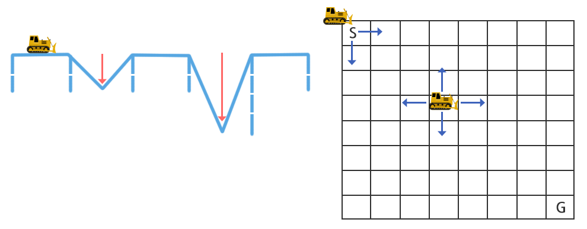
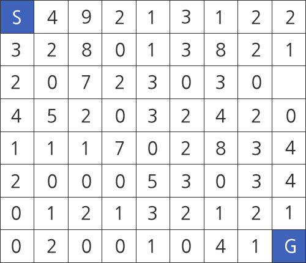
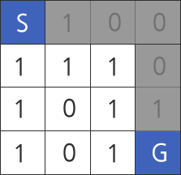

## 1249. [S/W 문제해결 응용] 4일차 - 보급로

2차 세계 대전에서 연합군과 독일군의 전투가 점점 치열해지고 있다.

전투가 진행중인 지역은 대규모 폭격과 시가전 등으로 인해 도로 곳곳이 파손된 상태이다.

그림 1(a)에서와 같이 도로들은 전투로 인해 트럭이나 탱크와 같은 차량들이 지날 갈 수 없다.

전투에서 승리하기 위해서는 기갑사단과 보급부대가 신속하게 이동하기 위한 도로가 있어야 한다.

공병대는 출발지(S) 에서 도착지(G)까지 가기 위한 도로 복구 작업을 빠른 시간 내에 수행하려고 한다.

도로가 파여진 깊이에 비례해서 복구 시간은 증가한다.

출발지에서 도착지까지 가는 경로 중에 복구 시간이 가장 짧은 경로에 대한 총 복구 시간을 구하시오.

깊이가 1이라면 복구에 드는 시간이 1이라고 가정한다.
 



​                       **그림 1 (a) 파손된 도로                               (b) 지도 형태와 이동 방향**


지도 정보는 그림1(b)와 같이 2차원 배열 형태로 표시된다.

출발지는 좌상단의 칸(S)이고 도착지는 우하단의 칸(G)가 된다.

이동 경로는 상하좌우 방향으로 진행할 수 있으며, 한 칸씩 움직일 수 있다.

지도 정보에는 각 칸마다 파여진 도로의 깊이가 주어진다. 현재 위치한 칸의 도로를 복구해야만 다른 곳으로 이동할 수 있다.
 




**그림 2 지도 정보**


이동하는 시간에 비해 복구하는데 필요한 시간은 매우 크다고 가정한다.

따라서, 출발지에서 도착지까지 거리에 대해서는 고려할 필요가 없다.

지도 정보는 그림2에서 보듯이 2차원 배열의 형태이다.

출발지(S)와 도착지(G)는 좌상단과 우하단이 되고 입력 데이터에서는 0으로 표시된다.

출발지와 도착지를 제외한 곳이 0인 것은 복구 작업이 불필요한 곳이다.

다음과 같은 지도에서 복구 작업 시간이 최소인 시간은 2이고 회색으로 칠해진 경로가 된다.
 




**[입력]**

가장 첫 줄은 전체 테스트케이스의 수이다.

각 테스트 케이스마다 지도의 크기(N x N)가 주어진다. 지도의 크기는 최대 100 x 100이다.

그 다음줄 부터 지도의 크기만큼 2차원 배열 형태의 지도 정보가 주어진다.
 
**[출력]**

각 테스트 케이스의 답을 순서대로 출력하며, 각 케이스마다 줄의 시작에 “#C”를 출력하여야 한다.

이때 C는 케이스의 번호이다.

같은 줄에 빈 칸을 하나 두고, 주어진 입력에서 출발지에서 도착지까지 가는 경로 중에 복구 작업에 드는 시간이 가장 작은 경로의 복구 시간을 출력하시오.


```python
from collections import deque


def bfs():
    deep = [[9999] * n for _ in range(n)]   # 깊이 최대치로 초기화
    deep[0][0] = 0                          # 시작 깊이는 0

    q = deque([(0, 0)])                     # 시작 좌표 입력

    while q:
        y, x = q.popleft()

        for d in delta:
            ny = y + d[0]
            nx = x + d[1]

            if 0 <= ny < n and 0 <= nx < n:     # 유효한 좌표일 경우
                gap = 0
                if arr[ny][nx] > 0:             # 구덩이가 존재할 경우
                    gap = arr[ny][nx]           # gap에 깊이 저장
                
                # 탐색한 값에 저장된 깊이가 전단계의 깊이 + gap보다 깊을 경우
                if deep[ny][nx] > deep[y][x] + gap:
                    # swap
                    deep[ny][nx] = deep[y][x] + gap
                    # 해당 좌표를 기준으로 다음 탐색 진행
                    q.append((ny, nx))
    
    # 도착지점 출력
    return deep[n-1][n-1]


for tc in range(1, int(input())+1):
    n = int(input())
    arr = [list(map(int, list(input()))) for _ in range(n)]

    delta = [[-1, 0], [1, 0], [0, 1], [0, -1]]
    res = bfs()

    print(f'#{tc} {res}')
```

```
# input
10
4
0100
1110
1011
1010
6
011001
010100
010011
101001
010101
111010
8
. . .

# output
#1 2
#2 2
. . .
```

