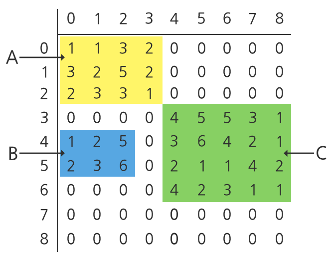

## 1258. [S/W 문제해결 응용] 7일차 - 행렬찾기

유엔 화학 무기 조사단이 대량 살상 화학 무기를 만들기 위해 화학 물질들이 저장된 창고를 조사하게 되었다.

창고에는 화학 물질 용기 n2개가 n x n으로 배열되어 있었다.

유엔 조사단은 각 용기를 조사하여 2차원 배열에 그 정보를 저장하였다.

빈 용기에 해당하는 원소는 ‘0’으로 저장하고, 화학 물질이 들어 있는 용기에 해당하는 용기는 화학 물질의 종류에 따라 ‘1’에서 ‘9’사이의 정수를 저장하였다.

다음 그림은 창고의 화학 물질 현황을 9x9 배열에 저장한 예를 보여준다.





유엔 조사단은 화학 물질이 담긴 용기들로부터 3가지 사항을 발견하였다.

\1. 화학 물질이 담긴 용기들이 사각형을 이루고 있다. 또한, 사각형 내부에는 빈 용기가 없다.

예를 들어, 위의 그림에는 3개의 화학 물질이 담긴 용기들로 이루어진 사각형 A, B, C가 있다.

\2. 화학 물질이 담긴 용기들로 이루어진 사각형들은 각각 차원(가로의 용기 수 x 세로의 용기 수)이 다르다.

예를 들어, 위의 그림에서 A는 3x4, B는 2x3, C는 4x5이다.

\3. 2개의 화학 물질이 담긴 용기들로 이루어진 사각형들 사이에는 빈 용기들이 있다.

예를 들어, 위의 그림에서 A와 B 사이와 B와 C 사이를 보면, 빈 용기를 나타내는 ‘0’ 원소들이 2개의 사각형 사이에 있는 것을 알 수 있다.

단, A와 C의 경우와 같이 대각선 상으로는 빈 용기가 없을 수도 있다.

유엔 조사단은 창고의 용기들에 대한 2차원 배열에서 행렬(화학 물질이 든 용기들로 이루어진 사각형)들을 찾아내고 정보를 수집하고자 한다.

찾아낸 행렬들의 정보를 출력하는 프로그램을 작성하시오.

**[제약 사항]**

n은 100 이하이다.

부분 행렬의 열의 개수는 서로 다르며 행렬의 행의 개수도 서로 다르다.

예를 들어, 3개의 부분행렬 행렬 (A(3x4), B(2x3), C(4x5))이 추출되었다면, 각 부분 행렬의 행의 수는 3, 2, 4로 서로 다르다.

마찬가지로 각 부분 행렬의 열의 수도 4, 3, 5로 서로 다르다.

테스트 케이스는 여러 개의 그룹으로 구성되며 아래와 같다.
그룹 1. n <= 10 이고 sub matrix의 개수 5개 이하
그룹 2. n <= 40 이고 5 < sub matrix <= 10
그룹 3. 40 < n <=80 이고 5 < sub matrix <= 10
그룹 4. 40 < n <=80 이고 10 < sub matrix <= 15
그룹 5. 80 < n<=100 이고 15 < sub matrix <= 20

**[입력]**

맨 첫 줄에는 테스트 케이스의 개수가 주어진다.

그리고 테스트 케이스가 각 라인에 주어진다.

각 테스트 케이스는 (n+1) 줄로 구성되며, 첫 줄에는 양의 정수인 n이 주어지고, 다음 n줄에는 n x n 행렬이 (각 행이 한 줄에) 주어진다.

**[출력]**

각 테스트 케이스 각각에 대한 답을 출력한다.

각 줄은 ‘#x’로 시작하고 공백을 하나 둔 다음, 각 테스트 케이스에 주어진 행렬에서 추출된 부분 행렬들을 개수와 그 뒤를 이어 행렬들의 행과 열의 크기를 출력한다.

크기는 행과 열을 곱한 값으로, 크기가 작은 순서대로 출력한다.

예를 들어 3x4 행렬의 크기는 3*4 = 12 이다.

크기가 같을 경우 행이 작은 순으로 출력한다.

예를 들어 12x4, 8x6 두 개의 행렬은 같은 크기이고 행은 각각 12, 8 이므로 8 6 12 4 순으로 출력한다.


```python
T = int(input())
t = 0
while t < T:
    n = int(input())
    arr = [list(map(int, input().split())) for _ in range(n)]

    box_cnt = 0     # 내부 행렬 개수
    xy = []         # 내부 행렬 크기를 저장하기 위한 리스트
    
    # 전체 행렬 순회
    for i in range(n):
        for j in range(n):
            
            # 0이 아닌 자리를 만날 경우
            if arr[i][j]:
                row_cnt = 0
                col_cnt = 0

                row = i
                col = j
                
                # 0을 만날때까지 행 증가
                while arr[row][j]:
                    row_cnt += 1
                    row += 1
                # 0을 만날때까지 열 증가
                while arr[i][col]:
                    col_cnt += 1
                    col += 1
                # 0을 만난 시점의 행, 열 인덱스까지 0으로 초기화
                for sub_i in range(i, row):
                    for sub_j in range(j, col):
                        arr[sub_i][sub_j] = 0
                # 카운트한 행과 열의 크기 저장 및 내부 행렬 개수 +1
                xy.append((row_cnt, col_cnt))
                box_cnt += 1
    
    # xy 정렬
    # 튜플의 0번째와 1번째를 곱한 값으로 오름차순 정렬하며 같을 경우, 튜플의 0번째 값을 오름차순으로 정렬
    xy.sort(key=lambda x: (x[0] * x[1], x[0]))  

    print('#{} {}'.format(t+1, box_cnt), end=' ')
    for x, y in xy:
        print(x, y, end=' ')
    print()
    t += 1
```

```
# input
10
9
1 1 3 2 0 0 0 0 0
3 2 5 2 0 0 0 0 0
2 3 3 1 0 0 0 0 0
0 0 0 0 4 5 5 3 1
1 2 5 0 3 6 4 2 1
2 3 6 0 2 1 1 4 2
0 0 0 0 4 2 3 1 1
0 0 0 0 0 0 0 0 0
0 0 0 0 0 0 0 0 0
4
1 2 0 0
0 0 0 0
9 4 2 0
1 7 3 0
…

# output
#1 3 2 3 3 4 4 5
#2 2 1 2 2 3
…
```

