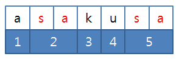

## 3143. 가장 빠른 문자열 타이핑

어떤 문자열 A를 타이핑하려고 한다.

그냥 한 글자씩 타이핑 한다면 A의 길이만큼 키를 눌러야 할 것이다.

여기에 속도를 조금 더 높이기 위해 어떤 문자열 B가 저장되어 있어서 키를 한번 누른 것으로 B전체를 타이핑 할 수 있다.

이미 타이핑 한 문자를 지우는 것은 불가능하다.

예를 들어 A=”asakusa”, B=”sa”일 때, 다음 그림과 같이 B를 두 번 사용하면 5번 만에 A를 타이핑 할 수 있다.



A와 B가 주어질 때 A 전체를 타이핑 하기 위해 키를 눌러야 하는 횟수의 최솟값을 구하여라.


**[입력]**

첫 번째 줄에 테스트 케이스의 수 T가 주어진다.

각 테스트 케이스마다 첫 번째 줄에 두 문자열 A, B가 주어진다. A의 길이는 1이상 10,000이하, B의 길이는 1이상 100이하이다.


**[출력]**

각 테스트 케이스마다 A 전체를 타이핑 하기 위해 키를 눌러야 하는 횟수의 최솟값을 출력한다.

```python
T = int(input())
x = 0
while x < T:
    a, b = map(str, input().split())
    # a 문자열에서 b 문자열이 등장하는 횟수
    macro = a.count(b)

    # 타이핑 회수 계산
    # 전체 문자열 길이 - b 문자열의 반복 길이 + b 문자열 등장횟수
    result = len(a) - (len(b) * macro) + macro

    print('#{} {}'.format(x+1, result))
    x += 1
```

```
# input
2              //Test Case의 개수
banana bana    //A=”banana”, B=”bana”
asakusa sa	   //A=”asakusa”, B=”sa”

# output

#1 3    //Test Case 1번의 답
#2 5	//Test Case 2번의 답
```

