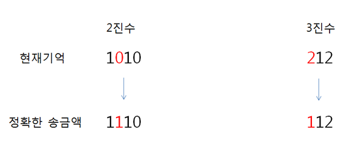

## 4366. 정식이의 은행업무

삼성은행의 신입사원 정식이는 실수를 저질렀다.

은행 업무가 마감되기 직전인 지금, 송금할 금액을 까먹고 말았다.

하지만 다행스럽게도 정식이는 평소 금액을 2진수와 3진수의 두 가지 형태로 기억하고 다니며, 기억이 명확하지 않은 지금조차 2진수와 3진수 각각의 수에서 단 한 자리만을 잘못 기억하고 있다는 것만은 알고 있다. 

예를 들어 현재 기억이 2진수 1010과 3진수 212을 말해주고 있다면 이는 14의 2진수인 1110와 14의 3진수인 112를 잘못 기억한 것이라고 추측할 수 있다.

정식이는 실수를 바로잡기 위해 당신에게 부탁을 하였다.

정식이가 송금액을 추측하는 프로그램을 만들어주자.

( 단, 2진수와 3진수의 값은 무조건 1자리씩 틀리다.  추측할 수 없는 경우는 주어지지 않는다. )




**[입력]**

10개 이하의 테스트 케이스가 주어진다.

첫 번째 줄에는 테스트케이스의 개수가 주어진다.

하나의 케이스는 두 줄로 되어있다.

각 케이스의 첫 번째 줄은 정식이가 기억하는 송금액의 2진수 표현, 두 번째 줄은 송금액의 3진수 표현이 주어진다.  

(3 ≤ 2진수, 3진수의 자릿수 <40)


**[출력]**

원래 송금하기로 하였던 금액을 케이스마다 한 줄에 하나씩 출력한다.

```python
for tc in range(1, int(input()) + 1):
    binary = input()
    ternary = input()

    n = len(binary)
    m = len(ternary)

    tmp_b = []
    btod = int(binary, 2)   # 2진수 -> 10진수

    # 2진수 찾기
    # 한 자리만 잘못된 숫자를 XOR 연산을 통해 모든 경우의 숫자 리스트에 저장
    for i in range(n):
        tmp_b.append(btod ^ (1 << i))

    # 3진수 찾기
    idx = 0         # 3진수 숫자 인덱스
    res = False     # 결과 값 저장
    while idx < m:  # 3진수 길이만큼 인덱스 순회
        t_list = list(ternary)  # 문자열 -> 리스트 변환

        for i in range(3):                  # 0, 1, 2를 할당
            t_list[idx] = str(i)            # idx번째 3진수를 i로 변환
            tmp_t = int(''.join(t_list), 3) # 해당 리스트를 합쳐서 10진수로 변환
            # print(tmp_t)

            if tmp_t in tmp_b:              # 만일 2진수 리스트에 존재한다면
                res = tmp_t                 # 결과 값에 저장
        if res:
            break
        idx += 1

    print(f'#{tc} {res}')
```

```
# input
1
1010
212

# output
#1 14
```

