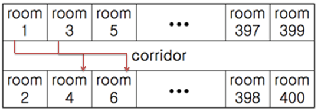

## 4408. 자기 방으로 돌아가기

고등학교 학생들이 학교에서 수련회를 갔다. 수련회에 간 학생들은 친구들과 음주가무를 즐기다가 밤 12시가 되자 조교들의 눈을 피해 자기방으로 돌아가려고 한다.

제 시간에 자기방으로 돌아가지 못한 학생이 한 명이라도 발견되면 큰일나기 때문에 최단 시간에 모든 학생이 자신의 방으로 돌아가려고 한다.

숙소는 긴 복도를 따라 총 400개의 방이 다음과 같이 배열되어 있다.

 

모든 학생들은 현재 위치에서 자신의 방으로 돌아가려고 하는데, 만약 두 학생이 자기방으로 돌아가면서 지나는 복도의 구간이 겹치면 두 학생은 동시에 돌아갈 수 없다.

예를 들어 (방1 -> 4) 와 (방3 -> 6) 은 복도 구간이 겹치므로 한 사람은 기다렸다가 다음 차례에 이동해야 한다. 이동하는 데에는 거리에 관계없이 단위 시간이 걸린다고 하자.

각 학생들의 현재 방 위치와 돌아가야 할 방의 위치의 목록이 주어질 때, 최소 몇 단위시간만에 모든 학생들이 이동할 수 있는지를 구하시오.


**[입력]**
입력은 T(≤10)개의 테스트 케이스로 되어 있다. 각 테스트 케이스의 첫 줄에는 돌아가야 할 학생들의 수 N이 주어진다.

다음 N 줄에는 각 학생의 현재 방 번호(≤400)와 돌아가야 할 방의 번호(≤400)가 주어진다. 주어지는 2N개의 방 번호 중 중복되는 것은 없다.

**[출력]**
테스트 케이스 T에 대한 결과는 “#T ”을 찍고, 각 테스트 케이스마다 필요한 시간을 한 줄에 하나씩 출력한다.

```python
T = int(input())
t = 0
while t < T:
    # 학생수 입력
    N = int(input())

    # 짝수 방, 홀수 방 인덱스 정리
    std = []
    for _ in range(N):
        now, togo = map(int, input().split())
        now, togo = (now - 1) // 2, (togo - 1) // 2

        # 무조건 현재 방이 작은 방이 아니였음, 대소 비교해서 숫자가 작은방을 앞으로
        if now > togo:
            std += [[togo, now]]
        else:
            std += [[now, togo]]

    # 카운트 시작
    max_cnt = 1

    # 400개 방/2 만큼 순회
    for i in range(200):            # 방 앞 복도라 생각하면 수월
        cnt = 0
        for st in std:              # 학생들이 들어갈 방을 2개씩 보자

            # 만약 학생의 현재방, 잠자는 방 사이인 i번째 복도를 지나면 cnt + 1
            if st[0] <= i <= st[1]:
                cnt += 1

        # 여러명이 해당 번호의 복도를 지나면 cnt가 1 이상으로 커짐 (해당 복도 지나는 학생은 cnt명)
        # 무조건 cnt 그 횟수 이상만큼 들어가야함 ㅆㅃ 드디어 풀었네 ㅆㅃ
        if max_cnt < cnt:
            max_cnt = cnt

    print(f'#{t+1} {max_cnt}')
    t += 1
```

```
# input
3  		// T : 테스트케이스 수
4  		// N : 돌아가야 할 학생들의 수
10 20 	// 10 : 현재 방, 20 : 돌아갈 방
30 40
50 60
70 80
2 		// 두번째 테스트케이스의 N
1 3
2 200
3
10 100
20 80
30 50

# output
#1 1
#2 2
#3 3
```

