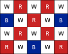
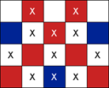
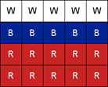

## 4613. 러시아 국기 같은 깃발

2016년은 삼성전자가 러시아 현지법인을 설립한지 20주년이 된 해이다. 이를 기념해서 당신은 러시아 국기를 만들기로 했다.

먼저 창고에서 오래된 깃발을 꺼내왔다. 이 깃발은 N행 M열로 나뉘어 있고, 각 칸은 흰색, 파란색, 빨간색 중 하나로 칠해져 있다.

당신은 몇 개의 칸에 있는 색을 다시 칠해서 이 깃발을 러시아 국기처럼 만들려고 한다. 다음의 조건을 만족해야 한다.

- 위에서 몇 줄(한 줄 이상)은 모두 흰색으로 칠해져 있어야 한다.
- 다음 몇 줄(한 줄 이상)은 모두 파란색으로 칠해져 있어야 한다.
- 나머지 줄(한 줄 이상)은 모두 빨간색으로 칠해져 있어야 한다.


이렇게 러시아 국기 같은 깃발을 만들기 위해서 새로 칠해야 하는 칸의 개수의 최솟값을 구하여라.


      

첫 번째 예제이다. 왼쪽에 있는 그림이 입력이다. 중간에 있는 그림에 X가 적힌 칸들을 새롭게 색칠하여 오른쪽에 있는 그림과 같은 깃발을 만들면 최적이다.


**[입력]**

첫 번째 줄에 테스트 케이스의 수 T가 주어진다.

각 테스트 케이스의 첫 번째 줄에는 두 정수 N,M(3≤N,M≤50)이 공백으로 구분되어 주어진다.

다음 N개의 줄에는 M개의 문자로 이루어진 문자열이 주어진다. i번 째 줄의 j번째 문자는 깃발에서 i번째 행 j번째 열인 칸의 색을 의미한다.

‘W’는 흰색, ‘B’는 파란색, ‘R’은 빨간색을 의미한다. ‘W’, ‘B’, ‘R’외의 다른 문자는 입력되지 않는다.


**[출력]**

각 줄마다 "#T" (T는 테스트 케이스 번호)를 출력한 뒤, 러시아 국기 같은 깃발을 만들기 위해서 새로 칠해야 하는 칸의 개수의 최솟값을 구하여 T 줄에 걸쳐서 출력한다.

```python
# 첫번째 풀이

def perm(idx, sub_sum):
    global ans
    # 유망성 검사
    # 아래의 조건문에 걸리게 되면
    # 이후 작업은 의미가 없음
    if sub_sum > n:
        return

    if idx == 3:
        if sub_sum == n:
            cnt = 0
            st = sel[0]
            st2 = st + sel[1]

            # 흰색 칠하기
            for i in flag[:st]:
                for j in i:
                    if j != 'W':
                        cnt += 1

            # 파란색 칠하기
            for i in flag[st:st2]:
                for j in i:
                    if j != 'B':
                        cnt += 1

            # 빨간색 칠하기
            for i in flag[st2:]:
                for j in i:
                    if j != 'R':
                        cnt += 1

            if ans > cnt:
                ans = cnt
        return

    # 중복순열 살짝 응용
    for i in range(1, n - 1):
        sel[idx] = i
        perm(idx + 1, sub_sum + i)

T = int(input())
t = 0
while t < T:
    n, m = map(int, input().split())

    flag = [list(input()) for _ in range(n)]

    sel = [0] * 3  # 흰 빨 파
    ans = 9999999

    # idx, 중간 합
    perm(0, 0)

    print('#{} {}'.format(t + 1, ans))
    t += 1

########################################################################
# 두번째 풀이

for tc in range(1, int(input()) + 1):
    n, m = map(int, input().split())

    flag = [input() for _ in range(n)]

    W = [0] * n
    B = [0] * n
    R = [0] * n

    # 행을 보면서 나와 다른 색깔의 개수를 카운팅
    for i in range(n):
        for j in range(m):
            if flag[i][j] != 'W':
                W[i] += 1
            if flag[i][j] != 'B':
                B[i] += 1
            if flag[i][j] != 'R':
                R[i] += 1

    # 누적
    for i in range(1, n):
        W[i] += W[i-1]
        B[i] += B[i-1]
        R[i] += R[i-1]

    ans = 9999999

    # 각 줄별로 색깔 합을 비교하여 총 합산
    for i in range(n-2):
        for j in range(i+1, n-1):
            w_cnt = W[i]			# 흰색은 적어도 2줄은 남겨야 함
            b_cnt = B[j] - B[i]		# 파랑은 흰색이 끝나는 지점부터 한줄이 남는 지점까지
            r_cnt = R[n-1] - R[j]	# 빨간색은 파란색이 끝나는 지점부터 마지막 지점까지

            if ans > w_cnt + b_cnt + r_cnt:
                ans = w_cnt + b_cnt + r_cnt

    print('#{} {}'.format(tc, ans))
```

```
# input
2
4 5
WRWRW
BWRWB
WRWRW
RWBWR
6 14
WWWWWWWWWWWWWW
WWRRWWBBBBBBWW
WRRRWWWBWWWWRB
WWBWBWWWBWRRRR
WBWBBWWWBBWRRW
WWWWWWWWWWWWWW

# output
#1 11
#2 44
```

