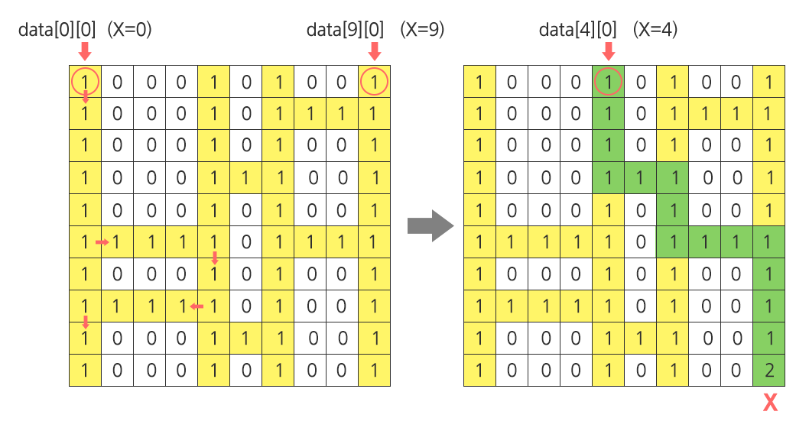
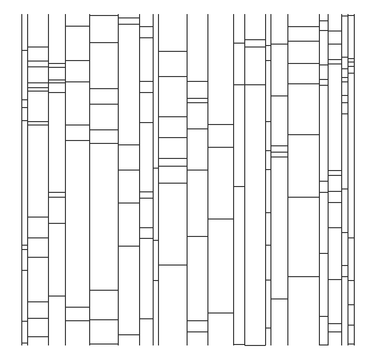
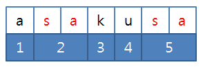
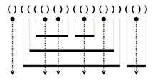
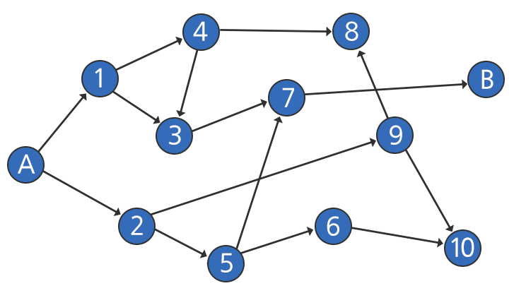
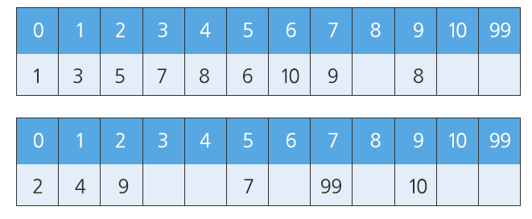
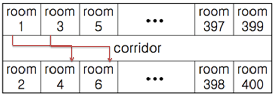
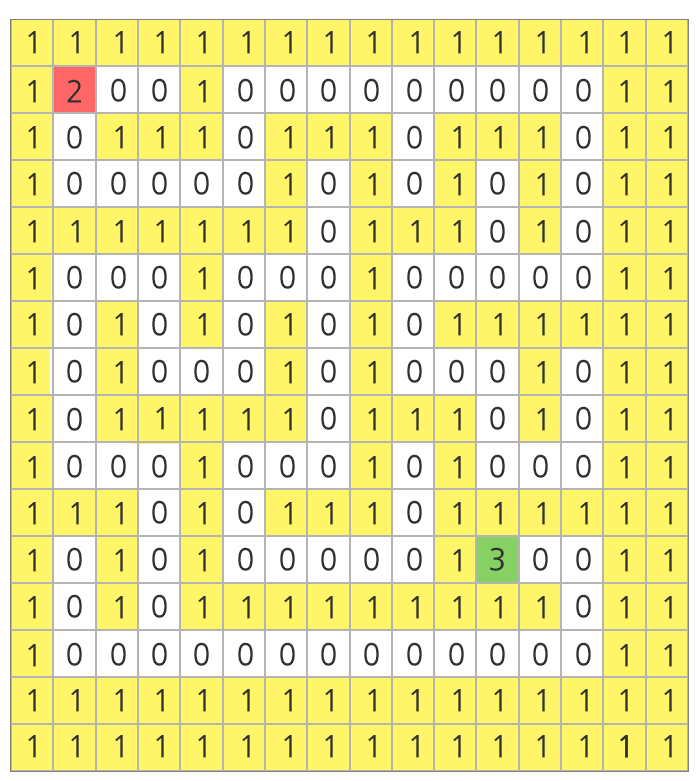
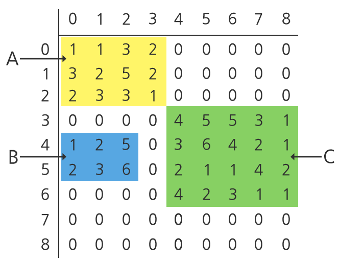

# D4

## [S/W 문제해결 기본] 2일차 - Ladder1

점심 시간에 산책을 다니는 사원들은 최근 날씨가 더워져, 사다리 게임을 통하여 누가 아이스크림을 구입할지 결정하기로 한다.

김 대리는 사다리타기에 참여하지 않는 대신 사다리를 그리기로 하였다.

사다리를 다 그리고 보니 김 대리는 어느 사다리를 고르면 X표시에 도착하게 되는지 궁금해졌다. 이를 구해보자.

아래 <그림 1>의 예를 살펴보면, 출발점 x=0 및 x=9인 세로 방향의 두 막대 사이에 임의의 개수의 막대들이 랜덤 간격으로 추가되고(이 예에서는 2개가 추가됨) 이 막대들 사이에 가로 방향의 선들이 또한 랜덤하게 연결된다.

X=0인 출발점에서 출발하는 사례에 대해서 화살표로 표시한 바와 같이, 아래 방향으로 진행하면서 좌우 방향으로 이동 가능한 통로가 나타나면 방향 전환을 하게 된다.

방향 전환 이후엔 다시 아래 방향으로만 이동하게 되며, 바닥에 도착하면 멈추게 된다.

문제의 X표시에 도착하려면 X=4인 출발점에서 출발해야 하므로 답은 4가 된다. 해당 경로는 별도로 표시하였다.




<그림 1> 사다리 게임에 대한 설명 (미니맵)


아래 <그림 2>와 같은 **100 x 100 크기의 2차원 배열로 주어진 사다리에 대해서, 지정된 도착점에 대응되는 출발점 X를 반환하는 코드를 작성하라** (‘0’으로 채워진 평면상에 사다리는 연속된 ‘1’로 표현된다. 도착 지점은 '2'로 표현된다).

 

<그림 2> 테스트 케이스에 의해 생성되는 실제 사다리의 모습


**[제약 사항]**

한 막대에서 출발한 가로선이 다른 막대를 가로질러서 연속하여 이어지는 경우는 없다.

**[입력]**

입력 파일의 첫 번째 줄에는 테스트 케이스의 번호가 주어지며, 바로 다음 줄에 테스트 케이스가 주어진다.

총 10개의 테스트 케이스가 주어진다.

**[출력]**

\#부호와 함께 테스트 케이스의 번호를 출력하고, 공백 문자 후 도착하게 되는 출발점의 x좌표를 출력한다.

```python
# 사다리 이동 로직
def move(ladder, point):
    row = point[0] - 1
    col = point[1]

    # 좌측 이동
    def moveleft(ladder, point):
        row = point[0]
        col = point[1] - 1

        while True:
            # 위쪽에 1이 있을 경우
            if ladder[row-1][col] == 1:
                return [row, col]

            col -= 1
    
    # 우측 이동
    def moveright(ladder, point):
        row = point[0]
        col = point[1] + 1
        
        while True:
            # 위쪽에 1이 있을 경우
            if ladder[row-1][col] == 1:
                return [row, col]
            
            col += 1

    while True:
        
        # 우측에 1이 있을 경우 moveright 함수로 이동
        if col != 99 and ladder[row][col+1] == 1:
            pos = moveright(ladder, [row, col])
            row, col = pos[0], pos[1]


        # 좌측에 1이 있을 경우 moveleft 함수로 이동
        elif col != 0 and ladder[row][col-1] == 1:
            pos = moveleft(ladder, [row, col])
            row, col = pos[0], pos[1]

        # 최상단에 도착한 경우
        elif row == 0:
            return [row, col]
        
        row -= 1


x = 0
while x < 10:
    T = int(input())

    # 사다리 리스트
    ladder = [list(map(int, input().split())) for _ in range(100)]

    # 도착 지점 위치
    goal = [99, 0]
    for i in range(100):
        if ladder[99][i] == 2:
            goal[1] = i
    
    # 사다리 이동 함수 (도착지점 -> 출발지점)
    point = move(ladder, goal)

    print(f'#{x+1} {point[1]}')

    x += 1
```

```
# input
1
1 0 0 1 0 0 0 0 0 0 0 0 1 0 0 0 0 0 1 0 1 0 0 0 0 0 0 0 0 0 0 1 0 0 0 0 0 1 0 0 0 ...
1 0 0 1 0 0 0 0 0 0 0 0 1 0 0 0 0 0 1 0 1 0 0 0 0 0 0 0 0 0 0 1 0 0 0 0 0 1 0 0 0 ...
1 0 0 1 1 1 1 1 1 1 1 1 1 0 0 0 0 0 1 0 1 0 0 0 0 0 0 0 0 0 0 1 0 0 0 0 0 1 0 0 0 ...
1 0 0 1 0 0 0 0 0 0 0 0 1 1 1 1 1 1 1 0 1 0 0 0 0 0 0 0 0 0 0 1 0 0 0 0 0 1 0 0 0 ...
1 0 0 1 0 0 0 0 0 0 0 0 1 0 0 0 0 0 1 0 1 0 0 0 0 0 0 0 0 0 0 1 0 0 0 0 0 1 0 0 0 ...
1 1 1 1 0 0 0 0 0 0 0 0 1 0 0 0 0 0 1 1 1 0 0 0 0 0 0 0 0 0 0 1 0 0 0 0 0 1 0 0 0 ...
1 0 0 1 0 0 0 0 0 0 0 0 1 0 0 0 0 0 1 0 1 0 0 0 0 0 0 0 0 0 0 1 0 0 0 0 0 1 0 0 0 ...
1 0 0 1 0 0 0 0 0 0 0 0 1 0 0 0 0 0 1 1 1 0 0 0 0 0 0 0 0 0 0 1 0 0 0 0 0 1 0 0 0 ...
1 0 0 1 0 0 0 0 0 0 0 0 1 0 0 0 0 0 1 0 1 0 0 0 0 0 0 0 0 0 0 1 1 1 1 1 1 1 0 0 0 ...
1 0 0 1 1 1 1 1 1 1 1 1 1 0 0 0 0 0 1 0 1 0 0 0 0 0 0 0 0 0 0 1 0 0 0 0 0 1 0 0 0 ...
1 0 0 1 0 0 0 0 0 0 0 0 1 0 0 0 0 0 1 0 1 0 0 0 0 0 0 0 0 0 0 1 0 0 0 0 0 1 0 0 0 ...
1 0 0 1 0 0 0 0 0 0 0 0 1 0 0 0 0 0 1 0 1 1 1 1 1 1 1 1 1 1 1 1 0 0 0 0 0 1 0 0 0 ...
1 0 0 1 0 0 0 0 0 0 0 0 1 1 1 1 1 1 1 0 1 0 0 0 0 0 0 0 0 0 0 1 0 0 0 0 0 1 0 0 0 ...
1 1 1 1 0 0 0 0 0 0 0 0 1 0 0 0 0 0 1 0 1 0 0 0 0 0 0 0 0 0 0 1 1 1 1 1 1 1 0 0 0 ...
1 0 0 1 0 0 0 0 0 0 0 0 1 0 0 0 0 0 1 0 1 0 0 0 0 0 0 0 0 0 0 1 0 0 0 0 0 1 0 0 0 ...
...

# output
#1 67
...
```


## 3143. 가장 빠른 문자열 타이핑

어떤 문자열 A를 타이핑하려고 한다.

그냥 한 글자씩 타이핑 한다면 A의 길이만큼 키를 눌러야 할 것이다.

여기에 속도를 조금 더 높이기 위해 어떤 문자열 B가 저장되어 있어서 키를 한번 누른 것으로 B전체를 타이핑 할 수 있다.

이미 타이핑 한 문자를 지우는 것은 불가능하다.

예를 들어 A=”asakusa”, B=”sa”일 때, 다음 그림과 같이 B를 두 번 사용하면 5번 만에 A를 타이핑 할 수 있다.



A와 B가 주어질 때 A 전체를 타이핑 하기 위해 키를 눌러야 하는 횟수의 최솟값을 구하여라.


**[입력]**

첫 번째 줄에 테스트 케이스의 수 T가 주어진다.

각 테스트 케이스마다 첫 번째 줄에 두 문자열 A, B가 주어진다. A의 길이는 1이상 10,000이하, B의 길이는 1이상 100이하이다.


**[출력]**

각 테스트 케이스마다 A 전체를 타이핑 하기 위해 키를 눌러야 하는 횟수의 최솟값을 출력한다.

```python
T = int(input())
x = 0
while x < T:
    a, b = map(str, input().split())
    # a 문자열에서 b 문자열이 등장하는 횟수
    macro = a.count(b)

    # 타이핑 회수 계산
    # 전체 문자열 길이 - b 문자열의 반복 길이 + b 문자열 등장횟수
    result = len(a) - (len(b) * macro) + macro

    print('#{} {}'.format(x+1, result))
    x += 1
```

```
# input
2              //Test Case의 개수
banana bana    //A=”banana”, B=”bana”
asakusa sa	   //A=”asakusa”, B=”sa”

# output

#1 3    //Test Case 1번의 답
#2 5	//Test Case 2번의 답
```


## 5432. 쇠막대기 자르기

여러 개의 쇠막대기를 레이저로 절단하려고 한다.

효율적인 작업을 위해서 쇠막대기를 아래에서 위로 겹쳐 놓고, 레이저를 위에서 수직으로 발사하여 쇠막대기들을 자른다.

쇠막대기와 레이저의 배치는 다음 조건을 만족한다.

 - 쇠막대기는 자신보다 긴 쇠막대기 위에만 놓일 수 있다.

 - 쇠막대기를 다른 쇠막대기 위에 놓는 경우 완전히 포함되도록 놓되, 끝점은 겹치지 않도록 놓는다.

 - 각 쇠막대기를 자르는 레이저는 적어도 하나 존재한다.

 - 레이저는 어떤 쇠막대기의 양 끝점과도 겹치지 않는다.

아래 그림은 위 조건을 만족하는 예를 보여준다.

수평으로 그려진 굵은 실선은 쇠막대기이고, 점은 레이저의 위치, 수직으로 그려진 점선 화살표는 레이저의 발사 방향이다.

 

이러한 레이저와 쇠막대기의 배치는 다음과 같이 괄호를 이용하여 왼쪽부터 순서대로 표현할 수 있다.

1. 레이저는 여는 괄호와 닫는 괄호의 인접한 쌍 “()” 으로 표현된다. 또한, 모든 “()”는 반드시 레이저를 표현한다.

2. 쇠막대기의 왼쪽 끝은 여는 괄호 ‘(’ 로, 오른쪽 끝은 닫힌 괄호 ‘)’ 로 표현된다.

위 예의 괄호 표현은 그림 위에 주어져 있다.

쇠막대기는 레이저에 의해 몇 개의 조각으로 잘려지는데, 위 예에서 가장 위에 있는 두 개의 쇠막대기는 각각 3개와 2개의 조각으로 잘려지고,

이와 같은 방식으로 주어진 쇠막대기들은 총 17개의 조각으로 잘려진다.

쇠막대기와 레이저의 배치를 나타내는 괄호 표현이 주어졌을 때, 잘려진 쇠막대기 조각의 총 개수를 구하는 프로그램을 작성하라.


**[입력]**

첫 번째 줄에 테스트 케이스의 수 T가 주어진다.

각 테스트 케이스의 첫 번째 줄에는 쇠막대기와 레이저의 배치를 나타내는 괄호 표현이 공백없이 주어진다. 괄호 문자의 개수는 최대 100,000이다.

**[출력]**

각 테스트 케이스마다 #T를 출력하고 한 칸을 띄운 후, 잘려진 조각의 총 개수를 출력한다.

```python
# 런타임 오류가 나와요 ㅠㅠ
# T = int(input())
# x = 0
# while x < T:
#     stick = input()
#
#     laser_idx = []
#     open_idx = []
#     close_idx = []
#
#     # 레이저, 막대기 시작, 막대기 끝 인덱스 분류
#     for i in range(len(stick)):
#         if stick[i] == '(' and stick[i + 1] == ')':
#             laser_idx.extend([i, i + 1])
#         elif stick[i] == '(':
#             open_idx.append(i)
#         elif stick[i] == ')' and i not in laser_idx:
#             close_idx.append(i)
#
#     # 막대기 시작, 끝 쌍 찾기
#     stick_idx = []
#     for i in range(len(open_idx) - 1, -1, -1):
#         for j in range(len(close_idx)):
#             if open_idx[i] < close_idx[j]:
#                 if open_idx[i] not in stick_idx and close_idx[j] not in stick_idx:
#                     stick_idx.extend([open_idx[i], close_idx[j]])
#
#     # 레이저로 잘린 막대기 수 구하기
#     total = 0
#     for i in range(0, len(stick_idx), 2):
#         cut = 0
#         for j in range(0, len(laser_idx)):
#             if stick_idx[i] < laser_idx[j] < stick_idx[i + 1]:
#                 cut += 1
#         total += cut // 2 + 1
#
#     print('#{} {}'.format(x + 1, total))
#     x += 1

T = int(input())
x = 0
while x < T:
    stick = input()

    layer = 0
    result = 0

    idx = 0
    while idx < len(stick):
        # 레이저
        if stick[idx] == '(' and stick[idx+1] == ')':
            result += layer

        # 막대기 시작
        elif stick[idx] == '(':
            layer += 1
            result += 1

        # 막대기 끝
        elif stick[idx] == ')' and stick[idx-1] == ')':
            layer -= 1

        idx += 1

    print('#{} {}'.format(x+1, result))
    x += 1
```

```
# input
2                           //전체 TC 개수
()(((()())(())()))(())      //첫 번째 TC
(((()(()()))(())()))(()())	//두 번째 TC

# output
#1 17   //첫 번째 TC의 출력
#2 24	//두 번째 TC의 출력
```


## 1219. [S/W 문제해결 기본] 4일차 - 길찾기

그림과 같이 도식화한 지도에서 A도시에서 출발하여 B도시로 가는 길이 존재하는지 조사하려고 한다.

길 중간 중간에는 최대 2개의 갈림길이 존재하고, 모든 길은 일방 통행으로 되돌아오는 것이 불가능하다.

다음과 같이 길이 주어질 때, A도시에서 B도시로 가는 길이 존재하는지 알아내는 프로그램을 작성하여라.

- A와 B는 숫자 0과 99으로 고정된다.

- 모든 길은 순서쌍으로 나타내어진다. 위 예시에서 2번에서 출발 할 수 있는 길의 표현은 (2, 5), (2, 9)로 나타낼 수 있다.

- 가는 길의 개수와 상관없이 한가지 길이라도 존재한다면 길이 존재하는 것이다.

- 단 화살표 방향을 거슬러 돌아갈 수는 없다.




**[제약 사항]**

출발점은 0, 도착점은 99으로 표현된다.

정점(분기점)의 개수는 98개(출발점과 도착점 제외)를 넘어가지 않으며, 한 개의 정점에서 선택할 수 있는 길의 개수도 2개를 넘어가지 않는다.

아래 제시된 가이드 라인은 제안사항일 뿐 강제사항은 아니다.

**[데이터 저장 가이드]**

정점(분기점)의 개수가 최대 100개 이기 때문에, size [100]의 정적 배열 2개을 선언하여, 각 정점의 번호를 주소로 사용하고, 저장되는 데이터는 각 정점에서 도착하는 정점의 번호를 저장한다.

위 그림을 저장하였을 때 결과는 다음과 같다.





**[입력]**

각 테스트 케이스의 첫 줄에는 테스트 케이스의 번호와 길의 총 개수가 주어지고 그 다음 줄에는 순서쌍이 주어진다.

순서쌍의 경우, 별도로 나누어 표현되는 것이 아니라 숫자의 나열이며, 나열된 순서대로 순서쌍을 이룬다.

**[출력]**

\#부호와 함께 테스트 케이스의 번호를 출력하고, 공백 문자 후 테스트 케이스에 대한 답을 출력한다.

```python
def find_route(nod):
    s = [nod]  # 스택 생성 및 시작점 추가

    while len(s) != 0:
        a = s.pop()  # 갈 수 있는 노드 중 하나 선택

        if a == 99:  # 만일 도착지점일 경우
            return 1

        # 방문 여부 확인
        if visited[a] == 0:  # 방문했던 노드는 pop()으로 이동하여 다음 노드진행
            visited[a] = 1  # 방문하지 않은 노드는 방문을 표시하고 밑의 로직 수행

            if adj[a] is None:  # 현재 노드로부터 갈 수 있는 노드가 없다면 skip
                continue
            else:               # 그렇지 않다면 갈 수 있는 노드 전부 스택에 추가
                for i in range(len(adj[a])):
                    s.append(adj[a][i])
    # 반복을 끝내고 나왔다면, 도착지점에 접근 불가
    return 0


x = 0
while x < 10:
    tc, e = map(int, input().split())  # 테스트케이스, 간선의 수 입력
    arr = list(map(int, input().split()))  # 간선 정보 입력

    adj = [[] for _ in range(100)]  # 인접 리스트 초기화
    visited = [0] * 100  # 방문 리스트 초기화

    # 인접 리스트 생성
    for i in range(0, len(arr), 2):
        start = arr[i]
        to = arr[i + 1]
        adj[start].append(to)
    
    # 결과 출력
    print('#{} {}'.format(tc, find_route(0)))
    x += 1
```

```
# input
1 16
0 1 0 2 1 4 1 3 4 8 4 3 2 9 2 5 5 6 5 7 7 99 7 9 9 8 9 10 6 10 3 7
2 159
0 4 0 10 1 4 1 10 2 11 2 8 3 13 4 8 4 11 5 10 5 8 6 10 6 11 7 8 7 15 8 14 9 10 9 20 10 14 10 17 11 21 12 21 13 14 13 17 14 20 15 22 16 22 16 20 17 19 18 28 18 29 19 27 20 29 21 31 21 30 22 24 22 30 23 24 23 26 24 27 25 31 26 31 26 37 27 34 27 30 28 38 28 30 29 32 30 38 30 32 31 35 31 36 32 34 32 37 33 40 33 44 34 44 35 39 35 46 36 38 36 41 37 40 38 40 38 49 39 41 39 44 40 45 41 44 41 50 42 44 42 51 43 45 43 52 44 45 44 52 45 48 45 52 46 47 46 55 47 48 47 58 48 53 49 55 50 59 50 60 51 57 51 60 52 60 52 63 53 57 53 62 54 62 54 65 55 62 56 58 57 66 58 64 58 61 59 69 60 62 61 63 62 68 62 64 63 66 64 68 64 71 65 75 65 67 66 75 66 73 67 71 67 72 68 72 68 70 69 72 70 71 70 80 71 80 72 81 72 83 73 77 73 75 74 83 74 78 75 81 75 85 76 79 76 82 77 86 77 87 78 86 78 81 79 89 80 84 80 86 81 83 81 88 82 87 82 86 83 86 83 94 84 94 84 88 85 95 86 91 86 97 87 93 88 92 88 90 89 97 89 92 90 99 91 95 92 96 92 97 94 95 95 97 95 99 96 97
........

# output
#1 1
#2 1
.......
```


## 1223. [S/W 문제해결 기본] 6일차 - 계산기2

문자열로 이루어진 계산식이 주어질 때, 이 계산식을 후위 표기식으로 바꾸어 계산하는 프로그램을 작성하시오.

예를 들어

“3+4+5*6+7”

라는 문자열로 된 계산식을 후위 표기식으로 바꾸면 다음과 같다.

"34+56*+7+"

변환된 식을 계산하면 44를 얻을 수 있다.

문자열 계산식을 구성하는 연산자는 +, * 두 종류이며 피연산자인 숫자는 0 ~ 9의 정수만 주어진다.

**[입력]**

각 테스트 케이스의 첫 번째 줄에는 테스트 케이스의 길이가 주어진다. 그 다음 줄에 바로 테스트 케이스가 주어진다.

총 10개의 테스트 케이스가 주어진다.

**[출력]**

\#부호와 함께 테스트 케이스의 번호를 출력하고, 공백 문자 후 답을 출력한다.

```python
x = 0
while x < 10:
    n = int(input())
    text = input()
    s = []
    postfix = ''

    # 후위표현식
    for i in range(n):
        if text[i].isdigit():           # 숫자일 경우
            postfix += text[i]          # 후위표현식에 바로 추가

        else:                           # 연산일 경우
            if text[i] == '+':          # +일 경우
                while len(s) > 0:       # 스택에 있는 연산 전부 후위표현식에 팝
                    postfix += s.pop()
                s.append(text[i])       # 그리고 현재 연산을 스택에 푸쉬

            elif text[i] == '*':        # *일 경우
                s.append(text[i])       # 바로 스택에 푸쉬

    while len(s) > 0:                   # 반복문이 끝나고 남은 연산 모두
        postfix += s.pop()              # 스택에 푸쉬

    # print(postfix)

    # 계산
    cal_s = []                          # 계산을 위한 스택 초기화
    for i in range(n):                  # 후위표현식을 순회
        if postfix[i].isdigit():        # 숫자라면
            cal_s.append(postfix[i])    # 스택에 푸쉬

        else:                           # 숫자가 아니(연산자)라면 
            num1 = int(cal_s.pop(-2))   # 스택의 숫자 최근 2번째것 할당
            num2 = int(cal_s.pop(-1))   # 스택의 숫자 마지막것 할당

            if postfix[i] == '*':       # * 연산 후 스택에 다시 추가
                cal_s.append(num1*num2)
            elif postfix[i] == '+':     # + 연산 후 스택에 다시 추가
                cal_s.append(num1+num2)

    print('#{} {}'.format(x+1, cal_s.pop()))
    x += 1
```

```
# input
101
9+5*2+1+3*3*7*6*9*1*7+1+8*6+6*1*1*5*2*4*7+4*3*8*2*6+7*8*4*5+3+7+2+6+5+1+7+6+7*3*6+2+6+6*2+4+2*2+4*9*3
79
4+4*3*4*9+2+7*4*7+7*7*9*5*2+8*8+2*6*7*3*7*9*3*4+8+8*9+3+9+6+9+4*1+6*3+5+1+7+5*1
...

# output
#1 28134
#2 195767
...
```


## 4408. 자기 방으로 돌아가기

고등학교 학생들이 학교에서 수련회를 갔다. 수련회에 간 학생들은 친구들과 음주가무를 즐기다가 밤 12시가 되자 조교들의 눈을 피해 자기방으로 돌아가려고 한다.

제 시간에 자기방으로 돌아가지 못한 학생이 한 명이라도 발견되면 큰일나기 때문에 최단 시간에 모든 학생이 자신의 방으로 돌아가려고 한다.

숙소는 긴 복도를 따라 총 400개의 방이 다음과 같이 배열되어 있다.

 

모든 학생들은 현재 위치에서 자신의 방으로 돌아가려고 하는데, 만약 두 학생이 자기방으로 돌아가면서 지나는 복도의 구간이 겹치면 두 학생은 동시에 돌아갈 수 없다.

예를 들어 (방1 -> 4) 와 (방3 -> 6) 은 복도 구간이 겹치므로 한 사람은 기다렸다가 다음 차례에 이동해야 한다. 이동하는 데에는 거리에 관계없이 단위 시간이 걸린다고 하자.

각 학생들의 현재 방 위치와 돌아가야 할 방의 위치의 목록이 주어질 때, 최소 몇 단위시간만에 모든 학생들이 이동할 수 있는지를 구하시오.


**[입력]**
입력은 T(≤10)개의 테스트 케이스로 되어 있다. 각 테스트 케이스의 첫 줄에는 돌아가야 할 학생들의 수 N이 주어진다.

다음 N 줄에는 각 학생의 현재 방 번호(≤400)와 돌아가야 할 방의 번호(≤400)가 주어진다. 주어지는 2N개의 방 번호 중 중복되는 것은 없다.

**[출력]**
테스트 케이스 T에 대한 결과는 “#T ”을 찍고, 각 테스트 케이스마다 필요한 시간을 한 줄에 하나씩 출력한다.

```python
T = int(input())
t = 0
while t < T:
    # 학생수 입력
    N = int(input())

    # 짝수 방, 홀수 방 인덱스 정리
    std = []
    for _ in range(N):
        now, togo = map(int, input().split())
        now, togo = (now - 1) // 2, (togo - 1) // 2

        # 무조건 현재 방이 작은 방이 아니였음, 대소 비교해서 숫자가 작은방을 앞으로
        if now > togo:
            std += [[togo, now]]
        else:
            std += [[now, togo]]

    # 카운트 시작
    max_cnt = 1

    # 400개 방/2 만큼 순회
    for i in range(200):            # 방 앞 복도라 생각하면 수월
        cnt = 0
        for st in std:              # 학생들이 들어갈 방을 2개씩 보자

            # 만약 학생의 현재방, 잠자는 방 사이인 i번째 복도를 지나면 cnt + 1
            if st[0] <= i <= st[1]:
                cnt += 1

        # 여러명이 해당 번호의 복도를 지나면 cnt가 1 이상으로 커짐 (해당 복도 지나는 학생은 cnt명)
        # 무조건 cnt 그 횟수 이상만큼 들어가야함 ㅆㅃ 드디어 풀었네 ㅆㅃ
        if max_cnt < cnt:
            max_cnt = cnt

    print(f'#{t+1} {max_cnt}')
    t += 1
```

```
# input
3  		// T : 테스트케이스 수
4  		// N : 돌아가야 할 학생들의 수
10 20 	// 10 : 현재 방, 20 : 돌아갈 방
30 40
50 60
70 80
2 		// 두번째 테스트케이스의 N
1 3
2 200
3
10 100
20 80
30 50

# output
#1 1
#2 2
#3 3
```


## 1224. [S/W 문제해결 기본] 6일차 - 계산기3

문자열로 이루어진 계산식이 주어질 때, 이 계산식을 후위 표기식으로 바꾸어 계산하는 프로그램을 작성하시오.

예를 들어

“3+(4+5)*6+7”

라는 문자열로 된 계산식을 후위 표기식으로 바꾸면 다음과 같다.

"345+6*+7+"

변환된 식을 계산하면 64를 얻을 수 있다.

문자열 계산식을 구성하는 연산자는 +, * 두 종류이며 문자열 중간에 괄호가 들어갈 수 있다.

이 때 괄호의 유효성 여부는 항상 옳은 경우만 주어진다.

피연산자인 숫자는 0 ~ 9의 정수만 주어진다.

**[입력]**

각 테스트 케이스의 첫 번째 줄에는 테스트 케이스의 길이가 주어진다. 그 다음 줄에 바로 테스트 케이스가 주어진다.

총 10개의 테스트 케이스가 주어진다.

**[출력]**

\#부호와 함께 테스트 케이스의 번호를 출력하고, 공백 문자 후 답을 출력한다.

```python
t = 0
while t < 10:
    n = int(input())
    text = input()

    # 후위표현식으로 바꿔주기 위한 준비
    op_order = {"+": 1, "*": 2, "(": 0}     # 연산자의 우선 순위 설정
    res = ''                                # 후위표현식 초기화
    s = []                                  # 연산자 저장 스택

    # 중위표현식 순회
    for i in range(n):

        # 소괄호를 만날 경우
        if text[i] == '(' or text[i] == ')':
            if text[i] == '(':  # 열린 소괄호면 걍 스택에 바로 추가
                s.append(text[i])
            else:               # 닫힌 소괄호면 열린거 만날때까지 연산자들 스택에서 다 꺼내
                while s[-1] != '(':
                    res += s.pop()
                s.pop()         # 그럼 top에 여는 소괄호일건데, 그거 버려

        # 숫자 만날 경우
        elif text[i].isdigit():
            res += text[i]      # 바로 후위표현식에 추가

        # 연산자일 경우
        else:
            # 스택에 쌓인게 있으면
            if len(s) > 0:
                # push 할 연산자보다 top의 연산자 우선순위가 더 높으면 pop으로 뽑아냄
                while op_order[s[-1]] >= op_order[text[i]]:
                    res += s.pop()
                    if len(s) == 0:
                        break
                s.append(text[i])       # 우선순위 정리했으면 push

            # 스택에 쌓인거 없으면 걍 바로 추가
            else:
                s.append(text[i])

    # print(res)

    # 후위표현식 연산을 위한 준비
    s2 = []     # 숫자 담을 스택

    # 후위표현식 순회
    for i in range(len(res)):
        # 숫자면 바로 스택에 추가
        if res[i].isdigit():
            s2.append(res[i])

        # 연산자일 경우
        else:   # 스택에서 숫자를 꺼내 연산 준비
            num2 = int(s2.pop())
            num1 = int(s2.pop())

            # + 연산 후 다시 스택에 추가
            if res[i] == '+':
                s2.append(num1 + num2)

            # * 연산 후 다시 스택에 추가
            elif res[i] == '*':
                s2.append(num1 * num2)

    # 문제에 항상 옳은 경우만 주어진다고 했으니, 연산이 끝나고 마지막 숫자 하나가 스택에 남아있을 것
    ans = s2.pop()      # 그 놈이 계산완료한 값

    print('#{} {}'.format(t+1, ans))
    t += 1
```

```
# input
113
(9+(5*2+1)+(3*3*7*6*9*1*7+1+8*6+6*1*1*5*2)*4*7+4*3*8*2*6+(7*8*4*5)+3+7+(2+6+5+1+7+6+7*3*(6+2)+6+6)*2+4+2*2+4*9*3)
85
(4+8+4*(8*5*(7*(6*8)+3+(6+(3+7+1*7*5*4)*3)*2*3+5)+6+7*7)*4+2+9*4+7+2*3*(7*6*1*8)+9+9)
...

# output
#1 672676
#2 1974171
...
```


## 1226. [S/W 문제해결 기본] 7일차 - 미로1

아래 그림과 같은 미로가 있다. 16*16 행렬의 형태로 만들어진 미로에서 흰색 바탕은 길, 노란색 바탕은 벽을 나타낸다.

가장 좌상단에 있는 칸을 (0, 0)의 기준으로 하여, 가로방향을 x 방향, 세로방향을 y 방향이라고 할 때, 미로의 시작점은 (1, 1)이고 도착점은 (13, 13)이다.

주어진 미로의 출발점으로부터 도착지점까지 갈 수 있는 길이 있는지 판단하는 프로그램을 작성하라.

아래의 예시에서는 도달 가능하다.


  


아래의 예시에서는 출발점이 (1, 1)이고, 도착점이 (11, 11)이며 도달이 불가능하다.




**[입력]**

각 테스트 케이스의 첫 번째 줄에는 테스트 케이스의 번호가 주어지며, 바로 다음 줄에 테스트 케이스가 주어진다.

총 10개의 테스트케이스가 주어진다.

테스트 케이스에서 1은 벽을 나타내며 0은 길, 2는 출발점, 3은 도착점을 나타낸다.

**[출력]**

\#부호와 함께 테스트 케이스의 번호를 출력하고, 공백 문자 후 도달 가능 여부를 1 또는 0으로 표시한다 (1 - 가능함, 0 - 가능하지 않음).

```python
t = 0
while t < 10:
    tc = int(input())

    # 미로 입력
    maze = [[0] * 16 for _ in range(16)]
    for i in range(16):
        tmp = input()
        for j in range(16):
            maze[i][j] = int(tmp[j])

    # 시작 지점
    s = [[x, y] for x in range(16) for y in range(16) if maze[x][y] == 2]

    # 델타
    d = [[-1, 0], [1, 0], [0, 1], [0, -1]]

    # 결과값
    res = 0

    # 시작지점을 큐에 삽입하고 BFS
    q = []
    q.extend(s)

    while q and not res:
        point = q.pop(0)

        for delta in d:                 # 4방향 델타 탐색
            row = point[0] + delta[0]
            col = point[1] + delta[1]

            if maze[row][col] == 0:     # 갈수있는 길이면 큐에 삽입
                q.append([row, col])
                maze[row][col] = 1
            elif maze[row][col] == 3:   # 도착지점이면 결과값을 1로 수정하여 종료
                res = 1

    print('#{} {}'.format(tc, res))
    t += 1
```

```
# input
1
1111111111111111
1210000000100011
1010101110101111
1000100010100011
1111111010101011
1000000010101011
1011111110111011
1010000010001011
1010101111101011
1010100010001011
1010111010111011
1010001000100011
1011101111101011
1000100000001311
1111111111111111
1111111111111111
2
1111111111111111
1200000010000011
1011111011111011
1000001010000011
1110101010111011
1010101010100011
1011111010111111
1000001010000011
1011101011111011
1010101010000011
1010101010111111
1010100000130011
1010111111111011
1000000000000011
1111111111111111
1111111111111111
...

# output
#1 1
#2 1
...
```


## 1258. [S/W 문제해결 응용] 7일차 - 행렬찾기

유엔 화학 무기 조사단이 대량 살상 화학 무기를 만들기 위해 화학 물질들이 저장된 창고를 조사하게 되었다.

창고에는 화학 물질 용기 n2개가 n x n으로 배열되어 있었다.

유엔 조사단은 각 용기를 조사하여 2차원 배열에 그 정보를 저장하였다.

빈 용기에 해당하는 원소는 ‘0’으로 저장하고, 화학 물질이 들어 있는 용기에 해당하는 용기는 화학 물질의 종류에 따라 ‘1’에서 ‘9’사이의 정수를 저장하였다.

다음 그림은 창고의 화학 물질 현황을 9x9 배열에 저장한 예를 보여준다.
 




유엔 조사단은 화학 물질이 담긴 용기들로부터 3가지 사항을 발견하였다.

\1. 화학 물질이 담긴 용기들이 사각형을 이루고 있다. 또한, 사각형 내부에는 빈 용기가 없다.

예를 들어, 위의 그림에는 3개의 화학 물질이 담긴 용기들로 이루어진 사각형 A, B, C가 있다.

\2. 화학 물질이 담긴 용기들로 이루어진 사각형들은 각각 차원(가로의 용기 수 x 세로의 용기 수)이 다르다.

예를 들어, 위의 그림에서 A는 3x4, B는 2x3, C는 4x5이다.

\3. 2개의 화학 물질이 담긴 용기들로 이루어진 사각형들 사이에는 빈 용기들이 있다.

예를 들어, 위의 그림에서 A와 B 사이와 B와 C 사이를 보면, 빈 용기를 나타내는 ‘0’ 원소들이 2개의 사각형 사이에 있는 것을 알 수 있다.

단, A와 C의 경우와 같이 대각선 상으로는 빈 용기가 없을 수도 있다.

유엔 조사단은 창고의 용기들에 대한 2차원 배열에서 행렬(화학 물질이 든 용기들로 이루어진 사각형)들을 찾아내고 정보를 수집하고자 한다.

찾아낸 행렬들의 정보를 출력하는 프로그램을 작성하시오.

**[제약 사항]**

n은 100 이하이다.

부분 행렬의 열의 개수는 서로 다르며 행렬의 행의 개수도 서로 다르다.

예를 들어, 3개의 부분행렬 행렬 (A(3x4), B(2x3), C(4x5))이 추출되었다면, 각 부분 행렬의 행의 수는 3, 2, 4로 서로 다르다.

마찬가지로 각 부분 행렬의 열의 수도 4, 3, 5로 서로 다르다.

테스트 케이스는 여러 개의 그룹으로 구성되며 아래와 같다.
그룹 1. n <= 10 이고 sub matrix의 개수 5개 이하
그룹 2. n <= 40 이고 5 < sub matrix <= 10
그룹 3. 40 < n <=80 이고 5 < sub matrix <= 10
그룹 4. 40 < n <=80 이고 10 < sub matrix <= 15
그룹 5. 80 < n<=100 이고 15 < sub matrix <= 20

**[입력]**

맨 첫 줄에는 테스트 케이스의 개수가 주어진다.

그리고 테스트 케이스가 각 라인에 주어진다.

각 테스트 케이스는 (n+1) 줄로 구성되며, 첫 줄에는 양의 정수인 n이 주어지고, 다음 n줄에는 n x n 행렬이 (각 행이 한 줄에) 주어진다.

**[출력]**

각 테스트 케이스 각각에 대한 답을 출력한다.

각 줄은 ‘#x’로 시작하고 공백을 하나 둔 다음, 각 테스트 케이스에 주어진 행렬에서 추출된 부분 행렬들을 개수와 그 뒤를 이어 행렬들의 행과 열의 크기를 출력한다.

크기는 행과 열을 곱한 값으로, 크기가 작은 순서대로 출력한다.

예를 들어 3x4 행렬의 크기는 3*4 = 12 이다.

크기가 같을 경우 행이 작은 순으로 출력한다.

예를 들어 12x4, 8x6 두 개의 행렬은 같은 크기이고 행은 각각 12, 8 이므로 8 6 12 4 순으로 출력한다.


```python
T = int(input())
t = 0
while t < T:
    n = int(input())
    arr = [list(map(int, input().split())) for _ in range(n)]

    box_cnt = 0     # 내부 행렬 개수
    xy = []         # 내부 행렬 크기를 저장하기 위한 리스트
    
    # 전체 행렬 순회
    for i in range(n):
        for j in range(n):
            
            # 0이 아닌 자리를 만날 경우
            if arr[i][j]:
                row_cnt = 0
                col_cnt = 0

                row = i
                col = j
                
                # 0을 만날때까지 행 증가
                while arr[row][j]:
                    row_cnt += 1
                    row += 1
                # 0을 만날때까지 열 증가
                while arr[i][col]:
                    col_cnt += 1
                    col += 1
                # 0을 만난 시점의 행, 열 인덱스까지 0으로 초기화
                for sub_i in range(i, row):
                    for sub_j in range(j, col):
                        arr[sub_i][sub_j] = 0
                # 카운트한 행과 열의 크기 저장 및 내부 행렬 개수 +1
                xy.append((row_cnt, col_cnt))
                box_cnt += 1
    
    # xy 정렬
    # 튜플의 0번째와 1번째를 곱한 값으로 오름차순 정렬하며 같을 경우, 튜플의 0번째 값을 오름차순으로 정렬
    xy.sort(key=lambda x: (x[0] * x[1], x[0]))  

    print('#{} {}'.format(t+1, box_cnt), end=' ')
    for x, y in xy:
        print(x, y, end=' ')
    print()
    t += 1
```

```
# input
10
9
1 1 3 2 0 0 0 0 0
3 2 5 2 0 0 0 0 0
2 3 3 1 0 0 0 0 0
0 0 0 0 4 5 5 3 1
1 2 5 0 3 6 4 2 1
2 3 6 0 2 1 1 4 2
0 0 0 0 4 2 3 1 1
0 0 0 0 0 0 0 0 0
0 0 0 0 0 0 0 0 0
4
1 2 0 0
0 0 0 0
9 4 2 0
1 7 3 0
…

# output
#1 3 2 3 3 4 4 5
#2 2 1 2 2 3
…
```


## 4613. 러시아 국기 같은 깃발

2016년은 삼성전자가 러시아 현지법인을 설립한지 20주년이 된 해이다. 이를 기념해서 당신은 러시아 국기를 만들기로 했다.

먼저 창고에서 오래된 깃발을 꺼내왔다. 이 깃발은 N행 M열로 나뉘어 있고, 각 칸은 흰색, 파란색, 빨간색 중 하나로 칠해져 있다.

당신은 몇 개의 칸에 있는 색을 다시 칠해서 이 깃발을 러시아 국기처럼 만들려고 한다. 다음의 조건을 만족해야 한다.

- 위에서 몇 줄(한 줄 이상)은 모두 흰색으로 칠해져 있어야 한다.
- 다음 몇 줄(한 줄 이상)은 모두 파란색으로 칠해져 있어야 한다.
- 나머지 줄(한 줄 이상)은 모두 빨간색으로 칠해져 있어야 한다.


이렇게 러시아 국기 같은 깃발을 만들기 위해서 새로 칠해야 하는 칸의 개수의 최솟값을 구하여라.


![img](data:image/png;base64,iVBORw0KGgoAAAANSUhEUgAAAIoAAABvCAYAAAAzDlhVAAAAAXNSR0IArs4c6QAAAARnQU1BAACxjwv8YQUAAAAJcEhZcwAADsMAAA7DAcdvqGQAABuRSURBVHhe7V0JfFXF9f5eXvJe9rBvAUT2NQiKbC4goghYN/zbqmDLKiKiIAJFRNa6tLaIpWyCFUWFWi37pgJSxOKCoCIoOwmyZd9J3uv5JvemUUPeDZn7/rG93+835N55lzfzzTkzc+a+OXNcjRs39l9zzTUIBvbt2YPIr79G1YgI+Iw8OxAiKTUnB5mtWiGhQ4eiTJux9/PPEb1/P6oEgVuKcMtu3RrtrriiKNNm7NixA67hw4f7FyxYYGTZiznPPouGM2agY/36yPP7jVz98Lpc+CIxEYcnTsSjkycbufbiT7NmofEzz6B9fLzt3D47eRLHp0zBmAkTjFx7MWLECITk5uYat/YjKzsbGdKIKYWFSLUx8ftZDssLFv6buVFHOJI5cBAQjqI4sARHURxYgqMoDizBURQHllA5FUWWgL6cHBSkpPwnpaXBn5+vPvtZ42LcLlyo1NwCKsp3332HJ554AllZWeq+UJZn48ePx6OPPoqCggKVx+XTxIkT8fXXX6v7isKXmYnqt96KFkuWoPXf/obWK1ei8bPPwtuwIXx5ecZTFcfBgwcxYcIE5IjgCPIZN26cSuRJZMsylM/wWR1Q3G6//YfcnnkGnvh4rdwoC8okz/jOC6KIY8aMUVz8xnseypT3hw4dUvdlIaCisMGWLVuGr776St3z74svvoiXXnoJe/bsUXkHDhzAX//6V1UZHfCJ4sVddx1iu3dHtggo99gxdd1o5ky4QkPhN4RYUbC+rPf+/fvV/b59+zB37lzFjdcEG5zPmJ2ioiC3Kj17IrZr12Ju5Npo+nS43G7t3Cgb4vPPP1fcKLsvv/xS5fHvq6++WtwpykJARbn88stx2WWXYe/evep+27Zt6NGjB/r06YP3339f5bFR69atixYtWqj7CkOGYDZa6gcfYP+DD+KbwYNxWEa16CuvRGjVqtLael6SN23aFA0aNChWig+kvBtvvBG9evXC1q1bVR4bk8/wWS0wuKW8957itp/cpOfHdO6M0Lg4bdwoi3r16hV3cHK75ZZbcJ0opcntiy++ULKljAMhoKJ4PB5VoNnrtm/fjptuugl9+/ZVvwEQ1No6deogPDxc3esA5/GI5s3RYPhw1Bs2DHWHDkWuTIOF6elSaz2mldfrRe3atfHNN9+o+w8//BA333yz6gTkSfAzcmM76AK5RbZsqbjFk9uQIciRNiyUaUkXN8qiVq1axSPKP//5T/Tr10/JriQ3yjYsLEzdlwVLterQoQOOHj2q5mv2MI4oPWX4pPJkZGQoO4bP6IRSlCZN0EBGkuYLFyJc7JNDY8eqeZw9UheulFHqyJEjar5m7yMv8iPPTBHc4cOH0bFjR+NpPVDcmjUr5uYRRTwsdpFPjHWd3FhvyoY8qBTkdv3116sRlLIkb6vcLCnKVVddhRMnTmDz5s2Ijo5Gc+npjRs3RvXq1bFx40ZVIBtcJ9wyDHPq2S1lJf35z2rIzk9Kgu51AbkdEzuB3OKkTE4xTFWqVFF5/IzP6AS5pWzZoridEkXhKJJHbppXPZQJFZ0yqipTNmXGKSkmJgabNm1SMrXKzZKitJRhkiubJWKpN5FezoI4bLdq1QqvvPKK6o281g32LpeUw8bkiid+9GgUGisUXWC9Wf+lS5eqDhAZGakSr5nHFZEt3EQ5XDKdJc2fjwgRYL2HHoJP8w99rDdHfMqI15QZZceOQFlyRWTVrrSkKDRU3SK0VatWKWPPRO/evbF27VplNdPg0wZZvoVERMAdFQW3kGNvS5KVSN0RIxDVpo3WZSTnaC4XyY18TPB69erV6jM+ow3kJooYQm5iR+QdP46kefMQP2oUIkSYOrlRJlz9rFmz5gfcKENyC5UVJGVrBZYUhYbRwIEDMWDAAGXomeDqgHmDBg1SU5IucBTJ2L0badwwI9duadgzK1bg3LvvIlx6n64lJMHRg/UnDxqyJmj0mdz4jC4obrt2IX3nTnVNhTnz5ps4L4KLkNWHX9Oqh6BMHnjgAcWjZAcnT5Ob1QWISx72c70dDMyeOhX1f/97JEgPzTde+pQKmavVMMzeJw1J+AsK4JMpgr3RRSu9jP/vkf//1alTODpmDCbPmmXk2otZkyej0Zw5aCM99FK4FQo3dggr3PbKCHvy8cfx22nTjFx7QWWzNKIEHWxEmXqoFKrRJNFeccfGqhduZTVkpcdFuIVWcm6VU1EcVDo4iuLAEhxFcWAJjqI4sARHURxYgqMoDiwhhK91g4XIyAhEyvIvVq5jbEz8/igpJ0KWocECy2KZweDGNmRbBgvUEVe3rl39gwf/2siyF2tXrUbM2nWoHxcHPduASkeopKS0NKT06YNb7rzT/ncTLhfW//3vqLphA+oFgdtJ4ZbRry/6/eLWokybsWTJK3DB3Uy63i2Az2bPM58HCNuDd1Y+gSo16huZ9iExJQUr7r4bfbOzkaPxp/vSEFFYiHWRkfi/lSsRz41VNiP13EnccfdzwIUrZE7IN3JtQkgkkLNeFCW2qx/xY4DCDOMTm+ALR1TeGpza+wJiqmj8ke0iSMrMxB/atcPD0tuz+MbTRkQVFOAlGbXG7duHehp/87oYMlKTUDdhLLK8/UWQNrsEu2XCS5wjxqy/UIQohfnybE5Shr+geJO23WA5F0R42Uw+n71JymBZweTGtgye3AqdVY8Da3AUxYElOIriwBIcRXFgCY6iGKBLJ11Wi5PGXXT/DbCuKGLVI0Us4OScopQuFnGh5GneFp+WloZ8+hgb4H7clJSUH3iz8XM+pw2yhA6tXh1htWsjrE4dhNWqpfK484x/dSHo3Fh1H+VmyKwCcrOmKPLF4d5QjBrdCdOn98CsWT0xcFACwsLdwAW9R9s9/PDDmD17tnEHLFy4EA0bNsT8+fONHOD555/HyJEjjbuKgb40YVWrou2aNUjYtAntNmxAwpYtaDZ3rvLcU87jmsA6s+4m5s2bp7gtXrzYyIHiPnr0aOOugijwIzIqDI882gUzDLnde187uD0i9oLyyc2iovgQE+3BS1OvQ5/rGqJLm5qYPa4LnnuiG1zUWCZNoHvjJ598YtxB7fKnxxv/mvj444/RqFEj467i4D5VKsXhxx/HV7fdhoPDhyPm6qtR4667irz3NIF1/te//mXcAevWrVPcuEveBD+34uJpCdKJq8V5MefJa3Bj9wbo0rYWnp/QDTMf61LUwcshNstTD0fgczL13PTrf6DXdUvwmwnv44E7WsIb69WqKF26dCk+OeDMmTNITEzEpEmTcOrUKXz//fcqn26SfE4n/Hl5yBAFTd+xA8kbNyJfyvPUrCnc9I2YnTt3LnZfJR8mciPHs2fPqvxvv/1WHzeRWYgIjnK7/r530Oval/HwtO0YcndruKM85eJmWVFoolBZenapjw49m+Cmaxtg3bZjyM+SoTmknBNeGaBzEk8OoJLs3LlT/XJJ1wK6TNA3+Pz582oe1+Y0LqDhylGl5Wuvof327WoKok8RXSjUJmhNYJ1Z9+TkZOW3HSVlkBs5kuvp06eVvUInO11gHw4R+dzYTeR2Q1P06ByPNR8cQWFu+c5jsawohWKnsMDFs2/Apr8NwPihHfD+Ryfgy9GrKHS24nD82WefqSmoWbNmyr2THm2ffvqpSnRlrV9f4w+L0mB09KKvTYEoYqz0/MPS09Ol/BCNjvesc40aNRQ38qA3IrmRI7ky1ZRRTKfDWYGYDZ4wN5Y9fyM2rbwLowe1w+YdJ4A8MaDLITfLihIa6lLK0mfwajTruhS9B/0D44Z0RL/+zQCOKppApyWeMMDjNdhwPKqB4OkJPOOD+VSk2FjuzNADunfKMIZEMS4PDB6spqCad9+t3X2Cvs1UBB47QWXh6QIEuZErTxkgd53OdGGhIcjLL0DPge+iWbel6D90LZ56uBN69W5cLrlZVhQTxxLTkXo0DVve+AonTmWIcXsZkKt3B0ZCQgLeeecdHD9+HObx6926dVNz+dtvv60+1w5RFo/0dp8oDJ3iqShxXbsqxyydYN3JgVy6yvcT5EZn+HfffRft27dXeTpBXT9yIkPklop1r+/DWVku976mgYwq1uVWLkWJlqXWfb9ojrvua4vHZ1yPLlfUwXsy/cCrd79Hp06dis9cMX2aORzHx8er/KtlRaIVMvXQJqGyhMrflM2bkb5rF+qPH1809ZR4z1FRsO40aMmFiSBHjiQ04sldN+JiPBh4u8jt3naYNKsHElrUwNZdiYDH+vYLl6wD/aj3kDRGGctAWUrFVg3H6oX9ULdmFELcLmRm5uPllfvx0tI98HOuCzTf+byIyt+A73b9DnXiZboqA/TAp+HK04DatGlj5EKdx8IjNjjKBJp6vhXDcK7YGiNECbLK2LhEX193RARirroKGTIdqBFERhWvlM0zTNI/+kitiKhEF0OUKNIC6bajZdneTAReFtLT05Uhy6Vy69atjdyiI884qlx77bXqxIGy8H3it2jaZRKyPH2kXlK3iyHfh+q1I0Vu/VFT5OcSGaVn5GG+zAYLl+0Te0I4BTJT3DINJs2zqCgmzJc0/HJeXpCeFi5aacUoKoei6IBVRVEQZaGC0BfYPMiGZ63xVb6b9kKA1UF5FEUHLCuKidLkFiFyC8BLwVCU8tko5sjBAmRUQUSYNSWp7JDRwi29WBm1nNAlhciSlXmWGrOyozS5lZPXpSlKccFGvoPKDQ1yK5+iOPifhaMoDizBURQHluAoigNLMBSF1k0wkvwbpFUEy/lx6banIHIzroKU+G/4lX5UGwb7HcC8CHW9hxNfz0Wt6hpPkLwIvktLw5xWrTA0Px+ZNnsKRhcWYrHHgzH796NpXJyRax/OnD+BBq1Ho8DfS7q6hfcoFQEdwJIXwVWrbhN/87bXQzmC2QoXko5+gW41wlA1Otb2kK/ns7Jw5OxZdGrUCHYzoxruPnoUl9esiepRUfaHs81Mx85zF1CvEX8X0vejZalwuXHwy21wDf7NA/6Xl7xi5NqL56dPRZWp05FQu3bZJydWEDw58evTp5E4ZQp+O326kWsvZj/1FOJnzEDrIHDbK9xSpz2F8U8F51TIIYN/jZBCO9X/RyjwyUwXGYnwmBjbk1d6dojPp3pgUJKUxTJLq4v2JG3ItgwWqCMhZpCfYIBlsbSgJYebFrAsdgYHDgLCURQHluAoigNLcBTFgSVUTkWRJeBPQr6mpxf5Awfp7adtKIUbw99Vdm4BFYVOV2+++eYPIpCuWLECy5cvN+64pbQQb731Fk6ePGnkVAzcXcatifVGjVLh1BqMH49av/yl2rKo08UzKSlJ1btkBFJyZTLBz/gMn9UBxe3qq3/AreY996i9uTq5URast+nXzJULZbZy5Up1T1CmfMZ0rCsLARWFjliPPPJIcRBD7lm9//77cd999xV79DEcGZ/hznIdYGzgGgMG4LIpU1DlhhtQ9eab0ejpp9Fg0iQylgf0vPxhA9HPl3H3CMb/JS/GJiIngp57fMZKY1oBuVExLnvyySJuffqg0bRpSmkUL03cKAvKhPIiKD+TG/fmmnl8xvRSLAsBFYVeayXD2dL3hAELu3fv/pNwttpCqskQTM+982vW4FPpfZ937ozvHntMBc3mqQO6jqSg4xWdssxwtvS3oTsnd8qbIV/5GZ+hs5YWkJvHg3OrVilun0k6JKNKjTvuUKF6dXGjLOi5YMY4ZjhbuoUwSCh9owiGs6WTvBXPxICKQrdHOi2ZUdKpKIwmRccs7pQnuDuewQ11OmXxyAk2XIwQixbFjJHE0PQcunXN5dztXq1atZ+E6mWELDPkKz+jZ6JOpyxOMWFSLrmRV7T8pa3CkxXK2u1fHlAW9EI0fZ2585+OZpSdqSjc+U/ZWolwZqlW7dq1U0OxT4bF3bt3q8LYoPR24zzHoVu3UxYNvFjpAe23bMEVO3eq0eSYTD+FGRlFHnyaQIcrTjmcy+mtR25M5En7xC5ucddco7h1EG7VZPo5NnWqOjlBZzhb1pv1Jw96WVJmDO/HExPIlzK1ys2SotApiV57dKTmXggqDoc2xqOjprJA3SFfGRErTUYsDs0p69cjT4yzlE2btDYkQW6M6cwA0gzGSD8i+tswaDTz+JlupywescFQvYqbKEveiRPK6UxnByAoE3YCyogBvimztm3byqAVomRZnlC9lhSFX85TgJYtW6bmNHMopnf+a6+9przz+YxWCBkuI3PFGDvx3HMqJH3tQYO0u3iy3jz1iDx4LgmHayZev/7664q3HdwKZQrNlQ52/NlnESf2Xi0xNBkzUSfYoXn6A7lRVpQZneRpc1KWdLSzys2SotD1kb2Npx8xtr8JRhxn/FxOSSxcG2RlQ2OWS0aOLFliH52RpV38o4/CK0azzmWk6bK6aNEiFWXcBK+ZR+gO1VvMTUaWLFkknJElav2xY9XRYOo4ME1gp+a08/LLLytZmaAMyY2jpunWGgiWFIVGH1cDdIOkQWSCRh/zeEAMjUJd4BCcf/o08mWJx2s2KoNkXzh3DrHS+5TRpwk8YYD1/zE3GusmNz6jC4qbLLVVVHhy83pxasECZajHShvrjHtMmXAFRx4lwxCTJ/PoJB/IfdVEucLZcuTg/FYSpeVdDJbD2RLmysZ4Th12I/YJeyNdPcta+VxKONuKcrMczpYojZsoDZMVbuUNZ1tRbuUOZ1vaF1strLxg45V8p0AlUXkBGvJS8f/OTaaIyszNnpbQAPoBK1/gElArHhsaMtj4OXKrtIrioHLBURQHluAoigNLcBTFgSU4iuLAEkL4di5Y4O8NPLU1Uix+uxPLYXnBwn8zN+qI6+b+/f2Tpk2TlZm9SzO+WnrtL39B3KJFaBIZqWLw2YUw4XKY0Ul/MxDDRj9o5NqLRXPnI2LpMjQOArdDwi1t2DDcP3Kk4UJuH7gz7ndTp8LV1uPx3x0To4Io2gmvFPihpOuffBJ1gxDyNTP9HCbNeAv5/lYyburZDHRR+NzwuPbjd1PuQXRsDSPTPpxKScG2mTNxrShNns0dnCPYSm7tuC0mxj+/bl2klHhTaAeiRRFfLCjAYwcOoF4QIpwXXkhFteYPId3VF3Dr+22oVBR6EOtfh+SD8+AOq2Jk2oeknBz8sUULPBIaikwRpJ2o6nbjwVOnEMLfYdMl8dALOxPLyJMRJS05Wa7sR0pyioybZJcTnCRlpbDMIIBtyLYMltzYis6qx4ElOIriwBIcRXFgCY6iOLCE8imKGFA/SQ4qPzTIzbqiyJdzm94PkizTGJ3iZw82XKYsoTOMxKhml9CYlRI/lltu7iXJzZKicDMzo0y0XL4cCe+9h/Zbt6q/jGejNtxoVJbx8p3mpmaCwY64X5eBnkwsXboU48aNM+4qCGnIsDA3ul7bEL1vaYKb+zZFm4TaRREpNCvL2LFjVd1NMMATua1atcrIKdrkzTbQAZ/IjU50rVes+I/ctmxRm9TVm/hyyM3aiCINxg3Ocd26IWXjRhUh67wIsO6QIah+221aQ75mZ2dj/fr1xl2R0/iePXvwxhtvGDlFYWCzdLk2MORrlXBsX34nXn3uRiya2QObX/kFht3frijunkZd+TE3ciqNW470eC0QRQiJiFCbtpPXrFFyS167FvVGjlQ+z+VxfbE+9YgG0sPt1Pz5OP6nP+HwxInI2rcP0QkJWl0M6FZgOo1nigLSEX7y5Mkqj0GRCDpXl3StqCjcbhfSM/PQ/Z630bDdAkybuxtPj74aYdEeqJPuNIFuEqazP7nQOYvcyNFUfDrFl3StqDBEbgWpqUpJlNwmTEC2lKHkVg63F8uKojYDyzRz2fTpaPbCC2i+cCEiWrRA6rZtcHm9xlMVR8uWLZXTFRuSgbDpT8Rd4Py19KOPPlLKkyrE+ZxOcJYJdYfAzahYgkPH04SzKInGn1Loqce6UynoqUdO5OaWdqWbp8lbJzfKjZ4Ll8+eXSQ3mdrCGzRA2vbt5ZKb9RHFmK+9Ukj1/v1Rd9gwHJsxAykbNsBtwcnZKsyQrzxFgI1Hj3w6MtEJi/fMp7+KTqesArFHaKdsf/MOHN87AvNn9MAfl+6RnpgnncN6EwUCubHuPGGAvs3kQG50wmKn4OkCdBq36pRlCZRbSIgKfVdDzIQ6gwfj6FNPIUXslfLIzXIrmEbrd6NG4YtevZAtw2W4kGRUTw5vusBTEdhYPE2AsYHpWE3Q2YyO1synSyuVSRc49VBZHpu5A/c+uBaT/rALE4Z3REKnelojsJIX687TBOjgT04EOZIrT4fgM2wDXVCuILLaOSgde6+URzdWLxWR00455Fbu7hImRAuSk/H94sWIHzMGUW3bquWWTnDoXSPGF49s6Nmzp8rjvM35e/Xq1dqnHa4AfD4/Nnx4HNvWH8IzU7YiX4zce29rIRao9XncChjomxxK2iL8y+M11oqhqZubgvALk45FD8XvX31VrVZpNqgjRCzCmqIYwxeXWtRQhqE/J0u73GPH0FCMWqWZGpfIPD2AczhPSzBD69NpnGe18IQB7eFsBR5PCNo2r44GrWugx23N0appVRw8klIUyVMjWHcz3D45ETzQh2H3aYNp5VZSbvKXU83Z5ctx4exZdSSY+tyi3NzNvN6n+8TEINewQUoFFUESzyZhlHF6tDHlyPTDCmTzIBoOZXJ9MXjk+z+VSnUaOhQ1Axy4w2mFnve/+tWvikO+0rONpzpRcQYMGBDw0J7srFS8uHgz8lxN5D+Xsdem0I/wqDCM+GUb3Htrc4wY2A539m2KdzYdwe8XfIYCcmIcvrLgd8PrP4Qxw3ojMrrsaYPc6O9LbuboQW6M8cxTncgtkD/wOZHDJzKiXyWd9gJlUwYoH65WldzETODonyOjGeWp5MZFShnfES7/fyPPbekbE+P/owggNdDGJREyHandIiD6yKossd7VSx0KLUCFo+T/L5BnR+7ahVY6jbWL4NzpI2jS+Qmkh4iNU9bGJXY6sVHq1IiEJ0yUQnjk5xciKYm7MQRWRhRuXPJtwqGPn0ON2kWjhJ3Yn5iIv3TpghGymsmiIl8MwoWrnkLKLS6uyM4U8P0Jl8Y8TSEQqsj/eYwbl4z7wJAKmVOPGrIkcQpShQVQkkoNqbpPRpWkE+k4ejgFRw8lq2s1imiedoIOkRFHFHPqMeXGKciKkpTEz7wlNIF67pUO4JWRUiW5DjTd/I/BURQHluAoigNLcBTFgSU4iuLAEhxFcWAJrttjY/2L4uORHOg9SgVBB7A5+fkYe+AAaofTe9Ze+AvSULXFKKSF9AfcNod8LfQizrcGKQf+DFeo/eFsT+fm4oUWLTDG47HdAaya241hPHQxPizM3ykiwtbImkSofP9BUZYWffsirhy/Wl4qcnMy8M66z3DBVU+6g72dgG9mw/xJuKNvR4RHWDtlsSJIy87GgXXr0FyUpMDmd1g8XHB3Tg7+DW+9k5Fg3UgvAAAAAElFTkSuQmCC)   ![img](data:image/png;base64,iVBORw0KGgoAAAANSUhEUgAAAIoAAABvCAYAAAAzDlhVAAAAAXNSR0IArs4c6QAAAARnQU1BAACxjwv8YQUAAAAJcEhZcwAADsMAAA7DAcdvqGQAABGcSURBVHhe7Z0HdFVFGsf/r6S8lx4CIYUQghCi0ju4cqxAYJfiQURdlBLqRhQLLQFMVIqsgtQQBFbYswqeRV0WUFkQFUSxUFZiaImQshTTk5fyys4378aDLMqNe+ftfez8zrnkzdxHJt/c/52Z7975ZgwJCQmuO+64A57gxNGjsJ48iTCLBU4lTwRGdpTZbKhKSkKnrl3dmYI5/s03CMzJQagHbCtlttXceis6dunizhTMp59+CsOkSZNcWVlZSpZYVixZgrjMTHSLjUWdy6Xkao+fwYBjhYU4N3s2npw3T8kVy/IXX0TC4sXoHBMj3LavCwpwPj0dM2bNUnLFMnnyZBhra2uVpHiqa2pQySqx1OFAmcCDfj+VQ+V5ipvZNtIItWQSyQ2RQpGoQgpFogopFIkqpFAkqtCtUJx1dXDZ7QBzBwlXQwOc9fX8s7dzPdtcOrdNf0Jhrp/BZIKlbVuYAgLclcgq1RQcDEubNuwvZn8y+45XQraZzdw2o9Xqto0dppAQ+MXHu4WjU9v0JxSnk1deXFoa2q1d625FWOUlbtqE6NRUOD343EdzFNtaL1yIdqtX85aFhN/hT39C9LRpurZNf0JhrQlV4IWlSxHUqxdaPPwwWjz6KL8LC155hVd2Y5PtdZBtNhsuLFmC4H790Hz0aEQ+9hj84uJQ+Oqr7u/o1DZdjlGMFguqvvkGFxYvRtycOYidMQP57C60nT4No7+/8i3vhLqcyi+/5DdC/Pz5iGEtyfcLFsB27hyMfn7Kt/SHLoVC0PikeMMGOCorUVdQgMt/+QtMQUHKWe+G25adDUd1NWx5ebj01lu6t023QqEmOrh3b966mCMiENC5M8+7GeC29enDW0ffyEgEdOqk+7GXLoVCrqI5NBRtWNdzeds2VB45ggTWr1PTzN1KL4bbFh6OhEWLcPHPf0bV8eP8rbOReUN6tk1/QmEeDt1dsU8/zfvzwpUrUbBsGSwdOiBq8mTeXHstim2tnn0WBh8fFL32GgrYWCXg9tvRcuJEXdumO6FQsxw2cCBajh/PB3mOsjLYzpzB+RdeQOzMmQju29druyD6u8OTkxE5dizyybaqKtTk5uI8a1FazZrFvTy92qY7oRh8fVFfVIScMWNQuncvH+TRcZkN+HIffxyO8nJ+N3ojZFtdYSFOPvQQyvbv/9G2S6wLyh03Do6KCt3apj+hsIqqYW5w+Sef8Ce09FzBoDyNpcqtzc/3XqGQbawFqTh48Ce2uZxOlO3bh7rz56VQVMMEYWR3nikwkFfkj7AKpTxekew7Xkmjbcw9vto2EovebdOfUCS6RApFogopFIkqpFAkqpBCkajC6OfBN5ZWqwVWNqoPZp/pFZiog35/ACvHYrGwT56ByqIyPWEb1SHVpacgjRj69e3rGj/+cSVLLH9/728I+vsuxIaEQORbDTM7isrLUTpoEAaPHCne5WSu7u6//hVhe/Yg2gO2FTDbKockY8jvfuvOFMzGjZthgKkdu/UGA07BkWdOX8DnKHZsfw6hEbFKpjgKS0uxbdQoJNfUwEYPtwRicTiwy2rFg9u3IyYsTMkVR9mVAowYtRRo6ML6BMFzbY1WwLabCSW4rwsxMwBHpXJGEE5/BNTtRPHxVxAUGq1kiqOoqgp/7NgRf2B3e7WZ7kNxBNjtWMVaradPnEA0PSgUTGVZEaI6zUS131B2IQVPTzCxDq9wBRvMuhzsIrLCnHWCD1aGy45qD70hpXIa2MWrocPpFHuwMqgsT9pGdem56+aQXo9EHVIoElVIoUhUIYUiUYUUikQVUijMfaaAM3tpKRvcMw+QpWmSM083NPxk3sj/M7oUSn19PVavXo2PP/5YyQHef/99vP7663AxN1RLXLW1COrRwz2Z298fzpoamENC+ARoa4cOcFHYp4bUsd+3atUqvoBeI7t378amTZs0t01LdCkUk8mE06dPY9iwYSgrK8PFixcxcuRIFBcXK9/QDro0NMmZhEKz/BtKShDz5JNomZICe3m5+0saYjabcfLkSW5bFSu3sLAQDzzwAC5dusQaL/22XgYE9XIhehrVlpIlCKcfAur34MzhRWgZ007J/HnsrPnv3bs3OnXqhAbWBZBYPvzwQ+XsjTnNvr+S/f/J9GT2Bo/wacJ280ceQXxGBo9vphDWM6mpKGXlqYngC2BdVhZrDVI//xztIiOV3J+HWsyePXvyo7KyEhUVFbxVUcu/Ck/jlj5zUO07iN3q2rZ4/4EpEChao98xCt15GzduxLvvvouPPvoI69evV85oD4nhyrZtKNm5E/ELF/JZ8Vwkgh7H+/r68q5m+/bt+JyJa926dcoZ/aLrwWznzp3RvHlztG7dGm1obRRRsBaH4mkq2EUjyg8dckft0ex/QXTr1g3NmjXjdpF9ekfXQlm6dCn82QDzypUr/A4UBYnEPyEBUZMmoeqrrxD7zDPwiYgQugrSSy+9hCDWktEYZcuWLUquftGtUGjAl5mZiWXLluFpNtB8kg0wCwoKlLMa4nTy1iMuPZ0L5hQTi190NGKfeop7QCLmshw7dowLZfny5XjiiScwg42JRAzUtUSXQiFvYOzYsRg4cCDuu+8+TGIXLykpCePHj+fupZY4mDhosZ5mQ4bgPBNmTU4OvmeD2qgpUxA2aBA/ryU0eCXbhg4dirvuugvTp09H27ZtMWHCBD7I1Su6FAoNXmkwS3dcIxs2bEAJc12/+OILJee/hx6w0aoJ4YMH82D4isOH+TIUP7AB9MWtW9GMubAmi4VH8mnF3r17ERAQ8KNt5BJnZ2dzr+4r1u3pFV26xw52AelZyvX4pXNXo9o9VsJVaZUBiuLjaVaGk7nktDYL73pu0P00xT0mt59uguuh1jbpHiv8UmWpqcgmQa0Fu0BcJPTAi0TBxMLT5PncQCRN5edEQmhum4boUigeh1qRa5+KUlqge+xtyJqQqEIKRaIKKRSJKqRQJKpQhEIDOU8c7N9rB42CoHKuLV344UHblE8eOuhf/+4uhKcwF1F0AJgfzIZ/4MLJlWjRrJWSKY4z5eVYkZSEifX1qBLsdgYy93oDc6dn5OTglpAQJVccl364gFa3psLuuofd6qKfowQBJdkwtIhq62p/+wDwQDChGFCUfwz9InwQFhgsfMvXH6qrkXf5MnrGx0O0ZSTDI/n5aNO8OZoFBIjfzraqAoeuNCA6vjNLaf8u6icYTDj1zwMwjB/3mOv1jZuVXLG8nLEAoQsy0CkyEvUaP8i6Gl/WNJ+8eBGF6emYm5Gh5IrlJVrXPjMTt3rAtuPMtrLn5+PZ+c8ruWKZMP5xGB0i5X8Ndifr6axW+AcFCT/82J1tdDr5HeiRg5VFZV7vb9H8YHVIdekpSCNGT07opbKoNI8d0jZNoLLoZpBIbogUikQVUigSVUihSFQhhSJRhWqh0Oyr6/Fz+d6EtO3GqBYKxQH36NEDOTk5PH306FH06tVL1/M81bJv3z4etXfq1CmeJpsoTTZ6Ox988AG35ezZszx9+PBhnj5x4gRPq0W1UPr27YvAwEBMmzYNNpsNqampaNmyJbp27ap8w3vp378/j96jGfGNtsXFxfEANG9nwIABMBqN3KZG2xISEtCxY0flG+pQLRQKxNq8eTPOnTvHA8YpqJpmj/t46d45V2O1WvHGG28gNzcXI0aM4IHxFML6S/NbvQWyjQLMqAUh22pra3kIa1Pn5zZpMBsfH4+FCxdiz549WLx4MSJVBGR7CxRbk56ezpfXINso3PNmoX379pgzZw637eWXX0bYr1gLt0lCIRoj2igU8maj0baioiL+82biv71uTRIKLf6ydu1aHuq5YMECHD9+XDnj/Rw4cIB3pRkZGUhLS8O3336rnPF+KOiMulaybfbs2fjuu++UM+pRLRTq2yZPnsz7OarIO++8k4d6OjWMovtfQQv8ki0PPvgg735o4E5pT754EwWFsE6ZMgVjxozhtnXv3p2nm4oqoVB0GwVTl5eXc1USK1eu5IHks2bN8mqx0CI95O3QjUDjL4JsI9d43rx5Xm8biYIETyIhaMkzWpOFeoSm3AiqhULu1Ntvv43Q0FCeFxsbyxe5IVfLmyuTbCMXn2yjZSgIGrSTbbRuiTfb1riy07Zt23i8M0GDdrKNrl9TbFMlFHKNyf/u06ePkuOGovGnTp3q1W4k7bNDy05QhV7Nvffey7tab7aNxEHLhVB3czX3338/UlJSmuQiN2kwK/n/RQpFogopFIkqpFAkqpBCkahCCkWiCqMn3/7Sq3x/9tNqNAo/qBwqz1PczLaRRgwDhw51zXn+eeEB1vQMcOvatQjJzkZbq5XvwScKH2bLOdqddNzvkZLa9MfVv4bsletg2bQFCR6w7SyzrTwlBY9OnaqEkIuDnt4uWrAAhtt9fV2jgoL4Jooi8WMFfsKOAWlpiPLAlq9VFVcwJ/Mt1LuSWLspeEqj0wRfQw4WpY9GYHCEkimO4tJSHHjhBfyGiaZO8A1OLdj2ykoYhgUFudZFRaFU8PzQQCbE1+x2PJWbi2gP7HDuaChDePtpqDAkAybB67c6fBHs2oWSU2tg8nG/4hBJkc2GVxMT8YTZjCp2IUUSZjJhSnExjA0sUcEOWvRC5EFl1LEWpbykhH0ST2lJKWs3yTpaUNgDByurlMr0AFSHVJeeum5Ui9LrkahCCkWiCikUiSqkUCSqkEKRqEIKhR5D1DuAKuZCM0+Cp53sJ6XtTndaok+h0PRECmG9OrQgPz8fh2gLN7qYWtLgRJu2Yeg/oLX78TFLG0wG3Hl3PKJjgnhaS2geK834v3ojp7y8PHz22Wfa26YhuhQKVRhNAh40aBCf10kTn++55x5s3bpV+YaGMCFERVjx0dbheHhYIlBciWmPdMTO9UMQYvVxtyoaQrbRXj2DBw/maYoAuPvuu/Hmm2/ytF7RpVDoJRQJ5fLly3xfwSVLlvD5nfRZ83dSFjMOHfgeGau/xNJZ/TBgeAekTe+BmYsOIufYRcBf2zmz9DKPYqMoyIy2waMt42jeLv301ILGvwbdjlEiIiKQlZXFRbJmzRq+AxgFyQvB4oNFq47gRO4V7Fg/FP84VIANb5wAAsS8oaXg/sZAOtqylwLPGmfJ6xVdD2Zpt3Gq1MTERB5wJgxfI+w/2JD15kmEBfti1RYmElsDYBZ3h9Pu6bRV72233cZXU9A7uhbKO++8w5dqoN1JaXArjHonzM0smDAqCRf+VYU/jO3o7nIc4gaXFEdEcTc0kD148KCSq190KxTa65gi+ObOnYvRo0fzXTxraHtZrSEt1NRjNhuX3BIfgoem7cZv74rHuEeZWCrErDNPG01SnBRFJg4fPhwTJ07kA3Y9o1uhUFBWVFQUD1Si0E5qWUg0msO6mB794zBvanfMXXYYh3afQSYb2K5I+w3a3NacnbcrX9SOxoV6aHve+fPn81DdxpBPvaJLoezatYuv5UEDPvIEaBBLC9vQgjD0LEUzWNdiZQPWJc/1w44P87DjnVygRQCWZ32Nr7+9hBef6QuzD6siegCnEe+99x7279/PB+pESEgIt5MGtVpu1as1uhRK4xpjV4d5Jicn8x3IO3TooORoALO+3mTAxLn78Nhze9mg1gT4mWBnwkiesJO1MJ/BSXkauq0Ulku2denSRclxD9opKL5du1/e5vd/iS6FQt4AdTvXQoHV4eHhSkoDmADsDU7knS1FA3Ux1HpQ48F+1lTVIz+vDE5qTTR0flq0aME9uWtp1arVr1oJyVPoUigehUTAWhGYFZE0QmlqTSQcKRSJKqRQJKqQQpGoQgpFogopFIkqDMODg13ZMTEo8UAA2Ir6eszMzUWkP0XPisVlL0dY4nSUG4cCJsFbvjr8EOLcidLc1TCYxW9ne7G2Fq8kJmKGr6/wALBwkwkphYUwxPj4uHpaLEJ31iTM7PefYmJJTE5GiNWq5Iqj1laJHbu+RoMhmt0OgkNKXSb4uIowIrkb/C3uBQNFUl5Tg9xdu9CeicQueA4L7Yp6xGbDvwFTyP5V4SnpxAAAAABJRU5ErkJggg==)   ![img](data:image/png;base64,iVBORw0KGgoAAAANSUhEUgAAAIoAAABvCAYAAAAzDlhVAAAAAXNSR0IArs4c6QAAAARnQU1BAACxjwv8YQUAAAAJcEhZcwAADsMAAA7DAcdvqGQAABqHSURBVHhe7Z0JlBTV1cf/PT37yuwwC8i+DassguwDOCyCHAL5opEgIiYBDxBE9Hye6BdjPEkMQRCNCQIKEo0m7CAgqxBcQXYY1mEbYPZ9n/7u/033OJhhuoqp6pzE+p9TZ7qqi7r1e+++9+59Xa+wtWrVyjFgwAB4QsePH0d8fDzCw8OdR8xTbm4url69iqSkJOcRc0W2hIQENGnSxHnEPOXk5ODatWseY9u/fz8wY8YMh6e0ePFix+XLl5175ur69evKnqdEW7TpCbEMPclGH/EqLS11+o35KioqUq3BE6Id2vOU/pvZ6CNezs+WLDUoy1EsaZLlKJY0yXIUS5pkOYolTbIcxZImuXWUc+fO4ZlnnqlNx6qqqjB//nzMmTMHlZWV6hjTp2effRYnT55U+43RwoULsX79eudezWTP1KlTsW/fPucRYPPmzXj11Vede3ev1NRULFiwACUlJWqfPPPmzVMbOani4mJ1Ds9trHjPvHeX9u7dq9gOHDjgPALFzjJorFgXrJOysjK1X1FRgdmzZysWh8OhjrFOuX/+/Hm135DcOgoLbNWqVThx4oTa59/Fixfj9ddfxzfffKOOnTlzBu+88466mcaK13zvvfece8Dbb7+trs2/LvH7w4cPO/fuXrxfXvvUqVNq/9ixY1iyZIli42eKBc5zXI2iMeI9r1mzxrkHLFu2TF17+fLlziPA6tWrceTIEefe3cvFxrqhaJtsrDvOIlP8++6779Y2iobk1lFatmyJFi1a4OjRo2qfrWDIkCFISUnBrl271DEWarNmzdC+fXu13xiNGDECFy5cUJ/Ly8sVDFsCHdTVOs6ePYvhw4erz41RmzZtkJiYWOsUu3fvVtdNTk7Gnj171DHa5zk8t7HitXnvFHthOiHZaJ+sFFs3y6CxYl3ExcXVNnCyjRo1CoMGDaplo0OyblnH7uTWUXx9fZVBV6vjEDBy5EiMHj265jcAEb22adOm8Pf3V/uNUefOnXHr1i01HHz99deqm5wxYwa8vLzwxRdfKGe5ceOGOq+x8vPzQ2xsLE6fPq32P/30UzzwwAOqEbiGOn5HNpZDY9WpUyd173QKspCJbGQ8dOiQGuYyMjIMYWNdxMTE1PYoHN7GjBmj6q4uG+vWx8dH7TckTcFsjx49cOnSJQXCFsYeZejQocp5CgoKVBzDc4wQf1iLiIhQ1/78888RHR2tCpgV+tlnnyk4/vDGVm6E7r33Xly8eFGN12x95CIfOQsLC1Xv1rNnT+fZjVPz5s0RFhamGMhGJrJFRUWpffYwZGcZGCHeN+uGHLRJtsGDB6sejHVJbq1smhylV69euHLlCnbs2IHg4GC0a9cOrVq1QmRkJLZt26YMssCNEAuNG1v3V199pSqNGjZsmIpfeJx2WchGiGxpaWmKjZXIIYYbnZHH+B3PMUK8Z947GRgzkIliBbL35HE2DPIbIdYJHZ11xF/sWWcckkJCQrB9+3ZVp1rZNDlKhw4d1JjKoKt169bKELvtjh07YuXKlao18rMRYnfMiiIcPd81XnN8Z4vfunWrAuZ5Roj3zftfsWKFagCBgYFq42ce4xBoJBvLb8uWLYrFFWeRkfECmclus9nU8caK980en3XEz6wz1h1tsC45jGuNKzWVNgNVu92ODRs23BZEEpDpHqNmo4YCqnfv3sohOHa7KolALGgWct++fdUxI8QxmnbIVjeI5OeNGzeq73iOUerTp49iIIurkshIO3QUshsl1gmzn02bNt3Gxjokm7e3t6pbLbJ369btxQkTJjh36xcvyDEtNDQUs2bNUn8pBkuMXRhNu7rRhsTgt23btm6HDXp9eno6Jk2ahP79+6tjdFSKQdq0adPcds8MChnIuXsoi4EcexQOO0899ZSyTfEeOewwaHcNfw2JbKx4Dh0NiUP3zZs3MXny5FqHZ/lWV1ernoxsHJ4aEv89syd3bAzA2aNw2GG90TbFeuOwM3bsWAwcOFAda0jr1q0DpkyZIs7sGb3yyisO6WKde+ZKunZlz1OiLdr0hFiGnmSjjxgz0Fv6r5flKJY0yXIUS5pkOYolTbIcxZImWY5iSZMsR7GkSV6c1vWUOKHUpEmYc89chYsd2vOUaIs2PSGWoSfZ6CO2/v36OaZNm+o8ZK62bv0YXbp0QUJCvPOIebqeno4j3xzBqFEpziPmimzdundDnMYp8cbo6tVr6ncwT7EtX74SNtjbOhAwCqgudh42STZ/oPxzwN5c+rEYOdD4p+HuLG/hyQSq0gDfvoDD5NWQtWwthI0/LTT+abg7y0fYbgnbZc+weUnPVbJVHCW0nwPxs8VwgfMbk0SDmX8HgroC/vcIoImOYhNHKb0CFH0DRE00vxHUsnUXtkRhM9FRbOIopZeE7ahn2OwhwLXXYIdv3IsI7iEGSwSwyrxNfBLFp6RBRIrxYDlW/q/nGLXBIY06R1p5OhDQRtik1dV3nlFbLZv0JvYgOSaNoL7zjNgUW7aw3fAMm03ynYIvrKzHkjZZjmJJkyxHsaRJlqNY0iTLUSxpknZHcUi0nSMRdrZkR9zyyySllmPGPAd8u/hwcYlkDi5btFtqYspZfQc2M0S2Yg+xsW4Um9NWXTad9WZDSB8H4n4u/7jQeageyYX9A7zx+OROiI0KhN1uw+nzOXh/81lUlAiktwZ/8woAstYDQUmAXwtxvAbmUaTg+vVLwJC+8QgO9kWpOM26HRdx7NhN+bfezpMaEOdRyq7WzDVEjq9J/e8kYQsM8lFsMREB8BK2U2ezhe0cKsuFza6HravcX4KwNVDxwjbg/kQM7B2n2ErEadbuuIATx29pZPMRtjRhO66NLdgH0yd3RnS4v2I7kZqND7acRVW5pL5a2DiVcf0N2OEX/yJCegtczZLGelVZjXApxN2rH0KgOExMqB8mj22L+NhgbN99SW5e3NPdEgMClpwBfGPEsfjmxOqa4/UprxTPzumLOY91U62va5cYPD6pI3Z9fh23rhUAPm4AmftX5QMV4liBHRquOGGLig7EJ++Mh5+fHbFhfvifB9upBrFjt1QIl4W4a321bLHCxgfPG2Z7fn5/zHq0i+o1u3eNxWMTO2DHwavITJfG6q7R2ezClids4lju2MqrEds0CNtXjoOvr7A18cfD49ohMjwAO/cIGx3FHZuXL1Dwpfahh36QKd3kyKnrkTxoOR5bsAs/mdABfuI0qnszUmLMR5zhb9Kqk4ctR+/7VyK/qAITUlrXDEkGi+toMrNLMezRdYptxvN7MO0HneAbIoVU3UCl343IJs6wZkOqYus1YCVKy6owbkSrmiHJSEmdeZFN6m3wI2uRPPBtzPq/fdLoOsEepI9Ns6MwRKGzDL0vAT2GtsbIgYnYsjcN5VKBcjfOs4xTuXSNcbFB6DFAbI1vj8Kicuz/8rq27lmnyOYlDMky3PUY1gbJ/ROwSXrKClacSWzx0tJ7DGiFFGHLLSjDwa/TAX/j2diGyTZcmMjG4XzT7ouoKhU2VqhGaXaUKhnvaHDZb4Zh+0c/wPzpPbDr4BUZIs0pzLyCCgyScXz72kn46E+jle0vj0p3627YuQtVVVXDW1r5yt8lY/uHEzF3WnfsOHAZDgaZprCVY5g0uO1rJ+PDN0epxV+HjmWYwlYpbL4+dqz6/XDF9tSULtix/4rEORKj6GDTfGfe3jblLCnTNqJtvxUYMWU95j3eE2MkVgF7FYMV0cQXW6XHattrGToOXYXjEoS98+pwNSQZPdTRSSoqqjBcmMg26rEN+N+f9cLIlDYmsflh466LtWxnL+VjhbB5M2aQMjZSHObKJCgfKsNq2/4rMHb6ZvxyVm8kc6jTwabbhdOu5SP3Uh4++esJXEkvQMogyWBMSO/sUmiF0vXnpuXi2uEbWPzuUdUKgyQgM7owKQ4/lyRQzk3Lw7Y1x3Ejs1gNr2ax5RfWsF2VIWfp6qMYIUODvwTShsd7IrJdvCJsl3Kx5b1jyJB0ecQAYSvTzqbLUYIljXxEouaJjyTh6ZcG477uTbFThh9ItmCoBKxaCqxz2whMfLQbJj7RA4ueH4ivT2SgMLfMlOEgVALXR8a1x8SHk/DMS0PQs3M0dn92zRQ2DjVd2kcqth/M6ImFzw3AFzKsFueZwxYmbI8+JPX2cBc89/IQdG0fhT1k89UeE2lLjyU4tss4N7hPnApmRw67Bx1aheMPb3+DVR+eEoNSmO4CIz3pcUU1Els2UY446oHWyvsvXM7D3F/vR2ZGsbHpsdyGj9z/YAnyhkkwS7Z2Yvu3fz6MNWtP1ziKZjYN6bGwNZey6+dkG35/IlIv5mLOy/uRk1migU1Hekw2f7sEsAkqUB8hbG2ah+GVtw7hg/WpNcGzO790psfaJtxcqnQWAC/OjzKuK2NaWoGeCTeKXTA316WlgFWFCThbZYPSM+HmkiFsGibcqLpsZKFt2qFTumXTMeHmUn1sAXQSDWzOCTd9MQphuNGAXbYAuWktBXk34mVdtrixELUU5N3q38XGv+Rir+xJNn7WobtzlFrDzuNmyFWItbbMNCaqa0vZcx43Q/+BbPocxdL3VpajWNIky1EsaZLlKJY0yekojG48sVH1HTdro+o7bsZG1XfcrI2q77gZm3IU+eBgauaBTfmlbPV9Z/TmSVvc/qvZbLCF+zZxtApugUp3k0SNlN1mR3rJTYT6hCDQ7o9q0yYNWIQ2lFSVIq+iAM0CYlHFhUwmysUWJmwBHmArFrZ8D7F527xxoTANtgdDAh2vN41CbpVz9s4khUj+/lpOPgYE+CPJzxfl/KXKJPnabDhdVo7dxSWYHRGGQs6CmqhgsmXnYWhgADp4gO24sO0vKcXs8FAUmMzWxO6FWTcyYRsdEuJY1KyZOIq5nhni5YWl2dnoHxiITn5+phfmmbIy7CsqwszISHEUcxtBMNmysjAoKAjtPcB2Utj+WVyMmRER4ijmsjWx2zEnPV0NdqqjtDZru9NGKUexZMmdLEexpEmWo1jSJMtRLGmSdkeRSL4yNxeVOTm1W7Xzf/c0XBLZ89p1bVXm58PBzEy+M1z/ZrYqs9h4PcmKjGBT6fEf3aXHYszm74+I0aPhIymZTVImR0UF8g8eROHRo3y1pPPEO0tPelwt6V9Iz54I6tYNdkk5WZFl168j95NPUCVpoc3b23lm/dKTHjvkO3tAgGLzDg+vYSsvR56wFR87BpsGNj3psWLr1QtBXbp8y3btGnKEjRWohU1rekznow3F1qSJYqsWtvwDB1B04oSmemN6PFfSY3tbP78XU0JCUNoAHJ3CRwqx00cfwZf/EWNcnIKN+eEPUfDVVyi7fBk2N/+BoZ8AfikFkSjnRUthNDRrU5WXh4R58xA/cya8pBID2rVD1EMPwSc2Frm7dklDkZbC7Q6yy3dZUkhpct99xDEbqjiy+cbEoOMHH8BXru8bH4+QPn0QPWkSCvifXV654paNlUe2Fr6+iNLAlrhgAeKefBJecm8B7dvXsEVFIW/3bk1sGcJ2hWxSNg2yiVOwvjr+9a/wEUY/YQvt2xfREyci/7PPUC6Nz51j+ksj2FZYqGPokX/Abuv0I4/gsBg71Lu3agmR48YZ301LYbBysjZtwtdSabR3bu5cRD74ILylh1DdtJESe5XS250Sxz983304JDYrMjIQMWaMOWziUJkbNig22jo/fz6iJkxQPZqhbHQ4F5s4fi2bDEV62XTFKFRg584Ivvde5Zk+0dGouHlT3Jw/HBkrR2WlKriQHj0QLMMQh6JKaY3VpaU1BWCkyCYNITApSdlSbNLCK27dMoeNPbQMG2QjV7D8VbED/+9juQ9D5WKToU7VW79+yjbrzabDluYzladLobVetAjd9uxB0ubNyP/nP3Hr/fdrxlqDxQAvtH9/dJOxu7vYYW+S9uKLqCoocNtd6hXZ2IO1WbIE3ckmrT13715kfPihaWxhAwYoth7CFpGSgrQXXkCVdPGMI4wU2bykB2u7dKli6/yPfyB3505kyl8vHWyaHUVVjhg9M20azkydqrKQrI0ba8Y5N2P43cg7NBR5n36qusqcrVtRdvUqcrZvN7wgKbKxlZ+eMgVnpk9Xzpi1fj3Kb9wwhy0sDLkSjyg2cRbGQTk7dhjeAChekz3V6R//GKkzZihnzCSb9JZ67Onu5zje0UGyJX6459e/VsMPC9lwSbfIMbT04kVc+d3vECLDQaxUZJVkMqZIumjFJoWY/fHHaPnyy/BhPGQSW5UMoaUXLuDyb3+LsPvvR4zEftUmslVIVpa5dq3qTRSbZEEc3rVKu6NIXOAlKTI3u0Tr1998U2ULsT/5ifEBn4CxJdMWe5aikydxa80axM+ZAz9J5Q2vvDps3K6/8YbKfmKkFZrKJj1L0dGjuCUZV8IvfqGyOj2Vp0l12SQdviZDkP899yDm4YdNCGbFGAFKzp6FQ3J4pqyl588rZwmTOMLoaJ1dYrkEW+WSVfEzIdP//GdUZGYiVFqfCvqMUl02cUCmrCWpqUh/6y0VR3D+wXA2GdJcqSkrj7YYqIdKVsJ5FsNENmGqy1YsjY5lGTZwIOzSCLWyaZtwc4lRsmuCR1qGCpTEaZSxBiZ+KN3PowikkvM82mB8wtbI+YHa7+vRXT2PUh+b3Ktq4W7+ve7nUepjE6fhpoVN9/Mod2Jjz+zmXl0TbtqHHtFtF5YbVjN9TFe13KxOEYabS7SljrkpyLuVYnOJbFK4qmv2FJs4pMfZ3Dl0HelyFJVx1AWhUR4zQYT5bp7/L/YN1L9w0L7FVitdjmLp+yvLUSxpkuUoljTJchRLmmQ5iiVNso0LDXUsjYvzyLqeRVlZGCj5e5K/v/u5hkaIcw2nJG3fXVSEOVFRHlnXsygzE0ODgtDRA2zHhe3T4mLMiYz0yLqemZwc7BsY6Ph5RITphRkggOsLCtDZz0894FNpYmF6i60r5eU4KgX6UGgoSky0RZFtXX4+uoqTJHqALU3YTpSVYXxIiOlsbARvZGfDJq3bMSksDCUmO4q/AO6RFt5KCrKZd8NPgTVWnCG4WVmJs1KgQ6SVl5lcmHx6j2xthS3WA2zpwnbBydbQk4lGKEAc5cO8PNjGy9DzVnw8cjhVbaJCpQv7g3TPnObuomWauxFyTXPvKizEL6KjUWjysBosbAszMjAsONgjy2WPOX+emCfDar7JbOHi+E/yNzddv/U0QtbaY2PkagSeXHus+7ceS99fWY5iSZMsR7GkSZajWNIkfY7CIO27m1nypC3Kk/Y8aYsywJ52R5GL8zG927aSErUk03BJZM8He/hQVK0t52dTVA9blZlslZX/Pjbaugs2TY7CJ6TswcHosGYNuu7cqdb18G/C/Pk1D8AYXKBcdhnzox8hacsWZYtbh9Wr1UIpghqpamHjQ84d33//W7ZPPkHivHk1DxeZwMbVBF3qsr37LoK7djXcWRQblwL/7W+3sfEhdbV0VQebth5FvJIPOPNB6pxt23B96VJkrVuHZo8/jsjx49VaESNFxwySguPT/tcWL1YPA7Ml3vPSS98+x2qUyBYQoFbQZUvlKbaNG9HsyScROWaMOWzdu6tF/y42Pgfcgmx+frc9ItloiSMotvvuU8tryJa9eTPifvYzhKek6Fr6on3okYriCrf0P/0JlxctwoVnn0XRsWOqJRhacZTYYmsuPHwYaUuW4PLvf4+rCxfCv2VL2ENCVOUaKrJJS09/880atmeeQfGpU+qNA6axHTqk2NLIJjYD2rSpYTO4B6M9vvaCTqLYFixA8dmzNfUmTqtVmh1FeboMMy1+9Su0lUprJy2BK/G59FLLqyH0ii2Zb0zo8NpraCOF2eL551Hw5Zdqja56qtxAKTZvb7WgTbH95S/KKblS0RS2ggL1xgQXW/PnnkPBwYOqQo1e60w29lgtf/Obb9kSE5G3b58uNu0l7mzFfmIkcuxYNHviCaRJd5nz8cdqiDBaBGQLC0pKQsLTT6uWfWHuXLWs1fCHnoWNYzbZosaNQ7Pp03HphRfUck+z2LydbInCxrjrvMRE7E2++9B1o8V6k2v6tWiBKAkTmk6bhku//CVyJF7Rw6b5rlxB67mZM3EkORnFqanwb94c1eyapZCNFp0k78ABHBZbXJzOd7KwBajWb7DIRkdM/elPcWT4cLVgik5jGhvXVUuLJtvll19W7y3hqzAMH3ZEik2C5FRp2EcfeEAtY6U9cNjRwabbfbkel2t0byxbhvjZs1Wr0LM0UbMYZErh+Ui2xeWkBOayS7X2xegYxSlfvuoiIwM3VqxAotgK6tjRNDY6PdlurlqlEoUEyURU1mMGmzgEX+PBFYo3JMNitsqwQU8Gqc1RnN2X69VVzDwy//53lKalobkEtcozjWwNci2+boIpuZfEDnzxC4NZpswhXHZpZIr8HTbazZB0kq8CS5SgVslMtqwsXP3jH1XKzLjF0BS5Lpv85VCTIY2OjSFRnEV9r5FN06u5lCPIxiCMr+Jiq+bGNbq8AWYIqiuTz3eSnldzKXtyPxwCSs6dq1nrfPGiSucqpWDV67LkGneSnldz0RbjE2Z0ik3+Dbtq2uZ3xadPAxyCGmDjT/9aX82l2EQlct2S8+dr2GQ4YM/FF/fw9R7u2LS+moti/dSyCQft1LKx3jiUO++pPrlezaX9eRTxPC6k5vjqAuFrGtSkjhxryBil63kUuZaav5BzVMooYmzCFJa9Gbtq1RruIL3Po3CWkteuy0anpNNoYdP1PIoBbJqfR5FzXde2h4WpHpOqZZNj7qT/eRQpDFf3rEBkI5gy5qYgdYuF6OyeXbbYMmhfvcmQxwyU69p12dhN/8ez1bk2/7rs1bLpkHZHsfS9luUoljTJchRLmmQ5iiVNshzFkiZZjmJJk2wPhYY6/hIfj2x38yiNVJikZ69mZWGwpGZd/P1NXb3Hyb2TpaXYWViIedHRpq994RzRHzIykCwpbycPsB0Ttr3FxXg6MhJ5JrNF2O14ggvA4n18HL01zPA1Vj4CeLqsDDHe3sppzMRjN5kvBchlpZwAM3MtMMX1wJzg43LSUA+w0TluCVsHYaswma1m1rkE/w8/e8CbmSscBgAAAABJRU5ErkJggg==)

첫 번째 예제이다. 왼쪽에 있는 그림이 입력이다. 중간에 있는 그림에 X가 적힌 칸들을 새롭게 색칠하여 오른쪽에 있는 그림과 같은 깃발을 만들면 최적이다.


**[입력]**

첫 번째 줄에 테스트 케이스의 수 T가 주어진다.

각 테스트 케이스의 첫 번째 줄에는 두 정수 N,M(3≤N,M≤50)이 공백으로 구분되어 주어진다.

다음 N개의 줄에는 M개의 문자로 이루어진 문자열이 주어진다. i번 째 줄의 j번째 문자는 깃발에서 i번째 행 j번째 열인 칸의 색을 의미한다.

‘W’는 흰색, ‘B’는 파란색, ‘R’은 빨간색을 의미한다. ‘W’, ‘B’, ‘R’외의 다른 문자는 입력되지 않는다.


**[출력]**

각 줄마다 "#T" (T는 테스트 케이스 번호)를 출력한 뒤, 러시아 국기 같은 깃발을 만들기 위해서 새로 칠해야 하는 칸의 개수의 최솟값을 구하여 T 줄에 걸쳐서 출력한다.

```python
# 첫번째 풀이

def perm(idx, sub_sum):
    global ans
    # 유망성 검사
    # 아래의 조건문에 걸리게 되면
    # 이후 작업은 의미가 없음
    if sub_sum > n:
        return

    if idx == 3:
        if sub_sum == n:
            cnt = 0
            st = sel[0]
            st2 = st + sel[1]

            # 흰색 칠하기
            for i in flag[:st]:
                for j in i:
                    if j != 'W':
                        cnt += 1

            # 파란색 칠하기
            for i in flag[st:st2]:
                for j in i:
                    if j != 'B':
                        cnt += 1

            # 빨간색 칠하기
            for i in flag[st2:]:
                for j in i:
                    if j != 'R':
                        cnt += 1

            if ans > cnt:
                ans = cnt
        return

    # 중복순열 살짝 응용
    for i in range(1, n - 1):
        sel[idx] = i
        perm(idx + 1, sub_sum + i)

T = int(input())
t = 0
while t < T:
    n, m = map(int, input().split())

    flag = [list(input()) for _ in range(n)]

    sel = [0] * 3  # 흰 빨 파
    ans = 9999999

    # idx, 중간 합
    perm(0, 0)

    print('#{} {}'.format(t + 1, ans))
    t += 1

########################################################################
# 두번째 풀이

for tc in range(1, int(input()) + 1):
    n, m = map(int, input().split())

    flag = [input() for _ in range(n)]

    W = [0] * n
    B = [0] * n
    R = [0] * n

    # 행을 보면서 나와 다른 색깔의 개수를 카운팅
    for i in range(n):
        for j in range(m):
            if flag[i][j] != 'W':
                W[i] += 1
            if flag[i][j] != 'B':
                B[i] += 1
            if flag[i][j] != 'R':
                R[i] += 1

    # 누적
    for i in range(1, n):
        W[i] += W[i-1]
        B[i] += B[i-1]
        R[i] += R[i-1]

    ans = 9999999

    # 각 줄별로 색깔 합을 비교하여 총 합산
    for i in range(n-2):
        for j in range(i+1, n-1):
            w_cnt = W[i]			# 흰색은 적어도 2줄은 남겨야 함
            b_cnt = B[j] - B[i]		# 파랑은 흰색이 끝나는 지점부터 한줄이 남는 지점까지
            r_cnt = R[n-1] - R[j]	# 빨간색은 파란색이 끝나는 지점부터 마지막 지점까지

            if ans > w_cnt + b_cnt + r_cnt:
                ans = w_cnt + b_cnt + r_cnt

    print('#{} {}'.format(tc, ans))
```

```
# input
2
4 5
WRWRW
BWRWB
WRWRW
RWBWR
6 14
WWWWWWWWWWWWWW
WWRRWWBBBBBBWW
WRRRWWWBWWWWRB
WWBWBWWWBWRRRR
WBWBBWWWBBWRRW
WWWWWWWWWWWWWW

# output
#1 11
#2 44
```

