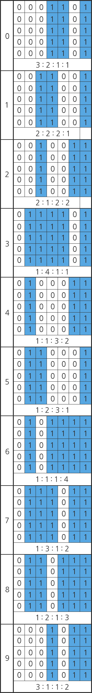
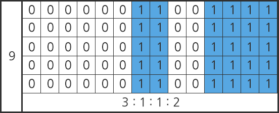

## 1242. [S/W 문제해결 응용] 1일차 - 암호코드 스캔

어떤 국가에서는 자국 내 방송국에서 스파이가 활동하는 사실을 알아냈다.

스파이는 영상물에 암호 코드를 삽입하여 송출하고 있었다.

암호 코드는 국가 내 중요 시설을 의미하는 숫자임을 알아냈다. 암호 코드의 규칙은 아래와 같다.


1. 총 8개의 숫자로 이루어져 있다. 
2. 앞 7자리는 상품 고유의 번호를 나타내며, 마지막 자리는 검증 코드를 나타낸다.  


- 검증코드는 아래와 같은 방법으로 계산한다.   

   “(홀수 자리의 합 x 3) + 짝수 자리의 합 + 검증 코드” 가 10의 배수가 되어야 한다.   

  상품 고유의 번호가 8801234일 경우,    

  “( ( 8 + 0 + 2 + 4 ) x 3 ) + ( 8 + 1 + 3 ) + 검증 코드”    

  = “42 + 12 + 검증 코드”    

  = “54 + 검증 코드” 가 10 의 배수가 되어야 하므로, 검증코드는 6이 되어야 한다.    

  즉, 88012346 이 정상적인 암호코드고, 그 외의 검증코드가 포함된 경우 비정상적인 암호코드다.


A 업체에서는 이 암호코드들을 빠르고 정확하게 인식할 수 있는 스캐너를 개발하려고 한다. 스캐너의 성능은 아래와 같은 방법으로 측정된다.


1. 세로 2000. 가로 500 이하의 크기를 가진 직사각형 배열에 암호코드 정보가 포함되어 전달된다. 이 때, 하나의 배열에는 1개 이상의 암호코드가 존재한다. (단, 모든 암호코드가 정상적인 암호코드임을 보장할 수 없다. 비정상적인 암호코드가 포함될 수 있다.)
2. 배열은 16진수로 이루어져 있으며, 이 배열을 2진수로 변환하여 그 안에 포함되어 있는 암호코드 정보를 확인한다.
3. 포함된 암호코드들의 검증코드를 확인하여 정상적인 암호코드인지 확인한다.  
4. 정상적인 암호코드들을 판별한 뒤 이 암호코드들에 적혀있는 숫자들의 합을 출력한다. 
5. 이때, 총 소요시간이 적을수록 성능이 좋은 것으로 간주된다.


배열에 포함되어 있는 암호코드의 세부 규칙은 아래와 같다.


1. 암호코드 하나는 숫자 8개로 구성되며 시작 구분선, 종료 구분선은 별도로 존재하지 않는다. 
2. 암호코드들이 붙어있는 경우는 존재하지 않는다. (각 암호코드의 둘레에는 최소 1칸 이상의 빈 공간이 존재한다.)  
3. 암호코드가 일부만 표시된 경우는 없다. 모든 암호코드는 8개의 숫자로 구성되어 있다.  
4. 암호코드의 세로 길이는 5 ~ 100 칸이다.  
5. 암호코드의 가로 길이는 암호코드 선의 두께에 따라 달라지며, 두께가 가장 가는 경우, 숫자 하나가 차지하는 길이는 7칸 이다. 각 숫자들을 그림으로 표시하는 방법은 다음과 같다.


   


각 숫자는 흰색과 파란색의 넓이 비로 표현된다. 암호코드의 가로 길이가 길어질 경우, 숫자 하나가 차지하는 길이는 7의 배수가 된다. 예를 들어, 가로 길이가 2배가 될 경우 9는 아래와 같이 표시될 수 있다.  

  


6. 암호코드 하나의 최소 가로 길이는 56이며, 암호코드 선이 굵어질 경우, 56의 배수의 길이를 갖게 된다. 예를 들어 암호코드 숫자 하나가 14칸을 사용하는 경우, 암호코드 하나의 가로길이는 112가 된다. 암호코드 하나에 포함되는 암호코드 숫자들은 모두 동일한 크기를 갖는다.


암호코드 정보가 포함된 2차원 배열을 입력으로 받아 정상적인 암호코드를 판별하는 프로그램을 작성하라.

**[입력]**

표준 입력으로 T개의 테스트 케이스가 이어져서 주어진다.

각 테스트 케이스의 첫 줄에 두 자연수가 주어지는데 각각 배열의 세로 크기 N, 배열의 가로크기 M이다 (1≤N<2000, 1≤M<500).

그 다음 N 개의 줄에는 M개의 배열의 값이 주어진다. 문제의 모든 배열의 값은 16진수이다.

**[출력]**

각 테스트 케이스의 답을 순서대로 표준출력으로 출력하며, 각 케이스마다 줄의 시작에 “#C”를 출력하여야 한다. 이때 C는 케이스의 번호이다.

같은 줄에 빈칸을 하나 두고, 입력에 주어진 배열에서 정상적인 암호코드들에 포함된 숫자들의 합을 출력한다.

**[참고]**

각 테스트 케이스의 구성은 아래와 같다.


| 테스트 케이스 | N * M      | 암호코드 가로 길이 | 암호코드 개수 |
| ------------- | ---------- | ------------------ | ------------- |
| 그룹 1        | 100 * 26   | 56                 | 1             |
| 그룹 2        | 200 * 50   | 56 ~ 112           | 2             |
| 그룹 3        | 500 * 126  | 56 ~ 280           | 5             |
| 그룹 4        | 1000 * 250 | 제한 없음          | 제한 없음     |
| 그룹 5        | 2000 * 500 | 제한 없음          | 제한 없음     |


**[예제 풀이]**

1번 케이스의 암호코드 정보를 변환하면 아래와 같다.

01110110110001011101101100010110001000110100100110111011
01110110110001011101101100010110001000110100100110111011
01110110110001011101101100010110001000110100100110111011
01110110110001011101101100010110001000110100100110111011
01110110110001011101101100010110001000110100100110111011
01110110110001011101101100010110001000110100100110111011
01110110110001011101101100010110001000110100100110111011
01110110110001011101101100010110001000110100100110111011
01110110110001011101101100010110001000110100100110111011
01110110110001011101101100010110001000110100100110111011
01110110110001011101101100010110001000110100100110111011
01110110110001011101101100010110001000110100100110111011

이 숫자가 나타내는 정보는 각각 아래와 같다.
0111011(7) 0110001(5) 0111011(7) 0110001(5) 0110001(5) 0001101(0) 0010011(2) 0111011(7)

검증코드가 맞는지 살펴보면, (7 + 7 + 5 + 2) * 3 + 5 + 5 + 0 + 7 = 80 이므로 올바른 암호코드라고 할 수 있다. 따라서 1번의 출력 값은 38이 된다.

2번 케이스도 같은 방식으로 계산할 경우, 328D1AF6E4C9BB 는 14468227 이 되며, 검증코드가 틀렸음을 알 수 있다.

196EBC5A316C578 는 18694956이 되며, 검증코드가 맞음을 알 수 있다.

따라서 2번의 출력 값은 올바른 암호코드인 18694956의 값만 더한 48이 된다.

```python
# 참고하는 코드
decode = {'112':0, '122':1, '221':2,'114':3, '231':4,'132':5, '411':6, '213':7, '312':8, '211':9}
hex_to_bin = {'0':'0000', '1':'0001', '2':'0010','3':'0011','4':'0100','5':'0101','6':'0110','7':'0111','8':'1000','9':'1001','A':'1010','B':'1011','C':'1100','D':'1101','E':'1110','F':'1111'}


def examine(arr): #검증조건 맞는지
    if ((arr[7]+arr[5]+arr[3]+arr[1])*3 + arr[0]+arr[2]+arr[4]+arr[6]) % 10:
        return False
    return True


for tc in range(1, int(input())+1):
    N, M = map(int, input().split())
    big_code = [input() for _ in range(N)]
    visited = []
    ans = 0
    for n in range(N):
        binarified = ''
        for char in big_code[n]:
            binarified += hex_to_bin[char]
        big_code[n] = binarified
    res = []
    for n in range(N):
        f1 = f2 = f3 = 0
        if '1' not in big_code[n]:
            continue
        for m in range(M*4-1,-1,-1):
            if f2 == 0 and f3 == 0 and big_code[n][m] =='1': #첫 1
                f1 += 1
            elif f1 and f3 == 0 and big_code[n][m] == '0': #10
                f2 += 1
            elif f1 and f2 and big_code[n][m] == '1': #101
                f3 += 1
            elif f3 and big_code[n][m] == '0':
                mul = min(f1, f2, f3)
                res.append(decode[str(f1//mul)+str(f2//mul)+str(f3//mul)])
                f1 = f2 = f3 = 0
                if len(res) == 8:
                    if res not in visited:
                        if examine(res):
                            ans += sum(res)
                        visited.append(res)
                    res = []
    print('#{} {}'.format(tc, ans))
```

```python
# tc 16에서 막힘
hex_code = {'0': '0000', '1': '0001', '2': '0010', '3': '0011',
            '4': '0100', '5': '0101', '6': '0110', '7': '0111',
            '8': '1000', '9': '1001', 'A': '1010', 'B': '1011',
            'C': '1100', 'D': '1101', 'E': '1110', 'F': '1111'}

for tc in range(1, int(input()) + 1):
    # if tc != 13:
    #     continue
    # else:
    n, m = map(int, input().split())
    original = [input() for _ in range(n)]

    code = []
    for i in range(n):
        tmp = ''
        for j in range(m):
            tmp += hex_code[original[i][j]]
        if int(tmp) != 0 and tmp not in code:
            code.append(tmp)
    # print(len(code), code) 이 부분이 16번째 테케에서 문제

    sum_res = 0
    for i in range(len(code)):
        t = 1
        for j in range(m*4-1, -1, -1):
            if code[i][j] == '1':

                while True:
                    if '1' in code[i][:j-(56*t)+1]:
                        # print(code[i][:j-(56*t)+1])
                        t += 1
                    else:
                        break

                # print("t :", t)
                hcode = {'0'*3*t + '1'*2*t + '0'*1*t + '1'*1*t: '0',
                         '0'*2*t + '1'*2*t + '0'*2*t + '1'*1*t: '1',
                         '0'*2*t + '1'*1*t + '0'*2*t + '1'*2*t: '2',
                         '0'*1*t + '1'*4*t + '0'*1*t + '1'*1*t: '3',
                         '0'*1*t + '1'*1*t + '0'*3*t + '1'*2*t: '4',
                         '0'*1*t + '1'*2*t + '0'*3*t + '1'*1*t: '5',
                         '0'*1*t + '1'*1*t + '0'*1*t + '1'*4*t: '6',
                         '0'*1*t + '1'*3*t + '0'*1*t + '1'*2*t: '7',
                         '0'*1*t + '1'*2*t + '0'*1*t + '1'*3*t: '8',
                         '0'*3*t + '1'*1*t + '0'*1*t + '1'*2*t: '9'}

                tmp_code = code[i][j-(56*t)+1:j+1]
                # print(tmp_code)

                # 암호코드 -> 검증코드 변환
                _digits = 0
                odd = 1
                val = 0
                res = 0

                while _digits < len(tmp_code):
                    tmp = tmp_code[_digits:_digits+(7*t)]
                    # print('tmp :', tmp)
                    decimal = int(hcode[tmp])
                    res += decimal

                    if odd % 2:
                        val += (decimal * 3)
                    else:
                        val += decimal
                    odd += 1
                    _digits += (7*t)

                if not val % 10:
                    # print(f'#{tc} {res}')
                    sum_res += res

                break

    print(f'#{tc} {sum_res}')
```


```
# input
2
16 26
00000000000000000000000000
00000000000000000000000000
000000001DB176C588D26EC000
000000001DB176C588D26EC000
000000001DB176C588D26EC000
000000001DB176C588D26EC000
000000001DB176C588D26EC000
000000001DB176C588D26EC000
000000001DB176C588D26EC000
000000001DB176C588D26EC000
000000001DB176C588D26EC000
000000001DB176C588D26EC000
000000001DB176C588D26EC000
000000001DB176C588D26EC000
00000000000000000000000000
00000000000000000000000000
18 50
00000000000000000000000000000000000000000000000000
00000000000000000000000000000000000000000000000000
000000000000000000000000000196EBC5A316C57800000000
000000000000000000000000000196EBC5A316C57800000000
000000328D1AF6E4C9BB0000000196EBC5A316C57800000000
000000328D1AF6E4C9BB0000000196EBC5A316C57800000000
000000328D1AF6E4C9BB0000000196EBC5A316C57800000000
000000328D1AF6E4C9BB0000000196EBC5A316C57800000000
000000328D1AF6E4C9BB0000000196EBC5A316C57800000000
000000328D1AF6E4C9BB0000000196EBC5A316C57800000000
000000328D1AF6E4C9BB0000000196EBC5A316C57800000000
000000328D1AF6E4C9BB0000000196EBC5A316C57800000000
000000328D1AF6E4C9BB0000000196EBC5A316C57800000000
000000328D1AF6E4C9BB0000000196EBC5A316C57800000000
000000000000000000000000000196EBC5A316C57800000000
000000000000000000000000000196EBC5A316C57800000000
00000000000000000000000000000000000000000000000000
00000000000000000000000000000000000000000000000000

# output
#1 38
#2 48
```