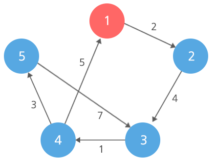
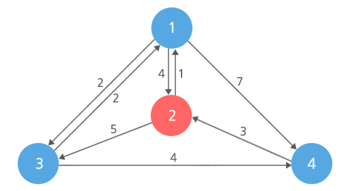

## 1795. 인수의 생일 파티

인수가 사는 마을에는 N개의 집이 있고, 각 집에는 한 명의 사람이 살고 있다.

N개의 집을 정점으로 볼 때, 도로는 어떤 집에서 다른 어떤 집으로 이동이 가능한 단방향 간선으로 볼 수 있으며, 각각에 대해서 이동하는데 시간이 정해져 있다.

도로는 모든 집들 간에 이동이 가능하도록 구성되어 있다.

집에 1번에서 N번까지의 번호를 붙일 때, 인수의 집은 X번 집이다.

오늘은 인수의 생일이기 때문에 모든 마을 사람들이 인수의 생일을 축하해주기 위해 X번 집으로 모인다.

각 사람들은 자신의 집에서 X번 집으로 오고 가기 위해 최단 시간으로 이동한다.

도로가 단 방향이기 때문에 이용하는 도로는 오고 갈 때 다를 것이다.




예를 들면 위와 같은 마을에서 X가 1인 경우

2번 집에서 1번 집으로 올 때 10, 갈 때 2의 걸려서 총 12이 걸리고,

3번 집에서도 총 12, 4번집에서도 총 12의 시간이 걸리고,

5번 집에서는 올 때 13, 갈 때 10의 시간이 걸려서 총 23의 시간이 걸리고,

5번 집이 1번 집으로 오고 가는데 가장 오랜 시간인 23의 시간이 걸린다.

X번 집으로 오고 가는데 드는 시간 중에서 가장 오래 걸리는 집은 어느 정도 걸리는지 구하는 프로그램을 작성하라.


**[입력]**

첫 번째 줄에 테스트 케이스의 수 T가 주어진다.

각 테스트 케이스의 첫 번째 줄에는 세 정수 N,M,X(1 ≤ X ≤ N ≤ 1,000, 1 ≤ M ≤ 10,000)가 공백으로 구분되어 주어진다.

다음 M개의 각 줄에는 세 정수 x, y, c (1 ≤ x, y ＜ N, 1 ≤ c ≤ 100)가 공백으로 구분되어 주어진다.

이는 x번 집에서 y번 집으로 가는 데 시간이 c가 걸리는 단 방향 도로가 존재한다는 뜻이다.


**[출력]**

각 테스트 케이스마다 ‘#x’(x는 테스트케이스 번호를 의미하며 1부터 시작한다)를 출력하고,

오고 가는데 걸리는 시간이 가장 긴 거리를 출력한다.


**[예제 풀이]**

입력으로 주어진 데이터를 단방향 그래프로 나타내면 다음과 같이 그려진다.



여기서 각 노드에서 모이는 노드인 2번 노드로 오고 가는 최단 시간을 계산하고,

각 노드들의 최단 시간 중에서 가장 오래 걸리는 노드의 시간을 출력하는 문제이다.

우선 1번 노드는 2번노드로 갈 때 4(1→2), 올 때 1(2→1)의 시간이 걸리며, 오고 가는데 걸리는 시간은 5이다.

2번 노드는 목적지이므로 따로 계산할 필요가 없이 0이다.

3번 노드는 갈 때 6(3→1→2), 올 때 3(2→1→3)의 시간이 걸리고, 오고 가는데 걸리는 시간은 9이다.

4번 노드는 갈 때 3(4→2), 올 때 7(2→1→3→4)의 시간이 걸리고, 오고 가는데 걸리는 시간은 10이다.

따라서 입력 예제에서 4번 노드가 오고 가는데 가장 오랜 시간이 걸리며, 그 값은 10이다.


```python
def dijkstra(s, adj): # 시작정점, 간선정보
    d = [0] * (N + 1)   # 최소 거리 저장 배열
    u = [0] * (N+1)     # 정점 등록 저장 배열
    u[s] = 1            # 시작 지점 등록

    # 시작 지점에서 갈 수 있는 정점의 거리 배열 저장
    for i in range(N+1):
        d[i] = adj[s][i]

    # 정점까지의 거리 비교, 저장 과정
    for _ in range(N):
        minv = float('inf')
        w = -1
        for i in range(N+1):
            # 아직 정점 등록하지 않았고, 현재 저장거리보다 작은 거리가 나올 시
            if u[i] == 0 and d[i] < minv:
                minv = d[i]     # 거리 갱신
                w = i           # 정점 번호 저장
        u[w] = 1    # 정점에 대해서 최소 거리를 등록했다는 것을 표시

        # 기존 거리와 w 정점을 경유하는 거리 비교
        for i in range(N+1):
            if 0 < adj[w][i] < float('inf'):
                # 기존에 저장되어있는 거리, w를 경유해서 가는 거리 중 최소값 추출출
               d[i] = min(d[i], d[w]+adj[w][i])

    return d


for tc in range(1, int(input())+1):
    N, M, X = map(int, input().split())
    adj = [[float('inf')] * (N+1) for _ in range(N+1)]
    r_adj = [[float('inf')] * (N+1) for _ in range(N+1)]    # 전치 행렬

    for _ in range(M):
        x, y, c = map(int, input().split())
        adj[x][y] = c
        r_adj[y][x] = c

    for i in range(N+1):    # 같은 정점은 이동 거리가 0
        adj[i][i] = 0
        r_adj[i][i] = 0

    d1 = dijkstra(X, adj)   # X에서 출발하여 돌아오는 최소 거리 
    d2 = dijkstra(X, r_adj) # 각 정점에서 X로 도착하는 최소 거리
    
    # X로 출발, X로부터 도착 거리의 최대거리 정점 탐색
    res = 0
    for i in range(1, N+1):
        tmp = d1[i] + d2[i]
        if res < tmp:
            res = tmp

    print(f'#{tc} {res}')
```

```
# input
1
4 8 2
1 2 4
1 3 2
1 4 7
2 1 1
2 3 5
3 1 2
3 4 4
4 2 3

# output
#1 10
```

