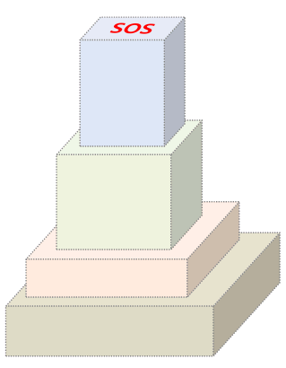
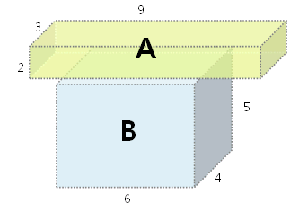
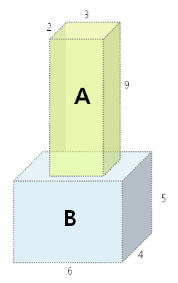
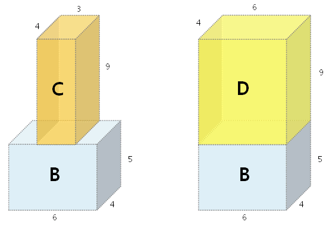

## 4335. [연습문제] 무인도 탈출

배를 타고 여행중이던 나삼성씨가 태풍을 만났다.
배는 난파되었고, 나삼성씨는 구명보트를 이용하여 가까스로 탈출에 성공 할 수 있었지만,
표류 끝에 무인도에 갖히게 되었다.


무인도에 갖힌 나삼성씨는, 인근 해상을 지나가는 비행기를 향해 SOS 신호를 보내려고 한다.


구명보트를 탈출할 당시 챙겨온 N 개의 직육면체 모양 상자들을
아래 **[그림 1]** 과 같이 탑처럼 쌓아 올려서 눈에 잘 보이게 하려고 한다.




상자를 쌓는 규칙은 다음과 같다.


1. 각각의 상자는 가로, 세로, 높이 축을 기준으로 90 도씩 회전시켜서 쌓을 수 있다.

2. N 개의 상자를 쌓는 순서에는 별다른 제약이 없으며, 모든 상자를 다 사용하지 않아도 된다.

3. 모든 상자의 밑면은, 바로 아래 쌓여진 상자의 윗면을 벗어나선 안된다.

 

예를 들어, **[그림 2]** 의 경우 상자 A 의 밑면이 상자 B 의 윗면을 벗어나므로 쌓을 수 없다.





하지만, **[그림 3]** 과 같이 상자 A 를 회전 시켜서 좁은 면이 아래를 향하게 만들면,
상자 A 의 밑면이 상자 B 의 윗면을 벗어나지 않으므로,
이와 같은 경우에는 상자 B 위에 상자 A 를 쌓을 수 있다.





**[그림 4]** 는 위에 놓여진 상자와 아래 놓여진 상자의 한 변 또는 두 변의 길이가 일치하는 경우를 보여준다

상자 C 의 밑면은 상자 B 의 윗면과 한 변의 길이가 같다.
상자 D 의 밑면과 상자 B 의 윗면은 두 변의 길이가 같다.

이와 같은 경우에도, 위에 놓여진 상자 C, D 의 밑면이 상자 B 의 윗면을 벗어나지 않으므로, 상자를 쌓을 수 있다.





입력으로 N 개의 상자들의 가로, 세로, 높이의 길이가 각각 주어질 때,
쌓을 수 있는 최대 높이를 계산하는 프로그램을 작성하라.

 

**[제약 조건]**
**1.** 상자 갯수 **N** 은 **2** **이상 20 이하의 정수**이다. **(2 ≤ N ≤ 20)**
**2.** 상자의 한 변 길이는 **1 이상 10,000 이하**이다.

**[입력]**
입력은 첫 줄에 총 테스트 케이스의 개수 T 가 온다.
다음 줄부터 각 테스트 케이스가 주어진다.
각 테스트 케이스의 첫 줄에는 상자들의 개수 N 이 주어지고,
두 번째 줄 부터는 각각의 상자들의 가로, 세로, 높이 길이가 나열된다.

 

**[출력]**
테스트 케이스 t 에 대한 결과는 “#t” 을 찍고, 한 칸 띄고, 정답을 출력한다.
( t 는 테스트 케이스의 번호를 의미하며 1 부터 시작한다. )
상자를 쌓아서 만들 수 있는 최대 높이를 정답으로 출력한다.


```
# input
5
2
27 24 35
76 36 3
3
28 33 45
80 53 23
38 90 45
4
269 152 375
45 8 259
37 113 98
685 40 35
...
```

```
# output
#1 76		// 상자들의 높이 (아래쪽 부터) : 76
#2 158		// 상자들의 높이 (아래쪽 부터) : 23, 90, 45
#3 1181
#4 6897
#5 36700
```


```python
# 시간초과
def getheight(pick, visit, side, row, col):
    result = memo[pick][visit][side]
    if result:
        return result

    for i in range(n):
        if visit & (1 << i):
            continue
        new_visit = visit | (1 << i)
        if row >= box[i][0] and col >= box[i][1]:
            result = max(result, box[i][2] + getheight(i, new_visit, 0, box[i][0], box[i][1]))
        if row >= box[i][0] and col >= box[i][2]:
            result = max(result, box[i][1] + getheight(i, new_visit, 1, box[i][0], box[i][2]))
        if row >= box[i][1] and col >= box[i][2]:
            result = max(result, box[i][0] + getheight(i, new_visit, 2, box[i][1], box[i][2]))

    return result


for tc in range(1, int(input()) + 1):
    n = int(input())
    box = [list(map(int, input().split())) for _ in range(n)]  # x, y, z
    # box.insert(0, [0, 0, 0])

    for i in range(n):
        if box[i][0] > box[i][1]:
            box[i][0], box[i][1] = box[i][1], box[i][0]
        if box[i][1] > box[i][2]:
            box[i][1], box[i][2] = box[i][2], box[i][1]
        if box[i][0] > box[i][1]:
            box[i][0], box[i][1] = box[i][1], box[i][0]

    # memo[지금 선택한 박스][선택되서 쌓아 올린 박스][어떤면이 윗면]
    memo = [[[0 for _ in range(3)] for _ in range(1 << n+1)] for _ in range(n+1)]

    print(f'#{tc} {getheight(0, 0, 0, 10001, 10001)}')
```

